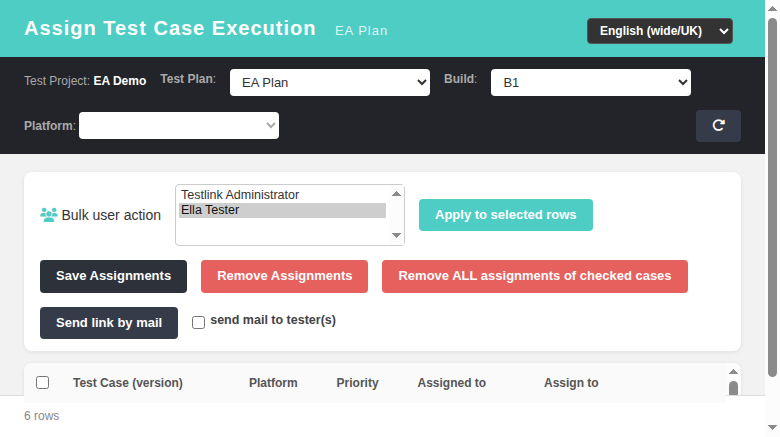
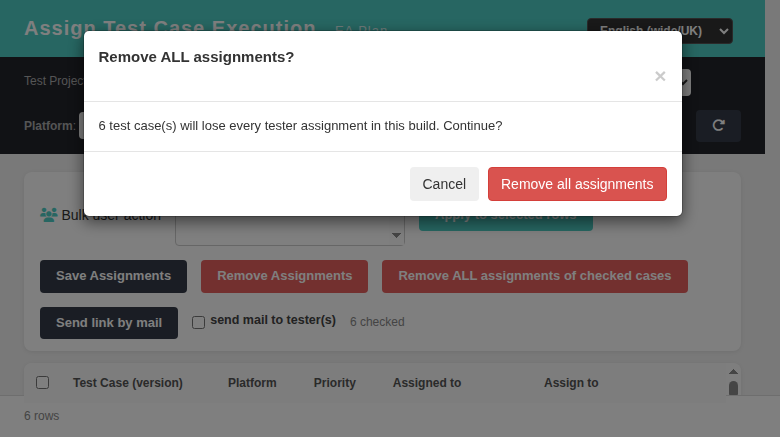

# Assign Test Case Execution (tcExecAssignment) — Modernized Screen

Modernization of **Assign Test Case Execution** (`lib/plan/tc_exec_assignment.php`)
— GitHub issue [#655](https://github.com/sebiboga/testlink-upgraded/issues/655).

The legacy Smarty screen is replaced by a standalone Dashio page
(`gui/templates/execute/tcExecAssignment.html`) backed by a plain-PHP REST BFF
(`api/execassignment/index.php`). The ASIDE **Execute → Assign Test Case
Execution** entry now points to the new HTML screen when a test plan is
selected (switched in `getActions()` in `lib/functions/common.php`).

**Path:** Execute → Assign Test Case Execution
**URL:** `gui/templates/execute/tcExecAssignment.html?tproject_id=<id>&tplan_id=<id>`
**BFF API:** `api/execassignment/index.php`
**Right:** `exec_assign_testcases` enforced server-side on every BFF route
(same as legacy `checkRights()`).

---
## Table of Contents
1. [What the screen does](#1-what-the-screen-does)
2. [REST API Reference](#2-rest-api-reference)
3. [Legacy parity notes](#3-legacy-parity-notes)
4. [i18n Keys](#4-i18n-keys)
5. [Security](#5-security)
6. [Testing](#6-testing)

## 1. What the screen does

| Feature | Legacy behavior | Modern implementation |
|---|---|---|
| Context toolbar | test project label + test plan / build selectors, platform filter | identical: plan select, build select (active+open), platform filter (when platforms enabled) |
| Tester list | tester combo built by `getTestersForHtmlOptions()` | same function server-side, exposed via `GET /init` |
| Case list | linked cases per build/platform with priority, assigned users, suite grouping | `GET /items` — suite-grouped table, one row per case × platform, priority badge when `testPriorityEnabled` |
| Per-row assign | multi-select of testers per feature row; touching it auto-checks the row | same multi-select + auto-check parity |
| Bulk apply | bulk user action applies chosen testers to checked rows | **Apply to selected rows** button |
| Save | `doAction='doBulkAssignment'` → `assignment_mgr` insert/remove per diff | `POST /assign` with per-row `{feature_id, tcase_id, user_ids[]}`, same manager calls |
| Remove single assignment | `doAction='doRemove'` → unassign one user from one feature | chip **×** icon → `POST /remove` `{feature_id, user_id}` |
| Bulk remove users | `doAction='doBulkUserRemove'` | `POST /bulkuserremove` `{feature_ids[], user_ids[]}` |
| Remove all for checked | `doAction='doRemoveAll'` with JS confirm | **Remove ALL** button → Bootstrap confirm modal → `POST /removeall` `{feature_ids[]}` |
| Send link by mail | `doAction='sendLink'` + notify checkbox → `send_mail_to_testers()` | `POST /sendlink` `{user_ids[]}`; `send_mail` flag honored on assign/remove routes; mail only when SMTP configured |

## 2. REST API Reference

All routes require an authenticated session; callers without
`exec_assign_testcases` get `403 {"status":"error","message":"No permission"}`.

| Method & path | Purpose | Failure modes |
|---|---|---|
| `GET /init?tproject_id&tplan_id` | pickers data: builds, platforms, testers, rights, flags, prefix | 401/403, 400 missing ctx |
| `GET /items?tproject_id&tplan_id&build_id&platform_id` | linked cases with assigned users per feature row | 401/403, 400 |
| `POST /assign` | save assignments (insert new / remove dropped per diff) | 400 no assignments |
| `POST /remove` | remove one (feature,user) pair | 400 |
| `POST /bulkuserremove` | remove users from many features | 400 |
| `POST /removeall` | remove every tester from checked features | 400 |
| `POST /sendlink` | mail execution-planning link to chosen users | 400 unknown users |

## 3. Legacy parity notes

- Testers are resolved through `getTestersForHtmlOptions()` exactly like the
  legacy controller — note that `get_tplan_effective_role()` requires the FULL
  `testproject::get_by_id()` record; passing a stripped `['id','name']` array
  silently drops tplan-scoped role resolution and empties the tester list.
- Build rows come from `testplan::get_builds()` which exposes `is_open` only;
  "closed" is derived as `!is_open`.
- Priority badges render only when the project option `testPriorityEnabled`
  is set (read via `testproject::getOptions()`, not `get_by_id()->opt`).
- Mail notifications reuse `notifyAssignees()`-style flow and are gated on an
  configured `smtp_host`; without SMTP the API still succeeds and reports the
  warning in the response payload.

## 4. i18n Keys

All labels/messages use the client-side `TLi18n` module with keys prefixed
`tea.` defined in ALL locale bundles (`gui/templates/i18n/*.json`: de, en, es,
fr, it, ja, pt, ro, ru, zh) plus shared `common.*` keys.

## 5. Security

- Session-based auth on every route (401 when not logged in).
- `exec_assign_testcases` right checked server-side on EVERY route (403).
- All SQL goes through tl `database` param binding / int casting.
- No HTML built from unescaped server strings client-side (jQuery text()).

## 6. Testing

Suite `#655` in `tmp/TLU_Test_Cases.md`: 14/14 PASS — covers load/render,
pickers, checkbox counter, bulk apply/save, chip removal, bulk user remove,
Remove ALL modal, send link, build switch, platform filter, ro_RO i18n,
rights enforcement (401/403) and Event Viewer hygiene.
Fixture builder: `php tmp/fixture_ea.php`.
