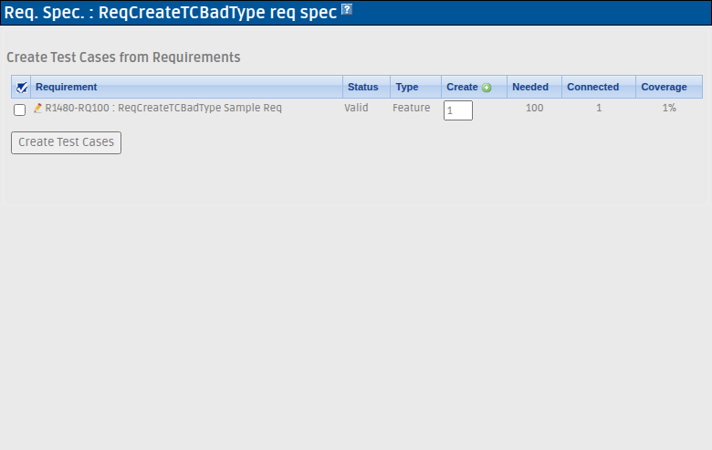

# Bugfix — Issue #1480: reqCreateTestCases E_WARNING `Undefined property stdClass::$tproject_id` + broken row-icon navigation

**Status:** FIXED & VERIFIED (branch `fix/issue-1480`, commit `be613e586`)
**Related:** #1428, #1481 (sibling requirement-viewer domain guards)

## Symptom

Every view of the *Create Test Cases from Requirements* screen
(`lib/requirements/reqEdit.php?doAction=createTestCases`) logged
`E_WARNING Undefined property: stdClass::$tproject_id` into the Event
Viewer — **once per requirement row** — and each row's requirement icon
called `openLinkedReqWindow(req_id, )` with an **empty project id**.
No data loss; warning spam + degraded row-icon navigation.

## Root cause

`reqCommands::createTestCases()` (`lib/requirements/reqCommands.class.php:480-506`)
builds its gui bean via `initGuiBean()` (`:48-79`), which initializes many
fields but **never sets `tproject_id`**. Both themes render
`openLinkedReqWindow({$gui->all_reqs[row].id},{$gui->tproject_id})`
(`gui/templates/dashio/requirements/reqCreateTestCases.tpl:174` and identically
`gui/templates/tl-classic/requirements/reqCreateTestCases.tpl:174`); the compiled
Smarty read `echo $_smarty_tpl->tpl_vars['gui']->value->tproject_id`
(compiled file `gui/templates_c/f24fb659…_0.file.reqCreateTestCases.tpl.php:217`)
triggers the E_WARNING and outputs an empty string.

The reference pattern is `doCreate()` at `reqCommands.class.php:236`:
`$obj->tproject_id = $argsObj->tproject_id;`. `doCreateTestCases()` (`:513-524`)
delegates entirely to `createTestCases()` (called twice: `:516`, `:521`), so it
inherits and re-triggers the same defect.

## Fix (minimal)

One line in `createTestCases()`, immediately after `initGuiBean()`:

```php
$guiObj = $this->initGuiBean();
$guiObj->tproject_id = $argsObj->tproject_id;
$guiObj->template = 'reqCreateTestCases.tpl';
```

- Covers both the pure-view path and the `doCreateTestCases()` submit path in a
  single location.
- No `isset()` guard needed: `$argsObj->tproject_id` is always `int ≥ 1`,
  enforced at `lib/requirements/reqEdit.php:94-98` (exception otherwise).
- No i18n change required (no user-facing strings added/changed).

## Blast radius

- `grep tproject_id lib/requirements/reqCommands.class.php` → 30 hits; only
  `createTestCases()` (and its delegate) left it unset.
- Template consumers exactly 2: dashio + tl-classic `reqCreateTestCases.tpl:174`.
- No theme-specific change; the fix is in the shared command layer.

## Verification

Fixtures created by `tmp/fixtures_1480.php` (project `ReqCreateTCBadType` id=1,
spec `SRS-1480` id=2, req `R1480-RQ100` id=4). Full 5/5 regression matrix in
`tmp/TLU_Test_Cases.md` (suite `Regression — Issue #1480`). Highlights:

| Case | Result |
|---|---|
| Pre-fix GET → `events` table gains `log_level=2 E_WARNING … tproject_id … Line 217`; DOM `openLinkedReqWindow(4,)` | reproduced |
| Post-fix same GET → 0 event rows; DOM `openLinkedReqWindow(4,1)` | PASS |
| Post-fix `doCreateTestCases` submit (hidden `req_id_cbox[]=4`) → Test Suite + Test Case created, page re-renders error-free, still 0 event rows | PASS |
| `php -l lib/requirements/reqCommands.class.php` | clean |
| Event Viewer full suite — no new Error/Warning rows | PASS |



## Files touched

| File | Change |
|---|---|
| `lib/requirements/reqCommands.class.php` | +1: `$guiObj->tproject_id = $argsObj->tproject_id;` in `createTestCases()` |
| `CHANGELOG` | +1 line under KEY BUGFIX (Refs #1480) |
| `tmp/fixtures_1480.php` | repro fixture (local, `tmp/` gitignored) |