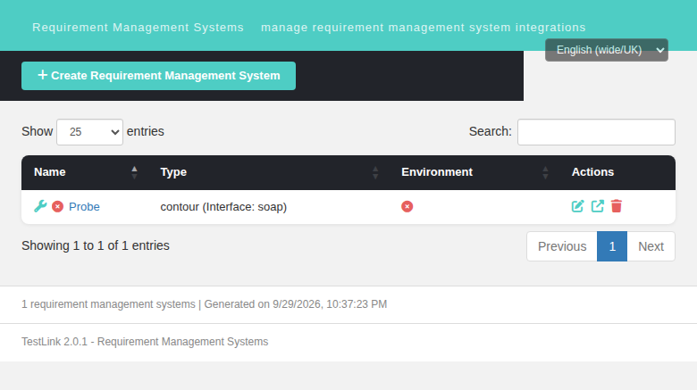

# Bugfix — Issue #1628: `initGuiBean()` read an undefined label for 2 of its 7 whitelisted actions

**Status:** FIXED · branch `fix/issue-1628` · commit `f4da422b4` + review follow-up
**Severity:** minor (Event Viewer noise, no user-visible breakage)
**Area:** Requirements Manager — legacy command class `reqMgrSystemCommands`

---

## Symptom

`reqMgrSystemCommands::initGuiBean()` read `$obj->l18n[$caller]` **unguarded** for every
dispatched action. The label table only described 5 of the 7 whitelisted action names, so two
of them raised a PHP 8 `E_WARNING "Undefined array key"` on every call, which TestLink's own
`set_error_handler("watchPHPErrors")` (`lib/functions/logger.class.php:1483`) converted into an
`events` row with `log_level = 2` (E_WARNING) in the **Event Viewer**.

## How the bug was born: two lists that drifted

| list | defined at | entries |
|---|---|---|
| dispatchable actions | `reqMgrSystemCommands.class.php:38-39` `$guiOpWhiteList` | **7** — `checkConnection`, `create`, `edit`, `delete`, `doCreate`, `doUpdate`, `doDelete` |
| action labels | `:64-65` `init_labels()` (3 of them: `create`, `edit`) + `:68-70` hand-mapped (3: `doCreate`, `doUpdate`, `doDelete`) | **5** |

`reqmgrsystem_management` and `reqmgrsystem_deleted` are page/feedback labels, not action names,
so the table never had a chance of covering the other two.

The author was demonstrably aware `delete` is a real caller: the very next statement, the
`switch($caller)` at `:74-76`, has an explicit `case 'delete':` branch that changes
`submit_button_label` — yet no `delete` label was ever added.

Nothing reconciled the two lists, so the drift went unnoticed from 1.9.6 to 2.0.1.

## Two corrections to the original report

1. **The report named only `checkConnection`. `delete` is the same defect on the same line.**
   The report's evidence query used `limit 3` / `limit 4` and therefore never surfaced the second
   row. A fix following the report literally would have left one of the two warnings alive.
2. **The report's HTTP repro is no longer reachable.** Since `Refs #1727`,
   `lib/reqmgrsystems/reqMgrSystemEdit.php` is a session-guarded **302 redirect shim** that no
   longer requires or instantiates the class:

   ```
   $ curl -s -b <session> -i "http://localhost:8082/lib/reqmgrsystems/reqMgrSystemEdit.php?doAction=checkConnection&id=1"
   HTTP/1.1 302 Found
   Location: http://localhost:8082/gui/templates/reqmgrsystems/reqMgrSystemEdit.html?id=1
   ```

   `events` delta for that request: **0 rows**. And
   `grep -rn "reqMgrSystemCommands" --include=*.php .` yields only the class's own two lines plus a
   *comment* in the shim — the class is currently **orphaned dead code**, so the defect has to be
   reproduced against the class, not the route.

   The `issueTrackerCommands` twin the report cites as the model was deleted in `596444f30`
   *"chore(issuetracker): delete legacy issuetrackerView cluster (Refs #966)"*, so its
   `'checkConnection' => 'btn_check_connection'` line can no longer be diffed against — but the
   **label it pointed at is still shipped** (`locale/en_GB/strings.txt:275`).

## Root cause chain

```
1. :38-39   guiOpWhiteList dispatches 7 action names
2. :64-65   init_labels() supplies 3 action labels
3. :68-70   3 more hand-mapped  =>  5 described, 2 missing
4. :72      ucfirst($obj->l18n[$caller])  ->  E_WARNING + E_DEPRECATED for the 2 missing
5. logger.class.php:1483  watchPHPErrors  ->  events row, log_level = 2
```

## The fix

Two lines (plus a short comment) in `lib/reqmgrsystems/reqMgrSystemCommands.class.php`:

```php
$obj->l18n = init_labels(array('reqmgrsystem_management' => null, 'btn_save' => null,
                               'create' => null, 'edit' => null, 'reqmgrsystem_deleted' => null,
                               'checkConnection' => 'btn_check_connection',
                               'delete' => 'btn_delete'));
...
$obj->action_descr = isset($obj->l18n[$caller]) ? ucfirst($obj->l18n[$caller]) : '';
```

**Why the two-argument form.** `init_labels()` already supports `key => label_code`
(`lib/functions/lang_api.php:317-325`: `is_null($value) ? lang_get($key) : lang_get($value)`), so
no helper was needed and no new i18n key was invented. The action names `checkConnection` /
`delete` are *keys*; the shipped label *codes* are `btn_check_connection` / `btn_delete`. Passing
`null` would have asked `lang_get()` for the non-existent code `checkConnection` and leaked the
raw key into the UI.

**Why the `isset()` guard is load-bearing, not belt-and-braces.** Fixing only the two known keys
means the 8th whitelist entry added later silently starts warning again — the exact drift that
created the bug. `doDelete` already maps to `''` by design (`:70`), so the guard is
behaviour-preserving on every correct path. Its regression coverage is the negative case
`initGuiBean($args, 'bogusActionNotInTheLabelTable')` → no diagnostic **and** `action_descr === ''`;
that is the *only* assertion that fails if the guard is deleted.

## Trade-off (measured, not hidden)

`btn_check_connection` ships in **7 of 19** legacy bundles and `btn_delete` in **18**. In the
remaining locales `lang_get()` back-fills from `en_GB` and records one `L18N` (**level 32**,
"not localized — using en_GB") audit row per key.

| | before fix | after fix |
|---|---|---|
| `ERROR`/`WARNING`/`NOTICE` rows (levels 1/2/4), all locales | **2** per call | **0** |
| `L18N` (level 32) rows, `ro_RO` | 5 | 7 (the 2 extra are the new labels) |

So the fix **relocates** the noise rather than eliminating all of it: 0 warnings everywhere, at the
cost of 2 extra level-32 audit rows in 13 locales. Those 5 pre-existing level-32 rows come from the
*same* five labels this function always looked up, i.e. this is the designed, documented fallback
of `lang_get()` (`lang_api.php:78-81`), not a new kind of error. Filling in 13 translations is out
of scope for a one-line label fix.

## Blast radius

```
$ grep -rn 'l18n\[\$[a-zA-Z_]*\]' --include=*.php lib/
lib/reqmgrsystems/reqMgrSystemCommands.class.php:72   $obj->action_descr = ucfirst($obj->l18n[$caller]);   <-- the defect
(the other three hits index by a validated enum / are writes)
```

- The other three `initGuiBean` implementations
  (`reqCommands`, `reqSpecCommands`, `testcaseCommands`) assign `action_descr` from `lang_get(...)`
  constants and **never** index an array by `$caller` — none is affected.
- The BFF (`api/reqmgrsystemedit`, `api/reqmgrsystems`) and both modern `.html` screens never load
  this class. Verified unaffected.

## Consumer note (corrected during code review)

`$gui->action_descr` **is** rendered by two legacy templates —
`gui/templates/dashio/reqmgrsystems/reqMgrSystemEdit.tpl:71` and
`gui/templates/tl-classic/reqmgrsystems/reqMgrSystemEdit.tpl:71`
(`<div class="action_descr">{$gui->action_descr|escape}</div>`) — and by 12 other `.tpl` files for
the requirement/plan clusters. Those pages are unreachable since the `Refs #1727` shim, so this is
not a regression, but the two new strings are user-visible text in those templates, not a dead
field. (The claim that no `.tpl` consumed it came from a `grep` that was truncated by `head -30`;
the code review caught it.)

## Verification

Harness (gitignored `tmp/`, re-runnable on a fresh import — creates and drops its own fixture):

| file | role |
|---|---|
| `bash tmp/verify_1628.sh` | driver — fixture, syntax gate, unit matrix, Event Viewer, 3 locales, HTTP, cleanup. Exits 1 on any failure. |
| `php tmp/unit_1628.php` | assert-based unit matrix over all 7 whitelisted callers + the guard negative case |
| `php tmp/raw1628.php [locale]` | all 7 callers with `watchPHPErrors` active and **no** suppression |
| `php tmp/ro1628.php <locale>` | same, per locale |

Result: **`TOTALS: PASS=21 FAIL=0`, exit 0.**

Proven to actually catch the bug — with the file reverted to `e9dd5c591` the same driver reports
**`TOTALS: PASS=15 FAIL=6`** (2 error rows in every locale, and `ro_RO` L18N 5 instead of 7):

| case | observed |
|---|---|
| `initGuiBean('checkConnection')` | `'Check connection'`, 0 warnings |
| `initGuiBean('delete')` | `'Delete'`, 0 warnings |
| all 7 whitelisted callers | `offenders: none` |
| unknown caller (guard) | no diagnostic, `action_descr === ''` |
| `create`/`edit`/`doCreate`/`doUpdate`/`doDelete` | `Create`/`Edit`/`Create`/`Edit`/`''` — unchanged |
| `submit_button_label` | `''` for `delete`+`doDelete`, `btn_save` otherwise |
| `main_descr`, `guiOpWhiteList` | unchanged, same 7 names |
| locale `en_GB` | 0 rows at every level |
| locale `ja_JP` | `接続テスト` / `削除` / `作成` / `編集` — `ucfirst()` does not mangle multi-byte values; 0 rows |
| locale `ro_RO` | `Check connection` / `Delete` via `en_GB` back-fill, no raw-key leak, 0 warnings, 7 L18N |
| `GET reqMgrSystemView.html` | 200, table renders the row |
| `POST api/reqmgrsystemedit?action=check_connection` | 200 `{"status":"error","connected":false,"code":"not_implemented",…}` |
| legacy `reqMgrSystemEdit.php?doAction=checkConnection` | 302 (unchanged by this fix) |
| Event Viewer after the full pass | only the `log_level=16` login-audit row; browser console clean |

## Why the HTTP rows are not fix coverage

The modern screen and the BFF never load `reqMgrSystemCommands`. Those checks exist to prove
**no regression** in the modern screen, not to verify this fix — the class is unreachable there.
The code review flagged that presenting them as fix coverage would mislead future readers, so they
are relabelled as such in both the driver and the suite.

## Follow-up worth filing (not done here)

The class has a second, independent drift: `'delete'` is whitelisted at `:38-39` but **no `delete()`
method exists** on the class (methods: `create`, `doCreate`, `edit`, `doUpdate`, `doDelete`,
`checkConnection`) — the same whitelist-vs-reality mismatch as #1722. A single source of truth
(building the label map next to `$this->guiOpWhiteList`) would make the class self-consistent.
Deliberately out of scope for a one-line label fix, and it only matters if the class is ever
rewired.

## Screenshot


