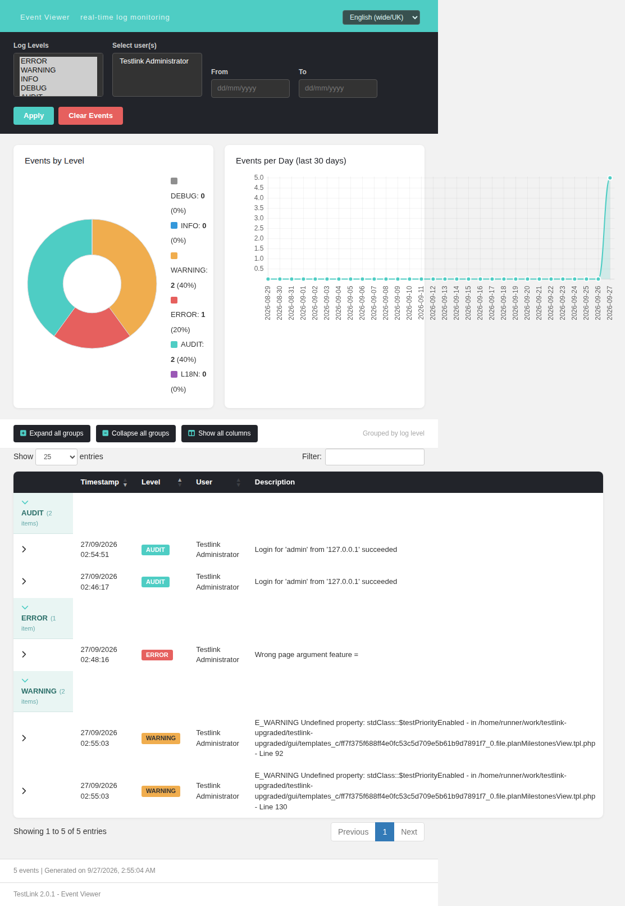
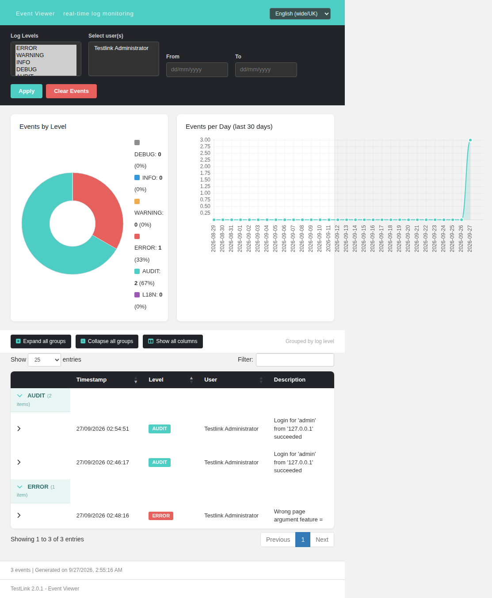

# Bugfix — Issue #1649: `Undefined property: stdClass::$testPriorityEnabled` on every `planMilestonesView.php` load

* **Issue:** https://github.com/sebiboga/testlink-upgraded/issues/1649
* **Fixed in:** `lib/functions/testproject.class.php` (only file changed)
* **Commits:** `c1934938b` (fix), `72d4b9287` (regression suite)
* **Branch:** `fix/issue-1649`
* **Severity:** minor (Event Viewer noise) — but the same root cause also silently
  destroyed project-option writes, see *Second symptom* below.

## Symptom

Every request to `lib/plan/planMilestonesView.php` wrote `E_WARNING Undefined property:
stdClass::$testPriorityEnabled` to the `events` table. The page itself rendered fine
(HTTP 200, milestone row present).

Measured on a fresh import: **2** rows per page load (the issue body reported 1 — see
*Correction* below), `log_level = 2`, pointing at the compiled template
`gui/templates_c/<hash>_0.file.planMilestonesView.tpl.php` lines **92** and **130**.

## Correction to the original report

It is **two** warnings per load, not one: the template dereferences the property once for
the table header cells and once inside the per-milestone row loop. Both sites survived the
fix, so the count is now 0.

## Investigation

**Environment** — `http://localhost:8082` (PHP built-in server, docroot = repo root),
MariaDB `127.0.0.1/testlink` freshly imported, `admin/admin`. The login form posts
`tl_login` / `tl_password` (not `user` / `pass`).

**Repro (fixtures from the issue body, note: no `options` column in the INSERT)**

```sql
INSERT INTO testprojects (id,notes,color,active,option_reqs,option_priority,
  option_automation,prefix,tc_counter,is_public,issue_tracker_enabled,
  code_tracker_enabled,reqmgr_integration_enabled,api_key)
  VALUES (1,'demo','#9BD',1,0,0,0,'TL',0,1,0,0,0,'aaaa');
INSERT INTO testplans (id,testproject_id,notes,active,is_open,is_public,api_key)
  VALUES (1,1,'demo',1,1,1,'bbbb');
INSERT INTO milestones (testplan_id,target_date,start_date,a,b,c,name)
  VALUES (1,'2026-12-31','2026-01-01',100,0,0,'Milestone One');
INSERT INTO nodes_hierarchy (id,name,parent_id,node_type_id,node_order)
  VALUES (1,'demo',NULL,1,1);
```

```bash
curl -s -b cj.txt "http://localhost:8082/lib/plan/planMilestonesView.php?tplan_id=1&tproject_id=1"
mysql -h 127.0.0.1 -utestlink -ptestlink testlink \
  -e "select id,log_level,description from events order by id desc limit 3;"
```

`select id, options, length(options) from testprojects;` ⇒ `1 | NULL | NULL` — the
decisive measurement. `testprojects.options` is `text DEFAULT NULL`, so any project that
has never been edited has no blob at all.

## Root cause chain

1. `gui/templates/dashio/plan/planMilestonesView.tpl:53` (`{if $gui->tprojOpt->testPriorityEnabled}`,
   the column headers) and `:76` (the same test inside the `{foreach $gui->itemsLive …}`
   row loop) read the option **unguarded** — compiled to lines 92 and 130, which is
   exactly where the two `events` rows point.
2. The controller `lib/plan/planMilestonesView.php` never sets `$gui->tprojOpt`. It is
   injected centrally by `initUserEnv()` — `lib/functions/common.php:1856`:
   `$gui->tprojOpt = $tprjMgr->getOptions($args->tproject_id);`. The very next lines
   (1858-1859) guard their *own* read with `isset(...)`, so the codebase already knew the
   property could be missing.
3. `testproject::getOptions()` — `lib/functions/testproject.class.php:3957-3972` (pre-fix)
   — returns `(object)[]`, an object with **zero** properties, in all three of its fallback
   paths: no row for that id (`:3963`), a blob whose first byte is not in the
   `['O','a','s','i','d','b','N','R']` whitelist (`:3967`, the #1484 hardening against
   hand-edited blobs), or a failed `decodeStoredOptions()` (`:3971`).
4. `NULL` blob ⇒ `!is_string($raw)` ⇒ `(object)[]` ⇒ the unguarded read in step 1 ⇒
   `E_WARNING`.

The same class already contained the **correct** fallback:
`parseTestProjectRecordset()` at `testproject.class.php:244-250` and `:445-453` builds
`new stdClass()` with all four keys set to `0` whenever the blob does not decode.
`getOptions()` — the accessor everyone else uses — simply never did.

### A fourth trigger found while fixing (not in the original report)

A blob that is **valid but partial** — an older release only serialized the options that
had once been toggled, so `{testPriorityEnabled:1}` alone is a perfectly well-formed
blob — decodes successfully and is returned untouched, still missing the other three keys.
That produced the *identical* warning, so fixing only the `(object)[]` fallbacks would
have left the bug reproducible. Hence `completeOptions()` below.

## Second symptom (worse than the warning): option writes were silently dropped

`setOptions()` (`:4003-4021` pre-fix) iterates the object returned by `getOptions()` and
copies over **only the properties that already exist on it**
(`if (property_exists($optObj, $prop))`), then skips the `UPDATE` entirely when nothing
matched (`$nike` stays false). With the empty fallback object this means:

> **A test project whose `options` column is NULL could never be saved at all** — toggling
> "Test Priorities" on the Project edit screen and saving did nothing, silently, forever.

The one-line consequence of the same fix (measured, real class + real DB):

```
getOptions(1)  ->  $o->testPriorityEnabled = 1;  setOptions(1,$o);
testprojects.options = O:8:"stdClass":4:{s:19:"requirementsEnabled";i:0;
                        s:19:"testPriorityEnabled";i:1; …}
re-read getOptions(1) -> {…, "testPriorityEnabled":1, …}
```

Before the fix that `UPDATE` was never issued.

## Blast radius

`getOptions()` has **41 call sites in 24 files** (`lib/functions/common.php` ×4,
`lib/testcases/*` ×4, `lib/results/*` ×3, `api/*` ×13 — testcases, search, reports,
requirements, milestones, inventory, printoptions, execassignment, aside, resultnav,
reqtcbassign, execsetresults, projects — plus `lib/general/asideMenu.php`,
`lib/plan/tc_exec_assignment.php`, `lib/functions/testcase.class.php`,
`lib/functions/exec.inc.php`).

The many consumers that already guard their read (`isset($tprojOpt->testPriorityEnabled)`
— `lib/plan/tc_exec_assignment.php:225`, `lib/results/freeTestCases.php:26`,
`lib/results/tcNotRunAnyPlatform.php:117`/`:221`, `lib/functions/common.php:1858`) are why
the bug was only ever *visible* where the read is unguarded: the Smarty templates
(`dashio` and `tl-classic` variants of `planMilestonesView.tpl`, `planMilestonesEdit.tpl`,
`tc_exec_assignment.tpl`, `searchForm.tpl`, `resultsGeneral.tpl`,
`testcases/include/attributes*.inc.tpl`, `containerMoveTC.tpl`) and PHP consumers such as
`lib/results/resultsTC.php:315`, `resultsTCFlat.php:246`, `resultsTCAbsoluteLatest.php:288`,
`testCasesWithoutTester.php:217`, `printDocument.php:507`, `planAddTC.php:621`,
`lib/functions/tlTestCaseFilterControl.class.php:1605`/`:1652`,
`tlTestCaseFilterByRequirementControl.class.php:1145`/`:1192`.

## The fix

Single file, `lib/functions/testproject.class.php`:

1. **`getDefaultOptions()`** (new, `:3974-3996`) — returns `new stdClass()` with
   `requirementsEnabled / testPriorityEnabled / automationEnabled / inventoryEnabled = 0`,
   i.e. exactly the fallback `parseTestProjectRecordset()` already used.
2. **`getOptions()`** (`:3957-3972`) — its three `(object)[]` returns now call
   `getDefaultOptions()`; a successfully decoded object goes through `completeOptions()`.
3. **`completeOptions()`** (new, private, `:3973-3989`) — adds only the *missing* canonical
   keys, `0`, never overwriting a stored value. Non-object payloads (a serialized array,
   which the `['a','s',…]` whitelist still admits) are passed through unchanged, so no
   behaviour moves for them.

### Why this method, and what was rejected

* **Guard the two template expressions** (`{if isset($gui->tprojOpt->testPriorityEnabled) && …}`)
  — rejected: treats the symptom. 14 templates and ~10 PHP consumers stay broken, and
  `setOptions()` keeps silently dropping writes.
* **Add `isset()` at every consumer** — rejected: 24 files of churn for one bug, and it
  perpetuates the write-loss in `setOptions()`.
* **Make the DB column carry a serialized default** — rejected: it is a migration, and the
  fallback still has to be safe for NULL and corrupt blobs that already exist in
  production databases.
* **Defaulting at the accessor** is the only layer where all 41 call sites are covered at
  once, and it makes `getOptions()` *total*: it can no longer hand out an object that is
  missing a key a consumer may read. `0` is falsy, exactly like the property being absent
  was, so every `isset()` / `empty()` / `!` based consumer keeps its current behaviour —
  verified by the priority columns still rendering when the option is genuinely enabled.

## Verification

Accessor matrix (real class, real DB):

| stored blob | before | after |
|---|---|---|
| `NULL` | `{}` | all four keys `0` |
| valid **partial** `{testPriorityEnabled:1}` | 1 of 4 keys (would still warn) | stored `1` preserved + 3 keys `0` |
| valid **full**, all `1` | all `1` | all `1` (untouched) |
| corrupt (#1484 shape) | `{}` | all `0` |
| valid **array** payload | pass-through | pass-through (unchanged) |
| unknown id / empty string | `{}` | all `0` |

Live page (`tplan_id=1&tproject_id=1`, admin session):

| scenario | HTTP | bytes | priority column | new `log_level=2` rows |
|---|---|---|---|---|
| before fix, `options=NULL` | 200 | 12091 | no | **2** |
| after fix, `options=NULL` | 200 | 12091 | no | **0** |
| after fix, `testPriorityEnabled=1` | 200 | **12327** | **yes** | 0 |
| after fix, corrupt blob | 200 | 12091 | no (correct) | 0 |

Regression: `asideMenu.php`, `tcSearchForm.php`, `frmWorkArea.php` with a NULL-options
project — 200/200/200, `count(*) where log_level=2` = 0. `php -l` clean. Event Viewer: no
new Error/Warning.

Regression suite `Regression — Issue #1649` in `tmp/TLU_Test_Cases.md`: **9 / 9 PASS**.

## Files changed

| file | purpose |
|---|---|
| `lib/functions/testproject.class.php` | the fix: `getOptions()` + `getDefaultOptions()` + `completeOptions()` |
| `tmp/TLU_Test_Cases.md` | regression suite (9 checks) |
| `CHANGELOG` | 2.0.1 key-bugfix line |
| `docs/Bugfix-Issue-1649-getOptions-Empty-Options-Object-EWarning.md` | this page |
| `tmp/wiki-repo/Bugfix-Issue-1649-getOptions-Empty-Options-Object-EWarning.md` | wiki mirror |

## Screenshots — Event Viewer before / after

Before the fix — one load of `lib/plan/planMilestonesView.php?tplan_id=1&tproject_id=1`
adds **2** WARNING rows (`WARNING: 2 (40%)`), both `testPriorityEnabled`:



After the fix — the same load adds **0** rows (`WARNING: 0 (0%)`):



(The single `ERROR: 1` row visible in both shots is `Wrong page argument feature =`,
produced by the regression pass calling `lib/general/frmWorkArea.php` without a `feature`
argument — the app's own argument validation logging, unrelated to this fix.)
