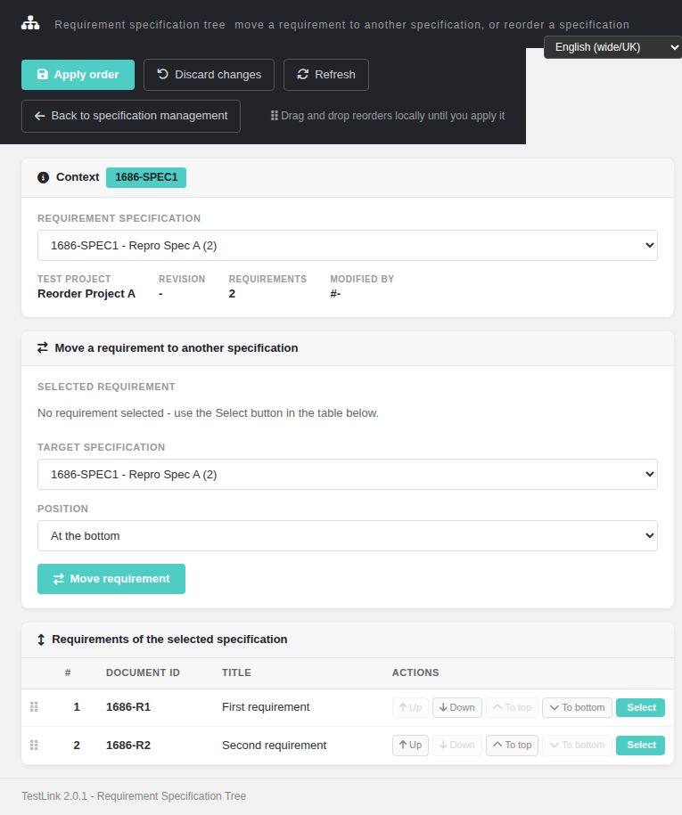

# Bugfix — Issue #1686: `reqTreeReorder.html` — "Back to specification management" was a dead self-reload in the error state and pointed at the wrong screen otherwise

**Number:** #1686
**Status:** Fixed (verified — the fix was already in the default branch; this run pinned it with a regression suite and closed the issue)
**Component:** `gui/templates/requirements/reqTreeReorder.html`
**Area:** Requirements / Specification Tree Reordering
**Fixing commit (code):** `983c9179c` — *fix(reqtreereorder): back link was a dead self-reload on the error path (Refs #1681)*
**Verification commit (this run):** `6588d4a18`

## Symptom

Two defects in one control.

1. **In the error / no-rights state the link pointed at itself.** The markup shipped
   `href="#"` and the only code that set a real target ran inside the **success** handler of
   the `init` AJAX call. On the 403 path ("You are not authorized to view requirements") the
   href was never written, so the *Back to specification management* button reloaded the
   forbidden page in the same tab. The observed URL was literally the current page with a
   trailing `#`.
2. **With data loaded the label lied.** When a specification was selected the link was pointed
   at `reqSpecView.html` (the specification **viewer**) while the label said
   *Back to specification **management***, leaving the management screen unreachable from the
   toolbar.

`target="_blank"` additionally made a *back* link open a new tab, unlike the sibling
`#mgmtLink` in `reqSpecView.html`.

## Root cause

The root cause is a design error, not a typo: **the href of a navigation control was
produced as a side effect of a successful data load.** A static `.html` template cannot
server-render the id (it is not PHP), so the assignment was placed in the AJAX `success`
handler — which means the control is broken in exactly the state where the user most needs
an escape hatch (403/404).

Root cause chain, as originally shipped:

| Hop | Location | What was wrong |
|---|---|---|
| 1 | `reqTreeReorder.html` (markup) | `<a class="btn-ghost" id="backLink" href="#" target="_blank">` — `#` is "same document", i.e. a self-reload; `target="_blank"` opens a *back* link in a new tab. |
| 2 | the only assignment, inside the `success:` handler of `$.ajax(...)` in `load()` | The href was never written when the call failed → the 403/404 dead end kept `href="#"`. |
| 3 | same success handler | On success it rewrote the href to `reqSpecView.html?id=<SPEC_ID>&tproject_id=<TP>` — the viewer — contradicting the "management" label. |

### Why the issue stayed open

Both defects were fixed by the #1681 modernization run in commit `983c9179c`, an ancestor of
the default branch. The implementing run left the issue **OPEN** (its own body documents the
fix under *"Fix applied in the Refs #1681 branch"*), so triage kept surfacing it as the oldest
open bug. Nothing was lost in the code; what was lost was the closure step. This run verified
the fix, pinned it with a regression suite and closed the issue.

## Fix (already in the default branch — shape of the correct solution)

* **markup `:77`** — the href is now a real page in the static markup,
  `href="/gui/templates/requirements/reqSpecMgmt.html"`, and `target="_blank"` is gone.
* **`:181-186` `buildBackLink()`** — derives the target **synchronously from the URL query
  string**, with a comment stating the intent ("the escape hatch must work on the error path").
* **`:189`** — `buildBackLink()` runs on DOM-ready, **before** `TLi18n.load()` and before
  `load(false)` → before any `$.ajax`. This is the structural guarantee: the href no longer
  depends on an API response. The `:0` branch still yields a valid management-screen URL,
  never `'#'`; the rewrite is only a *refinement* that adds `tproject_id`.
* **`:196-199` + `:417-424`** — the dropped "open this specification" target was **not** lost:
  it moved to the spec document chip in the Context card, whose `data-href` points at
  `reqSpecView.html?id=<spec>&tproject_id=<tp>` and opens in a new tab.

### Alternatives rejected

1. *Touch the file to have a diff* — rejected: the code is already correct and verified;
   any edit is churn and risks re-introducing the defect being certified.
2. *Make the fallback project-aware without `tproject_id`* — rejected: both entry points
   (`reqSpecMgmt.html:954`, `:964`) always pass it, and the target degrades gracefully
   without it (renders `Test Project: -`, API answers a clean `400`, no fatal).
3. *Harden `reqSpecMgmt.html` against `tproject_id=0`* — out of scope, it already degrades
   cleanly.

## Verification (measured, 9/9 cases PASS)

| Case | Measured result |
|---|---|
| Static markup, **before any JS runs** (`curl` + `grep -o 'id="backLink"[^>]*'`) | `id="backLink" href="/gui/templates/requirements/reqSpecMgmt.html"` — a real destination, so the link survives a total JS failure |
| `target="_blank"` on the back link | `grep -c _blank` → `0` |
| Error / 404 state | `href=/gui/templates/requirements/reqSpecMgmt.html?tproject_id=13`, `target=null`, `applyDisabled=true`, drag hint hidden — never a self-reload |
| Success state | `href_points_at_viewer:false`, `rows=2`, `rowsDraggable=["true","true"]` — the href matches its label |
| Real `.click()` on the back link | navigated **in place** to `…/reqSpecMgmt.html?tproject_id=13`, same tab |
| Spec chip click (`tproject_id=14`, spec 17) | new page opened at `reqSpecView.html?id=17&tproject_id=14` — the viewer target survived |
| Second test project | `href=…reqSpecMgmt.html?tproject_id=14`, `uses_wrong_project:false` — `tproject_id` follows the URL, never hardcoded |
| No project in context | `href=/gui/templates/requirements/reqSpecMgmt.html`, *"No test project in context."*, target renders `Test Project: -`, API `400` — no fatal, no blank page |
| Event Viewer / `events` | 1 row total, the login audit (`log_level=16`, `audit_login_succeeded`) — **zero** Error/Warning rows |

Regression suite: `## Regression — Issue #1686` in `tmp/TLU_Test_Cases.md`
(cases `TC-1686-01..09`). Merge-base gate
`TLU_REQUIRE_SUITE="Issue #1686" bash ai/verify_test_suites.sh` → **7 PASS / 0 FAIL**
(suite headings 65 → 66, nothing lost).

## Screenshot

## Files changed

* This run: `tmp/TLU_Test_Cases.md` (append-only regression suite), `docs/Bugfix-Issue-1686-reqtreereorder-Back-Link-Dead-Self-Reload.md`, wiki mirror + screenshot.
* No production code change in this run — the code fix is `983c9179c`.

## Commits

* `983c9179c` — the actual code fix (Refs #1681), already on the default branch
* `6588d4a18` — regression suite for this run
* docs + wiki mirror commit for this run

## Reference

See also: [Reorder Requirements Tree (reqTreeReorder) Modernized](Reorder-Requirements-Tree-Modernized.md)
and [Bugfix #1685 — drag & drop dirty flag](Bugfix-Issue-1685-reqtreereorder-Drag-Drop-Dirty-Flag.md).

Sibling issues from the same #1681 browser-testing pass, all in the same screen, all verified
fixed in the default branch and covered by the same fixture set:
[#1687](https://github.com/sebiboga/testlink-upgraded/issues/1687) (hardcoded `-` "Modified by" tile),
[#1688](https://github.com/sebiboga/testlink-upgraded/issues/1688) (toolbar stayed live on the 403/404 page),
[#1689](https://github.com/sebiboga/testlink-upgraded/issues/1689) (rows draggable in read-only mode),
[#1690](https://github.com/sebiboga/testlink-upgraded/issues/1690) (hardcoded `tproject_id` in the back link).