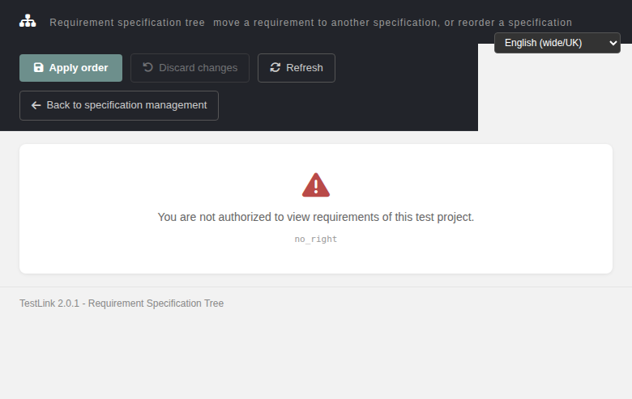

# Bugfix — Issue #1688: `reqTreeReorder.html` — the toolbar stayed live on the 403/404 error page

**Number:** #1688
**Status:** Fixed (verified — the fix was already in the default branch; this run re-measured it, pinned it with a regression suite and closed the issue)
**Component:** `gui/templates/requirements/reqTreeReorder.html`
**Area:** Requirements / Specification Tree Reordering
**Fixing commit (code):** `571760ea4` — *fix(reqtreereorder): disable the whole toolbar on the 403/404 error page (Refs #1681)*
**Regression-suite commit:** `bc4dfde43`

## Symptom

When the `init` call fails with **403 `no_right`** or **404**, the screen correctly hid the
Context / Move / Reorder cards and showed the error card — but the **toolbar above it stayed
fully enabled**:

```
applyDisabled: false, moveDisabled: false, specSelDisabled: false
```

Clicking **Apply order** on an *access denied* page answered **"Nothing to apply"**, and
**Discard changes** / **Move requirement** were equally live. The specification picker and the
position picker stayed enabled too. On top of that the page still advertised two things that
were wrong there:

* the **read-only banner** ("You have read-only access to requirements: moving and reordering
  are disabled") — a user who may *view but not modify* is a different situation from a user
  who may not see the page at all;
* the **drag-and-drop hint** ("Drag and drop reorders locally until you apply it").

So the visible state and the actual state disagreed: a live-looking toolbar pointed at an empty
client-side model.

## Root cause

Not a wrong condition — a **missing transition**. `idleUI()` is the single function that owns the
enabled/disabled state of every control, and it was only ever invoked from the **success**
handler of the `action=init` AJAX call.

Root cause chain, as originally shipped:

| Hop | Location | What was wrong |
|---|---|---|
| 1 | `reqTreeReorder.html` `:74-76` (markup) and `:90-91` | `#applyBtn`, `#discardBtn`, `#moveBtn`, `#specSel`, plus `#targetSel` / `#posSel` shipped **enabled** — no `disabled` attribute. |
| 2 | `idleUI()` — the only place that ever called `.prop('disabled', …)` | Derived the state from `BUSY` and `GRANT.modify` alone. Both come from the *success* payload. |
| 3 | `showState(text, code)` — reached from `:395` `MISSING_TPROJECT`, `:406` `BAD_PAYLOAD`, `:449` `HTTP_403`, `:450` `HTTP_404`, `:451` `HTTP_405`, `:452` any other status | It only toggled **card visibility**: `$('#stateCard').css('display','block')` and `$('#ctxCard,#moveCard,#ordCard').css('display','none')`. **It never called `idleUI()`** — hop 2 never ran. |
| 4 | `load()`'s `success:` handler (now `:438`) | The *only* `idleUI()` call site, so the disabled state was produced exclusively by a **successful** `action=init`. |
| 5 | `applyOrder()` | `if (ITEMS.length < 2) { showMsg(true, t('reqtr.nothing')); return; }` — with `ITEMS` empty on the dead page this answered **"Nothing to apply"** instead of refusing. `doMove()` / `discard()` were equally reachable. |

### Why it broke "now" — regression source

The defect was introduced **with the screen**: `reqTreeReorder.html` is the new Dashio rewrite of
the legacy ExtJS requirement-spec tree reordering (Refs **#1681**). The legacy UI hid the whole
panel when the tree could not be loaded, so the invariant *"a control is never enabled without
data behind it"* held implicitly. The rewrite split the markup (always rendered) from the data
(loaded by AJAX) and broke that invariant — and the toolbar happens to sit **outside** the three
cards that `showState()` hides.

### Blast radius

* **6 error entry points**, all funnelling through `showState()`: 403, 404, 405, any other HTTP
  status, `MISSING_TPROJECT`, `BAD_PAYLOAD`.
* **6 controls**: `#applyBtn`, `#moveBtn`, `#discardBtn`, `#targetSel`, `#posSel`, `#specSel`.
* **2 misleading messages**: `#roBanner` (`:81`), `#dragHint` (`:78`).
* **3 action handlers**: `applyOrder()`, `doMove()`, `discard()`.
* **Siblings from the same #1681 browser-testing pass**: [#1686](https://github.com/sebiboga/testlink-upgraded/issues/1686),
  [#1687](https://github.com/sebiboga/testlink-upgraded/issues/1687),
  [#1689](https://github.com/sebiboga/testlink-upgraded/issues/1689),
  [#1690](https://github.com/sebiboga/testlink-upgraded/issues/1690) — the same screen, the same
  class of defect: *control state derived only from the success path*.

## Fix (already in the default branch — shape of the correct solution)

`571760ea4` (+19 −4, one file):

| Location (current) | Change |
|---|---|
| `:163-165` | a page-level `var DEAD = false;` — deliberately **outside `GRANT`**, so a 403 can never be mistaken for "read-only" |
| `:222` / `:227` | `showState()` sets `DEAD = true` **and calls `idleUI()`** — the missing transition of hop 3 |
| `:231` | `hideState()` clears `DEAD = false` — the success path re-arms the screen |
| `:237` | `idleUI()` folds `DEAD` into its condition: `var off = BUSY \|\| DEAD \|\| !GRANT.modify;` |
| `:240` | `#roBanner` shown only when `!DEAD && !GRANT.modify` |
| `:242` | `#dragHint` toggled on `!DEAD && !!GRANT.modify` |
| `:245` | the `#specSel` read-only re-enable is itself gated on `!DEAD`, so the dead state wins over the read-only exception |
| `:458`, `:499`, `:535` | `doMove()` / `applyOrder()` / `discard()` start with `if (DEAD) { return; }` — enforced in the **handlers**, not only visually |

### Alternatives rejected

1. *Disable the controls in the markup and let `idleUI()` re-enable them on success.* Rejected:
   it would have masked the real problem (an error path that never runs the state owner) and
   still left `GRANT` empty, so the read-only banner would keep claiming "you may view but not
   modify" on a forbidden page.
2. *Reuse `GRANT.modify` for the dead state.* Rejected: `GRANT` describes a **rights** answer and
   is compared to a boolean in several places; overloading it would make a 403 indistinguishable
   from a read-only grant. Hence the separate `DEAD` flag.
3. *Leave the toolbar live and only make the handlers refuse.* Rejected as insufficient on its own:
   the buttons would still *look* actionable. The fix does both — `DEAD` disables the pixels
   **and** guards the handlers.

### Why the issue stayed OPEN

The fix commit is timestamped `2026-09-28 05:36:55Z` — the **same second** the issue was created
(`createdAt: 2026-09-28T05:36:55Z`). The #1681 run fixed the bug inside its own branch and
documented the fix in the issue **body** (*"Fix applied in the Refs #1681 branch"*), but never ran
`gh issue close`, so triage kept surfacing #1688 as the oldest open bug. **Nothing was lost in the
code; the closure step was lost.** This run supplied it, after re-measuring the symptom rather
than assuming it.

## Verification (measured, 11/11 cases PASS)

Fixtures (the DB is re-imported on every run): tproject 13, req specs 16 (`RS1`) / 17 (`RS2`),
requirements 20 (`REQ1`) / 21 (`REQ2`) in spec 16, plus user `tr1681norights` on
`role_id = 3` (`<no rights>`, no `role_rights` rows).

| Case | Measured result |
|---|---|
| API layer, `GET ?action=init&tproject_id=13&req_spec_id=16` as the no-rights user | `HTTP 403` `{"status":"error","code":"no_right","message":"You are not authorized to view requirements"}` |
| 403 — `window.DEAD` | `true` |
| 403 — `#applyBtn` / `#moveBtn` / `#discardBtn` `.disabled` | `true / true / true` (was `false`) |
| 403 — `#specSel` / `#targetSel` / `#posSel` `.disabled` | `true / true / true` (specSel was `false`) |
| 403 — `#roBanner` className / `#dragHint` display | `"banner"` (no `show`) / `none` |
| 403 — `#refreshBtn` `.disabled` | `false` — retry stays available on an error page (intended; the issue never complained about Refresh) |
| 403 — `applyOrder()`, `doMove()`, `discard()` invoked **with the `disabled` attribute bypassed** | `#msg` `display:none`, `text:""`, no exception — the reporter's *"Nothing to apply"* does not occur |
| 403 — real `.click()` on `#applyBtn` | `#confirmModal` `display:none`, no message |
| 404 — `?tproject_id=999&req_spec_id=16` | `DEAD:true`, code `tproject_not_found`, all 6 controls disabled, banner hidden, handlers no-op |
| no project in context — bare `?req_spec_id=16` | `DEAD:true`, code `MISSING_TPROJECT`, all 6 controls disabled, banner hidden |
| Success path as `admin` | `DEAD:false`, `GRANT:{"view":true,"modify":"yes"}`, `ITEMS:["REQ1","REQ2"]`, `SPECS:["RS1","RS2"]`, all 6 controls `disabled:false`, `#dragHint` `block`, `rowDraggable:["true","true"]`, `#mTproject` "TP 13 Fixture", `#mWho` "admin" — **no regression** |
| Event Viewer / `events` | `SELECT COUNT(*) FROM events WHERE log_level IN (0,1,2)` → **0**; 3 rows total, all `log_level=16` (`audit_login_succeeded`) |

Regression suite: `## Regression — Issue #1688` in `tmp/TLU_Test_Cases.md`, cases
`TC-1688-01..11`. Merge-base gate `TLU_REQUIRE_SUITE="Issue #1688" bash ai/verify_test_suites.sh`
→ **7 PASS / 0 FAIL** (suite headings 72 → 73, nothing lost).

## Retest recipe

```bash
# fixtures (see the suite for the full SQL — note req_versions.type is 1 char)
mysql -h 127.0.0.1 -utestlink -ptestlink testlink

curl -s -c cj -b cj -X POST \
  -d 'tl_login=tr1681norights&tl_password=admin&ssodisable=1' \
  http://localhost:8082/login.php
curl -s -c cj -b cj -o /dev/null -w '%{http_code}\n' \
  'http://localhost:8082/api/reqtreereorder/index.php?action=init&tproject_id=13&req_spec_id=16'
# -> 403

# then open, as that user:
# http://localhost:8082/gui/templates/requirements/reqTreeReorder.html?tproject_id=13&req_spec_id=16
# and evaluate in the console:
#   DEAD, document.querySelector('#applyBtn').disabled, document.querySelector('#roBanner').className
```

## Screenshot



## Files changed

* This run: `tmp/TLU_Test_Cases.md` (append-only regression suite), `CHANGELOG`,
  `docs/Bugfix-Issue-1688-reqtreereorder-Toolbar-Live-On-Error-Page.md`, Wiki mirror + screenshot.
* **No production code change in this run** — the code fix is `571760ea4`.

## Commits

* `571760ea4` — the actual code fix (Refs #1681), already on the default branch
* `bc4dfde43` — regression suite + CHANGELOG for this run
* docs + Wiki mirror commit for this run

## Reference

See also: [Reorder Requirements Tree (reqTreeReorder) Modernized](Reorder-Requirements-Tree-Modernized.md)
and [Bugfix #1686 — back link dead self-reload](Bugfix-Issue-1686-reqtreereorder-Back-Link-Dead-Self-Reload.md).
