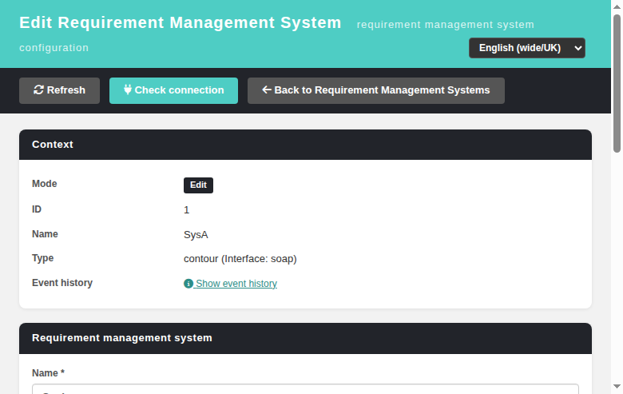

# Issue #1731 — the `reqMgrSystemEdit.php` 302 shim cast `$_REQUEST` without a shape check: `?doAction[]=x` wrote an E_WARNING **and** an ERROR row into `events` on every request

**Issue:** [#1731](https://github.com/sebiboga/testlink-upgraded/issues/1731)
**Commits:** `844bba827` (fix) + `cb7c5bf01` (regression suite)
**Branch:** `fix/issue-1731` (pushed; the CI `merge-prs.yml` lands it)
**Status:** VERIFIED-FIXED — regression suite **14/14 PASS** (Suite "Regression — Issue #1731", cases 53-66)
**Scope of this document:** the *shim* half of #1731. The *BFF* half was already fixed in `ef3331fd0` and is documented in [Modernized-ReqMgrSystemEdit.md](Modernized-ReqMgrSystemEdit.md).
**Sibling still open:** [#1732](https://github.com/sebiboga/testlink-upgraded/issues/1732) — the identical cast in `lib/testcases/listTestCases.php`.

## Symptom

One crafted GET against the legacy-URL redirect shim wrote **two** `events` rows, repeatably, with
no cap:

```
log_level 2 | E_WARNING
Array to string conversion - in .../lib/reqmgrsystems/reqMgrSystemEdit.php - Line 66
log_level 1 | reqMgrSystemEdit.php shim: unknown doAction "Array" - refusing to guess a modern target (Refs #1727).
```

The HTTP response itself is a perfectly normal `302 Found` to the list screen, so from the
outside the request is indistinguishable from the intended "unknown doAction → list screen"
path. 5 requests produced 10 rows.

## The approach, and why this one

### Root cause

`lib/reqmgrsystems/reqMgrSystemEdit.php` was rewritten in `ef3331fd0` ("harden the editor BFF **and
the shim**") from a full legacy page into a session-guarded 302 redirector. The **BFF's** parameter
reads were hardened in that same commit with `is_scalar()` (`api/reqmgrsystemedit/index.php:69,95-100,118-123`).
The **shim's own** reads were not — they were carried over verbatim from 1.9.20:

```php
$doAction = isset($_REQUEST['doAction']) ? trim((string)$_REQUEST['doAction']) : 'create';
$id       = isset($_REQUEST['id'])       ? intval($_REQUEST['id'])         : 0;
...
$v = isset($_REQUEST[$k]) ? intval($_REQUEST[$k]) : 0;   // $k in {tproject_id, tplan_id}
```

`isset()` returns `true` for `?doAction[]=x` — PHP fills `$_REQUEST['doAction']` with an **array** —
and `is_scalar()` is never consulted. Two distinct failures follow:

1. **Loud.** `(string)array` raises `E_WARNING Array to string conversion`. `logger.class.php`
   installs `watchPHPErrors` as the error handler, so that warning is persisted as a
   `log_level=2` row. The array is then coerced to the literal string `"Array"`, which matches no
   `switch` case, falls into `default:`, and fires the shim's own `tLog(..., 'ERROR')` — the second,
   **worse** row. So the corruption and the log-storm compound: 2 rows, not 1.
2. **Silent.** `intval(array)` is warning-free in PHP 8 and returns `1`. So `?id[]=1&doAction=edit`
   silently addressed system 1, and `?tproject_id[]=1` silently dropped the user into **test
   project 1** — with no warning and therefore *nothing at all* in `events`. Fixing only the loud
   path would have left this intact.

### Reachability — the part that makes it a real defect

The shim's only gate is `checkSessionValid($db)`. `grep -n "checkRights\|hasRight"` on the file
returns **line 14 only, inside the docblock** — there is no rights check in the shim, by design
(it only computes a 302 target). So **any** authenticated user of the installation, holding no
`reqmgrsystem_management` right at all, can write 2 Event-Viewer rows per request. That is the same
reachability #1731 documents for the BFF, and it is the "Event-Viewer-only" defect class of
[#1654](https://github.com/sebiboga/testlink-upgraded/issues/1654) and
[#1721](https://github.com/sebiboga/testlink-upgraded/issues/1721) — a defect that exists only in
the log, adding noise exactly where a real Error would need to be spotted.

Not anonymously reachable: `checkSessionValid()` redirects before line 66, so the unauthenticated
case is clean (verified, 0 rows).

### The fix

```php
function shimReqScalar($name)   // null when absent OR array-shaped, else the trimmed string
function shimReqInt($name)      // 0 when absent, array-shaped or non-numeric
```

This is deliberately the **same idiom already established in this repo**, not an invention:
`lib/attachments/attachmentdelete.php:33-38` and the `bffQueryScalar()` / `bffQueryInt()` helpers in
`api/reqmgrsystemedit/index.php:95-105`. Reusing it is what made the fix reviewable as obviously
equivalent to the BFF hardening a reviewer had already approved.

An array-shaped `doAction` is refused **early and separately**, not folded into the switch:

```php
if ($doActionShaped) {
    tLog('reqMgrSystemEdit.php shim: doAction is not a scalar value - ' .
         'refusing to guess a modern target (Refs #1731).', 'INFO');
    header('Location: ' . $listUrl, true, 302);
    exit;
}
```

### Why INFO and not ERROR, and why 302 and not 400 — the alternatives rejected

- **400 instead of 302.** Rejected. This file is a *bookmark redirector*; its entire contract is
  "never 500, always 302 somewhere sane", and the legacy deep links it exists to serve must keep
  resolving. Turning a junk query string into a client error would change the redirector's
  contract for no security gain — the request is refused either way.
- **ERROR instead of INFO.** Rejected, and this is the substantive judgement call. The ERROR level
  is reserved for a **genuinely** unknown verb (`?doAction=bogus`), which is a real client mistake
  worth surfacing to an operator. An array-shaped parameter is never a real request at all, and
  must therefore never be able to write a row — attacker-controlled text landing in the Event
  Viewer is precisely the harm. Note that the pre-fix ERROR row was a *downstream consequence* of
  the coercion, not a deliberate signal: the log fired because the value had been silently
  corrupted into `"Array"`. Removing the corruption removes the row at its source.

Array-shaped `id` / `tproject_id` / `tplan_id` degrade to `0`, which is exactly the "no id / no
context" case the code already handles (the session fallback at `testprojectID` / `testplanID`).
No new response shape, no new code path — just the existing one, fed sanitised input.

No user-facing string changed (the shim emits only a log line), so **no i18n keys were added**.

## Verification

Suite "Regression — Issue #1731", cases 53-66, `tmp/TLU_Test_Cases.md` — **14/14 PASS**.
One request per case, `events` rows with `log_level in (1,2)` counted before and after:

| Case | Result |
|---|---|
| `?doAction[]=x` | 302 → list screen, **rows=+0** (was +2) |
| `?doAction[]=edit` | 302 → list screen, rows=+0 |
| `?doAction[]=doDelete` | 302 → list screen, rows=+0, no server-side write |
| `?id[]=1&doAction=edit` | 302 → editor with **no** `id` (create mode), not `?id=1` |
| `?tproject_id[]=1` / `?tplan_id[]=1` | 302 → editor with no context parameter |
| `?doAction=edit&id=1&tproject_id=1` (scalar) | 302 → `reqMgrSystemEdit.html?id=1&tproject_id=1` — **legacy parity preserved** |
| `?doAction=create` | 302 → editor, no id |
| `?doAction=doCreate` | 302 → list screen, INFO only |
| `?doAction=bogus` (scalar unknown verb) | 302 → list screen, +1 ERROR — **pre-existing and intentional, unchanged** |
| 5 × `?doAction[]=x` | **rows=+0** (was +10) |
| anonymous | 302 to login, rows=+0 |
| `php -l` | no syntax errors |
| browser end-to-end | shim redirect → editor in Edit mode → rename `SysA` → `SysA-renamed` → **Save** → row persisted; 0 new Error/Warning rows; no console errors |



## Blast radius

`grep -rEn '\(string\)\$_REQUEST\[' --include=*.php lib gui` → **4 hits in 3 files**:

| File:line | Reachable? | Status |
|---|---|---|
| `lib/reqmgrsystems/reqMgrSystemEdit.php:66` | yes, 2 rows/request | **fixed here** |
| `lib/testcases/listTestCases.php:52` | yes, 2 rows/request | filed as **#1732** |
| `lib/keywords/keywordsEdit.php:71,73` | no — 302 before the cast, 0 rows | not a defect |

The `intval($_REQUEST[...])` form is far more widespread, but most call sites sit behind a full
`testlinkInitPage()` + rights gate, and only those whose coerced value is later interpolated into a
log line can escalate to a row. No exhaustive audit of those was done and no count is claimed.
