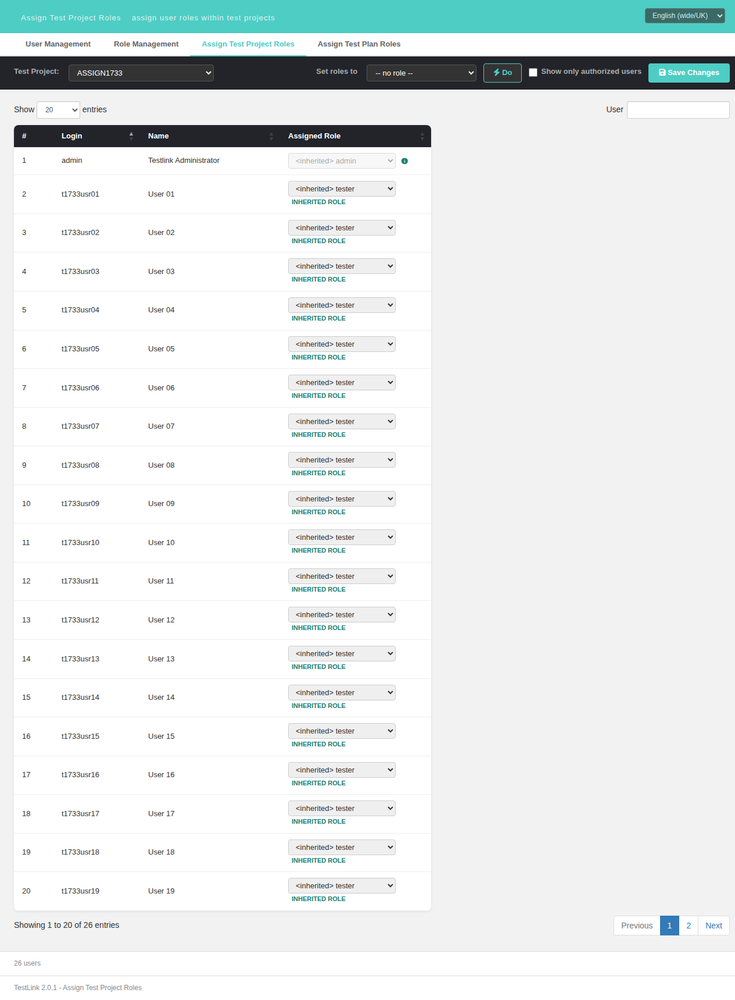
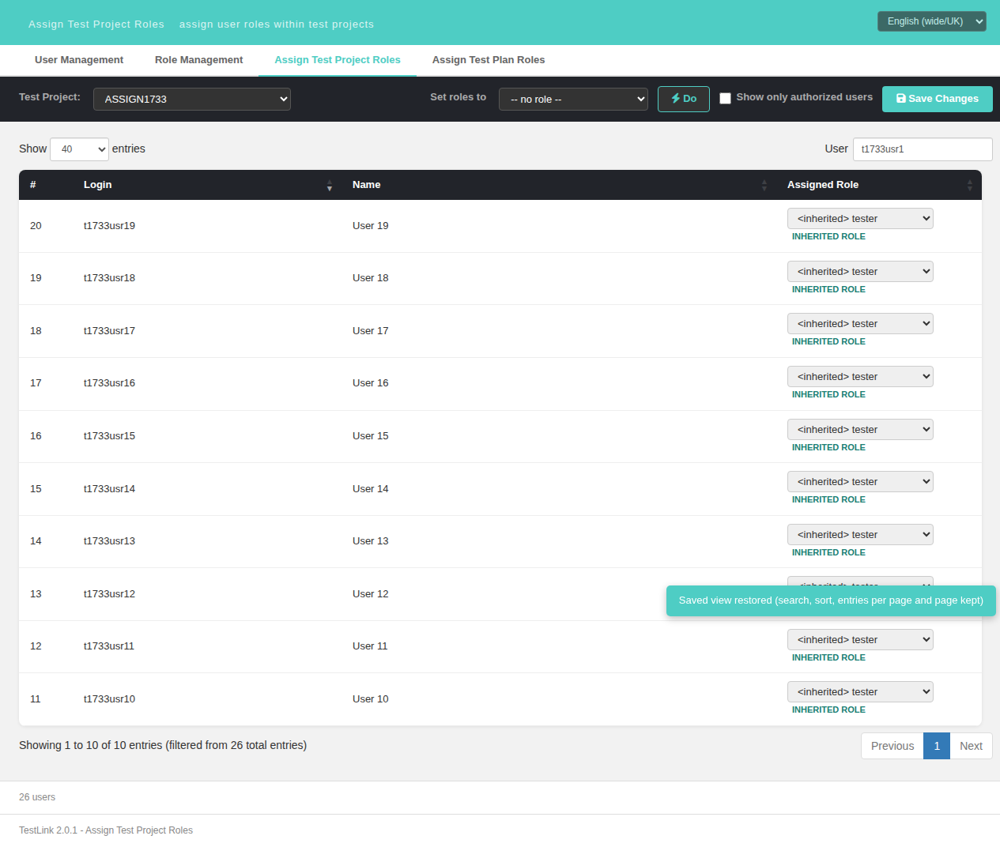

# Bugfix 1733 — "Saved view restored" toast fired on EVERY revisit of Assign Test Project Roles

**Issue:** [#1733](https://github.com/sebiboga/testlink-upgraded/issues/1733)
**Status:** FIXED & VERIFIED (2026-09-30) — branch `fix/issue-1733`, commit `0ed3cd422`
**Screen:** `gui/templates/usermanagement/usersAssignProject.html` (`notifyRestoredState()`, lines 714-736)
**BFF / PHP / i18n:** unchanged — `api/roles/index.php` already returned everything the grid needs, and
the `assign.viewStateRestored` key already exists in all 11 locale bundles

## The symptom

The localized toast **"Saved view restored (search, sort, entries per page and page kept)"** popped up
on **every** revisit of *Assign Test Project Roles* — including the plain case where the user had
changed nothing and the restored view was byte-for-byte the default one (empty search, *Show 20
entries*, `Login` ascending, page 1). Administrators were told their view had been restored when
nothing was restored, and the notice became noise that trains users to ignore it.

The twin screen *Assign Test Plan Roles* had already been corrected for this (issue #1642), so the two
identical-looking screens behaved differently.

## Root cause

`notifyRestoredState()` decided "is the restored view the default one?" with

```js
var isDefault = !st.search && st.length === dfltLen && st.start === 0 &&
  String(st.order) === '[[1,"asc"]]';        // usersAssignProject.html:719-720 (pre-fix)
```

but a state persisted by **DataTables 1.13.7** never looks like that:

| expression | measured value | verdict |
|---|---|---|
| `typeof st.search` | `"object"` | a `search` **object** is always materialised (`{search:'',smart:true,regex:false,caseInsensitive:true}`) |
| `!st.search` | `false` | **constant false** — any object is truthy |
| `String(st.order)` | `"1,asc"` | `order` is an **array of `[col,dir]` pairs**, so `String()` joins it |
| `String(st.order) === '[[1,"asc"]]'` | `false` | **constant false** — never equal to the JSON text |

So two of the three predicates could never hold, `if (isDefault) return;` was **unreachable**, and the
toast fired on every load from the second visit onwards. The first visit stayed silent only because
`state.loaded()` returns `null` when nothing was ever saved (early return at line 717).

Introduced by `9749149c` — *feat(#1622): DataTables stateSave on Assign Test Project Roles*. #1622 ported
the legacy `DataTables.inc.tpl` behaviour and wrote this test from scratch; #1642 ported the same
feature to the plan screen and this defect was caught and fixed there, which is exactly where #1733 was
filed from.

## Measured before the fix

Screen: `http://localhost:8082/gui/templates/usermanagement/usersAssignProject.html?tproject_id=5`,
`admin`/`admin`, 25 role-assignable users (`tmp/fixtures_1733.php`).

Restored state (a plain, untouched revisit):

```json
{"start":0,"length":20,"order":[[1,"asc"]],"search":{"search":"","smart":true,"regex":false,"caseInsensitive:true},"tproject_id":"5"}
```

Live grid at the same moment: `search()===""`, `page.len()==20`, `order()=='[[1,"asc"]]'`, `page()==0`
— i.e. the **default** view. Yet a `MutationObserver` on `#toast` recorded it visible for its full
lifetime:

```
visible:true  ms=175  class="toast ok"  text="Saved view restored (search, sort, entries per page and page kept)"
```

and `window.restoredStateNotified === true` afterwards. Executing both formulas side by side on that
very state: buggy `isDefault → false` (toast), corrected `isDefault → true` (silence).

## The fix

One function, +15/−2 lines — compare the search **string** and a **JSON-serialised** order, the exact
test the plan screen already uses:

```js
var searchStr = (st.search && typeof st.search === 'object')
  ? String(st.search.search || '')
  : String(st.search || '');
var isDefault = !searchStr && st.length === dfltLen && st.start === 0 &&
  JSON.stringify(st.order) === '[[1,"asc"]]';
```

Everything else is untouched: the one-shot guard (`if (!assignTbl || restoredStateNotified) return;`),
the `loaded() === null` early exit, the `restoredStateNotified = false` reset when the in-page project
combo really switches project, the caller, the i18n key and every locale bundle.

Alternatives rejected:

* **read the live table instead of the saved state** (`assignTbl.search()`, `.page.len()`, `.order()`).
  It would answer the same question, but the saved state is what was actually restored, and both
  screens already read the state — changing the source of truth would have made the twins differ in a
  second, subtler way.
* **persist a marker** (e.g. write a `tl_default_view` flag when the user leaves the grid on the
  default view). More code, more state to migrate, and it would keep lying whenever the flag and the
  real view drift apart.
* **drop the toast**. It is a real feature (#1622): a restored non-default view is otherwise invisible.

## Verified after the fix

`toast()` was wrapped in the page (`initScript`) so the **call count** is measured directly instead of
being inferred from CSS visibility — a 4 s auto-hide otherwise produces a second "visible" frame
cluster that a naive `getComputedStyle` poll miscounts as a second toast.

| Case | Expected | Observed |
|---|---|---|
| revisit with the **default** saved view (the bug) | no toast | **0 calls** (was 1) |
| first-ever visit, `state.loaded() === null` | no toast | 0 calls |
| non-default view (search `t1733usr1`, 40 entries, `Login` desc) | exactly one toast | **1 call** |
| back to the default view | silent again | 0 calls |
| length only differs (40) | toast | 1 call |
| in-page project switch 5 → 6 | state cleared, no leak | `state.loaded() === null`, 0 calls |
| twin `usersAssignPlan.html` | unchanged | 0 calls with a default state |
| console | clean | no `error`/`warn` |
| Event Viewer (`events`) | no new Error/Warning | only an AUDIT (`log_level=16`) row from the fixture; `log_level IN (1,2)` → 0 new rows |

Regression suite **1733 (cases 85-95): 11/11 PASS** — see `tmp/TLU_Test_Cases.md`.

## Screenshots

* Default view restored silently (after the fix) — the toast element stays empty and hidden:



* A genuinely non-default view is still announced, exactly once per page load:



## Files

| File | Purpose |
|---|---|
| `gui/templates/usermanagement/usersAssignProject.html` | the fix (`notifyRestoredState()`, lines 714-736) |
| `CHANGELOG` | `[KEY BUGFIX] - #1733` entry + the stale "still lives on the project screen" note in the #1642 entry |
| `tmp/fixtures_1733.php` | per-run fixture (project + 25 users); `tmp/` is gitignored |
| `tmp/TLU_Test_Cases.md` | regression suite 1733 (cases 85-95) |
