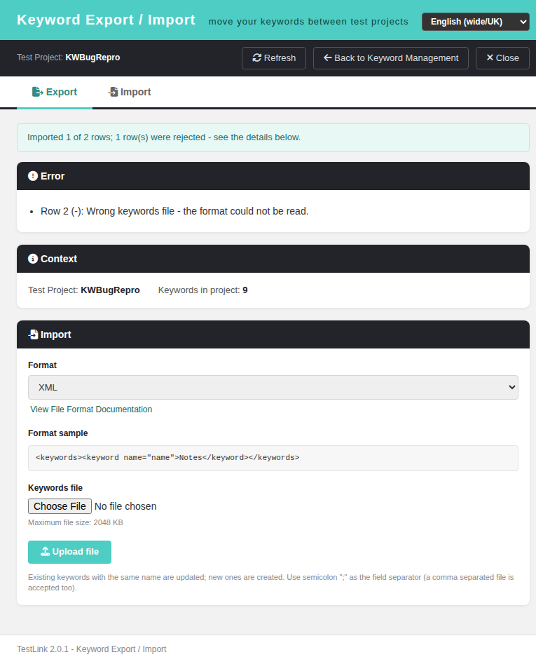
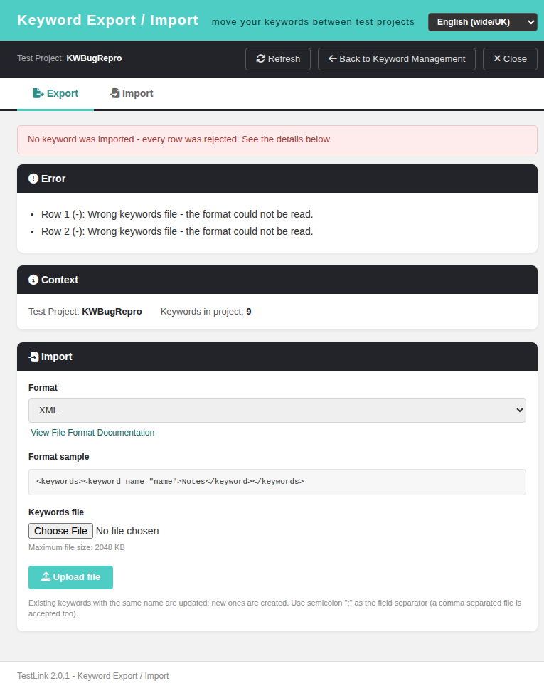

# Bugfix — Issue #1784: a malformed LAST `<keyword>` turned a successful XML keyword import into `400 wrong_keywords_file`

**Issue:** [#1784](https://github.com/sebiboga/testlink-upgraded/issues/1784) — *api/keywordsxml: a malformed LAST `<keyword>` turns a successful XML import into 400 wrong_keywords_file (earlier rows are written anyway)*
**Branch:** `fix/issue-1784`
**Affected screen:** Keyword Export / Import, **Import** panel (`gui/templates/keywords/keywordsExport.html`) + both import BFFs (`api/keywordsxml/index.php`, `api/keywords/index.php`); model function `testproject::importKeywordsFromSimpleXML()` (shared with the legacy `lib/keywords/keywordsImport.php` path and with `lib/testcases/tcImport.php` / `tcCreateFromIssue.php`)
**Regression suite:** `tmp/TLU_Test_Cases.md` → **Suite "Regression — Issue #1784"** (20/20 PASS; executable half `bash tmp/verify_1784.sh` → **18 PASS / 0 FAIL**)
**Commit:** `08ce29d54`

---

## 1. Symptom

An XML keywords file whose **last** `<keyword>` element is malformed made the WHOLE
import answer `400 wrong_keywords_file` ("the format could not be read") — even
though the rows before it had been imported successfully and were already in the
database. The row that was really wrong was not reported anywhere, so the user
retried the same file and kept getting the same 400 with nothing created.

The same file content imported **successfully** when the malformed row came
**first**: the outcome depended purely on the ORDER of the rows.

Measured pre-fix (`tproject_id=1`, fixture project `KWBugRepro`):

```
# valid row first, malformed row LAST
POST …?action=import  type=iSerializationToXML
=> 400 {"status":"error","message":"wrong_keywords_file","code":"wrong_keywords_file",
        "result":-16,"imported":1,"skipped":0,"rows":1,"errors":[]}

mysql> SELECT id,keyword FROM keywords WHERE testproject_id=1;
id  keyword
3   delta      <-- row 1 WAS written, yet the dialog says the file is wrong

# same bytes, the two rows SWAPPED
=> 200 {"status":"ok","imported":1,"skipped":0,"rows":1,"errors":[]}
```

Note that the failing response is also **internally inconsistent**: it claims
`rows:1, skipped:0, errors:[]` for a file with **2** rows, one of them rejected.

## 2. Root cause

`testproject::importKeywordsFromSimpleXML()` (`lib/functions/testproject.class.php`,
pre-fix `:1593-1619`) used ONE scalar for two different things:

```php
$status = tl::OK;
if(!$simpleXMLObj || $simpleXMLObj->getName() != 'keywords')   // file-level verdict
{
  $status = tlKeyword::E_WRONGFORMAT;
}

if( ($status == tl::OK) && $simpleXMLObj->keyword )
{
  foreach($simpleXMLObj->keyword as $keyword)
  {
    $kw = new tlKeyword();
    $kw->initialize(null,$testproject_id,NULL,NULL);
    $status = tlKeyword::E_WRONGFORMAT;     // ← the ROW verdict lands in the FILE scalar
    if ($kw->readFromSimpleXML($keyword) >= tl::OK)
    {
      $status = tl::OK;                    // ← …and is overwritten again
      if ($kw->writeToDB($this->db) >= tl::OK)
      { logAuditEvent(…); }                 // ← row already COMMITTED here
    }
  }
}
return $status;                              // ← LAST row decides the whole file
```

* the **document** check (unparsable file / wrong root node) is discarded by the very
  first iteration, so the returned scalar holds the verdict of the **last** `<keyword>`;
* `tlKeyword::E_WRONGFORMAT` is `-16`, exactly the `"result":-16` measured above;
* a purely **row-level** fact — `tlKeyword::readFromSimpleXML()` returning
  `E_WRONGFORMAT` for a `<keyword>` without a `name` attribute
  (`lib/functions/tlKeyword.class.php:443-446`) — was therefore escalated to a
  whole-file failure.

Two BFF arms made it worse, and neither could see a rejected row:

* `api/keywordsxml/index.php` called the XML arm with **no report** and *back-computed*
  one from the keyword-count delta (pre-fix `:336-337`:
  `$stats['rows'] = $stats['imported'] = max(0, $after - $before)`), which is why the
  response said `skipped:0, errors:[]`;
* the code mapping `NO_KEYWORDS_IMPORTED` / `EMPTY_FILE` **excluded** XML
  (pre-fix `:361 if ($type !== 'iSerializationToXML' && $fileWasReadable)`) — the note
  said "XML keeps the legacy code on purpose", which was true at the time #1605 added
  that mapping: the XML arm had no row report to publish yet;
* the sibling route `api/keywords/index.php` had the same defect and answered the very
  same file with a bare `422 {"error_code":"WRONG_FORMAT"}` and no row detail.

### Why it breaks NOW

The shape has been there since 1.9.20, but 2.0.1 made it *visible*: the modernized
Import dialog (#1615) and the per-row report for CSV (#1605) turned the old single
"wrong keywords file" answer into a response that claims to know the row count. The
correct end state is therefore to give the XML arm the same report the CSV arm got.

## 3. The fix (approach)

**Method chosen — mirror `importKeywordsFromCSV()`** (the in-repo precedent from #1605):
a rejected row is a *row* outcome, so it is reported, not escalated to the file; only an
unreadable document fails the file.

* `lib/functions/testproject.class.php`
  * `importKeywordsFromSimpleXML($testproject_id, $simpleXMLObj, &$stats = null)` gained
    the **same optional by-ref report** as the CSV arm
    (`rows` / `imported` / `skipped` / `errors[{row,code,name}]`, same
    `IMPORT_KEYWORD_ERRORS_MAX = 200` cap);
  * a **separate `$rowCode`** holds the per-row verdict, so the loop can no longer
    overwrite the document-level `$status`;
  * the function returns `tl::OK` whenever the document parsed and its root node is
    `<keywords>`; `E_WRONGFORMAT` is now returned **only** for those two file-level cases;
  * `importKeywordsFromXMLFile()` / `importKeywordsFromXML()` forward the optional report —
    source-compatible, so the legacy callers (`lib/testcases/tcImport.php:143`,
    `lib/testcases/tcCreateFromIssue.php:154`), which ignore the return value, are untouched.
* `api/keywordsxml/index.php` — passes the report to the XML arm, **deletes** the
  count-delta guess and the `iSerializationToXML` exclusion from the code mapping.
* `api/keywords/index.php` — the same 3-line change, so the two routes cannot drift apart.
* **No client change, no new i18n key**: `keywordsExport.html:357-367` already renders
  `skipped` / `rows` / `errors`, and `ROW_REASON` (`:404-413`) already maps `WRONG_FORMAT`
  → `kwxml.wrongFile` (the honest wording for one `<keyword>` node with no `name`).

**Alternatives rejected**

* *Roll the whole import back (all-or-nothing)* — would break the partial-import
  semantics the XML arm has always had, needs write-capable transactions, and still
  would not tell the user *which* row was bad.
* *Keep `E_WRONGFORMAT` as the return and only fill `$stats`* — the BFF decides HTTP 400
  from the return value alone, so a rejected row would still kill the whole file.
* *Throw an exception on a bad row* — nothing in this path throws (no Error/Warning in
  `events` either), and it would break the two legacy callers.

## 4. Verification

Measured post-fix on the same fixture (`tproject_id=1`, plus a fresh
`KWBugRepro1784` project for the script run):

| input | before | after |
|---|---|---|
| valid 1st + malformed **last** (the reported file) | `400 wrong_keywords_file result:-16 imported:1 skipped:0 rows:1 errors:[]` | `200 {"imported":1,"skipped":1,"rows":2,"errors":[{"row":2,"code":"WRONG_FORMAT","name":""}]}` |
| malformed 1st + valid last | `200 imported:1` | `200 {"imported":1,"skipped":1,"rows":2,"errors":[{"row":1,…}]}` (order no longer matters) |
| retry of the reported file | `400 wrong_keywords_file` (forever) | `400 NO_KEYWORDS_IMPORTED imported:0 skipped:2 rows:2 errors:[{row:1,ALREADY_EXISTS,delta},{row:2,WRONG_FORMAT,""}]` |
| every row rejected | `400 wrong_keywords_file` | `400 NO_KEYWORDS_IMPORTED skipped:2 rows:2 errors:[both rows]` |
| `not xml at all` | `400 wrong_keywords_file result:-16` | **unchanged** |
| `<notkeywords>` wrong root | `400 wrong_keywords_file result:-16` | **unchanged** |
| all rows valid | `200 imported:2 rows:2` | `200 imported:2 skipped:0 rows:2` — **no change** |
| CSV arm (valid / mixed / all-rejected) | — | measured **identical pre/post** |
| sibling route `api/keywords/index.php/import` | `422 WRONG_FORMAT`, no detail | `422 NO_KEYWORDS_IMPORTED rows:2 skipped:2 errors:[both rows]` |
| `events` table | — | 14 rows after 15 imports incl. 3 malformed, **all `log_level` 16** (audit) — 0 new Error/Warning |

Browser check (admin, Import panel, `tproject_id=1`):

* partial file → notice **"Imported 1 of 2 rows; 1 row(s) were rejected - see the details below."**
  and the row list **"Row 2 (-): Wrong keywords file - the format could not be read."**,
  project keyword count 8 → 9
* every row rejected → **"No keyword was imported - every row was rejected. See the details below."**
  with both rows named





## 5. Known pre-existing behaviour (deliberately NOT changed)

`<keywords></keywords>` — a document that parses fine but carries **no** `keyword`
node — still answers `400 wrong_keywords_file result:-16`. Measured root cause: an
**empty** `SimpleXMLElement` casts to `false` in a boolean context (no children, no
attributes, no text), so the legacy guard `!$simpleXMLObj` at
`testproject.class.php` fires on a perfectly valid document:

```
LOAD file=…-importkeywords.XML len=21 raw=<keywords></keywords> is_false=false
DBG  is_false=false name='keywords'        ← parsed fine, root node IS <keywords>
BFF  result=-16                            ← yet E_WRONGFORMAT
```

This is 1.9.20 behaviour, unrelated to the row-order defect, and changing the guard to
`=== false` would alter legacy semantics for a case nobody reported — out of scope for
a minimal fix. Documented instead (suite case 7, `verify_1784.sh` R7).