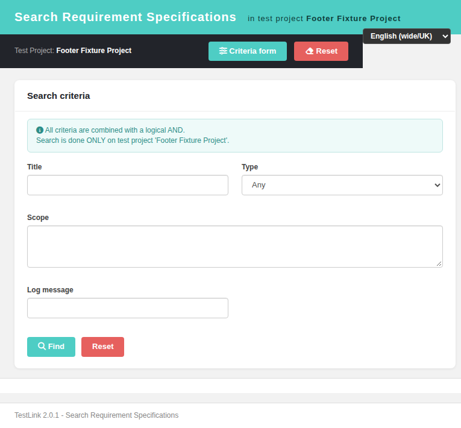

# Bugfix — Issue #1835: `searchReqSpec.html` — the "Criteria form" toolbar button rendered the raw i18n KEY in all 10 locales

**Number:** #1835
**Status:** Fixed (verified — reproduced pre-fix in the a11y tree, root-caused to `TLi18n.t()`'s missing-key echo combined with `apply()`'s unconditional `textContent` overwrite, fixed by adding the single absent key to all 10 bundles, pinned with an 18-case regression suite)
**Component:** `gui/templates/requirements/searchReqSpec.html` (consumer, unmodified), `gui/templates/i18n/*.json`
**Area:** Requirements / Search Requirement Specifications — i18n
**Branch:** `fix/issue-1835`
**Related:** #1825 (the modernization that introduced both the `rssf.*` namespace and the button), #1829 (same failure mode — `t()` echoing a key — on the neighbouring Specification Tree screen), #1081 (same screen; the generated-on footer whose mandatory review surfaced this defect)

## Symptom

The dark toolbar of the modern **Search Requirement Specifications** screen showed the raw
i18n key where a button label belongs:

```
searchReqSpec.html?tproject_id=9081   (locale en)
  toolbar   [ rssf.criteria ] [ Reset ]
                ^^^^^^^^^^^^ raw key
```

Every other string on the screen was translated — the header, the panel caption
(*Search criteria*), the AND-hint, the *Find* button and *Reset* — so the defect was one
element, not a broken i18n load. It was visible to **100% of users in 10/10 locales**.

The issue was filed as "the inner text is the English fallback only", implying a working
fallback. **Investigation corrected that framing:** there is no per-key English fallback at
all. `apply()` overwrites the inline text unconditionally, so the inline `Criteria form` was
dead code and could never be seen — only a bundle entry can fix this.

## Root cause

`gui/templates/i18n/i18n.js:175`:

```js
function t(key, params) {
  var str = _strings[key] || key;   // missing entry -> the KEY, which is truthy
  …
```

and `gui/templates/i18n/i18n.js:190-193`:

```js
$root.find('[data-i18n]').each(function() {
  var key = $(this).data('i18n');
  if (key) $(this).text(t(key));     // overwrites textContent unconditionally
});
```

The button label is declared at `gui/templates/requirements/searchReqSpec.html:69`:

```html
<button class="btn-teal" id="btnCriteria" onclick="openCriteriaForm()"><i class="fa fa-sliders"></i> <span data-i18n="rssf.criteria">Criteria form</span></button>
```

…and the key genuinely did not exist. Measured with a JSON **parser** (not grep, so a
malformed file cannot hide behind a grep miss):

```
de.json -> MISSING   en.json -> MISSING   es.json -> MISSING   fr.json -> MISSING
it.json -> MISSING   ja.json -> MISSING   pt.json -> MISSING   ro.json -> MISSING
ru.json -> MISSING   zh.json -> MISSING
```

`0/10` bundles define `rssf.criteria`, while `en.json` carries **48** other `rssf.*` keys
(including the sibling `rssf.criteriaCaption`, `rssf.header`, `rssf.find`). The `rssf`
namespace as such was never broken — the #1825 modernization added 48 keys and forgot this
one. So of the **21** distinct `data-i18n` keys the screen declares, **exactly one** was
absent:

```
$ grep -o 'data-i18n="[^"]*"' gui/templates/requirements/searchReqSpec.html | sed … | sort -u | wc -l
21
$ python3 -c "…compare against en.json…"
MISSING in en.json: ['rssf.criteria']        <-- the only one
```

**Why no verification step caught it.** The defect throws nothing, logs nothing and writes
no `events` row: `t()` returns its input, `apply()` writes it, and the result is a
plausible-looking button. Neither the Event Viewer nor the console can see it — only the
rendered DOM or a key-coverage check can. That is the same blind spot as #1829.

## Fix

**Approach: add the one absent key to all ten bundles.**

I considered and rejected three alternatives:

1. **Re-point the button at the existing `rssf.criteriaCaption` ("Search criteria").**
   Rejected — that key is the **panel caption on this very screen**
   (`<div class="panel-head" data-i18n="reqspecsearch.formCaption">`), so the button would
   duplicate the adjacent heading and read as a caption rather than an action. It is also
   semantically wrong for the destination screen.
2. **Hardcode "Criteria form" and drop `data-i18n`.** Rejected — forbidden by rule 3 of
   `ai/AGENTS.md` and it breaks the other nine locales.
3. **Harden `t()` so a lookup miss keeps the element's inline text.** Tempting, because it
   would close the entire *class* of bug (#1829 and this one are the same mechanism), but
   **rejected as out of scope**: it is a behaviour change to the shared i18n core affecting
   every modernized screen, and `ai/FIX-ISSUE.md` §3 forbids drive-by changes. Worth doing
   as its own enhancement.

The key was inserted **alphabetically, as a single line**, between the existing
`"rssf.contextCaption"` and `"rssf.criteriaCaption"` lines that every bundle already
carries — *not* via a `json.dump()` rewrite. Parallel CI agents append keys to these same
ten files, so a re-serialising rewrite would have produced a whole-file diff and destroyed
their in-flight work. Each bundle's diff is **+1 / −0**.

| bundle | value |
|---|---|
| en | Criteria form |
| de | Kriterienformular |
| es | Formulario de criterios |
| fr | Formulaire de critères |
| it | Modulo criteri |
| ja | 検索フォーム |
| pt | Formulário de critérios |
| ro | Formular de criterii |
| ru | Форма критериев |
| zh | 搜索条件表单 |

Terminology was matched to each bundle's **own sibling keys**, not translated in
isolation — de *Kriterien* (as in `rssf.filterModeAnd`), fr *critères*, es *criterios*,
ja 検索 and zh 搜索 (both sharing the prefix of `rssf.criteriaCaption`), pt *critérios*.

The `ro` value is deliberately **diacritic-free**: all 48 pre-existing `rssf.*` keys of
`ro.json` omit diacritics (`rssf.criteriaCaption` is the diacritic-stripped
`"Criterii de cautare"`), and `formular` / `criterii` require none in Romanian. The whole
`ro.json` bundle *does* use diacritics elsewhere (3329 of 6697 values) — the `rssf`
namespace is an outlier inside it, and the new key follows the namespace it belongs to.
The pre-existing `"Cautare"` misspelling in that sibling key was deliberately left
untouched: correcting it is not part of this fix.

The screen markup was **not** changed — the consumer at `searchReqSpec.html:69` was already
correct; only the data it looks up was missing.

## Verification

Fixture: `tmp/fixtures_1081.sql` (test project **9081**, 2 requirement specifications,
role for user 1). Live, in headless Chrome, authenticated as `admin`:

| # | case | expected | measured | verdict |
|---|------|----------|----------|---------|
| 1 | key coverage, 21 keys of the screen vs `en.json` | `MISSING: []` | `MISSING in en.json: []` (was `['rssf.criteria']`) | PASS |
| 2 | key present in 10/10 bundles (in-page `fetch`, JSON parse) | all `true` | `de,en,es,fr,it,ja,pt,ro,ru,zh` → all `true` | PASS |
| 3 | `python3 -m json.tool` on all 10 touched bundles | exit 0 each | `JSON OK` × 10 | PASS |
| 4 | a11y tree, locale `en` | `button " Criteria form"` | `uid=5_26 button " Criteria form"` (was `uid=1_9 button " rssf.criteria"`) | PASS |
| 5 | `&locale=ro` | Romanian, no raw key | `Formular de criterii`, `rawKeyVisible: false` | PASS |
| 6 | `&locale=de` | German | `Kriterienformular`, `rawKeyVisible: false` | PASS |
| 7 | `&locale=fr` | French | `Formulaire de critères` | PASS |
| 8 | `&locale=es` | Spanish | `Formulario de criterios` | PASS |
| 9 | `&locale=it` | Italian | `Modulo criteri` | PASS |
| 10 | `&locale=pt` | Portuguese | `Formulário de critérios` | PASS |
| 11 | `&locale=ru` | Russian | `Форма критериев` | PASS |
| 12 | `&locale=ja` | Japanese | `検索フォーム` | PASS |
| 13 | `&locale=zh` | Chinese | `搜索条件表单` | PASS |
| 14 | minimal diff: each bundle vs `HEAD`, parsed JSON | 1 added, 0 removed, 0 modified, +1 line | 10/10 `added=['rssf.criteria'] removed=[] changed=[] lines +1` | PASS |
| 15 | button still navigates (`openCriteriaForm()`) | `reqSpecSearchForm.html` | navigated to `…/requirements/reqSpecSearchForm.html?tproject_id=9081` | PASS |
| 16 | full authenticated render | header, project name, Type dropdown, both toolbar buttons translated | title `Footer Fixture Project - Search Requirement Specifications`; name + Type options populated from the BFF | PASS |
| 17 | console after the pass | no new error/warning | 0 console errors on the authenticated page | PASS |
| 18 | `events` table after the pass | no new Error/Warning | 1 row only: `log_level 16` (AUDIT) `audit_login_succeeded`; 0 Error/Warning | PASS |



Regression suite **"Regression — Issue #1835"** (18 cases) appended to
`tmp/TLU_Test_Cases.md`; merge-base gate
`TLU_REQUIRE_SUITE="Issue #1835" bash ai/verify_test_suites.sh` → **7 PASS / 0 FAIL /
0 SKIP** (baseline 85 suites → 86, no suite lost).

## Blast radius

One consumer only: `grep -rn 'rssf\.criteria"' gui/templates api` returns exactly the
single reference at `searchReqSpec.html:69`. No JS, no PHP, no screen markup and no
existing key was touched — `1 added / 0 removed / 0 modified` in all ten bundles. No other
screen reads this key, and the ten new values are distinct from one another and from each
bundle's own `rssf.criteriaCaption`, so nothing can collide. The bundle fetch is
cache-busted (`i18n.js:135`), so no stale cache can serve the old rendering.

## Known limitation (pre-existing, out of scope)

The locale switcher offers **16** locales (`cs, de, en, es, fi, fr, id, it, ja, ko, nl,
pl, pt, ro, ru, zh`) but only **10** bundles exist; `cs, fi, id, ko, nl, pl` fall back to
`en` at file level (`i18n.js:135-152`). Not introduced or worsened here — and because of
this fix those six locales now render "Criteria form" through the `en` fallback instead of
a raw key, so they improve too.

There is also **no i18n coverage gate** in `ai/verify_test_suites.sh`. That absence is why
both this bug and #1829 could ship: neither the console nor the Event Viewer can observe a
key that resolves to itself. A `data-i18n` / `t()`-key coverage script over the bundles
would catch the whole class.