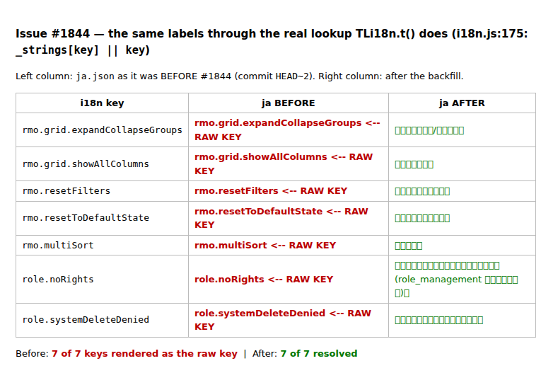
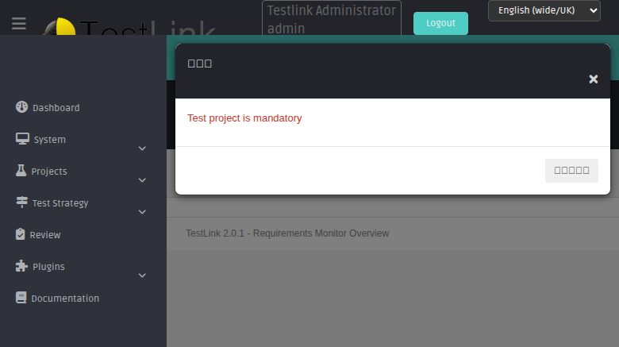

# Bugfix — Issue #1844: the raw i18n key in 8 of 10 bundles, and the gate that now makes it impossible to miss

**Branch** `task/issue-1844` · **Commits** `c0f874cad` (gate + backfill), `11f0a9718`
(drop the CI workflow file — the bot token cannot push it) · **Follow-up** #1850 ·
**Refs** #1840, #1845

## The gap

The client-side translator falls back to the key itself:

```js
// gui/templates/i18n/i18n.js:175
var str = _strings[key] || key;
```

`apply()` then overwrites `textContent` unconditionally, so a bundle that is silent on a
key paints the key on screen — no exception, no console error, no failed build, no
Event-Viewer row. Nothing in the toolchain noticed, because the only i18n check in the
repository was

```bash
python3 -m json.tool <file>      # ai/AGENTS.md rule 3, ai/IMPLEMENT-TASK.md §3,
                                  # ai/FIX-ISSUE.md §5, ai/ISSUES.md §4,
                                  # ai/MERGE-STALE-BRANCHES.md
```

which proves **well-formedness, never coverage**. `{"role.noRights": null}` is valid JSON.

## What was actually broken (measured on `ca1eedd1c`)

| bundle | keys | missing vs `en.json` |
|---|---|---|
| `en.json` | 6781 | 0 (reference) |
| `fr.json` | 6781 | 0 — the only complete one, thanks to #1840 |
| `de.json` | 6755 | **26** |
| `es.json` | 6755 | **26** |
| `it.json` | 6755 | **26** |
| `ja.json` | 6761 | **20** |
| `pt.json` | 6761 | **20** |
| `ru.json` | 6761 | **20** |
| `ro.json` | 6775 | **6** |
| `zh.json` | 6741 | **40** |

40 unique keys, in five groups:

| group | keys | missing from |
|---|---|---|
| `rctc.*` (Create Test Cases from Requirements) | 6 | de, es, it |
| `rmo.*` (Requirements Monitor Overview toolbar) | 10 | all but ro |
| `role.*` (Role Management) | 6 | all nine |
| `ts.chapterBug*` (Test Strategy chapters) | 4 | all but ro |
| `tspec.*` (Test Specification version lifecycle) | 16 | zh |

Keys a bundle has but `en.json` does not: **0 in all nine** — drift is strictly
one-directional, which is what makes `en.json` the right reference for a gate.

## Where the drift came from (`git log -S`)

| key | commit | the commit claimed | the truth |
|---|---|---|---|
| `rctc.countFilled` | `9d380b9dc` | "rctc.* keys in **all 10** locale bundles" | `grep -c rctc.countFilled gui/templates/i18n/*.json` → en/ja/pt/ro/ru/zh = 1, **de/es/fr/it = 0** |
| `rmo.grid.groupItem` | `a381901e3`, `05e072a95` | reqMonitorOverview grid + toolbar | keys written to `en` + `fr` only |
| `role.noRights` | `4bcf10e07` | "restore 10 BFF APIs + GUI templates + i18n gutted by `8ef9694d3`" | the *restoration* restored the drift: `en` + `fr` |
| `ts.chapterBugStructure` | `588897593` | Test Strategy bug chapters | `en` + `fr` |
| `tspec.freeze` | `1df35b90f` | "version selector + lifecycle actions" | every bundle except `zh` |

The class is not carelessness. `4bcf10e07` shows it is what happens when a **revert is
re-landed bundle by bundle**: each bundle is valid, each diff is reviewed, and nobody
compares the key *sets*.

## The fix, part 1 — backfill (184 pairs)

Written **textually before the closing brace**, never re-serialised: the bundles are
append-ordered, not alphabetically sorted, so `json.dumps(sort_keys=True)` would have
moved ~100 lines per file and buried 184 real lines in reformatting noise. Result per file:
`+26/-1`, `+20/-1`, `+6/-1`, `+40/-1` — additions only, the single `-1` being the closing
brace gaining a comma.

* **8 strings reused verbatim from each bundle's own sibling.** `rmo.grid.*` are the
  Requirements-Monitor-Overview twins of the already-translated `ro.grid.*` (identical
  English in `en.json`), and `rmo.resetFilters` is the twin of `tspec.resetFilters`.
  Reusing the sibling is the only way the two screens keep saying the same thing — a fresh
  hand translation would have drifted from `ro.grid.*` inside one UI.
* **~80 hand-written translations** for `rctc.*`, `role.*`, `ts.chapterBug*`,
  `rmo.multiSort`, `rmo.resetToDefaultState` and `tspec.*` (zh), each written in the
  bundle's existing register and reusing its established terms.
* Placeholders preserved: `{count}` in `rmo.grid.groupItem/groupItems`, verified across all
  nine bundles.
* `fr.json` — nothing to do; #1840 had already fixed it.

## The fix, part 2 — `ai/verify_i18n_coverage.sh` (blocking)

```bash
bash ai/verify_i18n_coverage.sh              # exit 1 if a bundle misses an en.json key
bash ai/verify_i18n_coverage.sh --report     # WARN only, triage
bash ai/verify_i18n_coverage.sh --max-print N <dir>
```

* **Flattens** nested bundles before comparing — `TLi18n` looks up flat keys, so a bundle
  that nests `a.b.c` as an object must compare equal to a flat `en.json`.
* **Extra keys are informational, not failures** — a bundle may legitimately carry a key
  `en.json` has dropped; that must not wedge the gate.
* **Blocking, not warning.** A `--report`-only gate would have printed all five historical
  commits and exited 0: the same silent outcome, one step removed.
* **Refuses to report success when it cannot compare** — missing or empty `en.json`,
  invalid JSON in any bundle: all exit 1 with a readable message.
* Read-only: it never rewrites a bundle.

Wired into `ai/AGENTS.md` rule 3, `ai/IMPLEMENT-TASK.md` §3 and `ai/FIX-ISSUE.md` §5 —
all three previously stopped at `json.tool`, which is exactly how the drift shipped.

### Why there is no CI workflow yet

`.github/workflows/i18n-coverage.yml` was written and validated (`yaml.safe_load` → `jobs:
['coverage']`), but the agents' push token is a GitHub App **without** `workflows`
permission and the push was rejected. The YAML is preserved verbatim in **#1850** for a
token that can commit it. Until then the rulebooks are the enforcement point, and they
cover every agent run.

## Verification

```
$ python3 -m json.tool gui/templates/i18n/*.json     -> 10/10 valid
$ bash ai/verify_i18n_coverage.sh ; echo $?
PASS de.json ... PASS zh.json — 6781 keys, 0 missing
9 bundle(s) passed, 0 failed
0
```

9-case gate self-test: **exit 1** on a single injected missing key (the exact shape of
`9d380b9dc`), on invalid JSON, on an empty reference, on a missing reference, on a bad
`--max-print`; **exit 0** with `--report` on the same tree; nested layout compares equal;
the real tree stays green.

Browser: the pre-fix `ja.json` (`HEAD~2`) and the fixed one rendered through the real
lookup side by side — **7 of 7 keys were the raw key before, 7 of 7 resolve after**:



And in the live UI (admin/admin, locale forced with `?locale=ja`):



`グループの展開/折りたたむ` · `全ての列を表示` · `フィルターをリセット` ·
`デフォルト状態に戻す` · `複数ソート` — five strings that used to be raw keys on that
toolbar. Role Management, Create Test Cases from Requirements and Test Specification were
checked the same way in `zh` and `ja`: zero raw keys on screen, and a programmatic sweep of
**368 key × locale lookups** across the 40 keys × 9 bundles returned zero fallbacks.

Test suite: `Task — Issue #1844` in `tmp/TLU_Test_Cases.md`, 15 cases, **15/15 PASS**.
`ai/verify_test_suites.sh` (G1805): 7 PASS / 0 FAIL / 0 SKIP — 12 suites at the merge-base
→ 13, none lost.


