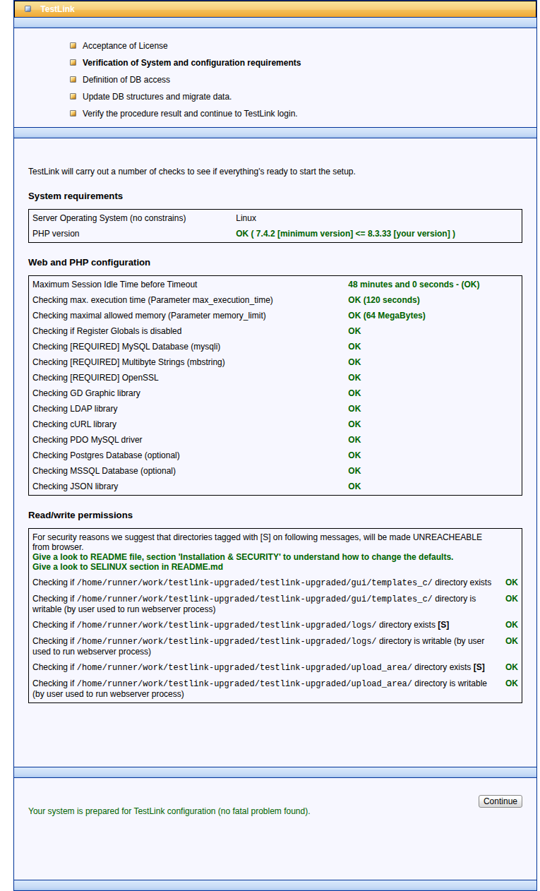

# Bugfix Issue #484 — PHP configuration requirements for installer warnings

Issue: https://github.com/sebiboga/testlink-upgraded/issues/484
Branch: `fix/issue-484-php-config-installer-warnings` · Fix commit: `c8e6edd14`

## Symptom (pre-fix)

`install/installCheck.php` ("Web and PHP configuration" table) showed three
`tab-warning` rows on every dev environment started per the README:

| Row | Value shown | Why |
|---|---|---|
| Maximum Session Idle Time before Timeout | `24 minutes and 0 seconds - (Short. Consider to extend.)` | `session.gc_maxlifetime=1440` (stock php.ini); success needs > 30 min |
| Checking max. execution time | `30 seconds - We suggest 120 seconds ...` | stock php.ini value below the recommended 120 s |
| Checking maximal allowed memory | `-1 MegaBytes - We suggest 64 MB ...` | **false positive** — `-1` is PHP's "unlimited" sentinel, not a byte count |

## Root cause

Two independent causes:

1. **Environment**: the documented Quick Start ran a bare
   `php -S 0.0.0.0:8082 -t .`, so stock php.ini values (1440 / 30 / -1) flowed
   straight into the installer checks. Nothing in the repo enforced or
   documented the values the installer expects.
2. **Checker logic** (`lib/functions/configCheck.php`,
   `check_php_settings()`): the memory check computed
   `intval(str_ireplace('M','',ini_get('memory_limit')))` and compared it
   against 64 — so unlimited (`-1`) was flagged as insufficient. The
   max-execution-time comparison likewise did not know that `0` means *no
   limit*.

## The fix — HOW

* **Checker sentinels** (`lib/functions/configCheck.php`):
  * `max_execution_time == 0` → success row `OK (no limit)`;
  * `memory_limit == -1` → success row `OK (unlimited)`.
  Warning branches for real under-provisioning are unchanged.
* **Durable configuration**: new executable `scripts/devserver.sh` starts the
  built-in server with exactly the required overrides:
  `-d max_execution_time=120 -d session.gc_maxlifetime=2880 -d memory_limit=64M`
  (2880 s = 48 min > 30-min threshold). README *Quick Start (Development)* now
  uses the launcher and lists the equivalent php.ini snippet for real web
  servers:

```ini
max_execution_time = 120
session.gc_maxlifetime = 2880
memory_limit = 64M
```

Alternatives rejected: editing `/etc/php/php.ini` on the dev box (not
versionable; lost on every fresh CI run); forcing `ini_set()` at application
bootstrap (changes runtime behaviour of already-installed systems — this bug
is display/config-level only).

## Verification (measured)

* Pre-fix curl of `installCheck.php`: the three warnings above reproduced 1:1.
* After restarting through `scripts/devserver.sh`, same request returns all
  rows green: `48 minutes and 0 seconds - (OK)`, `OK (120 seconds)`,
  `OK (64 MegaBytes)`.
* Sentinel paths proven in isolation via a CLI harness running
  `check_php_settings()` with `memory_limit=-1` / `max_execution_time=0`:
  outputs `OK (unlimited)` / `OK (no limit)`.
* App regression: login admin/admin after restart renders the full shell;
  `events` table shows no new Error/Warning entries.



Regression suite: `tmp/TLU_Test_Cases.md` → *Suite 484* (9/9 PASS).
