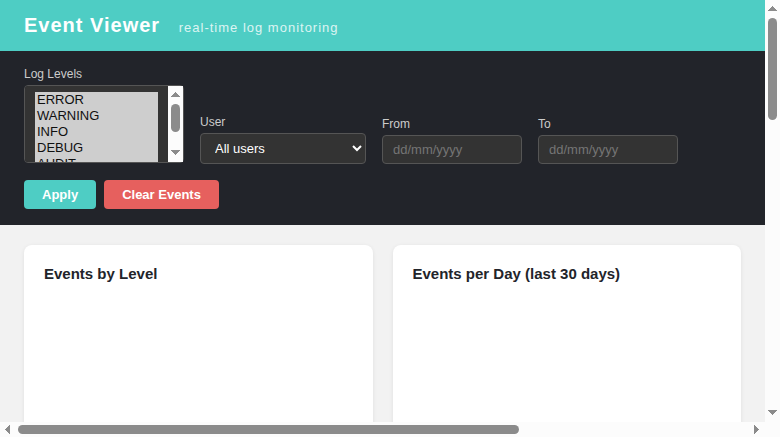

# Issue 668 — `getLastExecutionResult`: spurious E_USER_NOTICE `missing column:exec_id` from `fetchRowsIntoMap()` on every never-executed query

**Issue:** [#668](https://github.com/sebiboga/testlink-upgraded/issues/668)
**Branch:** `fix/issue-668`
**Status:** FIXED & VERIFIED (2026-08-24)

## Symptom

Every `tl.getLastExecutionResult` call for a test case with **no executions**
(response `[{"id":-1}]`) logged one spurious event into the `events` table:

```
E_USER_NOTICE
database/fetchRowsIntoMap - missing column:exec_id - SQL: SELECT MAX(id) AS exec_id
FROM executions WHERE testplan_id = 4 AND tcversion_id IN( SELECT id FROM nodes_hierarchy
WHERE parent_id = 101) - in .../lib/functions/database.class.php - Line 679
```

Responses were always correct — pure audit/log noise, one row per API request,
polluting the Event Viewer.

## Root cause chain

1. `lib/api/xmlrpc/v1/xmlrpc.class.php:1630` — the never-executed lookup uses an
   aggregate: `SELECT MAX(id) AS exec_id FROM executions WHERE ...`.
2. MariaDB semantics: an aggregate query **without GROUP BY always returns exactly
   one row**; on an empty set that row is `exec_id = NULL` (verified directly:
   plain query → 1 row/NULL; same query with `HAVING exec_id IS NOT NULL` → 0 rows).
3. `database.class.php:658` — `exec_query()` returns a truthy result, so the fetch
   loop at :671 runs once over `array('exec_id' => null)`.
4. `database.class.php:675` — guard `if( !isset($row[$column]) )`: PHP's `isset()`
   returns **false for keys whose value is NULL**, so a present-but-NULL column is
   misclassified as "missing column".
5. `database.class.php:677-680` → `trigger_error(..., E_USER_NOTICE)` + `return null`.
6. Caller `xmlrpc.class.php:1641-1649` reads null as "never executed" → `[{"id":-1}]`.

Not an alias-resolution problem (as first hypothesized in the issue) — the alias
resolves fine; it is the classic `isset()`-on-NULL false negative colliding with
SQL aggregate semantics.

## Blast radius

| Site | Exposure |
|------|----------|
| xmlrpc.class.php:1630 (`getLastExecutionResult`, MAX aggregate) | ONLY site feeding `fetchRowsIntoMap` a column that can be NULL |
| xmlrpc.class.php:1777 (`getAllExecutionsResults`) | immune — plain `SELECT(id)`; empty set ⇒ zero rows ⇒ clean null |
| xmlrpc.class.php:7558 (`getTestCaseBugs`) | immune — same plain-column shape |
| `fetchRowsIntoMap` itself (~303 callers under lib/) | deliberately NOT touched |

Changing the DB class guard to `array_key_exists()` was rejected: for this caller it
would build `array('' => row)` instead of returning null, so `intval(key($rs))`
(xmlrpc.class.php:1649) would yield 0 → `WHERE id=0` → the wire response would change
from `{"id":-1}` to a null entry — an API contract break across a 303-caller surface.

## Approach — filter the NULL aggregate row at the single affected query

Append `HAVING exec_id IS NOT NULL` to the MAX() query so an empty execution set
produces **zero rows** instead of one NULL row. The fetch loop then never runs and
`fetchRowsIntoMap()` returns null cleanly — no trigger_error, identical caller flow,
identical wire response.

```php
$sql = " SELECT MAX(id) AS exec_id FROM {$this->tables['executions']} "
     . " WHERE testplan_id = {$this->args[self::$testPlanIDParamName]} "
     . " AND tcversion_id IN( SELECT id FROM {$this->tables['nodes_hierarchy']} "
     . " WHERE parent_id = {$this->args[self::$testCaseIDParamName]})";
// optional AND build_id / AND platform_id appended here ...
$sql .= " HAVING exec_id IS NOT NULL";   // MUST come last
```

Note (portability): `HAVING exec_id IS NOT NULL` references the SELECT alias,
which MariaDB/MySQL accept on implicit-aggregate queries; PostgreSQL would require
`HAVING MAX(id) IS NOT NULL`. Fine for this project's MariaDB target.

Placement matters: `build_id`/`platform_id` filters are concatenated AFTER the base
string, so the HAVING clause is appended LAST. The first attempt embedded it in the
base string producing `... HAVING exec_id IS NOT NULL AND build_id = 1` → MariaDB
error 1054 ("Unknown column 'build_id' in 'HAVING'") on build-filtered calls. Caught
by regression item R5 before landing; corrected in commit `bda84f3bc`. The two ERROR
events from that intermediate state (13:43/13:44) are documented in the issue trail.

## Verification (Suite 668 — 6/6 PASS, see tmp/TLU_Test_Cases.md)

Live XML-RPC matrix against http://localhost:8082; fixtures project 3 / plan 4 /
build B1-668 / cases 101, 104; events watermark 5:

| # | Case | Result |
|---|------|--------|
| R1 | fresh never-executed case → getLastExecutionResult | `[{"id":-1}]`, events 5→5 |
| R2 | getAllExecutionsResults never-executed | `[{"id":-1}]`, no notice |
| R3 | executed once (pass) → re-query | real exec id, status p, full fields |
| R4 | executed twice (fail) → MAX semantics preserved | latest id returned |
| R5 | build-filtered query | hit on build 1, valid SQL post-correction |
| R6 | Event Viewer delta + UI inspection | zero new ERROR/WARNING post-fix |



## Commits

- `e20b0bb7e` fix(api): initial HAVING clause (superseded — placement flaw caught by R5)
- `bda84f3bc` fix(api): append HAVING after optional build/platform filters (final)
