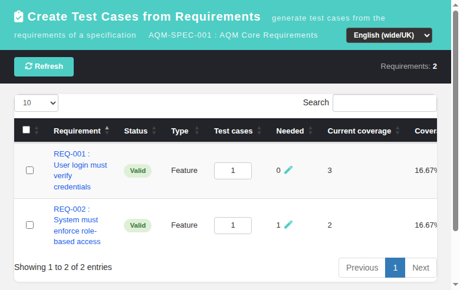
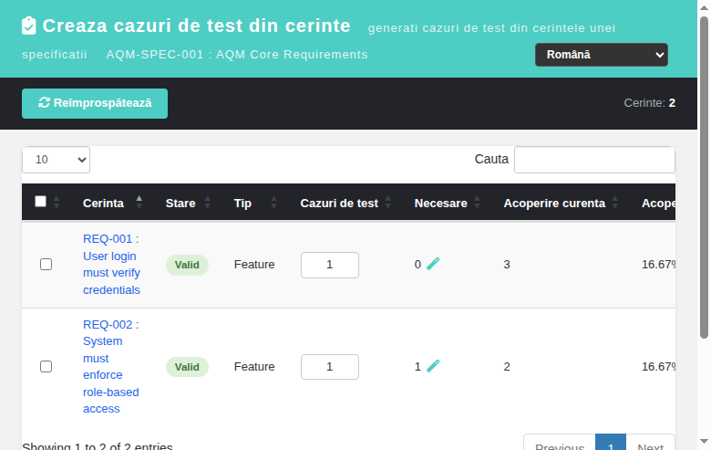

# Create Test Cases from Requirements (reqCreateTestCases) — Modernized Screen

Modernization of **Create Test Cases from Requirements**
(`lib/requirements/reqEdit.php?doAction=createTestCases` /
`doCreateTestCases`) — GitHub issue
[#1483](https://github.com/sebiboga/testlink-upgraded/issues/1483).

The legacy Smarty screen is replaced by a standalone Dashio page
(`gui/templates/requirements/reqCreateTestCases.html`) backed by a plain-PHP
REST BFF (`api/reqcreatetestcases/index.php`). The screen is reached from the
modernized Requirement Spec Viewer toolbar (`reqSpecView.html` → "Create Test
Cases" button).

**URL:** `gui/templates/requirements/reqCreateTestCases.html?spec_id=<req_spec_id>&tproject_id=<id>`
**BFF API:** `api/reqcreatetestcases/index.php`
**Rights:** `mgt_view_req` **AND** `mgt_modify_req` on the OWNING test project
required for every route (legacy `checkRights()` `rightsAnd` parity → 401 anon /
400 no/invalid spec / 403 no right / 404 unknown spec, spec mismatch).

---
## Table of Contents
1. [What the screen does](#1-what-the-screen-does)
2. [REST API Reference](#2-rest-api-reference)
3. [Legacy parity notes](#3-legacy-parity-notes)
4. [i18n Keys](#4-i18n-keys)
5. [Security](#5-security)
6. [Testing](#6-testing)

## 1. What the screen does

| Feature | Legacy behavior | Modern implementation |
|---|---|---|
| List requirements | every requirement of the spec (latest version), `range='all'` | same via `requirement_spec_mgr::get_requirements($spec_id)`; DataTable with Search |
| Requirement hyperlink | opens `openLinkedReqVersionWindow(req_id,tproject_id)` | opens modern `reqView.html?id=<req_id>&tproject_id=<id>` popup |
| Status / Type | localized labels from `reqStatusDomain`/`reqTypeDomain` | identical localized labels returned server-side (`init_labels()` + `lang_get()`, same session-locale semantics as legacy) |
| Test cases count | per-row `<input type=text>` `testcase_count[reqid]` default 1 | same input `name="testcase_count[reqid]"`, validated ≥0, clamped to 1 on NaN/negative |
| Needed | `expected_coverage - coverage` (only when `expected_coverage_management`) | same + magic icon auto-fills all counts from `needed` (legacy `cs_all_coverage_in_div` toggle parity), click again to reset to 1 |
| Coverage | `reqMgr->get_coverage(req_id)` count + `round(100/(expected_coverage*coverage),2)` % | byte-for-byte identical math (25%, 33.33%, 16.67% verified) |
| Select all | header checkbox | `#toggleAll` + per-row checkboxes `req_id_cbox[reqid]`; Create button gated on ≥1 selection |
| Create | POST `doAction=doCreateTestCases` → `requirement_mgr::create_tc_from_requirement($reqIds,$req_spec_id,$user_id,$tproject_id,$testcase_count)` | BFF `POST ?action=create` calls the identical method; messages rendered in a feedback box + success toast, table reloads with post-creation coverage |
| Empty spec | "Requirement Specification has no Requirements" | localized `rctc.noReqs` empty state, Create hidden |
| No permission | denied-access redirect | localized red banner (`403 No permission`), table not rendered |

## 2. REST API Reference

All routes are session-authenticated and JSON; CSRF Origin header required.

| Method | Route | Body / Query | Returns |
|---|---|---|---|
| GET | `?action=init` | `spec_id` (+ optional `tproject_id`) | `{status, tproject_id, tproject_name, spec:{id,doc_id,title}, requirements:[{id,req_doc_id,title,status,status_label,type,type_label,expected_coverage,coverage,coverage_percent,needed}], expected_coverage_management, rights}` |
| POST | `?action=create` | `{spec_id, tproject_id, req_ids:[...], testcase_count:{reqId:n}}` | `{status:'ok', messages:[...], count}` — messages from `create_tc_from_requirement()` |

### Error conditions
- Missing/invalid session → HTTP 401 `{status:'error',...}`.
- `spec_id` missing/≤0 → 400; unknown spec → 404.
- `tproject_id` (when given) does not own the spec → 400.
- No `mgt_view_req` or `mgt_modify_req` on the owning project → 403.
- Empty `req_ids` → 400 "Select at least one requirement".
- A selected requirement id not belonging to the spec → 404 (forged-id guard).

On success the screen shows the legacy `array_of_msg` messages and re-runs
`init` so coverage/needed columns reflect the freshly created test cases.

## 3. Legacy parity notes

- The BFF pre-validates spec ownership and that **every** selected requirement
  belongs to the given spec (ids are membership-checked against
  `requirements.srs_id`) — forged ids cannot create orphan test cases.
- Legacy type/status codes: types are **numeric** (`TL_REQ_TYPE_FEATURE` = `2`),
  statuses alphabetic (`TL_REQ_STATUS_VALID` = `V`). Labels are resolved
  server-side via `init_labels($reqCfg->type_labels/status_labels)` —
  `lang_get()` uses the user session locale, exactly like the legacy template.
- `needed` is only surfaced when `req_cfg->expected_coverage_management` is
  ENABLED (default in this build) and only for reqs with
  `expected_coverage >= coverage`.
- Coverage is "current coverage" = number of `req_coverage` rows; its % uses the
  legacy formula `100/(expected_coverage*coverage)` (NOT `coverage/expected`).

## 4. i18n Keys

All labels are client-side via `TLi18n`; keys under the `rctc.` namespace
(`rctc.title`, `rctc.headerSub`, `rctc.create`, `rctc.countInfo`, `rctc.colReq`,
`rctc.colStatus`, `rctc.colType`, `rctc.colCount`, `rctc.colNeeded`,
`rctc.colCurrent`, `rctc.colCoverage`, `rctc.toggleAll`, `rctc.toggleCount`,
`rctc.countFilled`, `rctc.countReset`, `rctc.noReqs`, `rctc.createdTitle`,
`rctc.createdOk`, `rctc.errLoad`, `rctc.errNoSpec`, `rctc.errSave`,
`rctc.errSelect`, `rctc.statusV/N/D/R/W/F/I/O` and `footers.rctc`). Present in
all 10 bundles (`en ro de es fr it ja pt ru zh`).

## 5. Security

- Server-side rights check on every route: both `mgt_view_req` AND
  `mgt_modify_req` on the owning project required (legacy `rightsAnd` parity).
- CSRF guarded via Origin header check (`bffSameOriginGuard()`).
- Spec-ownership (`tproject_id` vs `req_specs.testproject_id`) and
  requirement-membership (`requirements.srs_id`) validated server-side on both
  routes.
- Output is HTML-escaped in the client before insertion; DB writes go through
  the legacy `create_tc_from_requirement()` method (prepared statements).

## 6. Testing

See **Suite 1483 — Create Test Cases from Requirements (reqCreateTestCases)**
in `tmp/TLU_Test_Cases.md` (N/N PASS): init render, status/type labels, needed
+ auto-fill toggle, per-row counts, `toggleAll`, create flow (multi-requirement
counts → generated suite + TCs + `req_coverage` links), post-create coverage
reload, missing-spec error, no-permission (403), req popup link, reqSpecView
toolbar entry navigation, locale switch (ro), i18n integrity, and Event Viewer
cleanliness.