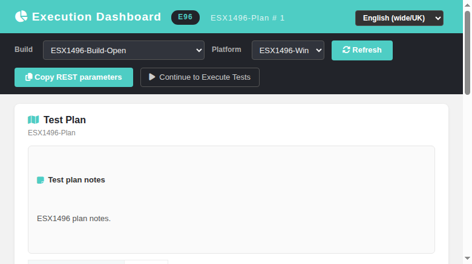
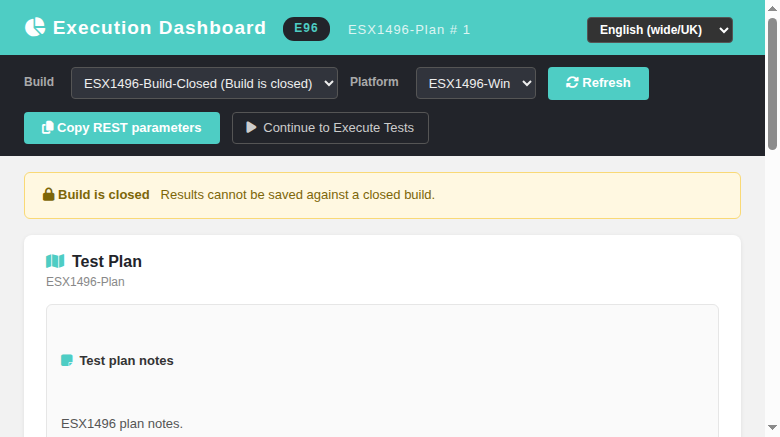

# Execution Dashboard (execDashboard) — Modernized Screen

Modernization of the **Execution Dashboard** landing pane
(`lib/execute/execDashboard.php`) — GitHub issue
[#1496](https://github.com/sebiboga/testlink-upgraded/issues/1496).

The legacy Smarty screen is replaced by a standalone Dashio page
(`gui/templates/execute/execDashboard.html`) backed by a plain-PHP REST BFF
(`api/execdashboard/index.php`). The ASIDE **Execute → Execute Tests** entry now
opens the modern dashboard first, with a **Dashboard** toolbar button on
`execTest.html` to jump back.

**Path:** Execute → Execute Tests (landing pane)
**URL:** `gui/templates/execute/execDashboard.html?testPlanID=<id>&buildID=<id>&platformID=<id>`
**BFF API:** `api/execdashboard/index.php`
**Right:** `testplan_execute` OR `exec_ro_access` on the OWNING test project
(read); `testplan_execute` for `POST ?action=context` (write).

---
## Table of Contents
1. [What the screen does](#1-what-the-screen-does)
2. [REST API Reference](#2-rest-api-reference)
3. [Legacy parity notes (context resolution)](#3-legacy-parity-notes-context-resolution)
4. [i18n Keys](#4-i18n-keys)
5. [Security](#5-security)
6. [Testing](#6-testing)

## 1. What the screen does

| Feature | Legacy behavior | Modern implementation |
|---|---|---|
| Context toolbar | project prefix + test plan / build / platform labels | identical header with prefix badge, plan name and project; Build and Platform selectors reload the context |
| Build selector | active + open builds (`testplan::get_builds`) | same list; each row now carries `is_open`, closed builds are suffixed `(Build is closed)` and selectable (read-only review affordance) |
| Closed-build notice | legacy `$isOpen ? '' : 'warning'` banner | amber **closed-build** banner shown when the resolved build `is_open == 0` |
| Platform selector | `tc_platforms` list | same; first linked platform preselected; select change reloads |
| Notes panels | tplan/build/platform notes box | collapsible notes cards (tplan/build/platform) rendered as raw HTML when `notes_type != 'none'` (CKEditor), text otherwise; headers localized |
| Design custom fields | `get_linked_cfields_at_design` on plan/build nodes | server-rendered `html_table_of_custom_field_keys_values` tables for the test plan and the build (CF must be `show_on_design=1`, `enable_on_design=1`, `show_on_execution=1`, active project linkage) |
| REST arguments recap | hidden traceability box listing `testPlanID/buildID/platformID` | **REST parameters** card with the three values + **Copy to clipboard** button (toast on success; legacy `execution_mode` REST-args are absent, right param triple is shown instead) |
| Continue to Execute Tests | legacy paging into `execTest.php` | **Continue to Execute Tests** button navigates to `execTest.html?tplan_id=&tproject_id=` |
| Refresh | GUI refresh re-running the pane | toolbar Refresh re-runs the BFF init with the current selectors |

## 2. REST API Reference

All routes require an authenticated session; without `testplan_execute` /
`exec_ro_access` on the owning test project callers get
`403 {"status":"error","code":"common.forbidden", …}`.

| Method & path | Purpose | Failure modes |
|---|---|---|
| `GET ?action=init[&testPlanID&buildID&platformID]` | context (tproject/plan/build/platform), notes + cfields HTML, selector lists (platforms, builds with is_open), grants, REST param triplet, REST base URL | 401 anon, 403 no rights, 400 missing/mismatched context |
| `POST ?action=context` (`testplan_id`, `build_id`, `platform_id`) | persist the execution context into the session `execution_mode` cache (and `_stored_setting_*` keys), legacy-style | 401 anon, 403 no `testplan_execute`, 400 invalid ids |

## 3. Legacy parity notes (context resolution)

- The resolved context follows the legacy precedence chain: **explicit
  parameter** (`testPlanID`/`buildID`/`platformID`) → **session cache** pairs
  found in `execution_mode` whose `setting_testplan == $tplanId` (build and
  platform chains scanned independently) → legacy `{$tplanId}_stored_setting_build` /
  `_stored_setting_platform` keys → **defaults** (max `active=1`+`open=1` build,
  first platform linked to the plan).
- The plan "id" is ephemeral: the BFF maps `testPlanID` → `tplan_id` via the
  `testplan_id`-prefixed session keys (same membership the legacy portal used);
  explicit `tplan_id` is also accepted.
- Build/platform/tplan objects come from the 2.0.1 schema: `testplans` has no
  `name` column (title lives in `nodes_hierarchy`), `builds` is
  `testproject_id`-scoped (no `testplan_id`), so membership checks use the
  resolved owning project.
- Plan and build CKEditor notes are served as HTML (`notes_type='ckeditor'` by
  `getWebEditorCfg()`), platform notes as `notes_type='platform'` — the client
  chooses raw-HTML vs text rendering accordingly.
- `POST ?action=context` writes the same three session entries the legacy
  dashboard wrote (`execution_mode` build/platform chains keyed by
  `setting_testplan`), plus the `_stored_setting_*` fallbacks, so
  `execTest.html` and subsequent dashboard loads resolve the current context.

## 4. i18n Keys

All labels/messages use the client-side `TLi18n` module with keys prefixed
`edb.` (21 keys: `edb.title`, `edb.project`, `edb.testPlan`, `edb.build`,
`edb.platform`, `edb.buildClosed`, `edb.buildClosedMsg`, `edb.refresh`,
`edb.copyRest`, `edb.copyRestOk`, `edb.continueExecute`, `edb.restArgs`,
`edb.notes`, `edb.tplanNotes`, `edb.buildNotes`, `edb.platformNotes`,
`edb.customFields`, `edb.noBuilds`, `edb.isOpen`, `edb.reload`,
`edb.noCfields`) plus `footers.execDashboard` and `exe.dashboard`,
defined in ALL locale bundles (`gui/templates/i18n/*.json`: de, en, es,
fr, it, ja, pt, ro, ru, zh).

## 5. Security

- Session-based auth on every route (401 when not logged in).
- `testplan_execute` OR `exec_ro_access` checked server-side on the OWNING
  test project (403); the context-persist route requires `testplan_execute`.
- Forged/invalid plan, build or platform ids are rejected with 400/404 JSON
  (membership against the owning project); no direct SQL values interpolated
  unsanitized.
- Notes/cfields HTML served by the legacy renderers with the standard escaping.

## 6. Testing

Suite `#1496` in `tmp/TLU_Test_Cases.md`: covers BFF init (explicit params,
default resolution, closed build, platform list), context persist, closed-build
banner, cfields tables (plan + build), notes panels, Copy REST parameters,
Continue-to-Execute navigation from the dashboard and back (Dashboard toolbar
button), refresh, i18n key presence in all 10 bundles and Event Viewer hygiene
(PASS, see the suite for recorded results).
Fixture builder: `php tmp/fixtures_1496.php` (idempotent) — creates project
ESX1496 (`tproject_id=1`), plan ESX1496-Plan (`tplan_id=2`), open build 1 +
closed build 2, platforms ESX1496-Win (1, linked) / ESX1496-Mac (2, unlinked)
and custom field ESX1496-CF with a plan value (`Pre-prod`) and a build value
(`Build-Edge`).