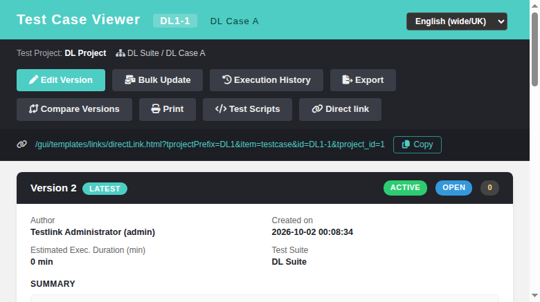

# Feature — #1043: Direct link in the Test Case Viewer (legacy parity)

**Issue** — [#1043 — Implement direct-link display in tcView.html (gap vs legacy)](https://github.com/sebiboga/testlink-upgraded/issues/1043)
**Area** — Test Case Viewer (`gui/templates/testcases/tcView.html` + `api/testcases/index.php`)
**Status** — implemented, verified in browser, closed.

## The gap

The legacy 1.9.20 test case viewer header carries a *direct link* affordance:

| Legacy | Code |
|---|---|
| toggle icon | `gui/templates/dashio/testcases/tcView.tpl:131` — `{$tlIMGTags.toggle_direct_link}` (fa-link, `title="show_hide_direct_link"`, `onclick="showHideByClass('div','direct_link')"`, icon defined in `lib/functions/tlsmarty.inc.php:318-321`) |
| the link panel | `gui/templates/dashio/testcases/tcView.tpl:145` — `<div class="direct_link" style='display:none'><a href="{$gui->direct_link}" target="_blank">{$gui->direct_link}</a></div>` |
| link construction | `lib/testcases/testcaseCommands.class.php:1209-1215` → `lib/functions/testcase.class.php:5692 buildDirectWebLink()` → `<basehref>linkto.php?tprojectPrefix=PFX&item=testcase&id=PFX-N` |

The modern screen had **none** of it (`grep -c direct_link gui/templates/testcases/tcView.html`
= 0): the permalink could neither be seen nor copied, even though the BFF already returned every
input (`prefix`, `glue`, `fullExternalId`).

## What was implemented

### 1. BFF — `api/testcases/index.php`, `action=view`

```php
'direct_link' => '/gui/templates/links/directLink.html'
    . '?tprojectPrefix=' . urlencode($prefix)
    . '&item=testcase&id=' . urlencode($prefix . $glue . intval($first['tc_external_id'] ?? 0))
    . '&tproject_id=' . $tprojectId,
```

No new SQL — the value is assembled from fields the view payload already fetched. Legacy pointed
at `linkto.php`, which drops the user into the **legacy** inner-frame shell; in 2.0.1 the deep-link
gateway is `gui/templates/links/directLink.html` (backed by `api/directlink/index.php`,
`item=testcase` → `api/directlink/index.php:295-341`), with the identical parameter set — the same
choice `api/requirements/index.php:825` already made for `item=req` (see #1532/#1542).

### 2. Screen — `gui/templates/testcases/tcView.html`

* `.direct-link-bar` / `.btn-copy` CSS, copied from the modernized Requirement Viewer
  (`gui/templates/requirements/reqView.html:48-52`).
* A **`Direct link`** button (fa-link) appended to the actions bar + the permalink bar below the
  toolbar with the permalink as an anchor (`target=_blank`) and a **Copy** button.
* `toggleDirectLink()` (open/close, re-renders the URL on open) and `copyDirectLink()` with the
  `navigator.clipboard` API and a `textarea`/`execCommand` fallback → toast
  `Direct link copied to clipboard`.
* The bar is part of the `@media print` hide-list, so printed documents are unchanged.
* No grant gate: legacy showed the link to every user who can open the viewer.

### 3. i18n

`tcview.directLink`, `tcview.copyLink`, `tcview.directLinkCopied` in **all ten** bundles
(de, en, es, fr, it, ja, pt, ro, ru, zh), appended without re-ordering the files.

## Verification

Fixture `tmp/fixtures_1043.sql` (project `DL1`, suite, test case with two versions) +
`admin/admin`. 14/14 cases PASS — see `tmp/TLU_Test_Cases.md` (Suite 1043): button present,
panel hidden by default, toggle open/close, permalink payload, copy toast, gateway resolution
(`200` → `tcView.html?tcase_id=3`), anonymous → login (legacy `linkto.php` parity), 0 console
errors, no new `events` rows (last Error/Warning predates the browser run and belongs to an
aborted fixture attempt), all 10 bundles parse.



## Files

| File | Purpose |
|---|---|
| `api/testcases/index.php` | `action=view` emits `direct_link` |
| `gui/templates/testcases/tcView.html` | button, permalink bar, toggle + copy JS |
| `gui/templates/i18n/*.json` | 3 keys × 10 locales |
| `tmp/fixtures_1043.sql` | reproducible fixture (project/suite/case, 2 versions) |
| `tmp/TLU_Test_Cases.md` | Suite 1043 (14 cases) |
