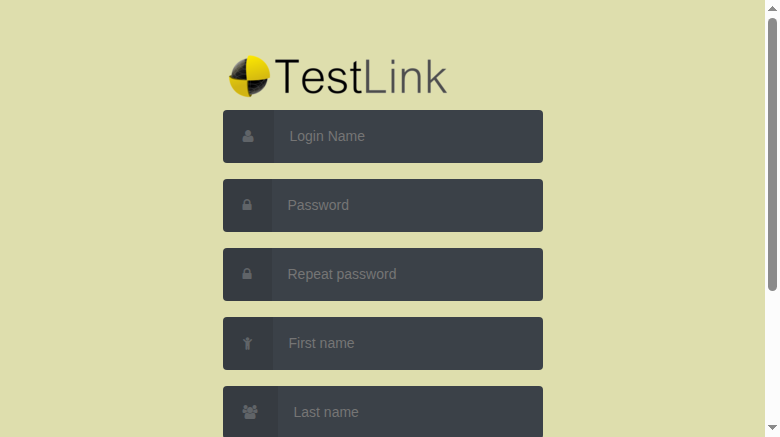

# Issue 656 — `firstLogin.php?viewer=new`: 3x E_WARNING per render (2x Undefined property `pwdInputMaxLength` + 1x Undefined array key `"login"`)

**Issue:** [#656](https://github.com/sebiboga/testlink-upgraded/issues/656)
**Branch:** `fix/issue-656`
**Status:** FIXED & VERIFIED (2026-08-24)

## Symptom

Every render of the legacy-model signup form (`firstLogin.php?viewer=new`, reached by the
"New User?" link from the login page) wrote **3 PHP 8 E_WARNING rows** into the TestLink
Event Viewer (`events` table):

```
E_WARNING Undefined array key "login"                …file.firstLogin-model-marcobiedermann.tpl.php Line 36
E_WARNING Undefined property: stdClass::$pwdInputMaxLength   same compiled file Line 74
E_WARNING Undefined property: stdClass::$pwdInputMaxLength   same compiled file Line 82
```

Warning noise accumulates on every visit; a plain-form render must produce zero events.
Reproduced on a freshly imported DB: one `curl "http://localhost:8082/firstLogin.php?viewer=new"`
→ exactly 3 new `log_level=2` rows.

## Root cause chain

1. `firstLogin.php:87-104` — `init_args()` fills `$args` via `I_PARAMS`; POST keys only
   exist after a POST. Nothing in this controller ever creates a property named
   `pwdInputMaxLength` (line 90 creates `pwdInputSize`, and `config_get('loginPagePasswordSize')`
   resolves to nothing defined — latent quirk, no warning emitted).
2. `firstLogin.php:76-78` — `viewer=new` switches display to
   `login/firstLogin-model-marcobiedermann.tpl`.
3. Template line 10 `<title>{$labels.login}</title>` — but the `lang_get s='…'` list
   (lines 3–5) never fetches the `login` key → bare array access →
   `Undefined array key "login"` (compiled line 36 confirmed via templates_c).
4. Template lines 39 & 45 `maxlength="{$gui->pwdInputMaxLength}"` — echo of a property
   assigned nowhere in the codebase → 2x `Undefined property` (compiled lines 74/82).

The sibling `{$gui->firstName|escape}` etc. do not warn because Smarty compiles modifier
pipelines with null-coalescing; the two bare references above do warn on PHP 8.

**Inheritance:** the defect was copied verbatim from upstream 1.9.20 — the identical three
references exist in `gui/templates/tl-classic/login/firstLogin-model-marcobiedermann.tpl`
(the two files were byte-identical before the fix).

## Blast radius

- Every GET of `firstLogin.php?viewer=new` (the default signup entry point) — 3 warnings each.
- Same defect dormant in the tl-classic theme copy.
- grep over `gui/templates/**`: no other template references `pwdInputMaxLength`.

## Approach — minimal controller + label-list fix

1. `firstLogin.php:72` — assign what the template expects:
   `$gui->pwdInputMaxLength = config_get('loginPagePasswordMaxLenght');` (=40,
   `config.inc.php:483`). Mirrors the intent of `login.php:296` (which assigns the same
   config under the misspelled name `pwdInputMaxLenght` for the *login* page).
2. Both copies of `firstLogin-model-marcobiedermann.tpl` — add `,login` at the head of the
   `lang_get` list so `<title>` resolves to the existing `$TLS_login` string ("Login").
   Zero rendered-output change beyond the warnings disappearing.

Alternatives rejected:

- *Template-side `{#LOGIN_MAXLEN#}` config var for maxlength* — changes maxlength semantics
  away from the password-policy config used by the login page.
- *Rename the template ref to match the misspelled `pwdInputMaxLenght`* — propagates the typo.

## Verification

| Check | Result |
|---|---|
| Repro re-run after fix | 0 new events (was 3/render) |
| Plain GET `/firstLogin.php` | 200, unchanged, 0 new events |
| Rendered HTML | `<title>Login</title>`; 2x `maxlength="40"` on password inputs |
| POST mismatched passwords | validation message shown, user not created, 0 new Error/Warning |
| POST valid signup | user created, redirect target `login.php?note=first`, only expected AUDIT event (log_level 16) |
| Browser render (chrome-devtools) | clean page, screenshot below |



Regression suite: `tmp/TLU_Test_Cases.md` → *"Suite 656 — 6/6 PASS"*.

Side observation logged separately: self-signup accepts duplicate email addresses →
[#657](https://github.com/sebiboga/testlink-upgraded/issues/657).
