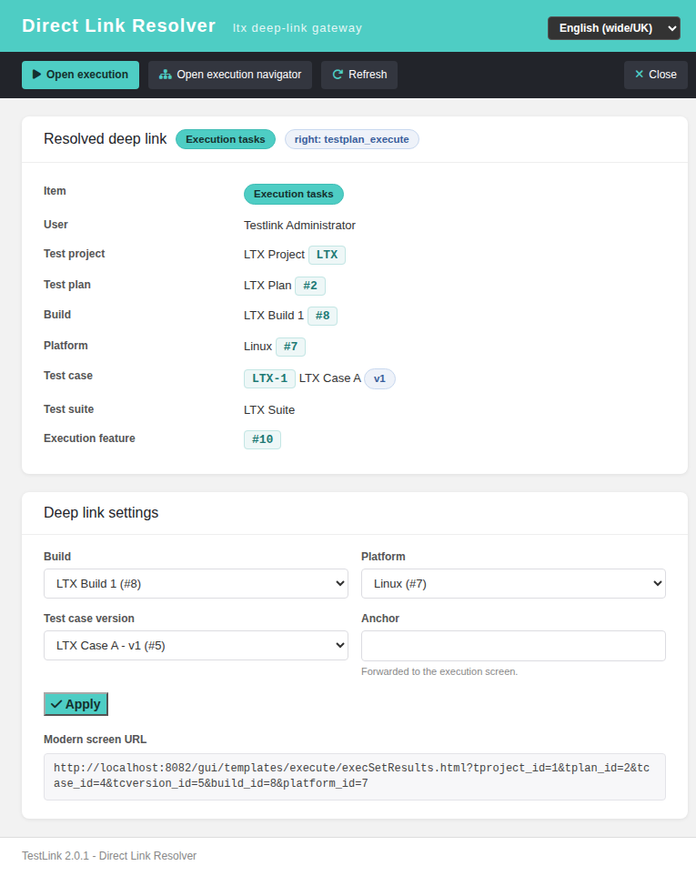
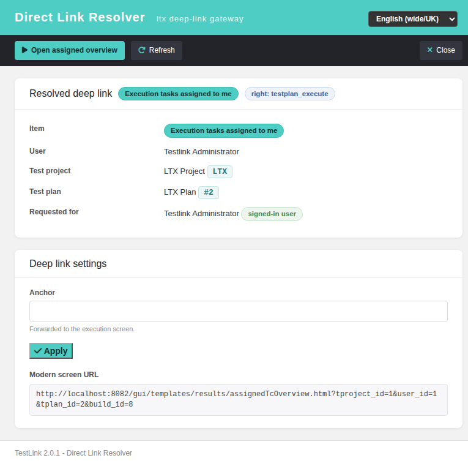
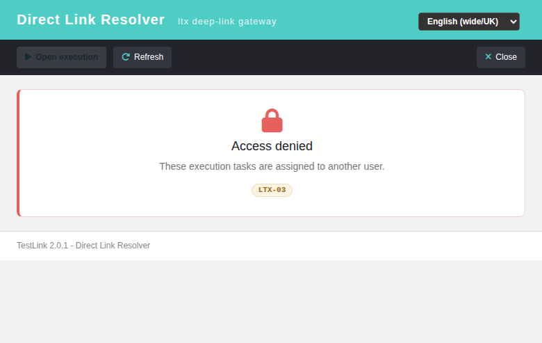
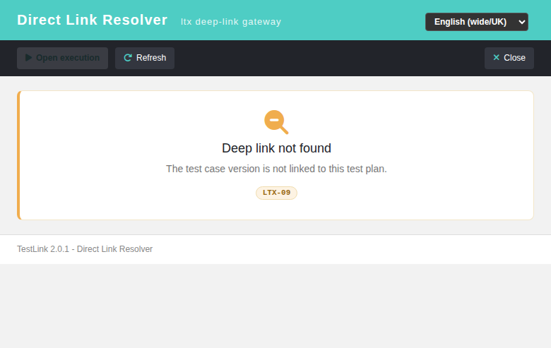
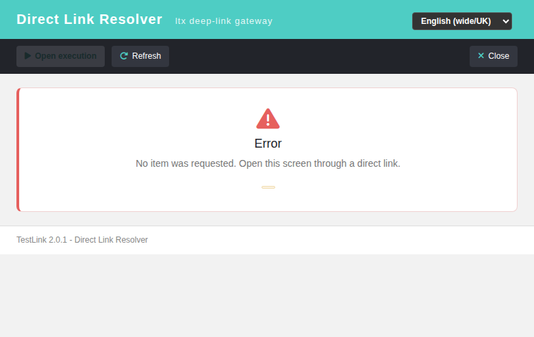
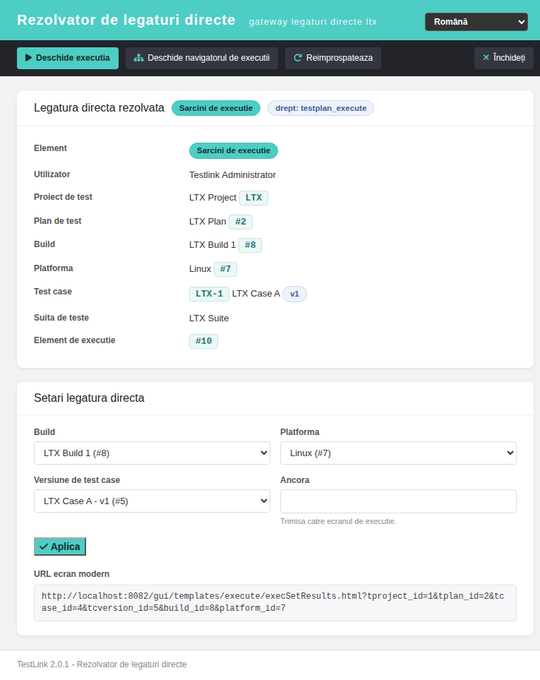

# Direct Links Gateway (`ltx.php`) — Modernized

> Issue **#1677** · screen `gui/templates/links/ltxDirectLink.html` · BFF `api/ltx/index.php`

The repo-root gateway `ltx.php` was the **last root-level controller still rendering a full
Smarty frameset** in TestLink 2.0.1. It is now a Dashio resolver screen backed by a REST BFF,
with `ltx.php` kept as a session-guarded 302 shim so every existing deep link keeps working.

## What the legacy screen did

A **two-step frameset**, not a single page:

| Step | Entry | What it did |
|---|---|---|
| 1 — outer frame | `ltx.php?item=…` | `init_args()` + `checkTestPlan()`, then `main.tpl` = navBar + asideMenu + an iframe pointing back at `ltx.php&load=1` |
| 2 — inner frame | `ltx.php?item=…&load=1` | `launch_inner_exec()` / `launch_inner_xta2m()` re-resolved the context, then `frmInner.tpl` (exec navigator + `lib/execute/execSetResults.php`) or `workframe.tpl` (single frame) |

Three Smarty templates, two resolvable link shapes:

- `item=exec` + `build_id` + (`feature_id` **or** `tplan_id`+`tcversion_id`) + `platform_id` (+ `anchor`)
- `item=xta2m` + `user_id` + `tplan_id` (+ `build_id`) — "eXecution Tasks Assigned TO Me"

Failures were reported with raw untranslated `echo` / `die()` markers `LTX-01` … `LTX-10`.

Its already-modernized siblings — `linkto.php` (#1532/#1542), `lnl.php` (#1541),
`ltcp.php` (#1623) — made this the last one standing.

## The modern screen

`gui/templates/links/ltxDirectLink.html` — a resolved-context card (test project, test plan,
build, platform, test case external id `PREFIX-tc_external_id`, suite, version) with clickable
chips to switch build, platform, or any version **linked to the plan** without editing the
link, a primary *Open Execution* and a secondary *Open Navigator*, and explicit
access-denied / not-found / error cards that each keep the `LTX-0x` marker visible.

Resolved context for an execution deep link:



Clicking a version chip and **Apply** re-issues the link with that version's `feature_id`:



Every failure state is a real screen state, not a browser alert:

| State | Card |
|---|---|
| no `testplan_execute` right |  |
| unknown plan / version / build / platform / feature |  |
| unresolvable / unexpected failure |  |
| full UI in Romanian (TLi18n) |  |

## BFF contract

```
GET api/ltx/index.php?action=init&item=exec
    &build_id=N[&feature_id=M | &tplan_id=P&tcversion_id=V][&platform_id=R][&anchor=step_3]
GET api/ltx/index.php?action=init&item=xta2m&user_id=U&tplan_id=P[&build_id=N]
```

Session auth + `bffSameOriginGuard` + `bffEnforceSession`; the `testplan_execute` right is
checked on the **owning** project. GET only (405 otherwise). 7 stable machine codes, and every
answer also returns the `legacy_code` marker so each old outcome stays recognizable.

| Code | HTTP | Legacy marker | Meaning |
|---|---|---|---|
| `unauthenticated` | 401 | — | no session (anon) |
| `no_rights` | 403 | — | no `testplan_execute` on the owning project |
| `not_your_tasks` | 403 | `LTX-03` | `user_id` ≠ session user |
| `build_id_not_set` | 400 | `LTX-04` | legacy `init_args` gate |
| `security_check_ko` | 400 | `LTX-01` | any `item` other than `exec`/`xta2m` |
| `missing_user_id` | 400 | `LTX-01` | `xta2m` without `user_id` |
| `testplan_not_set` | 400 | `LTX-06` | `xta2m` without `tplan_id` |
| `plan_not_found` | 404 | `LTX-02` | `die("ltx - tplan info does not exist")` |
| `unknown_build` / `tcversion_not_found` / `unknown_platform` / `version_not_in_plan` | 404 | `LTX-09` | the legacy `die()` class |
| `unknown_feature` | 404 | `LTX-10` | null `feature_id` recordset |
| `method_not_allowed` | 405 | — | non-GET |
| `server_error` | 500 | — | DB connection failed, guarded JSON |

The legacy table also listed `LTX-05` (`item_not_set`) and `LTX-08`
(`platform_id_not_set`), but **no legacy branch ever reached them** — `item`
was validated by the `init_args` switch that answers `LTX-01`, and a missing
`platform_id` is optional. They are not emulated. 19 distinct machine codes
are emitted in total.

Links now hand over to the already-modern `execSetResults.html`, `execNavigator.html` and
`assignedTcOverview.html` instead of the still-legacy `lib/execute/*.php` renderers.

## The shim

`ltx.php` is a pure 302: session guard first, then `Location: …/gui/templates/links/ltxDirectLink.html?<query>`,
then `exit()`.

- The whole query string is forwarded unchanged — including the legacy `&load=1` inner-frame URL.
- CR/LF are stripped from the forwarded query string (header injection).
- `testlinkInitPage($db, true)` runs **before** the redirect, so an anonymous deep link still
  bounces to `login.php?note=expired&destination=…`, exactly as in 1.9.20. This gateway is
  **not** public, unlike `lnl.php` / `ltcp.php`.

## Security fixes

Each was a real hole in 1.9.20, found by porting the branch:

1. **`&load=1` auth bypass** — the inner frame re-resolved the context *without* the outer
   `checkTestPlan()`, so a no-rights user holding a `load=1` deep link reached execution. Now a
   single code path with the rights check always applied.
2. **`xta2m` "assigned to ME"** — the `user_id != session user` rejection lived only in the
   outer frame, so the inner frame served another user's assigned tasks. Now `403 not_your_tasks`.
3. **Cross-plan access** — neither the `feature_id` path nor the explicit `tcversion_id` path
   proved the version belonged to the addressed plan. Now `404 version_not_in_plan`.
4. **NULL dereference** — an unknown `feature_id` / `tcversion_id` read `parent_id` off a null
   recordset (PHP 8 fatal). Now typed failures.
5. **Unsafe `anchor`** — interpolated unfiltered into the iframe `src`. Now whitelisted.
6. **Non-numeric params** — `build_id=1abc` passed the legacy `if ($b_id)` test because `1abc`
   is truthy in PHP. Now `intval`-gated.

## Bugs found while testing

- **#1678** (fixed, `fc0777408`) — `testplan::get_parenttestsuites()` recursed on a **NULL**
  `parent_id`, producing `AND NH.id = ` → MariaDB **1064** and a `log_level=1 DATABASE` Event
  Viewer row on every hit from any screen on the `get_testsuites()` reporting path. Guarded with
  `intval()` + a `<= 0` short-circuit; the 2.0.1 `nodes_hierarchy` refactor made `parent_id`
  nullable, which makes the shape far easier to reach than in 1.9.20.
- **#1679** (filed, not fixed here) — `bffSameOriginGuard()` short-circuits on
  `X-Requested-With` before reading `Origin`/`Referer`. Not CORS-exploitable (no BFF emits
  `Access-Control-Allow-Origin`), but the guard is shared by **102** endpoints, so the repo-wide
  fix belongs in its own PR.

## i18n

`ltx.*` (53 keys) + `footers.ltxDirectLink` in **all 10** bundles (`en`, `ro`, `de`, `es`, `fr`,
`it`, `pt`, `ru`, `ja`, `zh`), validated with `python3 -m json.tool`. No hardcoded strings.

## Code review

The mandatory subagent review found **1 MAJOR, 14 MINOR, 14 NIT** and no security hole —
it could not find a path around the `version_not_in_plan` proof, and rated the `.fail()`
handling better than `execDashboard.html`'s. Everything actionable is fixed; the
interesting ones:

- **MAJOR — the platform selector was a silent no-op.** `applySettings()` always re-emitted
  a `feature_id`, and the BFF's `feature_id` branch then *overwrote* `platform_id` from the
  `testplan_tcversions` row. Choosing a platform and clicking **Apply** snapped the context
  back to the feature row's platform. An explicit `platform_id` now always wins, and the
  feature platform is only used as a **default**.
- **MINOR — "No platform" could never take effect.** The BFF re-derived the platform from
  the plan link whenever `platform_id <= 0`, and the screen's "No platform" `<option>` has
  `value=""`, so the choice was indistinguishable from "the link named no platform". Both
  sides now use *presence* (`isset($_GET['platform_id'])` / `URLSearchParams.has()`)
  instead of truthiness — including in `currentParams()`, the BFF **request** builder, which
  had the same bug and was only caught by exercising the screen in the browser.
- **MINOR — an ambiguous `testplan_tcversions` row.** A version linked under several
  platforms has one row per platform and the old query had no `ORDER BY`, so both the
  reported `feature` id and the platform fallback came from an arbitrary row. Now ordered,
  and the requested platform is a *preference* (a version linked under platform A is still
  valid on platform B — that must not 404).
- **MINOR — the DB was connected before the auth gate.** `common.php` echoes the raw
  `dbms_msg` on a failed connect, so a down database produced an **HTTP 200** carrying an
  untranslated host/database name. The connect moved inside the `try` and behind the guard.
- **MINOR — the xta2m branch forwarded `build_id` unvalidated** while the docs claimed
  membership was proven for all three link shapes. It is now proven against the owning
  project.
- **MINOR — N+1 query and duplicate options.** One extra `SELECT` per linked version (2001
  queries on a 2000-TC plan) and one `<option>` per platform link, so a multi-platform
  version rendered duplicate option values. Replaced by a single `LEFT JOIN` + `GROUP BY`.
- **MINOR — the header comment claimed two branches that do not exist** (`LTX-05`, `LTX-08`)
  and the docs listed "7 stable machine codes" where 19 are emitted. Both regenerated from
  the source.
- **MINOR — 2 unreachable i18n keys** (`ltx.errPlatformNotSet`, `ltx.errUnauthenticated`)
  removed from all 10 bundles and from the screen's error map.

## Tests

`tmp/suite_1677.py` — 96 executable cases, **96/96 PASS** (exit 0): F fixture · A auth ·
E exec resolution · X xta2m · S security · O options · C contract/legacy markers · H shim ·
I i18n/wiring · V Event Viewer · **R code-review regressions** (18 cases, one per review
fix, so none of them can silently regress). Plus a browser pass in EN and RO with a clean
console.

Event Viewer after the whole run: **0** `ERROR`/`WARNING` rows, **0** `DATABASE` rows, **0**
rows mentioning ltx.

Fixture: `tmp/fixtures_1677.sql` (project `1`, plan `2` + alternate plan `12`, build `8`,
platforms `7`/`9`, test case `4` with versions `5`/`6`, feature links `10`/`11`, no-rights user
`ltxnorights`). Node types are the **2.0.1** ones — `testproject=1 testsuite=2 testcase=3
testcase_version=4 testplan=5` — the 1.9.20 values in the first draft are what surfaced #1678.
