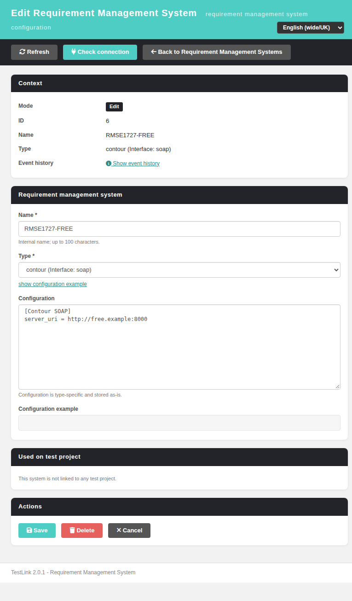
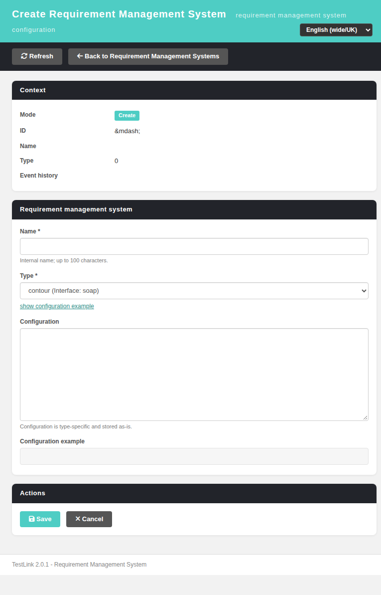
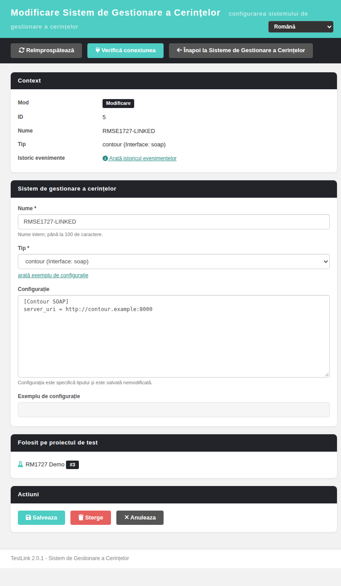
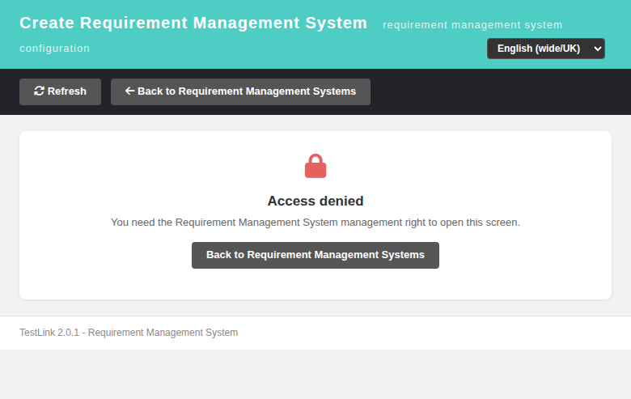

# Requirement Management System editor — Modernized (Issue #1727)

The standalone create/edit screen for a requirement management system
(`gui/templates/reqmgrsystems/reqMgrSystemEdit.html`), backed by a plain-PHP
REST BFF (`api/reqmgrsystemedit/index.php`). It was the last full legacy
renderer in the ASIDE menu without a modern twin.

## Was

`lib/reqmgrsystems/reqMgrSystemEdit.php` rendered
`gui/templates/dashio/reqmgrsystems/reqMgrSystemEdit.tpl`:

- `testlinkInitPage()` + `checkRights()` for the single
  `reqmgrsystem_management` right (no read/manage split).
- a plain `<form action="...php">` POST — **no origin proof**, i.e. a
  cross-site-postable write;
- a name field, a type `<select>`, a free-text configuration body and a
  *show configuration example* button wired to
  `lib/ajax/getreqmgrsystemcfgtemplate.php` via Ext.Ajax;
- a *used on test project* table of the test projects the system is linked to;
- `showEventHistoryFor(id, 'reqmrgsystems')` — an event-history icon;
- *Check connection* and a *Delete* button.

Only two dead `.tpl` files ever reached it, so the screen was effectively
unreachable from the UI even though `$actions->reqMgrSystemEdit` existed.

## Now

### Screen — `gui/templates/reqmgrsystems/reqMgrSystemEdit.html`

- Dashio shell (teal/dark/red palette), same layout conventions as the other
  modernized screens, driven by the client-side `TLi18n` module
  (`gui/templates/i18n/i18n.js`) — 31 `rmse.*` keys plus
  `footers.reqMgrSystemEdit` in **all 10** locale bundles.
- One page serves both modes: no `id` → **Create**, `?id=N` → **Edit**.
- A context card (Mode / ID / Name / Type / "used on test project" chips /
  event-history deep link) and an explicit state machine — loading, denied,
  not-found, error — instead of a half-rendered form.
- Create mode hides Delete, Check connection, the used-on list and the event
  history; `mgt_view_events` is honoured for the history link.
- Save posts JSON; success re-loads the form so the context card and the type
  label come from the server. Validation, duplicate name, linked-delete refusal
  and server errors are all shown **in place** with a localized headline and
  the server detail as a muted hint.
- Delete goes through a Bootstrap modal; the refusal to delete a system that is
  still linked to a test project keeps the user on the screen.

### BFF — `api/reqmgrsystemedit/index.php`

| action | verb | notes |
|---|---|---|
| `init` | GET | create/edit form; `prune=1` keeps the legacy dead-link cleanup |
| `cfg_template` | GET | the configuration example; degrades to a message when the interface class is not shipped (#1625/#1626) |
| `create` / `update` / `delete` | POST | the three legacy writes |
| `check_connection` | POST | `tlReqMgrSystem::checkConnection()` |

Every route runs `bffEnforceSession()` **and** the right gate before anything
else, writes pass `bffSameOriginGuard()` (Origin/Referer proof — the legacy form
had none), every failure carries a machine `code` **and** `status:error`, and
the status codes are 400/401/403/404/405/409.

### Legacy parity kept

the single management right, the used-on-test-projects table, the dead-link
cleanup that `initializeGui()` performed on every edit load, the
`reqmrgsystems` event-history deep link, and the configuration example.

### Hardening (the legacy page had none of this)

- the reads really are reads: the dead-link cleanup only runs with `prune=1`
  (the screen always sends it), so a link prefetch can no longer DELETE;
- `is_scalar()` guards on `action`/`id`/`type`/`name`/`cfg` — no
  "Array to string conversion" warning rows, and a system can never be named
  `Array` (#1731);
- an absent `?id=` still means create mode, a present-but-array one is a 400;
- `HEAD` is a read, `405` answers carry `Allow`, a UNIQUE-name collision
  reports `name_exists`;
- every interpolated value that reaches the DOM is escaped, including a system
  name inside an i18n message (#1730);
- `lib/reqmgrsystems/reqMgrSystemEdit.php` is now a session-guarded **302 shim**
  (`?doAction=create|edit|checkConnection` → the modern editor; the three legacy
  write doActions are logged and **not** executed server side, so there is no
  second, unauthenticated-by-origin write path).

## Wiring

- `lib/functions/common.php` — `$actions->reqMgrSystemEdit` carries the current
  test project / test plan context.
- `gui/templates/reqmgrsystems/reqMgrSystemView.html` — a per-row edit icon
  next to each system.

## Bugs found and fixed while testing

| issue | defect |
|---|---|
| [#1728](https://github.com/sebiboga/testlink-upgraded/issues/1728) | `tlReqMgrSystem::delete()` leaked the internal `Class:tlReqMgrSystem - Method: delete -` prefix into the user-facing (and JSON) message |
| [#1729](https://github.com/sebiboga/testlink-upgraded/issues/1729) | `getByAttr()` read `$rs['type']` on an `output => 'id'` row, so **every** create logged an E_WARNING Event Viewer row |
| [#1730](https://github.com/sebiboga/testlink-upgraded/issues/1730) | stored DOM XSS: the unescaped system name was injected into the feedback banner through `TLi18n.t()` |
| [#1731](https://github.com/sebiboga/testlink-upgraded/issues/1731) | array-shaped parameters logged E_WARNING rows and could be stored as the name `Array`; a plain GET performed a DELETE; the shim read a session key nothing writes |

## Verification

55 numbered cases in `tmp/TLU_Test_Cases.md` (Suite 1727) — **55 / 55 PASS**:
create/edit/delete, configuration example, check-connection degradation, dead-link
cleanup, the whole 400/401/403/404/405/409 contract, the same-origin guard, the
7 legacy shim redirects, `ro` locale, the no-rights and anonymous browser paths,
the four code-review regressions, a clean console and a clean Event Viewer
(only audit rows plus the two intentional shim `tLog` rows).

