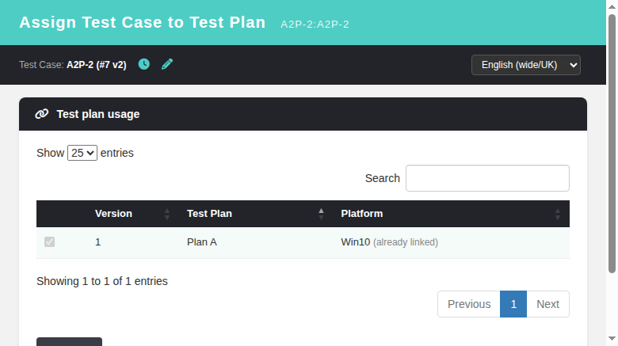
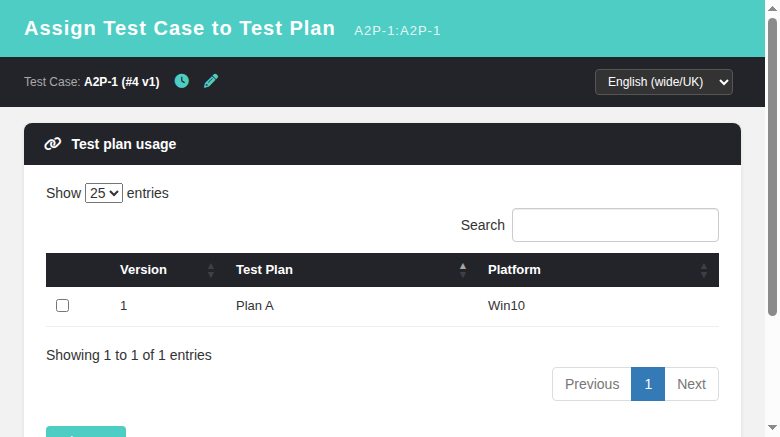

# tcAssign2Tplan — Modernized (Issue #1321)

Modernized DataTables parity for "Assign Test Case to Test Plan"
(`gui/templates/testcases/tcAssign2Tplan.html`).

## Was
The plan grid was a plain HTML table — no sort, search, pagination, or
per-page length menu (a regression vs legacy `dashio/testcases/tcAssign2Tplan.tpl`
which used `DataTables.inc.tpl` with `DataTablesSelector="#item_view"` and
length menu `[[25,50,75,-1],[25,50,75,"All"]]`).

## Now
- DataTables 1.13.7 (Bootstrap 5 theme, CDN) included: CSS
  `dataTables.bootstrap5.min.css`, JS `jquery.dataTables.min.js` +
  `dataTables.bootstrap5.min.js` (same CDN pattern as `suiteView`/`tcScripts`).
- `renderPlans()` re-initializes `#planTable` with:
  - `pageLength: 25`, `lengthChange: true`, length menu `[25,50,75,All]`
  - `searching: true`, search box (localized via `common.search`)
  - `orderable` columns, checkbox column non-orderable
  - destroys any prior instance (`DataTable(...).destroy()`) before re-init,
    avoiding "cannot reinitialise DataTable" on repeated adds/re-renders.

## Verification
- Legacy/modern diff measured during INVESTIGATION (issue comment).
- JS+i18n statically validated (syntax check, all bundle keys present).
- Browser round-trip requires a seeded testproject/testplan/testcase — the
  CI-injected DB is a fresh import with no such fixture yet, so full UI
  interaction scripting is pending a fixture (`tmp/TLU_Test_Cases.md` lists
  the manual steps).

---

# tcAssign2Tplan — Navigation Icons (Issue #1320)

Restored the legacy quick-navigation icons next to the test-case identity in
the toolbar (legacy `dashio/testcases/tcAssign2Tplan.tpl:47-51` dropped them
during modernization).

## Was
Toolbar showed only `Test Case: <name>` as plain text — no way to jump to the
Execution History or the Test Case Viewer while the assign popup is open.

## Now
`gui/templates/testcases/tcAssign2Tplan.html` toolbar renders two icon links
right after the test-case identity (hidden until the screen loads):
- clock icon (title `ta2p.execHistory`) → `openHistory()` →
  `window.open('/gui/templates/execute/execHistory.html?tcase_id=..&tproject_id=..', 'execHistory_<id>', 800x600)`.
- pencil icon (title `ta2p.design`) → `openDesign()` →
  `window.open('/gui/templates/testcases/tcView.html?tcase_id=..&tproject_id=..', 'tcView_<id>', 900x700)`.

This mirrors legacy `openExecHistoryWindow()` / `openTCaseWindow()`
(`gui/javascript/testlink_library.js:1720/1003`) using the established Dashio
popup convention (`tcAssignments.html:362-368`, `tcasesWithCF.html:102-110`).
i18n keys `ta2p.execHistory` + `ta2p.design` added to all 10 locale bundles.

## Verification
- Both icons open the correct modern screens (`execHistory.html`, `tcView.html`)
  for the same test case/project; tooltips localize (tested with `?locale=ro`).
- Add-flow regression passes; Event Viewer shows no new Error/Warning rows.
- Test suite recorded in `tmp/TLU_Test_Cases.md` (Task — Issue #1320, 6/6 PASS).

---

# tcAssign2Tplan — Cancel always visible on locked views (Issue #1319)

Legacy `dashio/testcases/tcAssign2Tplan.tpl` renders the Cancel button OUTSIDE
the `{if $gui->can_do}` conditional (tpl line 86), so the user can always
navigate away — even when every plan/platform row is read-only because the
shown tcversion is already linked to a different version (`can_do=false`).

## Was
Modern `gui/templates/testcases/tcAssign2Tplan.html` kept both **Add** and
**Cancel** inside the single `#actionsBar` div, and `renderPlans()` hid that div
whenever `ctx.info.can_do` was false — trapping the user on a screen with no
action row (only browser back / tab close), while the legacy UI always offered
**Cancel**.

## Now
- `tcAssign2Tplan.html:83-85` — Cancel moved into its own `#cancelBar`
  actions-bar div, separate from `#actionsBar` (Add).
- `renderPlans()` shows `#cancelBar` unconditionally whenever test plans exist
  and gates ONLY `#actionsBar` on `ctx.info.can_do` (`:226-230`).
- Fatal-error and no-plans paths hide `#cancelBar` (`:180-185`, `:194-202`)
  exactly like legacy (no plans → `no_test_plans` text, no form → no buttons).
- BFF `api/tcassign2tplan/index.php` `buildGrid()` unchanged — `can_do` already
  computed exactly as legacy (OR of drawable checkboxes).

## Verification
- Browser can_do=false (A2P-2 v2, Plan A linked on v1): read-only `checked
  disabled` row, Add hidden, **Cancel visible** (`#cancelBar` flex, `#actionsBar`
  none).
- Browser can_do=true (A2P-1 unlinked): addable row, Add + Cancel both visible.
- Add-flow regression passes; after assigning, view reloads to can_do=false with
  Add hidden and Cancel still available.
- Event Viewer: no new Error/Warning entries (only INFO audit rows).
- Test suite recorded in `tmp/TLU_Test_Cases.md` (Task — Issue #1319, 6/6 PASS).

