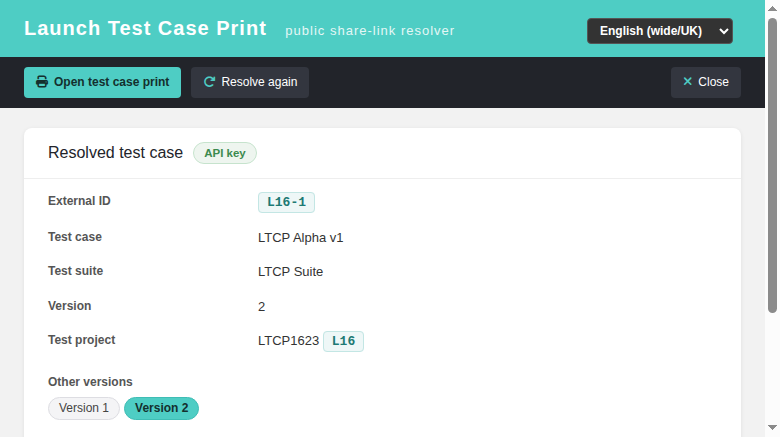
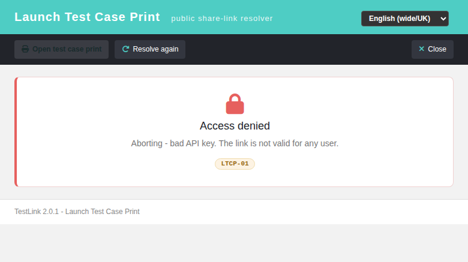
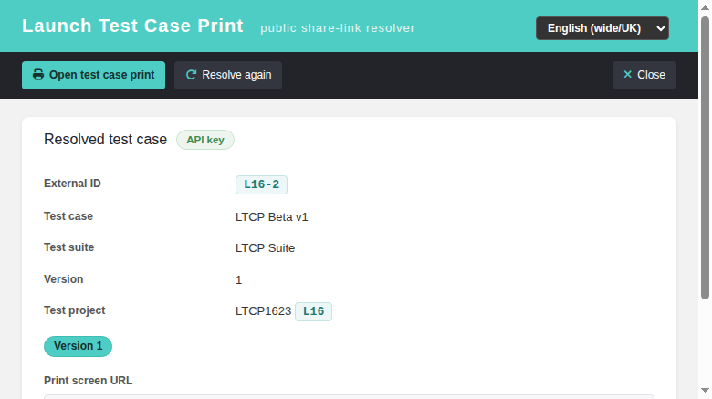
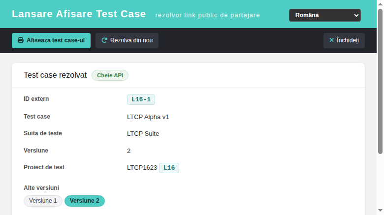
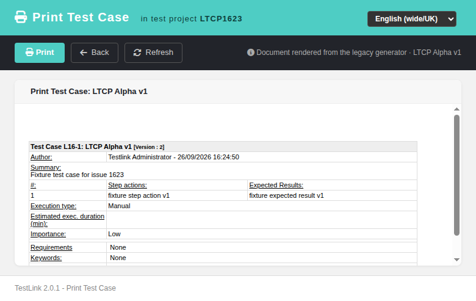

# Modernized: Launch Test Case Print gateway (ltcp)

Issue: [Refs #1623](https://github.com/sebiboga/testlink-upgraded/issues/1623)
Legacy: `ltcp.php` (repo root) — it resolved the share link inline and 302-redirected
into `lib/testcases/tcPrint.php`, which was **still a full legacy renderer**
(`renderHTMLHeader()` + `renderTestCaseForPrinting()`).
Modern: `gui/templates/testcases/tcLaunchPrint.html` + BFF `api/tcprintlaunch/index.php`

## What was modernized

`ltcp.php` is a *public share-link gateway*: an external system (ticket, mail, chat)
hands a colleague a link that prints one specific test case version, and the recipient
does **not** have a TestLink login:

```
ltcp.php?apikey=<32-char user API key>&testcase=<PREFIX>-<NUMBER>-<VERSION>
```

The legacy controller did all of this inline and then redirected into the last
legacy-rendered page the gateway could reach. It also reported every failure by
`echo`-ing a raw, **untranslated** marker straight into the browser body
(`LTCP-01` … `LTCP-05`, plus a completely empty body for a missing version).

It is now a Dashio resolver screen that hands over to the already-modern print
screen `gui/templates/testcases/tcPrint.html`:

- **Resolved test case card** — external id (`L16-1`), test case name, test suite,
  version, test project with its prefix, an auth-mode chip (**API key** or
  **Session**) and the resolved print-screen URL.
- **Version pills** — every version of the test case, the current one marked
  active; clicking another re-resolves it, so a recipient can move from v1 to v2
  without editing the link.
- **State cards** — *Access denied* (bad key / no `mgt_view_tc` / not logged in),
  *Test case not found* (unknown prefix / unknown test case / unknown version) and
  a generic *Error*. Each keeps the legacy `LTCP-0x` marker visible in a
  `legacy-tag` chip, so every old outcome stays recognizable while the text itself
  is now localized in all 10 shipped locales.
- **Tools** — *Open test case print* (disabled until a link resolves), *Resolve
  again*, *Close*; TLi18n locale switcher.

`ltcp.php` is kept as a **public 302 shim** forwarding the whole query string to
the modern screen — the same pattern as the `lnl.php` publicLink shim
([#1541](https://github.com/sebiboga/testlink-upgraded/issues/1541)) — so every
existing share link keeps working unchanged.

## Legacy parity table

| legacy | condition | modern |
|---|---|---|
| `LTCP-01` | apikey length != 32 | `400 bad_apikey` |
| `LTCP-01` | 32-char key matching no user | `403 bad_apikey` |
| `LTCP-02` | `testcase` is not `PREFIX-NUM-VERSION` | `400 bad_external_id` |
| `LTCP-02` | `testcase` parameter missing | `400 missing_testcase` |
| `LTCP-03` | prefix is not a known test project | `404 unknown_prefix` |
| `LTCP-04` | no `mgt_view_tc` on the owning project | `403 no_rights` |
| `LTCP-05` | external id does not resolve | `404 testcase_not_found` |
| *(empty `die()`)* | version not in the test case id set | `404 version_not_found` |
| 302 | all checks pass | `200` + resolved ids + `print_url` |

The prefix is resolved against the whole `testprojects` map before any lookup
(same SQL-injection mitigation as the legacy controller) and the version must be
one of the test case's own `tcversion_id`s.

## BFF (api/tcprintlaunch/index.php)

- `GET ?action=resolve[&apikey=K][&testcase=P-N-V]`

  **Authorization** — a 32-char `apikey` authorizes as its owner (remote access,
  `tlUser::getByAPIKey()`), and the remote-access session is established with
  `setUpEnvForRemoteAccess()` so the *session-based* print BFF
  (`api/testcasesprint`) accepts the follow-up `tcPrint.html` navigation. The
  legacy `clearSession => true` is deliberately **not** reproduced: the identity of
  an existing session is switched to the link owner instead of logging an
  unrelated user out. With no `apikey`, an authenticated session user is accepted
  (a convenience superset of the legacy apikey-only contract).

  **Payload** — `auth_mode`, `print_url` and a `testcase{}` object with
  `testcase_id`, `tcversion_id`, `external_id`, `version`, `name`, `suite`,
  `tproject_id`, `tproject_name`, `prefix` and `available_versions[]`.

- **Contract** — `200` resolved · `400` bad parameters / unknown action ·
  `401` no apikey and no session · `403` bad key / no rights · `404` unknown
  prefix / test case / version · `405` non-GET. `GET` only, so the read-only
  endpoint needs no CSRF proof; session-based `same-origin` is inherited from the
  apikey path of the shared BFF conventions.

## Security notes

- `tlUser::getByAPIKey()` returns `null` on no-match, and the legacy code did
  `count($user)` on it — a PHP 8 `count(null)` `TypeError`, i.e. a 500 for any
  well-formed-but-unknown key. The BFF guards it (same guard as
  `api/publiclink` and `api/executionprint`).
- The prefix is looked up in a pre-loaded map, never interpolated into SQL.
- `setUpEnvForRemoteAccess()` is only ever reached **after** the key resolved to
  exactly one user, so a bogus key cannot mutate a session.
- The 32-char user key and the 64-char test-plan object key are **not**
  interchangeable here: only a user key is accepted, as in legacy. (The 64-char
  object-key public share links are served by the publicLink / report gateways.)

## Notes / gotchas found while porting

- The apikey column is **`users.script_key`** (32 chars) — there is no
  `users.apikey` column in this schema.
- `testprojects` has **no `name` column** and there is **no `testcases` table**:
  names live in `nodes_hierarchy`, and a test case version links to its node by
  node id. Reading `testprojects.name` is a `1054 Unknown column` error.

## Testing

Suite 1623 in `tmp/TLU_Test_Cases.md`: **36 API assertions + 10 browser cases, all
PASS** — every legacy branch above, the 400/401/403/404/405 contract, the rights
path, the shim 302 with the query string preserved, i18n coverage (28 keys × 10
bundles plus every key the screen references), `php -l`, a clean Event Viewer
(audit rows only), and in the browser the resolved card, the print hand-over, the
version pill, all three state cards, the RO locale with zero raw keys and the
critical **anonymous** share-link path (a recipient with no TestLink login
resolves and prints).

One real bug was found and fixed during the run: non-2xx BFF responses never
reached the state-card handler (jQuery routes them to `.fail()`), so every error
card lost its localized message and its `LTCP-0x` marker.










