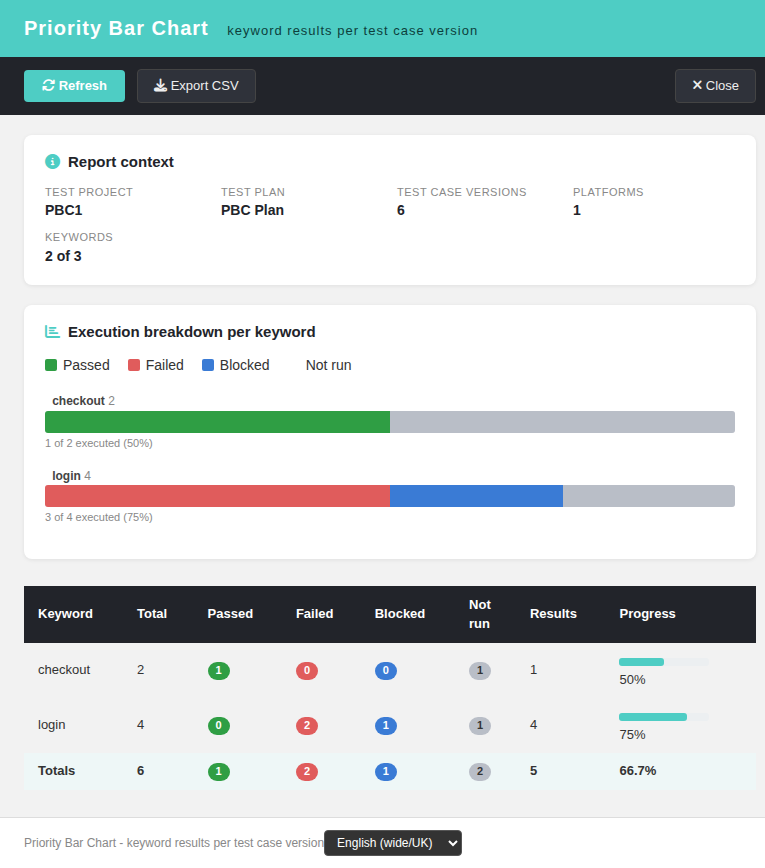
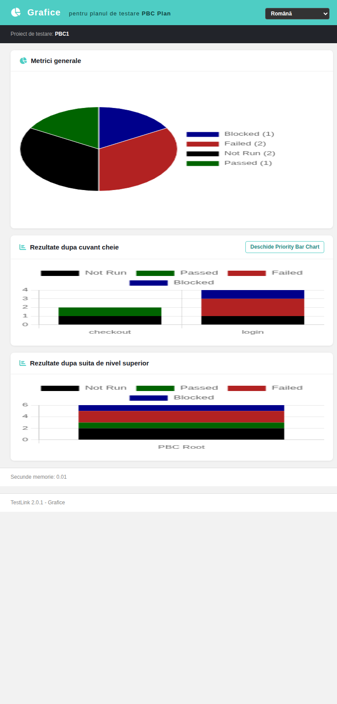

# Priority Bar Chart (Refs #1845)

Screen: `gui/templates/results/priorityBarChart.html` ·
BFF: `api/prioritybarchart/index.php` (`GET|HEAD ?action=init&tplan_id=N[&tproject_id=P]`) ·
Issue: #1845 · Bug found while building it: #1846



## The file was dead code — and dead loudly

`lib/results/priorityBarChart.php` was an orphan (its own first line read
`@TODO this file seems not to be in use`: no ASIDE entry, no Smarty template, no JS
caller). On 2.0.1 it could not run at all:

| Legacy statement | Reality in 2.0.1 |
| --- | --- |
| `require_once("../../third_party/charts/charts.php")` | **file gone** — phpchart dropped with `third_party/charts/` |
| `require_once("../functions/results.class.php")` | **file gone** — `results.class.php` split into per-area classes |
| `$db->get_recordset()` via `results::getAggregateKeywordResults()` | **method gone** with the class above |

Any request → uncaught `Error` → **HTTP 500 with an empty body**. Verified before the
fix:

```bash
curl -s -o /dev/null -w '%{http_code}\n' -b <cookie> \
  'http://localhost:8082/lib/results/priorityBarChart.php?tplan_id=1&tproject_id=1'
# 500
```

## Security gap closed with the screen

Legacy took `$tplan_id` raw out of `$_REQUEST`, called `testlinkInitPage()` and then
**never checked a right**: any authenticated account could read the per-keyword result
breakdown of *any* test plan in the installation (IDOR). `$tproject_id` was read from
the session but never compared with the plan's real owner, so the project "assertion"
was decorative.

The new BFF resolves the plan's **owning** project server-side, asserts it against the
requested `tproject_id` when one is given, requires the `testplan_metrics` right on that
owning project, and audits refusals:

```
403 {"status":"error","code":"no_right",
     "message":"Forbidden: missing right testplan_metrics on tproject 125"}
tLog("BFF prioritybarchart: user 2 has no testplan_metrics right on tproject 125 (tplan 127)", "ERROR")
```

Verified with a real role-3 fixture user through the browser and through the API — and
with a forged `Origin`, which never reaches the plan data.

## What the 2.0.1 screen does now

* a context strip: test project, test plan, assigned versions, platforms, keywords
  (total in project vs. keywords actually plotted),
* one **stacked horizontal bar per keyword** (passed / failed / blocked / not executed,
  teal-red-dark-grey palette) with the progress percentage on the right,
* a DataTable with the same numbers plus the raw result count and a bold **Totals** row,
* **Export CSV** (`;` separator, UTF-8 BOM, a `Totals` line) and **Refresh**,
* **Close** (pops the report window, like every other modern report),
* a machine state card for every failure — bad request, session expiry, no right, plan not
  found, project mismatch, server error — each localized, each showing the raw code so a
  support request is self-explanatory,
* an explicit **empty state** ("no keyword of this test project is attached to a test case
  of this test plan") instead of an empty chart box.

## Rebuilding the aggregate (documented decision)

`testcase_versions` has **no `testcase_id` column** in 2.0.1, and the plan↔version link is
a plain `testplan_tcversions` row (`assign_tcversion_to_plan()` does not exist any more,
the fixture inserts it directly; builds hang off `builds.testproject_id`, not
`testplan_id`). The bar is therefore built like this:

1. the universe is the **distinct `tcversion_id` in `testplan_tcversions` for this plan**,
2. each version is attributed the result of its **latest execution row**
   (`MAX(executions.id)` for that plan + version) — so a version executed twice (passed,
   then failed) is counted **once, as failed**, and the four buckets always partition the
   keyword total exactly,
3. a version with **no** execution row falls into *not executed*,
4. the raw number of **execution rows** per keyword is reported in its own column, so work
   done in several builds stays visible instead of being hidden by the latest-wins rule,
5. progress % = executed versions / versions in the keyword.

Project isolation is covered by tests, not by hope: a second project+plan fixture proves
that each plan reads its own keywords (`foreign-keyword` never leaks into `PBC1`), and
that a foreign `tproject_id` on a real plan is refused with `project_mismatch`.

## Contract

| Case | Answer |
| --- | --- |
| `action=init&tplan_id=N` | 200 `{status:"ok", context, keywords[], totals}` |
| no / non-numeric / array / negative `tplan_id`, unknown action | 400 `invalid_request` |
| no session | 401 `not_authenticated` (or `session_expired`) |
| missing `testplan_metrics` on the owning project | 403 `no_right` + `tLog` |
| unknown plan | 404 `tplan_not_found` |
| `tproject_id` ≠ owning project | 404 `project_mismatch` |
| `POST` with same-origin `Origin` | 405 `method_not_allowed` |
| `POST` without same-origin proof | 403 CSRF (shared `bffEnforceSession` helper) |
| `HEAD` | 200 (safe verb) |

Every response carries `Cache-Control: no-store` + `X-Content-Type-Options: nosniff`, and
the params are bound placeholders, never interpolated.

## The legacy URL now redirects instead of fataling

`lib/results/priorityBarChart.php` is a launcher shim: it keeps
`testlinkInitPage()` (so the anonymous case still lands on `login.php?note=expired`, the
1.9.20 contract) and then

* **302** for a browser navigation → `gui/templates/results/priorityBarChart.html?tplan_id=…&tproject_id=…`
  (`tproject_id` defaults to the session project when absent),
* **405** `modern_endpoint_only` for an XHR caller — the legacy answer was a PNG, there is
  nothing left to serve,
* **400** `invalid_request` JSON when `tplan_id` is missing.

No ASIDE entry, template or JS caller of the legacy file is left; the only remaining
mentions of it are two explanatory comments.

## Wiring

* `$actions->priorityBarChart` in `lib/functions/common.php` — inside the
  `tplan_id > 0` guard, so the report is plan-scoped like every other plan report,
* a visible **Open Priority Bar Chart** button on the *Results by Keyword* section of
  `gui/templates/results/charts.html`, the report family that shares the same aggregate:



## i18n

46 `pbc.*` keys + `footers.priorityBarChart` + `charts.openPriorityBarChart` in **all 10**
client bundles (`en ro de fr es it pt ja ru zh`). Verified by switching the locale in the
browser: header, subtitle, legend, the "1 din 2 executate (50%)" progress text, all eight
table headers and the footer translate, and no raw dotted key ever reaches the DOM.

## Tests

Suite **1845** in `tmp/TLU_Test_Cases.md` — 68 executable cases (`python3
tmp/suite_1845.py`, exit 0) covering auth, the aggregate semantics, project isolation, the
whole 400/401/403/404/405 matrix, all four shim branches, the wiring, the 10 bundles and the
Event Viewer, plus 9 browser cases (render, refresh, CSV content, RO↔EN, bad request,
project mismatch, real no-rights login, empty plan, charts link). Event Viewer: no new
Warning/Error row; the only `log_level=1` entries are the deliberate `no_right` audit rows,
same convention as `api/namecheck/checkDuplicateName.php`.