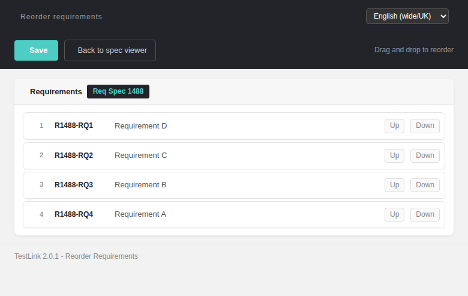
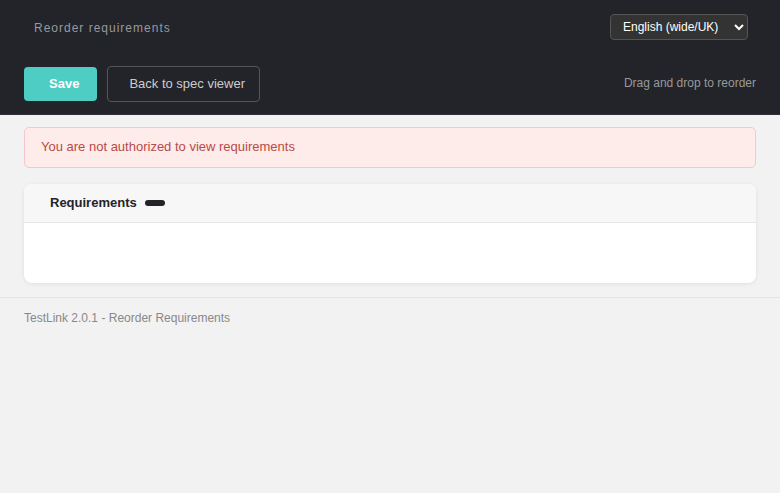

# Reorder Requirements (reqReorder) Modernized — docs mirror

> Docs mirror of the wiki page
> **`Reorder-Requirements-Modernized.md`** (Refs
> [#1488](https://github.com/sebiboga/testlink-upgraded/issues/1488)). Same
> content as the wiki; kept in sync with `tmp/wiki-repo/` + `docs/` ledger +
> `docs/CHANGELOG.md` per the ASIDE-parity workflow.

Modernization of the **Reorder Requirements** sub-screen of the Requirement
Specification Viewer — `lib/requirements/reqSpecView.php?doAction=reorder` / the
`reorder` action of **`reqReorder.php`** (toolbar entry "Reorder requirements"
in the spec viewer). This was the last legacy requirements-ordering bit still
served by a `lib/requirements/*.php` controller print path; now a standalone
Dashio screen + REST BFF.

---
## 1. What the screen does

| Feature | Legacy behavior | Modernized |
|---|---|---|
| Route | `doAction=reorder` on `lib/functions/reqSpecView.php` (frame submit) | `gui/templates/requirements/reqReorder.html` + BFF `api/reqreorder/index.php` |
| Reorder list | `get_requirements_ordered`-style drag list (Dashio) | modern DataTable + drag-and-drop rows (`Sortable.js`), each with **Up**/**Down** buttons |
| Persist | legacy `lib/requirements/reqReorder.php` updates `node_order` on `nodes_hierarchy` | BFF `POST ?action=reorder&req_spec_id=&tproject_id=` with `nodes_order[]` (0-based index) — writes `node_order` on the matching `nodes_hierarchy` rows (`id` = requirement node id) |
| Order source | legacy `reqSpecView.php` `get_requirements` query | BFF `GET ?action=init` returns the spec's requirements ordered by `node_order` (latest version rows) incl. `doc_id` (from `requirements.req_doc_id`), `title`, `node_order`, `canReorder` (grant) |
| Rights | `mgt_view_req` / `mgt_modify_req` on the owning project | BFF gates every route: `mgt_view_req` reads, `mgt_modify_req` writes — 401 anon / 403 no right / 400 bad params / 404 unknown spec, JSON contract |
| Back link | legacy `doViewOptions` / history | "Back to spec viewer" → `reqSpecView.html?id=<spec>&tproject_id=<tproject>` |
| Locale | server `strings.txt` | `reqro.*` (15) + `footers.reqReorder` keys in all 10 TLi18n bundles; per-screen locale switcher (verified `ro` + `en`) |

![Browser-verified drag-drop persist — `node_order` written to `nodes_hierarchy`]  (see screenshot above)

---
## 2. BFF API

`GET api/reqreorder/index.php?action=init&req_spec_id=<id>&tproject_id=<id>`  
`POST api/reqreorder/index.php?action=reorder&req_spec_id=<id>&tproject_id=<id>`  
`Content-Type: application/json`, body `{"nodes_order":[<node_id>,…]}`.

**Rights:** `mgt_view_req` (init) / `mgt_modify_req` (reorder) on the owning
project → 401 unauthenticated, 403 no right, 400 missing/invalid params, 404
unknown spec, 405 non-POST/GET, JSON `{status, message}` on every path.

---
## 3. Files & wiring

| File | Purpose |
|---|---|
| `gui/templates/requirements/reqReorder.html` | modernized Dashio screen (TLi18n, drag-drop list, Up/Down, Save, Back, locale switcher) |
| `api/reqreorder/index.php` | BFF: `init` (ordered requirements + grant) / `reorder` (persist `node_order`) |
| `gui/templates/requirements/reqSpecView.html` | toolbar **Reorder requirements** button (`#reorderLink`) → opens `reqReorder.html?req_spec_id=&tproject_id=` |
| `lib/functions/common.php` | `$actions->reqReorder` link switch |
| `gui/templates/i18n/{de,en,es,fr,it,ja,pt,ro,ru,zh}.json` | `reqro.*` + `footers.reqReorder` in all 10 bundles |

**Dependency commits (bugs found + fixed during modernization):**
- `e574c90b3` — `gui/templates/requirements/reqReorder.html` + `lib/functions/common.php` `$actions->reqReorder` + `api/reqreorder/index.php`; wiring + toolbar button + `reqSpecView.html` reorder entry.
- `61a170343` — rewrite `reqReorder.html` with TLi18n i18n keys; fix `down21` (undefined drag-item ReferenceError kept the list from rendering).
- (BFF fixes in `api/reqreorder/index.php`) — instantiate `$tprojMgr` (was NULL → 500 on init); init requirement/version query (versions are children of requirement nodes; `req_doc_id` lives on `requirements`); persist `node_order` on `nodes_hierarchy` (legacy wrote to `requirements` table by mistake — parity bug, fixed to `nodes_hierarchy`).

---
## 4. Testing

Regression suite **1488** (appended to `tmp/TLU_Test_Cases.md`) — 11/11 PASS:
init order parity (D,C,B,A), drag-and-drop + Up/Down reorder, Save → persisted
`node_order` re-verified in DB + Event Viewer clean, guest 403 / anon 401 /
no-right 403, locale switching (ro + en render; no raw keys), Back link,
toolbar button entry. Browser-verified end-to-end; Event Viewer shows no new
Error/Warning rows; console clean.

---
**Mirror-source:** `docs/MODERNIZATION-STATUS.md` row **24f** (`#1488`). Wiki:
`Reorder-Requirements-Modernized.md`. CHANGELOG: `docs/CHANGELOG.md`.
