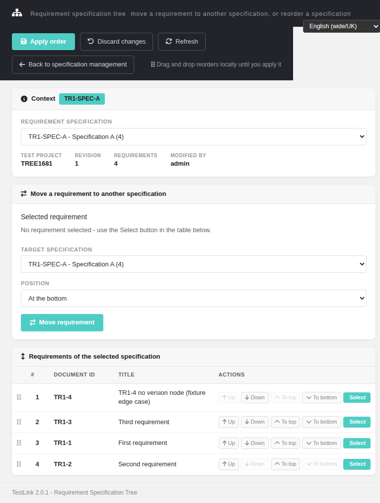
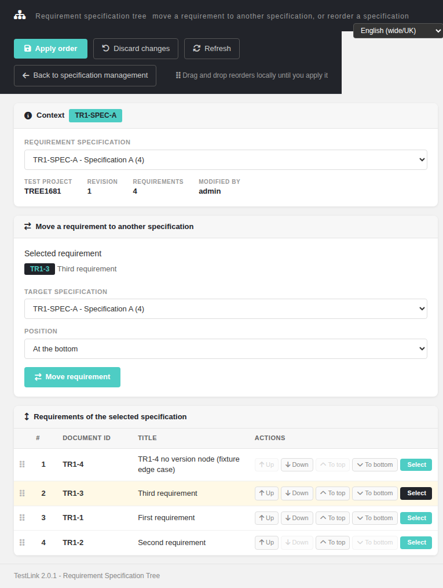
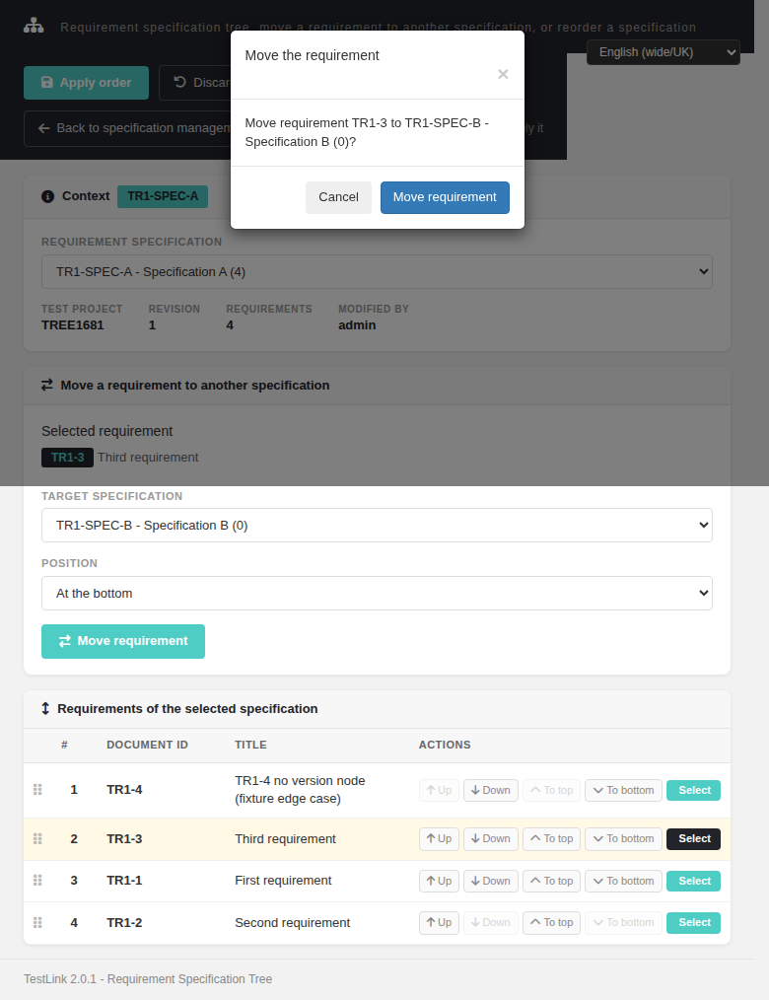
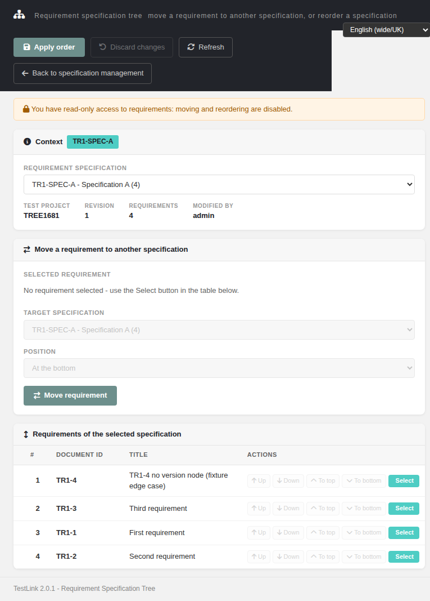
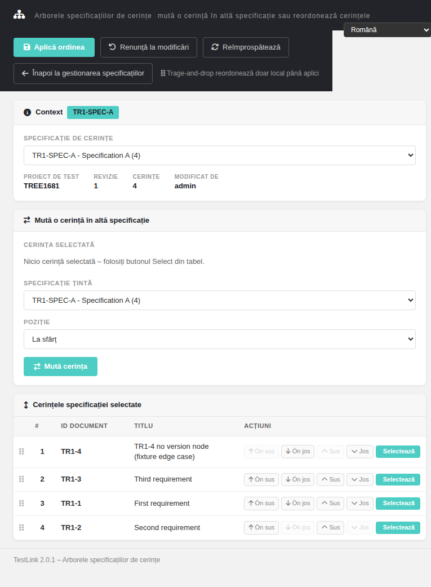

# Reorder Requirements Tree (reqTreeReorder) Modernized — docs mirror

> Docs mirror of the wiki page
> **`Reorder-Requirements-Tree-Modernized.md`** (Refs
> [#1681](https://github.com/sebiboga/testlink-upgraded/issues/1681), bugfix
> [#1692](https://github.com/sebiboga/testlink-upgraded/issues/1692)). Same
> content as the wiki; kept in sync with `tmp/wiki-repo/` + `docs/` ledger +
> `CHANGELOG.md` per the ASIDE-parity workflow.

Modernization of the **Requirement Specification Tree move / re-parent** flow, which had
**no screen at all** in 1.9.20. The legacy write path was the AJAX endpoint
`lib/ajax/dragdroprequirementnodes.php` (`doAction=changeParent` / `doAction=doReorder`),
called straight from a drag-and-drop widget. Now a standalone Dashio screen backed by a
REST BFF, reachable from the Requirement Specification Viewer toolbar.

| Feature | Legacy (1.9.20) | Modernized (2.0.1) |
|---|---|---|
| Screen | none (bare drag list inside the spec viewer) | `gui/templates/requirements/reqTreeReorder.html` |
| BFF | none | `api/reqtreereorder/index.php` (`init` / `move` / `reorder`) |
| Write endpoint | `lib/ajax/dragdroprequirementnodes.php` | `POST /api/reqtreereorder/index.php?action=move` / `?action=reorder` |
| Rights on write | **none** | `mgt_modify_req` on the **owning** project (403 otherwise) |
| Ownership | **none** — any requirement id could be re-parented | node's owning project proved through its spec; cross-project id -> 404 |
| CSRF / same origin | **none** — read `$_REQUEST`, so a plain **GET mutated** | `bffSameOriginGuard()` + JSON POST; the legacy URL is a non-mutating shim |
| Collision handling | silent (half-applied move) | `409 duplicate_doc_id` preflight on `UNIQUE (srs_id, req_doc_id)`, before any write |
| Row list | every **version** node of a requirement | each requirement's **latest** version node only |
| Locale | server `strings.txt` | `reqtr.*` (54 keys) + `footers.reqTreeReorder` in all 10 TLi18n bundles, per-screen switcher |
| Entry point | drag handles inline in the viewer | toolbar link **Reorder / move requirements** on the spec viewer + `$actions->reqTreeReorder` |








---
## 1. What the screen does

* **Context card** — test project, requirement specification (with its requirement count),
  spec revision, requirement count and the real **Modified by** author (the creator of the
  newest `req_specs_revisions` row, never a hardcoded `admin`).
* **Specification picker** — every spec of the project, `doc_id — title (n)`.
* **Reorder table** — one row per requirement: document id, title, and
  **Select / Up / Down / To top / To bottom**, plus drag-and-drop. Every button acts on **its
  own row**. A drag or a button click marks the form dirty (an *Unsaved changes* chip) —
  nothing is written until **Apply order**. **Discard changes** reloads from the server,
  **Refresh** re-reads.
* **Move a requirement to another specification** — pick a target spec and *At the top* /
  *At the bottom*, confirm in a Bootstrap modal (spec and requirement named in the message),
  then the screen follows the requirement into its new spec.
* **States** — read-only banner for view-only users, denied box + disabled writes for 403,
  not-found box for 404, empty box for a spec with no requirements.

## 2. BFF API

Base `api/reqtreereorder/index.php`. Session auth + `bffSameOriginGuard()`; JSON in, JSON out.

| Route | Body / params | Answer |
|---|---|---|
| `GET ?action=init&tproject_id=N[&req_spec_id=M][&node_id=K]` | — | `context` (project/spec/revision/counts/author/back-link), `specs[]`, `requirements[]` (`id`, `req_doc_id`, `title`, `status`, `type`, `version`, `node_order`), `grant{view,modify}` |
| `POST ?action=move` | `{tproject_id, node_id, new_spec_id, position:"top"\|"bottom"}` | `200 {moved:true, node_id, spec_id, position}` |
| `POST ?action=reorder` | `{tproject_id, req_spec_id, nodes_order:[id,…]}` | `200 {reordered:N, req_spec_id}` |

Error contract: `401` unauthenticated, `403` no rights / cross-origin, `404` unknown or
foreign spec/requirement, `400` bad params (incl. `invalid_nodes_order` on a duplicate id and
`no_change` when nothing moved), `405` wrong verb, `409 duplicate_doc_id`.

### Ordering of the checks (security-relevant)

`init` evaluates rights on the **requested** project *before* it resolves the node, and only
then compares the node's owning project with it. The other order turned the endpoint into a
cross-project **existence oracle**: a user without rights got `404` for a foreign id but `403`
for an existing one. `move` never resolves or writes anything before `mgt_modify_req` on the
owning project has been confirmed.

## 3. The list is the *latest* version node

TestLink adds a `node_type_id=8` (requirement version) node on every revision and never
removes the previous one, so a plain join returns a revised requirement **once per
revision** (measured: `81, 81, 81, 83, 85` after one revision of `81`). The list therefore
pins the join to the newest version node (`VN.id = (SELECT MAX(VN2.id) …)`), while keeping the
`LEFT JOIN` so a requirement with no version node at all still appears (defensive: such a row
renders with an empty status/version instead of disappearing from the tree).

## 4. Files & wiring

| File | Purpose |
|---|---|
| `gui/templates/requirements/reqTreeReorder.html` | the Dashio screen (table, move modal, dirty tracking, read-only / denied states, back link) |
| `api/reqtreereorder/index.php` | the BFF (`init` / `move` / `reorder`) |
| `gui/templates/requirements/reqSpecView.html` | the entry point: toolbar link `#treeReorderLink` |
| `lib/functions/common.php` | `$actions->reqTreeReorder` (generic launcher, legacy template parity) |
| `lib/ajax/dragdroprequirementnodes.php` | retired endpoint, now a session-guarded non-mutating shim |
| `gui/templates/i18n/*.json` | `reqtr.*` (54 keys) + `footers.reqTreeReorder`, all 10 bundles |
| `tmp/fixtures_1681.php` | fixture: admin, `<no rights>` user, view-only role; re-runnable |
| `tmp/TLU_Test_Cases.md` | Suite 1681 — 45 cases |

## 5. Testing

Suite **1681 — 45/45 PASS** (BFF contract, browser flows, permission paths, i18n, legacy
shim, syntax/JSON checks, Event Viewer). Bugs found while testing, each filed with `bug`:

| Issue | Symptom |
|---|---|
| #1682 | duplicate DOM ids in the order list |
| #1683 | native `alert()` instead of the Dashio/Bootstrap modal |
| #1684 | row buttons reordered the wrong row |
| #1685 | drag-and-drop did not mark the form dirty |
| #1686 | the back link lost its parameters on the error/success paths — fixed in `983c9179c`, re-verified 9/9 and closed ([details](Bugfix-Issue-1686-reqtreereorder-Back-Link-Dead-Self-Reload.md)) |
| #1687 | *Modified by* was hardcoded to `admin` |
| #1688 | the denied (403/404) state still had live controls |
| #1689 | read-only users saw drag handles, grips and hints |
| #1690 | the back link's `tproject_id` was hardcoded to `13` |
| #1691 | the list showed superseded version nodes (critical) |
| #1692 | deleting a project holding an **empty** requirement spec fataled in the shared delete path (`array_keys(null)` + two `IN ()` SQL errors) — found by re-running this screen's own fixture |

## 6. How to reproduce the fixture

```
php tmp/fixtures_1681.php
# -> tproject (prefix TR1), specA (3 requirements), specB (0 requirements)
# -> tr1681norights  (role 3, <no rights>)               -> 403 path
# -> tr1681readonly  (custom role: mgt_view_req only)    -> read-only path
```

`http://localhost:8082/gui/templates/requirements/reqTreeReorder.html?tproject_id=<TP>&req_spec_id=<SPECA>`
(all fixture users use the password `admin`).

## 7. Notes for future screens

`database::fetchRowsIntoMap()` returns **`null`** — not an empty array — when a query matches
no rows. Any `array_keys()` / `implode()` / `foreach()` on its result must be guarded
(#1692). The same "return null for an empty result" contract is the sibling screen
`api/reqreorder`'s latest-version pattern; keep the two queries in sync when the schema moves.
