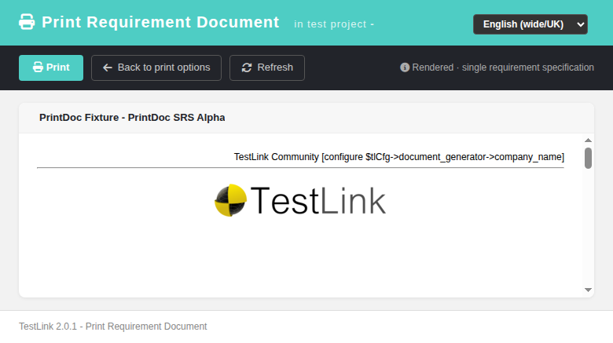
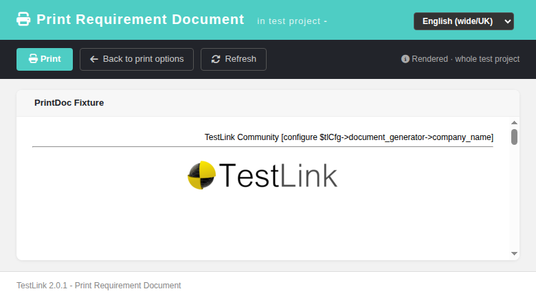

# Requirement Document Print (printDocument) — Modernized Screen

Modernization of the **Requirement Spec Document Print** output
(`lib/results/printDocument.php`) — GitHub issue
[#755](https://github.com/sebiboga/testlink-upgraded/issues/755).

The legacy standalone print launcher that `printReqSpec.html` opened directly
is replaced by a new Dashio viewer (`gui/templates/requirements/printDocument.html`)
backed by a plain-PHP REST BFF (`api/reqdoc/index.php`). The document is
regenerated as HTML by the BFF and rendered inside the modern screen (generated
documents are HTML-only in 2.0.1), where the document body keeps its own legacy
layout inside a same-origin iframe.

**URL:** `gui/templates/requirements/printDocument.html?type=reqspec&level=<reqspec|testproject>&id=<id>&tproject_id=<id>&format=<n>&toc=<y|n>&<opt>=<y|n>`
**BFF API:** `api/reqdoc/index.php?action=doc&...&<print option>=<y|n>`
**Rights:** `testplan_metrics` enforced server-side (same gate as legacy
`checkRights()` in `printDocument.php`).

---
## Table of Contents
1. [What the screen does](#1-what-the-screen-does)
2. [REST API Reference](#2-rest-api-reference)
3. [Legacy parity notes](#3-legacy-parity-notes)
4. [i18n Keys](#4-i18n-keys)
5. [Security](#5-security)
6. [Testing](#6-testing)

## 1. What the screen does

| Feature | Legacy behavior | Modern implementation |
|---|---|---|
| Entry point | `printReqSpec.html` opened `/lib/results/printDocument.php` in a new window | opens `printDocument.html` (new tab) with the same query params (type/level/id/tproject_id/format + print options) |
| Document generation | Smarty/PHP rendered a full standalone page via `print.inc.php` + `printDocOptions` | BFF `action=doc` reuses the exact same legacy renderers and returns the generated HTML as JSON; the screen writes it into an iframe `srcdoc` |
| Print | Browser print of the standalone page | **Print** toolbar button calls the iframe's `contentWindow.print()` |
| Table of contents navigation | native anchor jumps within the page | anchors are resolved inside the iframe (`name=` and `id=` lookups) so the parent page never navigates |
| Refresh | reload page | re-issues the BFF call and re-renders |
| Locale | PHP `$g_lang` | client-side `TLi18n` switcher; keys in `pdoc.*` namespace |
| Errors | legacy pages errored out | i18n error banners (not found / not authorized / generation failed) with Print disabled and iframe hidden |

## 2. REST API Reference

Session-authenticated JSON; safe verb (GET) only, so no Origin guard needed.

| Method | Route | Query | Returns |
|---|---|---|---|
| GET | `?action=doc` | `tproject_id`, `id`, `level=reqspec\|testproject`, `format` (0=HTML), and every `printDocOptions` var (`toc`, `headerNumbering`, `req_spec_scope`, `req_spec_author`, `req_spec_overwritten_count_reqs`, `req_spec_type`, `req_spec_cf`, `req_scope`, `req_author`, `req_status`, `req_type`, `req_cf`, `req_relations`, `req_linked_tcs`, `req_coverage`, `displayVersion`) | `{status:'ok', html, title, level, id, format}` |

### Error conditions
- Missing/invalid session → HTTP 401.
- `tproject_id` unknown → 400 `Invalid test project id`.
- No `testplan_metrics` right on the project → HTTP 403.
- `level=reqspec` and `id` is not a requirement-spec node that belongs to the
  project (including hand-crafted `id == tproject_id` URLs) → HTTP 404.
  The BFF probes `req_specs` directly before calling `get_by_id()`, so a bad id
  can never fatal (a pre-fix 500 on that edge was fixed in `88672f945`).
- Unknown `action` → HTTP 400.

## 3. Legacy parity notes

- Reuses the untouched legacy renderers `lib/functions/print.inc.php`
  (`renderHTMLHeader`, `renderFirstPage`, `renderTOC`, `renderEOF`,
  `renderReqSpecTreeForPrinting`) and `lib/functions/printDocOptions.class.php`
  (`getAllOptVars`); `cfg/reports.cfg.php` provides `DOC_REQ_SPEC`.
- Same project-level document (all specs in the tree, item = test project id,
  `level=testproject`) and single-spec document (`level=reqspec`) semantics as
  the legacy launcher.
- The generated document body keeps its own layout (company header/footer from
  `document_generator` config, `Printed by TestLink on …` stamp); it is only
  embedded in the modern shell.

## 4. i18n Keys

All labels are client-side via `TLi18n`; keys under the `pdoc.` namespace
(`pdoc.title`, `pdoc.inProject`, `pdoc.btnPrint`, `pdoc.btnBack`,
`pdoc.generating`, `pdoc.errLoad`, `pdoc.errNoRights`, `pdoc.errNotFound`,
`pdoc.errEmpty`, `pdoc.errNotReady`, `pdoc.rendered`, `pdoc.levelProject`,
`pdoc.levelSpec`) plus shared `common.refresh`. Present in all 10 bundles
(`en ro de es fr it ja pt ru zh`).

## 5. Security

- Session-authenticated BFF; rights re-checked server-side on every request
  (`testplan_metrics`) — guests without that right get 403.
- Generated HTML is inserted via `srcdoc` (no `document.write`/innerHTML of the
  BFF body outside the iframe boundary); error state hides the iframe.
- The `id`/`tproject_id` values are int-cast before any SQL use; the spec probe
  is a parameter-safe recordset lookup.

## 6. Testing

See **Suite 68 — Requirement Spec Document Print (printDocument)** in
`tmp/TLU_Test_Cases.md` (14/14 PASS): BFF render (spec + whole project), BFF
error codes (404/400/edge), rights gate both directions, screen render/print,
in-iframe TOC navigation, option flags, locale switcher, entry-point link
switch, screen error paths, console cleanliness, events, i18n bundle integrity.