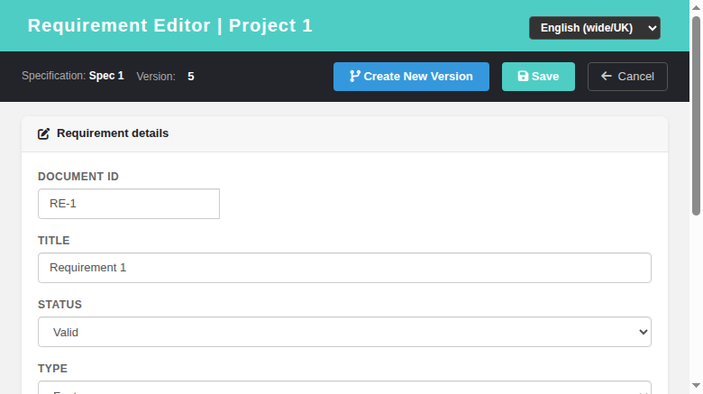
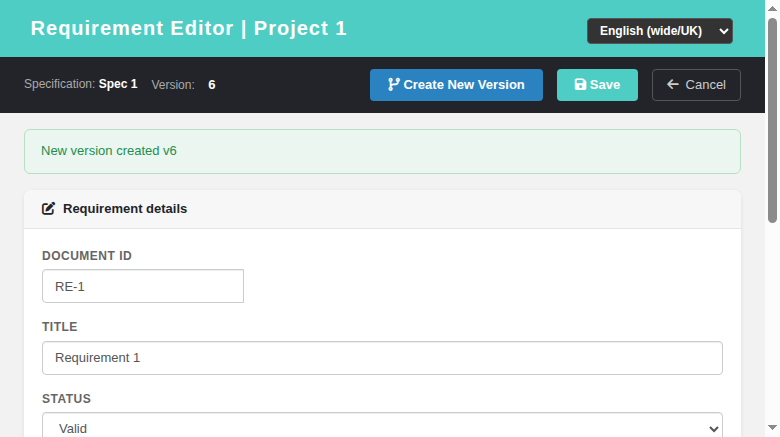
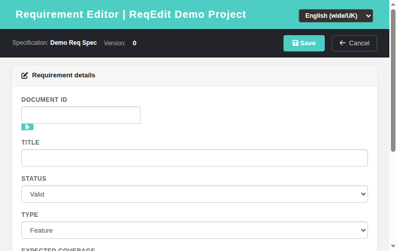
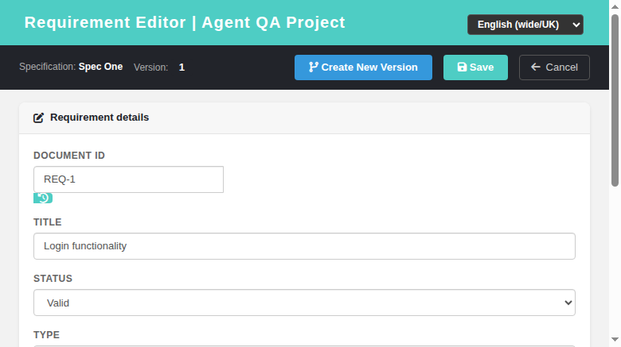
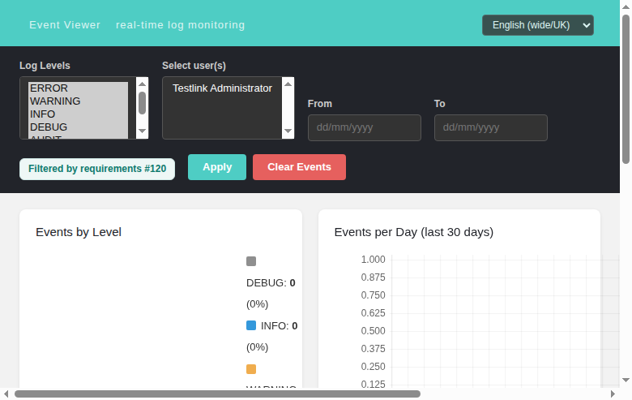

# Requirement Editor (reqEdit) — Modernized Screen

Modernization of **Requirement Editor** (`lib/requirements/reqEdit.php`) — GitHub
issue [#798](https://github.com/sebiboga/testlink-upgraded/issues/798).

The legacy Smarty screen is replaced by a standalone Dashio page
(`gui/templates/requirements/reqEdit.html`) backed by a plain-PHP REST BFF
(`api/reqedit/index.php`). This is a non-ASIDE screen reached as a popup from the
modernized **Search → Advanced (full text)** results — the `openReqEdit` link was
switched from the legacy `reqEdit.php` to the new HTML screen.

**URL:** `gui/templates/requirements/reqEdit.html?id=<requirement_id>&tproject_id=<id>` (edit)
or `gui/templates/requirements/reqEdit.html?spec_id=<spec_node_id>&tproject_id=<id>` (create)
**BFF API:** `api/reqedit/index.php`
**Rights:** `req_view` (view) / `req_mgmt` (manage) enforced server-side on every route
(same as legacy `checkRights()`).

---
## Table of Contents
1. [What the screen does](#1-what-the-screen-does)
2. [REST API Reference](#2-rest-api-reference)
3. [Legacy parity notes](#3-legacy-parity-notes)
4. [i18n Keys](#4-i18n-keys)
5. [Security](#5-security)
6. [Testing](#6-testing)

## 1. What the screen does

| Feature | Legacy behavior | Modern implementation |
|---|---|---|
| Mode (edit / create) | `requirement_id` vs `req_spec_id` URL args | `id=` opens edit, `spec_id=` opens create; header shows spec title + latest version chip |
| Document ID | required `req_doc_id` (created as child revision node) | same; validation blocks save when empty |
| Title | required text | same; validation |
| Status | `char(1)` status code (D/R/F/I/V/O/N/...) | same; mapped to human label on load/save |
| Type | `char(1)` type code (V/R/...) | same; dropdown of 7 types |
| Expected coverage | 1/2/3/5/10 | same dropdown |
| Scope | description textarea | same |
| Save | `doAction=save` → update/create revision | `POST ?action=save`; on create, builds `nodes_hierarchy` + `requirements` + first `requirements_revisions` row and switches to edit mode |
| Create New Version (edit) | `doAction=doCreateVersion` → `create_new_version()` (reqCommands.class.php:609): copy the ENTIRE source version (scope/status/type/expected_coverage/custom fields/attachments/TC links), set `log_message` from the `ask4log()` prompt, freeze the source when `req_cfg->freezeREQVersionOnNewREQVersion` (default TRUE) and notify monitors (`notify=true`) | **same (Refs #1377)** — `POST ?action=version` now calls `requirement_mgr::create_new_version()`; the screen prompts for a log message (`reqe.newVersionPrompt`) and passes the editor's selected `version_id` as the copy source |
| Insert last doc id (create) | icon next to Document ID fills it with the project's last `req_doc_id` (config `allow_insertion_of_last_doc_id`) | BFF form response carries `allow_insert_last_doc_id` + `last_doc_id`; a teal insert icon is rendered in create mode only and one-click fills the field (Refs #1379) |
| Event history (edit) | `question.gif` icon next to Document ID (right `mgt_view_events` + req_id set) opens `eventviewer.php` object-scoped to the requirement | fa-history icon in the Document ID input group (edit mode + `rights.canViewEvents`) opens `eventviewer.html?object_id=&object_type=requirements` in a new tab (Refs #1378) |
| Cancel | return to caller | returns without any DB write |

## 2. REST API Reference

All routes are session-authenticated and JSON; CSRF Origin header required.

| Method | Route | Body / Query | Returns |
|---|---|---|---|
| GET | `?action=form&id=N` | `tproject_id` | `{mode:'edit', requirement, options, tproject_id, tproject_name, allow_insert_last_doc_id, last_doc_id, rights}` |
| GET | `?action=form&spec_id=N` | `tproject_id` | `{mode:'create', spec_title, tproject_id, tproject_name, allow_insert_last_doc_id, last_doc_id, options, rights}` |
| POST | `?action=save` | `{id?, spec_id?, tproject_id, doc_id, title, status, type, scope, expected_coverage}` | `{status:'ok', id}` (update or create) |
| POST | `?action=version` | `{id, tproject_id, version_id?, log_message?}` | `{status:'ok', version, version_id, new_version}` — full copy of the source version (type/coverage/CFs/attachments/scope/status), stores `log_message`, freezes source per config, notifies monitors (Refs #1377) |

### Error conditions
- Missing/invalid session → HTTP 401.
- `tproject_id` missing → 400.
- Missing required field (doc_id/title) → `{status:'error', message}`.
- No `req_view` right → 403 on form; no `req_mgmt` → 403 on save/version.

On success the screen hides the error bar and (after create/version) refreshes the
form with the new id/version.

## 3. Legacy parity notes

- The editor uses the **`req_specs`** table (not `requirement_specs`) and reads the
  spec title from `nodes_hierarchy`/`req_specs_revisions` (spec node name).
- Status/type are stored as single-char codes; the BFF maps between the char code
  and the human label using the same `tl` localization keys as legacy.
- On **create**, the requirement node + `requirements` row + first
  `requirements_revisions` row are created in one transaction, mirroring the
  legacy `doCreate` flow.
- **Insert last doc id (Refs #1379):** controlled by
  `req_cfg->allow_insertion_of_last_doc_id` (`config.inc.php`, repo default
  `DISABLED`, same as legacy). When enabled, the BFF form responses compute
  `last_doc_id` via `requirement_mgr::get_last_doc_id_for_testproject()`
  (lib/functions/requirement_mgr.class.php — `max()` over the project's
  requirement IDs), exactly like legacy `reqEdit.php:249-251`. The screen shows
  a teal FontAwesome insert icon next to Document ID **in create mode only**,
  hidden when the project has no requirements yet, in edit mode, after the
  first create-save flips to edit, or when the config flag is off. The tooltip
  mirrors legacy `insert_last_req_doc_id`, e.g.
  `Insert Document ID of last created Requirement: "REQ-002"`; clicking fills
  `#reqDocId` (legacy `insert_last_doc_id()` parity).
- **Create New Version (Refs #1377):** mirrors legacy `doCreateVersion()`
  (reqCommands.class.php:609 → `requirement_mgr::create_new_version()` at
  requirement_mgr.class.php:2328). The BFF `version` action passes
  `reqVersionID` (the editor's selected version, `version_id` arg), `log_msg`
  (`log_message` arg), `notify=true` and `freezeSourceVersion` from
  `req_cfg->freezeREQVersionOnNewREQVersion` (default TRUE). Internally it
  computes next version number (last child + 1), notifies monitors
  (`notifyMonitors`, mail cfg at requirement_mgr.class.php:4435), copies the
  whole source version (`copy_version()`: scope/status/type/expected_coverage +
  `copy_cfields()` + `copy_attachments()` + TC-link freeze/close), persists the
  log message and freezes the source (`updateOpen(...,0)`). The screen prompts
  with `window.prompt(TLi18n.t('reqe.newVersionPrompt'))` (revision-log
  pattern); Cancel aborts without a request. Related PHP 8 E_WARNINGs in the
  legacy `copy_version()` chain fixed in issue #1513.
- **Event-history icon (Refs #1378):** legacy `reqEdit.tpl:287-292` renders a
  `question.gif` next to Document ID calling
  `showEventHistoryFor(req_id,'requirements')` when the user holds the
  `mgt_view_events` right and a requirement is being edited (mode with
  `$gui->req_id` set). The modern screen keeps full parity: the BFF `form`
  responses expose `rights.canViewEvents` (computed via
  `hasRight('mgt_view_events')`, mirrors `lib/requirements/reqEdit.php:299`),
  and the HTML renders a FontAwesome history icon in the Document ID input group
  **only when** `mode==='edit' && canViewEvents`. Clicking submits the hidden
  `#eventhistory` GET form (target=_blank) to
  `gui/templates/eventviewer/eventviewer.html?object_id=<req_id>&
  object_type=requirements`, opening the modern event viewer object-scoped to
  the requirement — same target/new-tab behaviour as the legacy helper.

## 4. i18n Keys

All labels are client-side via `TLi18n`; keys under the `reqe.` namespace
(`reqe.pageTitle`, `reqe.title`, `reqe.docId`, `reqe.status`, `reqe.type`,
`reqe.expectedCoverage`, `reqe.scope`, `reqe.save`, `reqe.cancel`,
`reqe.newVersion`, `reqe.newVersionPrompt` (create-new-version log prompt,
Refs #1377), `reqe.spec`, `reqe.version`, `reqe.detailHeader`,
`reqe.insertLastDocId` (insert-last-doc-id tooltip),
`reqe.showEventHistory` (event-history icon tooltip), and
validation/toast messages). Present in all 10 bundles
(`en ro de es fr it ja pt ru zh`).

## 5. Security

- Server-side rights check on every route: `req_view` required even to read the
  form; `req_mgmt` required for save/version.
- CSRF guarded via Origin header check (all BFF routes).
- Output is HTML-escaped in the client before insertion; DB writes use prepared
  statements.

## 6. Testing

See **Suite 66 — Requirement Editor (reqEdit)** in `tmp/TLU_Test_Cases.md`
(12/12 PASS): edit mode, create mode, validation, create, save persist,
Create New Version, BFF rights, no-permission, cancel, i18n integrity, legacy
link switch, and Event Viewer cleanliness.

**Create New Version full parity (Task #1377)** — **Suite 185** in
`tmp/TLU_Test_Cases.md` (PASS): log-message prompt shown (`reqe.newVersionPrompt`),
accept creates a full copy (type Feature + coverage 5 + scope/status preserved),
log_message persisted verbatim, source version frozen (is_open=0), new version
open, prompt Cancel creates nothing, Event Viewer / `events` table zero
Error/Warning rows, browser console clean.

**Insert last doc id helper** — see **Task — Issue #1379** in
`tmp/TLU_Test_Cases.md` (10/10 PASS): config-enabled create BFF payload,
icon render + tooltip, one-click fill, create-save flips mode and hides the
icon, edit mode hides it, config-DISABLED hides it, duplicate doc id guard,
locale switch, Event Viewer cleanliness.

**Event-history icon** — see **Task — Issue #1378** in `tmp/TLU_Test_Cases.md`
(9/9 PASS): BFF `canViewEvents` in edit + create payloads (admin=true,
restricted user=false), icon visible in edit mode, opens the object-scoped
event viewer in a new tab, icon hidden in create mode and without
`mgt_view_events`, i18n integrity, Event Viewer cleanliness.

See also **Task #1380 — unsaved-changes warning** suite (8/8 PASS): the modern
screen now installs the legacy `checkmodified.js` `beforeunload` guard (BUGID 4153
parity). Dirty edits to any field (`scope`, `title`, doc id, `status`, `type`,
expected coverage) flip `content_modified` and navigating away / closing the page
fires the native "You have unsaved changes. Are you sure you want to leave?"
confirmation. Save success and the Cancel button suppress the warning (a deliberate
navigation), and `loadForm()`/version-switch reloads reset the dirty flag so
programmatic filling never warns. i18n key `reqe.unsavedWarning` added to all 10
client locale bundles (native translations, same text as `tcedit.unsavedWarning`).
Event Viewer + console clean.
