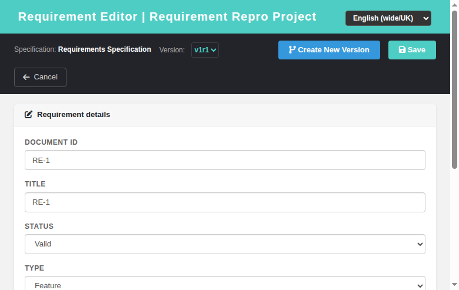

# Requirement Editor (reqEdit) — Modernized Screen

Modernization of **Requirement Editor** (`lib/requirements/reqEdit.php`) — GitHub
issue [#798](https://github.com/sebiboga/testlink-upgraded/issues/798).

The legacy Smarty screen is replaced by a standalone Dashio page
(`gui/templates/requirements/reqEdit.html`) backed by a plain-PHP REST BFF
(`api/reqedit/index.php`). This is a non-ASIDE screen reached as a popup from the
modernized **Search → Advanced (full text)** results — the `openReqEdit` link was
switched from the legacy `reqEdit.php` to the new HTML screen.

**URL:** `gui/templates/requirements/reqEdit.html?id=<requirement_id>&tproject_id=<id>` (edit)
or `gui/templates/requirements/reqEdit.html?spec_id=<spec_node_id>&tproject_id=<id>` (create)
**BFF API:** `api/reqedit/index.php`
**Rights:** `req_view` (view) / `req_mgmt` (manage) enforced server-side on every route
(same as legacy `checkRights()`).

---
## Table of Contents
1. [What the screen does](#1-what-the-screen-does)
2. [REST API Reference](#2-rest-api-reference)
3. [Legacy parity notes](#3-legacy-parity-notes)
4. [i18n Keys](#4-i18n-keys)
5. [Security](#5-security)
6. [Testing](#6-testing)

## 1. What the screen does

| Feature | Legacy behavior | Modern implementation |
|---|---|---|
| Mode (edit / create) | `requirement_id` vs `req_spec_id` URL args | `id=` opens edit, `spec_id=` opens create; header shows spec title + latest version chip |
| Specific version editing (edit) | `reqEdit.php?doAction=edit&requirement_id=N&req_version_id=VID` loads and edits THAT exact version (used by the legacy reqViewVersionsViewer 'Edit' submit); without `req_version_id` → latest version | **same (added in #1382)** — `req_version_id` / `version_id` URL arg deep-links into the exact version; the BFF `form` returns the selected version deterministically plus the full `versions` list; the editor shows a **`Select version`** dropdown when the requirement has multiple versions (frozen marked `*`); saving targets the selected version |
| Document ID | required `req_doc_id` (created as child revision node) | same; validation blocks save when empty |
| Title | required text | same; validation |
| Status | `char(1)` status code (D/R/F/I/V/O/N/...) | same; mapped to human label on load/save |
| Type | `char(1)` type code (V/R/...) | same; dropdown of 7 types |
| Expected coverage | 1/2/3/5/10 | same dropdown |
| Scope | description textarea | same |
| Scope template on create | `renderGui()` default branch pre-fills the Scope editor with the configured `requirement_template` content (`getItemTemplateContents('requirement_template','scope',…)` in lib/functions/common.php:1104 — types `string` / `string_id` / `file`, `none` → empty) | **same (added in #1381)** — the BFF create `form` response resolves the same legacy function and returns the body as `requirement.scope` AND `template_body`; the screen pre-fills the textarea on create and re-applies it after a stay_here bulk-entry reset; edit mode never applies the template (legacy parity) |
| Save | `doAction=save` → update/create revision | `POST ?action=save`; on create, builds `nodes_hierarchy` + `requirements` + first `requirements_revisions` row and switches to edit mode |
| Create another after saving (create) | `stay_here` checkbox ("check to create another requirement after saving", BUGID 3953 — create mode only) | **same (added in #1384)** — `stay_here` checkbox in the toolbar, create mode only; when checked the save resets the form (doc id/title/scope empty, status/type/coverage at defaults) and keeps the caller in create mode on the same spec for bulk entry; when unchecked the form transitions to edit mode for the created requirement |
| Create New Version (edit) | `doAction=doCreateVersion` typewriter copy | `POST ?action=version` — copies content, bumps `version` (+1) |
| Cancel | return to caller | returns without any DB write |

## 2. REST API Reference

All routes are session-authenticated and JSON; CSRF Origin header required.

| Method | Route | Body / Query | Returns |
|---|---|---|---|
| GET | `?action=form&id=N` | `tproject_id`, optional `version_id`/`req_version_id` | `{mode:'edit', requirement, versions[], show_version_selector, options, tproject_id, tproject_name, rights}` — requirement includes `version_id` and `is_latest`; `versions[]` = {version_id, version, revision, status, is_open} |
| GET | `?action=form&spec_id=N` | `tproject_id` | `{mode:'create', spec_title, versions:[], show_version_selector:false, tproject_id, tproject_name, options, rights}` — create mode also returns `template_body` (the configured `requirement_template` scaffold, `''` when type is `none`) and pre-fills `requirement.scope` with it (see #1381) |
| POST | `?action=save` | `{id?, spec_id?, tproject_id, doc_id, title, status, type, scope, expected_coverage, version_id?, stay_here?}` | `{status:'ok', id, version_id, stay_here}` (update or create) — `version_id` targets THAT exact requirement version, absent → latest |
| POST | `?action=version` | `{id, tproject_id, ...fields}` | `{status:'ok', version}` (create new version) |

### Error conditions
- Missing/invalid session → HTTP 401.
- `tproject_id` missing → 400.
- Missing required field (doc_id/title) → `{status:'error', message}`.
- No `req_view` right → 403 on form; no `req_mgmt` → 403 on save/version.

On success the screen hides the error bar and (after create/version) refreshes the
form with the new id/version.

## 3. Legacy parity notes

- The editor uses the **`req_specs`** table (not `requirement_specs`) and reads the
  spec title from `nodes_hierarchy`/`req_specs_revisions` (spec node name).
- Status/type are stored as single-char codes; the BFF maps between the char code
  and the human label using the same `tl` localization keys as legacy.
- On **create**, the requirement node + `requirements` row + first
  `requirements_revisions` row are created in one transaction, mirroring the
  legacy `doCreate` flow.
- **Per-version editing (#1382):** mirrors the legacy `reqEdit.php` contract —
  `get_by_id(id, version_id)` loads the exact version when given
  (`lib/requirements/reqCommands.class.php:181`) and `update(id, version_id, ...)`
  targets it (`reqCommands.class.php:343`). The modern BFF implements the same
  contract: `form` picks the requested `req_version_id` (validated) or falls back
  to the latest; `save` writes through `requirement_mgr::update(reqId, versionId, ...)`
  which directly updates that `req_versions` row. The version selector follows the
  existing `reqView.html` pattern (`v<version>r<revision>`, ` *` for frozen).
- **Requirement template on create (#1381):** mirrors `renderGui()`'s default
  branch (`lib/requirements/reqEdit.php:166`). The BFF reuses the exact legacy
  resolver `getItemTemplateContents('requirement_template','scope','')`
  (lib/functions/common.php:1104) — same `string` / `string_id` (`lang_get`)
  / `file` (`getFileContents`, already in scope via `requirement_mgr.class.php:18`
  → `attachments.inc.php` → `files.inc.php`) / `none` resolution and the same
  missing-file fallback message. `template_body` is exposed so the SPA can
  re-apply the scaffold after a stay_here bulk-entry reset; the value is also
  written into `requirement.scope` so the editor opens pre-filled exactly like
  legacy (saving without touching the field persists the template as the scope).

## 4. i18n Keys

All labels are client-side via `TLi18n`; keys under the `reqe.` namespace
(`reqe.pageTitle`, `reqe.title`, `reqe.docId`, `reqe.status`, `reqe.type`,
`reqe.expectedCoverage`, `reqe.scope`, `reqe.save`, `reqe.cancel`,
`reqe.newVersion`, `reqe.stayHere`, `reqe.spec`, `reqe.version`,
`reqe.versionSelect`, `reqe.detailHeader`, and
validation/toast messages). Present in all 10 bundles
(`en ro de es fr it ja pt ru zh`).

## 5. Security

- Server-side rights check on every route: `req_view` required even to read the
  form; `req_mgmt` required for save/version.
- CSRF guarded via Origin header check (all BFF routes).
- Output is HTML-escaped in the client before insertion; DB writes use prepared
  statements.

## 6. Testing

See **Suite 66 — Requirement Editor (reqEdit)** in `tmp/TLU_Test_Cases.md`
(12/12 PASS): edit mode, create mode, validation, create, save persist,
Create New Version, BFF rights, no-permission, cancel, i18n integrity, legacy
link switch, and Event Viewer cleanliness.

See also **Task #1384 — stay_here create-another** suite (10/10 PASS): checkbox
visible/checked in create mode, bulk entry resets the form on same spec, unchecked
save transitions to edit mode, edit mode hides the checkbox, BFF echoes
`stay_here`, i18n `reqe.stayHere` in all 10 bundles, Event Viewer + console clean.

See also **Task #1382 — per-version editing** suite (11/11 PASS): deep-link into a
specific version via `req_version_id`, latest-version default, version selector
shown for multi-version requirements and hidden for single-version ones, selector
switch reloads the chosen version, save targets the selected version only (other
versions untouched), save without `version_id` targets latest, create regression,
invalid `version_id` → 404, BFF payload shape (`version_id`, `is_latest`,
`versions[]`, `show_version_selector`), Event Viewer + console clean.

See also **Task #1381 — requirement-template scope prefill** suite (10/10 PASS):
BFF create form resolves `requirement_template` for types `string` / `string_id`
(`lang_get`) / `file` (file contents + missing-file fallback) / `none` (empty),
exposes `template_body`, the create screen pre-fills the Scope textarea on load,
edit mode stays template-free, stay_here reset re-applies the scaffold, saved
scope persists the template body, Event Viewer + console clean.

See also **Task #1380 — unsaved-changes warning** suite (8/8 PASS): the modern
screen now installs the legacy `checkmodified.js` `beforeunload` guard (BUGID 4153
parity). Dirty edits to any field (`scope`, `title`, doc id, `status`, `type`,
expected coverage) flip `content_modified` and navigating away / closing the page
fires the native "You have unsaved changes. Are you sure you want to leave?"
confirmation. Save success and the Cancel button suppress the warning (a deliberate
navigation), and `loadForm()`/version-switch reloads reset the dirty flag so
programmatic filling never warns. i18n key `reqe.unsavedWarning` added to all 10
client locale bundles (native translations, same text as `tcedit.unsavedWarning`).
Event Viewer + console clean.
