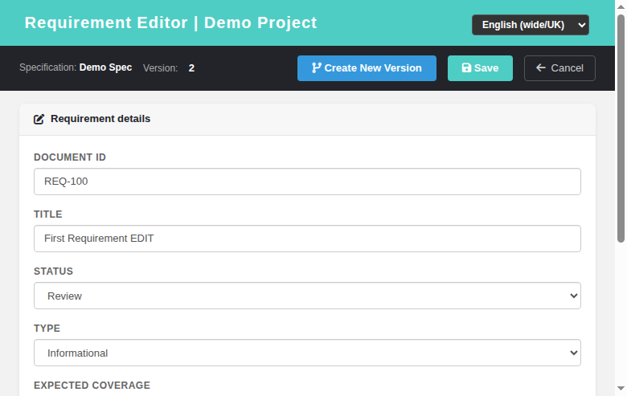

# Requirement Editor (reqEdit) — Modernized Screen

Modernization of **Requirement Editor** (`lib/requirements/reqEdit.php`) — GitHub
issue [#798](https://github.com/sebiboga/testlink-upgraded/issues/798).

The legacy Smarty screen is replaced by a standalone Dashio page
(`gui/templates/requirements/reqEdit.html`) backed by a plain-PHP REST BFF
(`api/reqedit/index.php`). This is a non-ASIDE screen reached as a popup from the
modernized **Search → Advanced (full text)** results — the `openReqEdit` link was
switched from the legacy `reqEdit.php` to the new HTML screen.

**URL:** `gui/templates/requirements/reqEdit.html?id=<requirement_id>&tproject_id=<id>` (edit)
or `gui/templates/requirements/reqEdit.html?spec_id=<spec_node_id>&tproject_id=<id>` (create)
**BFF API:** `api/reqedit/index.php`
**Rights:** `req_view` (view) / `req_mgmt` (manage) enforced server-side on every route
(same as legacy `checkRights()`).

---
## Table of Contents
1. [What the screen does](#1-what-the-screen-does)
2. [REST API Reference](#2-rest-api-reference)
3. [Legacy parity notes](#3-legacy-parity-notes)
4. [i18n Keys](#4-i18n-keys)
5. [Security](#5-security)
6. [Testing](#6-testing)

## 1. What the screen does

| Feature | Legacy behavior | Modern implementation |
|---|---|---|
| Mode (edit / create) | `requirement_id` vs `req_spec_id` URL args | `id=` opens edit, `spec_id=` opens create; header shows spec title + latest version chip |
| Document ID | required `req_doc_id` (created as child revision node) | same; validation blocks save when empty |
| Title | required text | same; validation |
| Status | `char(1)` status code (D/R/F/I/V/O/N/...) | same; mapped to human label on load/save |
| Type | `char(1)` type code (V/R/...) | same; dropdown of 7 types |
| Expected coverage | 1/2/3/5/10 | same dropdown |
| Scope | description textarea | same |
| Save | `doAction=save` → update/create revision | `POST ?action=save`; on create, builds `nodes_hierarchy` + `requirements` + first `requirements_revisions` row and switches to edit mode |
| Create New Version (edit) | `doAction=doCreateVersion` typewriter copy | `POST ?action=version` — copies content, bumps `version` (+1) |
| Cancel | return to caller | returns without any DB write |

## 2. REST API Reference

All routes are session-authenticated and JSON; CSRF Origin header required.

| Method | Route | Body / Query | Returns |
|---|---|---|---|
| GET | `?action=form&id=N` | `tproject_id` | `{mode:'edit', requirement, options, tproject_id, tproject_name, rights}` |
| GET | `?action=form&spec_id=N` | `tproject_id` | `{mode:'create', spec_title, tproject_id, tproject_name, options, rights}` |
| POST | `?action=save` | `{id?, spec_id?, tproject_id, doc_id, title, status, type, scope, expected_coverage}` | `{status:'ok', id}` (update or create) |
| POST | `?action=version` | `{id, tproject_id, ...fields}` | `{status:'ok', version}` (create new version) |

### Error conditions
- Missing/invalid session → HTTP 401.
- `tproject_id` missing → 400.
- Missing required field (doc_id/title) → `{status:'error', message}`.
- No `req_view` right → 403 on form; no `req_mgmt` → 403 on save/version.

On success the screen hides the error bar and (after create/version) refreshes the
form with the new id/version.

## 3. Legacy parity notes

- The editor uses the **`req_specs`** table (not `requirement_specs`) and reads the
  spec title from `nodes_hierarchy`/`req_specs_revisions` (spec node name).
- Status/type are stored as single-char codes; the BFF maps between the char code
  and the human label using the same `tl` localization keys as legacy.
- On **create**, the requirement node + `requirements` row + first
  `requirements_revisions` row are created in one transaction, mirroring the
  legacy `doCreate` flow.

## 4. i18n Keys

All labels are client-side via `TLi18n`; keys under the `reqe.` namespace
(`reqe.pageTitle`, `reqe.title`, `reqe.docId`, `reqe.status`, `reqe.type`,
`reqe.expectedCoverage`, `reqe.scope`, `reqe.save`, `reqe.cancel`,
`reqe.newVersion`, `reqe.spec`, `reqe.version`, `reqe.detailHeader`, and
validation/toast messages). Present in all 10 bundles
(`en ro de es fr it ja pt ru zh`).

## 5. Security

- Server-side rights check on every route: `req_view` required even to read the
  form; `req_mgmt` required for save/version.
- CSRF guarded via Origin header check (all BFF routes).
- Output is HTML-escaped in the client before insertion; DB writes use prepared
  statements.

## 6. Testing

See **Suite 66 — Requirement Editor (reqEdit)** in `tmp/TLU_Test_Cases.md`
(12/12 PASS): edit mode, create mode, validation, create, save persist,
Create New Version, BFF rights, no-permission, cancel, i18n integrity, legacy
link switch, and Event Viewer cleanliness.
