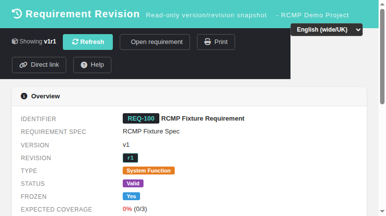
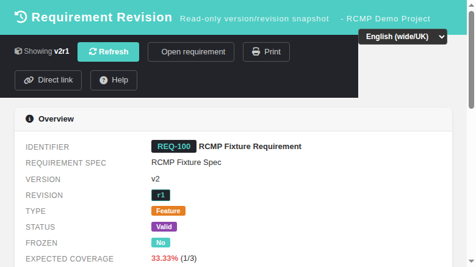
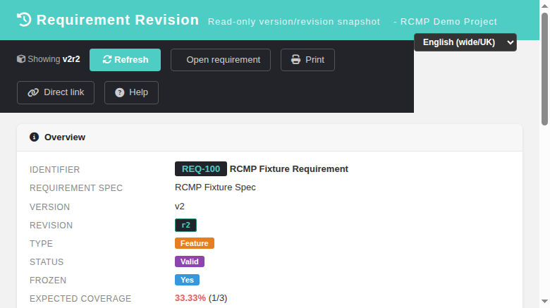
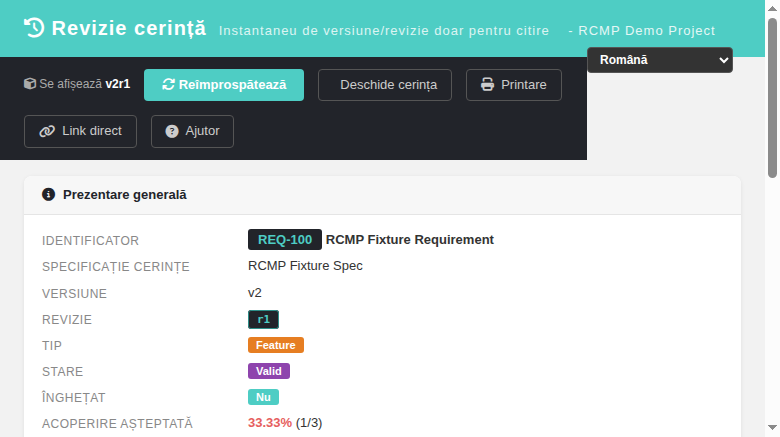

# Requirement Revision Viewer (reqViewRevision) — Modernized Screen

Modernization of the legacy **Requirement Revision / Version** read-only
viewer — GitHub issue
[#1435](https://github.com/sebiboga/testlink-upgraded/issues/1435).

The legacy screen (`lib/requirements/reqViewRevision.php`) is a read-only
popup that shows an immutable snapshot of a **requirement VERSION** or a
**requirement REVISION** (resolved from a `nodes_hierarchy` item_id), reached
today via the `openReqRevisionWindow()` helper in
`gui/javascript/testlink_library.js` (requirement revision logs, version
compare navigation). It was the last standalone legacy requirements screen
with no Dashio replacement, and it also HTTP 500'd in the dashio theme
(missing `displayReqCoverageRO.inc.tpl`, issue #1427).

In 2.0.1 the snapshot is served by a new BFF endpoint and rendered by a
standalone Dashio page.

**URL:** `gui/templates/requirements/reqRevisionView.html?item_id=<version-or-revision-node-id>`
**BFF API:** `api/reqrevision/index.php?action=revision&item_id=<id>[&show_req_spec_title=1]`
**Rights:** `mgt_view_req` on the **OWNING** test project (modern parity — the
legacy controller gated the SESSION project only).

## What it does

| Feature | Legacy behavior | Modern implementation |
|---|---|---|
| Entry point | `openReqRevisionWindow(item_id)` → `reqViewRevision.php?item_id=` popup | `openReqRevisionWindow()` (`testlink_library.js:1625`) and `$actions->reqRevisionView` (`common.php:2052`) open `reqRevisionView.html?item_id=` |
| Node resolution | `get_available_node_types()` — `requirement_version` (8) / `requirement_revision` (10) | BFF resolves the same node kinds (`tree_mgr`), then `get_version()` / `get_revision()` |
| Attributes | req doc id, title, version/revision, type/status labels, scope, author, timestamps, frozen flag | same fields in an **Overview** card (id chip, `vN`/`rN` badges, type/status/frozen badges) |
| Spec context | spec title + doc id (optional `show_req_spec_title`) | `REQUIREMENT SPEC` row + owning test project in the header |
| Coverage | `getActiveForReqVersion()` linked TCs table | link list as a DataTable (`tc external id`, name → TC viewer popup, version); expected-coverage % vs actual (`33.33% (1/3)`), obsolescence `*` marker |
| Custom fields | `get_linked_cfields(null, item_id, tid)` populated design CF values | **Custom Fields** card with `cfield_mgr::custom_field_types` date/datetime formatting |
| Direct link | — | **Direct link** toolbar button → `/linkto.php?item=req&id=<req_doc_id>` with one-click Copy + toast |
| Print | legacy print helpers | **Print** → `printReq.html?req_id=&req_version_id=&req_revision=&tproject_id=` (revision-aware) |
| Open requirement | — | **Open requirement** → `reqView.html?id=&version_id=&tproject_id=` popup |
| Locale | PHP `$g_lang` | client-side `TLi18n`, keys under `reqv.*` (40 keys × 10 bundles) |

## REST API Reference

Session-authenticated JSON (`bffSameOriginGuard` + CSRF proof, safe GET).

| Method | Route | Query | Returns |
|---|---|---|---|
| GET | `?action=revision` | `item_id` (requirement version **or** revision node id), `show_req_spec_title` (default 1) | snapshot: `node_kind`, `tproject_id/name`, `req_id`, `req_doc_id`, `req_spec_title/doc_id`, `title`, `version`, `revision`, `version_id`, `revision_id`, `status_code/label`, `type/label`, `scope`, `is_open`, `expected_coverage`, `author`, `modifier`, timestamps, `expected_coverage_mgmt`, `cf_values` (object), `coverage` (array), `coverage_qty`, `coverage_pct`, `grants.req_mgmt` |

### Error conditions
- Missing/invalid session → HTTP 401.
- Non-GET verb → HTTP 405.
- Missing/invalid `item_id` → HTTP 400.
- Unknown node / not a requirement version-revision node → HTTP 404.
- No `mgt_view_req` on the owning project → HTTP 403.

## Legacy parity notes

- 1:1 port of `initialize_gui()` from `reqViewRevision.php`: node-kind switch,
  `get_version()` / `get_revision()`, `getActiveForReqVersion()` coverage,
  `get_linked_cfields()` with node-id access key.
- Revision rows keep `req_version_id` → coverage/cfields are queried against
  the same underlying `req_version_id` the legacy screen used.
- Frozen = `is_open == 0` rendered as `Yes` badge (legacy `is_open` semantics).
- Expected-coverage percentage only shown when
  `req_cfg->expected_coverage_management` is enabled (legacy gate).

## Screenshots

## Test suite

Suite **#1435** — 20/20 PASS, recorded in `tmp/TLU_Test_Cases.md`.

## Event Viewer

No new Error/Warning rows generated by the BFF or screen flows
(`events` table clean); console shows only the DataTables search-input
a11y hint, no JS errors.