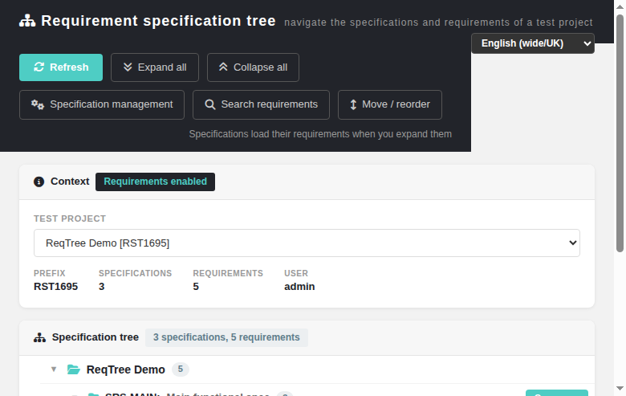
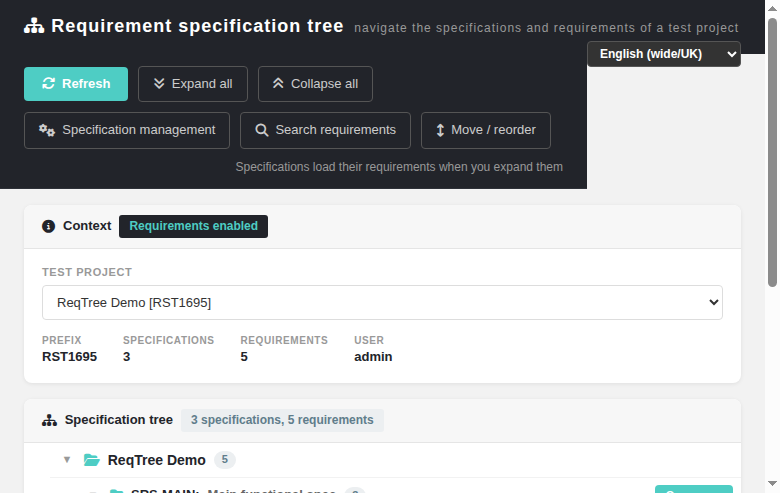
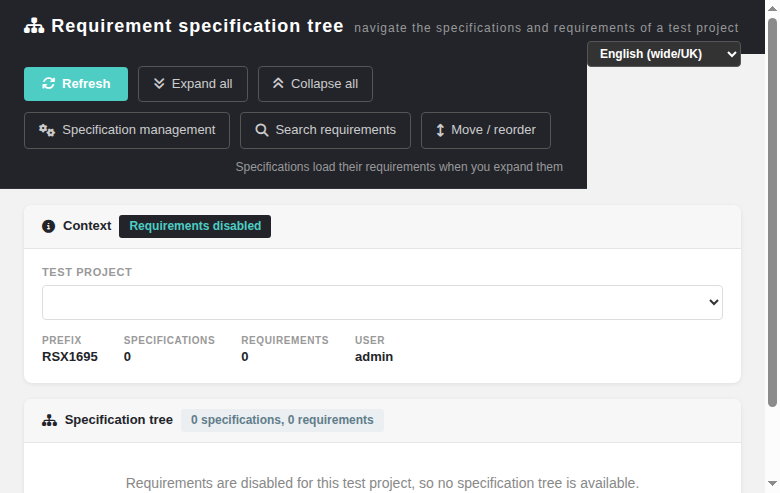
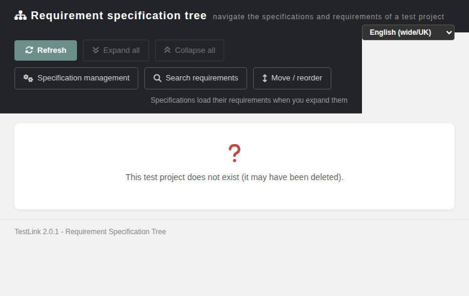
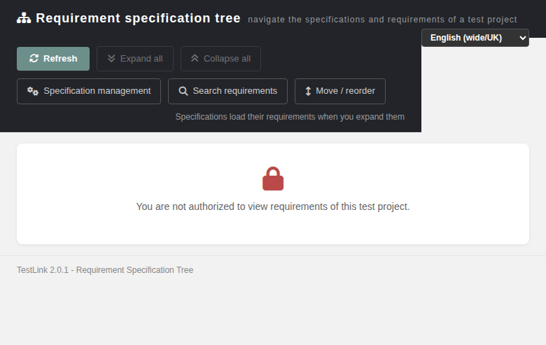
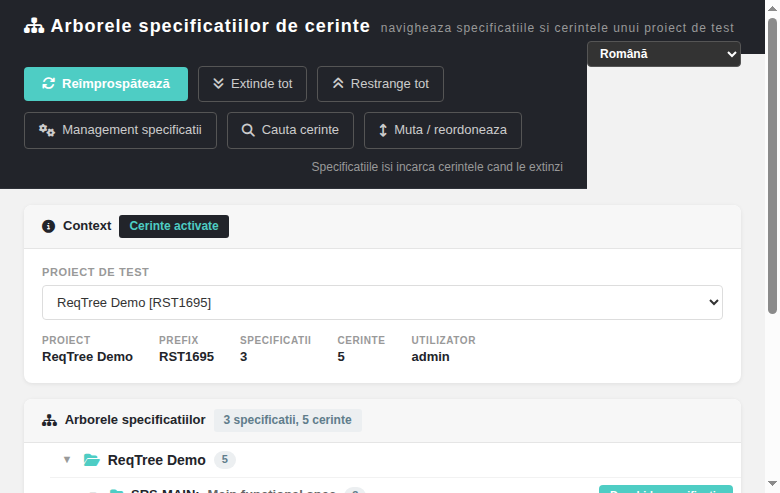

# Requirement Specification Tree (reqSpecListTree) Modernized — docs mirror

> Docs mirror of the wiki page
> **`Requirement-Specification-Tree-Modernized.md`** (Refs
> [#1695](https://github.com/sebiboga/testlink-upgraded/issues/1695), bugs
> [#1696](https://github.com/sebiboga/testlink-upgraded/issues/1696) /
> [#1697](https://github.com/sebiboga/testlink-upgraded/issues/1697)). Same
> content as the wiki; kept in sync with `tmp/wiki-repo/` + `docs/` ledger +
> `CHANGELOG` per the ASIDE-parity workflow.

Modernization of the **requirement specification tree navigator** — the ExtJS
`test project -> specification -> requirement` frame of 1.9.20. The legacy
controller was `lib/requirements/reqSpecListTree.php` (84 lines), which built the tree with
`tlRequirementFilterControl::build_tree_menu()` and rendered
`gui/templates/dashio/requirements/reqSpecListTree.tpl`
(`inc_head.tpl` + `inc_ext_js.tpl` + `treebyloader.js`), lazy-loading every level from
`lib/ajax/getrequirementnodes.php`.

| Feature | Legacy (1.9.20) | Modernized (2.0.1) |
|---|---|---|
| Screen | `lib/requirements/reqSpecListTree.php` + `reqSpecListTree.tpl` (ExtJS frame) | `gui/templates/requirements/reqSpecListTree.html` |
| BFF | none (Smarty + ExtJS store) | `api/reqspectreelist/index.php` (`init` / `children` / `projects`) |
| Lazy loader | `lib/ajax/getrequirementnodes.php` — **no rights check at all** (#1696) | `GET …?action=children`, rights + ownership proven before any lookup |
| Project selection | always the **session** project | readable project switcher (deep-linkable `?tproject_id=`) |
| Rights on read | **none** beyond being logged in | `mgt_view_req` **or** `mgt_modify_req` on the addressed project (403) |
| Ownership | **none** — `node=` accepted any `nodes_hierarchy.id` | every `node_id` proved to be a `node_type_id = 6` spec **of that project** (404) |
| Existence disclosure | n/a | rights checked **before** the existence lookup, so an unauthorized caller cannot enumerate project ids (#1697) |
| Wording | a `Read-only` label printed unconditionally | a real banner driven by `mgt_modify_req` (`grant.modify` in the `init` payload), shown only to a caller who may view but not modify, with the **Move / reorder** link `aria-disabled` and inert |
| Requirement counts | the denormalised `req_specs_revisions.total_req` | computed live from the requirement rows parented by the specification (the #1681 lesson) |
| Locale | server `strings.txt` | `rstl.*` (43 keys) + `footers.reqSpecListTree` in all 10 TLi18n bundles, per-screen switcher |
| Entry point | not linked from the ASIDE menu | ASIDE **Requirements Design** entry + `$actions->reqSpecListTree`; the legacy controller is now a session-guarded **302 shim** |

---
## 1. What the screen does

* **Context card** — test project, prefix, live specification count, live requirement count, the
  current user and a `Requirements enabled` / `Requirements disabled` chip read from
  `testprojects.option_reqs`.
* **Test-project switcher** — every requirement-enabled project the caller may read, sorted by
  name, `name [PREFIX]`, `*` marking a project that is not active. The legacy frame always used the
  session project; here the screen is fully deep-linkable with `?tproject_id=`. A project that
  cannot be listed (requirements disabled, or no right on it) is appended as `Current project #N`
  and its name stays readable in the context card, so the selection is never silently empty.
* **Lazy tree** — project -> requirement specification (`doc_id:` + title + live count) ->
  requirement (`doc_id:` + title + status badge). Specifications fetch their requirements from the
  BFF on the first expand, exactly like the ExtJS lazy loader, and the fetched children are cached
  so a collapse/expand round-trip costs no request.
* **Toolbar** — Refresh, Expand all, Collapse all, Specification management, Search requirements,
  Move / reorder, plus a read-only banner that appears when the caller holds `mgt_view_req`
  without `mgt_modify_req` (the **Move / reorder** link is then `aria-disabled` and inert).
* **State cards** — no project, access denied, not found, invalid request, read-only method and
  server error, each with its own icon and a localized sentence. The machine code is *not* shown
  to the user; it goes to `console.warn` so a support case can be correlated with the BFF log.
* **Locale switcher** — the standard `TLi18n` one, driven by `/api/userinfo/locales`.
* **Deep links** — every specification and requirement row has an *Open spec* / *Open requirement*
  button that opens `reqSpecView.html` / `reqView.html` in a new tab, the same convention as
  `reqBulkMon.html` and `reqCopy.html`.

## 2. Legacy behaviour that had to be reimplemented

`tlRequirementFilterControl::build_tree_menu()` (the legacy tree builder) produced:

1. a single root node for the **current** test project;
2. one child per requirement specification, labelled `doc_id: title` plus a requirement count;
3. one child per requirement under the expanded specification, labelled `doc_id: title` plus the
   localized **status** label;
4. ordering by `nodes_hierarchy.node_order ASC, id ASC` at every level.

All four are reproduced by the BFF, and the counts are computed from the same
`req_specs → requirement node` walk so the modern tree shows what the legacy tree showed.

## 3. The security change (the important part)

`lib/ajax/getrequirementnodes.php` — the lazy loader of the legacy screen — called
`testlinkInitPage($db, false, false)` (no `$initAuth`) and then resolved whatever the caller
passed. It answered:

* `root_node=<any test project id>` with that project's specification doc_ids and titles, and
* `node=<any nodes_hierarchy.id>` with that node's requirement children.

There was no `mgt_view_req` / `mgt_modify_req` check and no proof that the node belonged to the
caller's project, so **any authenticated user could read the requirement identifiers, titles and
structure of every test project** and walk the whole node hierarchy. Reported as **#1696**; the
loader is now unreferenced, and the screen it served is a 302 shim onto the BFF-protected page.

The BFF (`api/reqspectreelist/index.php`) enforces, in this order:

1. `initAuth` (401 `session_expired` for a dead session) and the same-origin guard;
2. `mgt_view_req` **or** `mgt_modify_req` on the addressed project — **before** the project is
   resolved, so an unauthorized caller gets `403 no_right` for a real *and* a bogus project id and
   therefore cannot enumerate projects (**#1697**);
3. for `children`, `node_id > 0` and the node proved to be a `node_type_id = 6` requirement
   specification whose `req_specs.testproject_id` equals the requested project — a foreign
   specification and a bogus id both answer `404 req_spec_not_found`, so there is no node oracle
   either.

## 4. BFF contract

Base: `http://localhost:8082/api/reqspectreelist/index.php`. All calls are `GET` with
`X-Requested-With: XMLHttpRequest` and same-origin credentials.

| Action | Params | 200 payload | Errors |
|---|---|---|---|
| `init` | `tproject_id` | `context` (name, prefix, `requirements_enabled`, spec + requirement counts, `user_login`, `grant.modify`) + `specs[]` | `400 invalid_tproject`, `403 no_right`, `404 tproject_not_found`, `405 wrong_method` |
| `children` | `tproject_id`, `node_id` | `children[]` (id, `req_doc_id`, title, `node_order`, `status`) | `400 invalid_req_spec`, `403 no_right`, `404 tproject_not_found` / `req_spec_not_found` |
| `projects` | – | `projects[]` (id, name, prefix, active, is_current) + `session_tproject_id` | `401` |

`requirements_enabled` comes from `testprojects.option_reqs`; when it is off the screen shows the
disabled empty state and never lists the project in the switcher.

## 5. Data model gotchas found while building it

* `nodes_hierarchy` has **no `testproject_id` column** in 2.0.1 (confirms #1660) — project
  ownership of a specification must be read from `req_specs.testproject_id`, and project names from
  the project manager, not from the hierarchy.
* The requirement **data** (`req_doc_id`, `title`, `status`) lives on the requirement's *revision*
  row, reached by joining the requirement node with its `node_type_id = 8` version child — the same
  join the legacy loader used.
* `hasRight()` may return the **string** `'yes'`, so the `grant.modify` flag in the `init` payload
  is normalized to a real boolean before it is JSON-encoded.
* `req_versions.status` / `.type` are `char(1)` (`V`, `D`, `O`, …) under a strict `sql_mode`;
  passing full words raises `Data too long for column 'status'`.

## 6. i18n

`rstl.*` (44 keys) + `footers.reqSpecListTree` in **all 10** TLi18n bundles (`de`, `en`, `es`,
`fr`, `it`, `ja`, `pt`, `ro`, `ru`, `zh`) with real translations, plus a new server label
`TLS_href_req_spec_tree` ("Requirement Specification Tree") in **all 19** locale bundles for the
ASIDE entry — with only 11/19 `lang_get()` fell back to `en_GB` and logged an L18N warning event
per session in the other 8. The `rstl.status_*` keys reuse the requirement-status vocabulary already used by
`reqSpecView.html`.

## 7. Tests

Suite 1695 in `tmp/TLU_Test_Cases.md`: **51 cases, 51 PASS** on the delivered code, plus one case
(1695-43) that reproduces the legacy read hole and is filed as **#1696**. Six cases are regression
proofs for the defects found during the pass:

* 1695-5 / 1695-24 — the screen's local `t()` wrapper dropped its params bucket, so
  `TLi18n.t()` never interpolated and the chip rendered the raw
  `{specs} specifications, {reqs} requirements`; the state card also printed the machine code and
  the generic error branch showed the BFF's English message. Fixed in `bd8c85225`.
* 1695-40 — the pre-fix BFF answered `404 tproject_not_found` for a non-existent project and
  `403 no_right` for an existing one, which enumerated every project id in the installation.
  Fixed in `8cc36b712` (**#1697**).
* 1695-13 / 1695-18 — **Collapse all** only folded the project root (the per-specification expand
  flags survived, so the tree re-opened by itself) and **Refresh** emptied the children cache while
  keeping the expand flags, so a 3-requirement specification was painted as an empty one.
* 1695-19 — the **Search requirements** button pointed at `reqSearch.html`, which does not exist
  (404); the screen is `searchReq.html`.
* 1695-47 — after a `403`/`404` the project switcher was disabled, a dead end in exactly the state
  where the caller has to reach a different project.
* 1695-50 — the 302 shim ignored `$_SESSION['basehref']`, so a sub-directory install was redirected
  off the document root.

**Event Viewer** after the pass: the only 3 `ERROR` entries are timestamped 13:57–13:58 and are the
two authoring mistakes of this session (`Unknown column 'NH.testproject_id'` from the first draft of
the BFF, and two `Data too long for column 'status'` from the first fixture run) — both fixed. There
is **no** `ERROR` and **no** `WARNING` entry after 13:58, i.e. the whole browser-test pass
(13:58 → 14:15) produced none.

## 8. Known limitations

* The tree navigator is **read-only**. The write gesture (move / re-parent / reorder) is
  `reqTreeReorder.html` (**#1681**), linked from the toolbar and gated on `mgt_modify_req`.
* `lib/ajax/getrequirementnodes.php` is dead code but still present and still unprotected — #1696
  stays open until it is deleted (or locked down if something outside this repository still calls
  it).
* **`child_requirements_mgmt` container children.** When that option is on, TestLink allows a
  *test project* node to be re-parented under a specification, and the requirements then hang off
  that container. The 1.9.20 lazy loader walked any child node type, so such a container — and the
  requirements below it — appeared in the old tree. This read-only navigator lists the requirements
  of the specification itself, so a container child is not shown. Tracked as a task issue.
* The requirement count on each specification is a live count; on a very large specification the
  `children` response can be big, but it is fetched only on the first expand and then cached.
