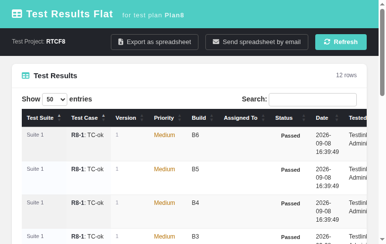
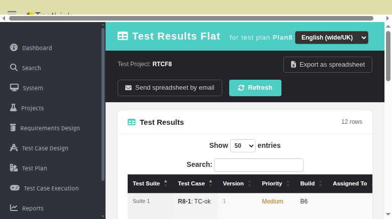

# Test Results Flat — Modernized Screen

The **Test Results Flat** report lists every execution row in the active test plan
in a flat spreadsheet-like format: one row per test case × build × platform,
with status, tester, date, notes, duration and execution type. It replaces the
legacy 1.9.20 `lib/results/resultsTCFlat.php` HTML view with a modern
Dashio-styled page backed by a plain-PHP REST BFF. The legacy XLS export
button is preserved as-is: it POSTs to the same legacy controller endpoint
(XLS generation stays in `lib/results/resultsTCFlat.php`).

**Path:** ASIDE menu → Reports → *Test Results Flat*
**URL:** `gui/templates/results/resultsTCFlat.html?tproject_id=<id>&tplan_id=<id>`
**BFF API:** `api/reports/index.php` — `GET ?action=results_flat&tproject_id=&tplan_id=`
**Rights:** `testplan_metrics` (same right the legacy controller enforces via
`checkRights()` through `resultsNavigator.php`; BFF returns 403 otherwise)
**Tracking issue:** [#685](https://github.com/sebiboga/testlink-upgraded/issues/685)

---

## Table of Contents

1. [Overview](#1-overview)
2. [Screen Layout](#2-screen-layout)
3. [Build Launcher (legacy parity)](#3-build-launcher-legacy-parity)
4. [Data Flow and Parity](#4-data-flow-and-parity)
5. [Toolbar Actions (legacy parity)](#5-toolbar-actions-legacy-parity)
6. [i18n](#6-i18n)
7. [Permission Path and Empty State](#7-permission-path-and-empty-state)
8. [BFF API Reference](#8-bff-api-reference)
9. [Files](#9-files)

---

## 1. Overview

The screen renders every execution in the plan as a single flat DataTable row,
giving testers and managers a complete spreadsheet-style view of results across
all builds and platforms. The DataTable provides built-in search, pagination
(50 rows per page) and column sorting.

## 2. Screen Layout

| Section | Description |
|---------|-------------|
| **Header** | Teal Dashio header "Test Results Flat — for test plan X" with locale switcher |
| **Toolbar** | Dark bar: test project context, *Export as spreadsheet* (BFF gateway, legacy XLS), *Send spreadsheet by email*, *Refresh* |
| **Launcher** | Shown only when active builds exceed the configured `buildQtyLimit`; multi-select of builds with *Apply Filter* button |
| **Report table** | White card with DataTable: Test Suite, Test Case (TC prefix + name), Version, Platform (when enabled), Priority (when enabled), Build, Assigned To, Status (color-coded badge), Date, Tested By, Notes, Duration, Exec Type |
| **Footer** | Legacy `info_gen_test_rep` description line + "Generated on \<timestamp\> · Processing time (seconds): n" |

## 3. Build Launcher (legacy parity)

When the number of active builds exceeds `resultMatrixReport.buildQtyLimit`,
the BFF returns `need_selection: true` and the screen renders a build-selector
launcher. The user multi-selects builds (Ctrl/Cmd + click) and clicks *Apply
Filter*. The selected build IDs are passed as `build_set[]` query parameters
back to the BFF, exactly matching the legacy `setUpBuilds()` guard in
`lib/results/resultsTCFlat.php`.

A warning banner is displayed when the active build count exceeds the limit,
showing the numeric counts.

## 4. Data Flow and Parity

The BFF calls the same engine method as the legacy controller:

1. `tlTestPlanMetrics::getExecStatusMatrixFlat($tplanId, ['buildSet' => ...],
   $opt)` — produces the flat execution matrix with cumulative output mode,
   execution notes, tester, assigned user, timestamps and duration.
2. Empty `metrics` ⇒ `hasData:false` ⇒ screen shows the empty state.
3. Status labels are resolved server-side through `lang_get($cfgResults['status_label'][…])`.
4. Priority labels come from `config_get('urgency')['code_label']`, matching the
   legacy urgency-based display.
5. Execution type labels (`Manual` / `Automatic`) resolved server-side.
6. User names for Assigned To and Tested By resolved via
   `getUsersForHtmlOptions()` using the authenticated user instance (same PHP 8
   compatibility pattern as other modernized screens).
7. Build names resolved from `testplan::get_builds()` active build set.

## 5. Toolbar Actions (legacy parity)

| Button | Behaviour |
|--------|-----------|
| Export as spreadsheet | Links to the BFF export gateway `/api/reportsexport/index.php?action=results_tc_flat&tplan_id=&tproject_id=` (303 → legacy XLS generator) with optional `buildListForExcel` and `build_set[]` when filtered |
| Send spreadsheet by email | Links to the BFF export gateway `/api/reportsexport/index.php?action=results_tc_flat_mail&tplan_id=&tproject_id=` (303 → legacy `resultsTCFlat.php` mail path). **Refs #1219 fix:** the legacy controller now honours `sendSpreadSheetByMail_x` — before the fix the mail action silently produced an XLS download instead of sending the email (resultsTCFlat.php's own `init_args()`/`createSpreadsheet()` did not route to `email_send_wrapper`; the `getSpreadsheetBy` flag is now detected and the spreadsheet is attached to an email addressed to the current user) |
| Refresh | Re-fetches the BFF payload and re-renders the DataTable |

## 6. i18n

All labels use the client-side `TLi18n` module with keys prefixed `rtf.` defined
in ALL 10 locale bundles (`gui/templates/i18n/*.json`: de, en, es, fr, it, ja,
pt, ro, ru, zh) plus shared `common.*` keys. The `rtf.header` mirrors the legacy
page title; DataTable language strings (search, pagination, info) are also
localized.

## 7. Permission Path and Empty State

* No session ⇒ HTTP 401 from the BFF.
* User without `testplan_metrics` (global role AND project context) ⇒ HTTP 403;
  the screen shows an "Insufficient rights" warning box. The gate matches the
  legacy `checkRights()` semantics: users holding the right ONLY through a
  per-project role pass, exactly like `hasRightOnProj()`.
* Plan without execution data ⇒ friendly empty state message.

### Public-link / API-key anonymous access (Refs #1220)

The modern screen reproduces the legacy apikey flow of `resultsTCFlat.php`
`init_args()`:

| apikey length | Legacy mode | Behaviour |
|---------------|-------------|-----------|
| 32 chars      | `setUpEnvForRemoteAccess()` | Request authenticated as the owning user; the same `testplan_metrics` gate applies |
| > 32 chars    | `setUpEnvForAnonymousAccess()` | Anonymous read-only access for the connected test plan / test project (`addOpAccess=false`, no rights check) |
| invalid / unknown | — | `401 {"error":"Unknown api key"}` |
| absent        | session login | unchanged session-only auth |

Public / shared links therefore work end-to-end with no session:

```
gui/templates/results/resultsTCFlat.html?tplan_id=9&apikey=<64-char-plan-key>
```

* The screen reads `apikey` from its own URL and forwards it to the BFF
  (`api/reports/index.php?action=results_flat&…&apikey=…`).
* The BFF mirrors the legacy split: 32-char user key vs. longer anonymous
  entity key, and (like `setUpEnvForAnonymousAccess`' `Refs #1021` fix) rebuilds
  `basehref` via `setPaths()` on fresh sessions so the follow-up legacy export
  request does not bounce to login.
* `export_xls_url` / `send_mail_url` keep the apikey, and the export gateway
  (`api/reportsexport`) accepts it **only** for `results_tc_flat` /
  `results_tc_flat_mail`; every other export/mail action still requires a
  session (401 otherwise). The gateway forwards the apikey to the legacy
  controller whose own `init_args()` re-runs its `setUpEnvFor*()` flow.
* Anonymous sessions get `$_SESSION['userID'] = -1` exactly as legacy; only the
  report payload/data renders — theme bootstrap endpoints
  (`api/userinfo` for the locale switcher) still 401 (cosmetic, report works).



## 8. BFF API Reference

`GET /api/reports/index.php?action=results_flat&tproject_id=<id>&tplan_id=<id>`

```json
{
  "status": "ok",
  "hasContext": true,
  "hasData": true,
  "tproject_id": 1, "tplan_id": 2,
  "tproject_name": "My Project", "tplan_name": "My Plan",
  "need_selection": false,
  "build_qty_limit": 5,
  "active_builds_qty": 3,
  "filter_applied": false,
  "show_platforms": true,
  "priority_enabled": true,
  "builds": [],
  "rows": [
    {
      "suite_name": "Login:Positive",
      "external_id": "PRJ-001",
      "tc_name": "Valid login",
      "version": 2,
      "build_name": "Build 1.0",
      "assigned_to": "John Doe",
      "status_code": "p",
      "status_label": "Passed",
      "exec_ts": "2025-06-15 10:30:00",
      "tester": "Jane Smith",
      "exec_notes": "All good",
      "exec_duration": "00:05:30",
      "exec_type": "Manual",
      "priority_level": 3,
      "priority_label": "High",
      "platform_name": "Linux"
    }
  ],
  "export_xls_url": "/api/reportsexport/index.php?action=results_tc_flat&tplan_id=2&tproject_id=1&buildListForExcel=1,2",
  "send_mail_url": "/api/reportsexport/index.php?action=results_tc_flat_mail&tplan_id=2&tproject_id=1&buildListForExcel=1,2",
  "elapsed_time": 0.12
}
```

Notes:
* `hasData:false` responses carry only the context fields.
* When `need_selection: true`, the response includes `builds` (list of
  `{id, name}`) and `legacy_url` instead of `rows`.
* Build-filtered requests pass `build_set[]` and `do_action=result` as query
  parameters.
* `export_xls_url` and `send_mail_url` both point to the BFF export gateway
  (`api/reportsexport`) which validates the session + `testplan_metrics` right
  then 303-redirects to the legacy controller for XLS generation / email send.
* With an `apikey`, `export_xls_url` / `send_mail_url` additionally carry
  `&apikey=<key>`; the rights pre-check is skipped for anonymous long keys
  (legacy `addOpAccess=false`).



## 9. Files

| File | Purpose |
|------|---------|
| `gui/templates/results/resultsTCFlat.html` | Modern Dashio screen |
| `api/reports/index.php` | `results_flat` action (BFF, `send_mail_url` Refs #1219 + apikey auth Refs #1220) |
| `api/reportsexport/index.php` | `results_tc_flat` / `results_tc_flat_mail` gateway |
| `lib/results/resultsTCFlat.php` | Legacy XLS generator + email-send path (`getSpreadsheetBy`, Refs #1219) |
| `lib/general/asideMenu.php` | Reports menu href switch (`link_report_test_flat`) |
| `gui/templates/i18n/*.json` | `rtf.*` keys in all 10 bundles |
