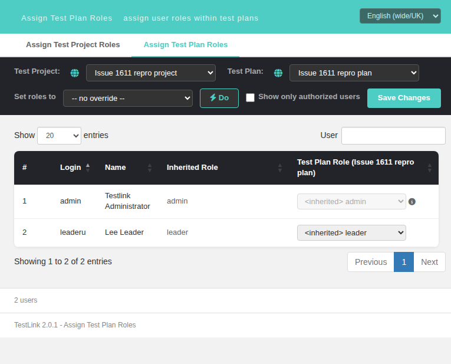

# Rights-gated tab bar in User & Role Management (issue #1611)

The four-tab bar at the top of the User Management / Role Management / Assign Test Project
Roles / Assign Test Plan Roles screens is now rendered **only** for the tabs the current user
actually holds the right for, exactly like legacy 1.9.20 did.

## Legacy reference

- Template (surviving file, still the canonical description of the tab contract):
  `gui/templates/dashio/usermanagement/tabsmenu.tpl:38-79`
- Grants source: `lib/usermanagement/usersAssign.php:119`
  `$gui->grants = getGrantsForUserMgmt($db, $args->user, $target->testprojectID, -1);`
- Helper: `lib/functions/users.inc.php:419-460` `getGrantsForUserMgmt()`

| legacy tab | legacy gate | right |
|---|---|---|
| User Management | `{if $grants->user_mgmt == "yes"}` (`tabsmenu.tpl:38`) | `mgt_users` |
| Role Management | `{if $grants->role_mgmt == "yes"}` (`:47`) | `role_management` |
| Assign Test Project Roles | `{if $grants->tproject_user_role_assignment == "yes"}` (`:58`) | `user_role_assignment` **or** `testproject_user_role_assignment` |
| Assign Test Plan Roles | `{if $grants->tplan_user_role_assignment == "yes"}` (`:74`) | `testplan_user_role_assignment` |

`getGrantsForUserMgmt()` also carries legacy's shortcut: a holder of `mgt_users` gets **both**
assign tabs (`users.inc.php:437-440`), so an admin sees all four and a `leader` (global role 9
— `user_role_assignment` + `testplan_user_role_assignment`, but **no** `mgt_users` and **no**
`role_management`) sees **only** the two assign tabs.

## The gap that was fixed

`gui/templates/usermanagement/usersAssignProject.html`, `usersAssignPlan.html` and
`rolesView.html` each built a **static four-element tab array with no grant check at all**, so
every user saw all four tabs and was bounced by the `denyBox` the moment one of the two
forbidden ones was clicked. Only `usersView.html` already gated correctly.

The two existing grants routes could not simply be reused: `/api/users/index.php/meta/grants`
is behind `mgt_users` and `/api/roles/index.php/meta/grants` falls through to the
`role_management` catch-all (`api/roles/index.php:402-403`), so **both** answer
`403 no_permissions_for_action` for exactly the user class this feature is about.

## Modern implementation

### BFF — `api/roles/index.php` (additive only)

The two assignment reads that are gated by the legacy `usersAssign.php:201-240` union
(`userCanAssignRoles()`) now ship the grants in their JSON envelope:

- `GET /api/roles/index.php/meta/tproject-roles` → `'grants' => getGrantsForUserMgmt($db, $currentUser, $tproject_id, -1)`
- `GET /api/roles/index.php/meta/tplan-roles` → same call

The `-1` plan scope and the **requested** `tproject_id` (not `$_SESSION['testprojectID']`) are
legacy's exact argument shape from `usersAssign.php:119`. No route gate was added, removed or
changed.

### Frontend — `gui/templates/usermanagement/usermgmt-tabs.js` (new)

`TLUmgmtTabs.render({selector, active, ctx, grants})` holds the single definition of the tab
contract: four rows in legacy order, each with the `getGrantsForUserMgmt()` property that
gates it and the modernized screen that replaces the legacy controller.
`TLUmgmtTabs.granted(grants, active)` exposes the same projection without touching the DOM.

### Screens

| screen | grants come from | tab source |
|---|---|---|
| `usersView.html` | `GET /users/index.php/meta/grants` (pre-existing) | `renderTabs()` delegates to the helper (behaviour unchanged) |
| `rolesView.html` | `GET /roles/index.php/meta/grants` (pre-existing) | `renderTabs(r.grants)` inside `loadGrants()` |
| `usersAssignProject.html` | `GET /roles/meta/tproject-roles` → `grants` | `renderTabs(r.grants)` on every load |
| `usersAssignPlan.html` | `GET /roles/meta/tplan-roles` → `grants` (all three reads) | `renderTabs(r.grants)` on project list, plan list and grid load |

Each screen draws the bar once up-front with **no** grants (so only its own tab is shown and
the bar never flashes links the user may not use), then redraws it as soon as the payload that
carries the flags arrives — mirroring legacy rebuilding `$gui->grants` on every render. The
grants are project-scoped, so the plan screen re-evaluates them when the Test Project combo
changes.

## Behavior matrix (measured)

| user | rights | `getGrantsForUserMgmt(·,101,-1)` | tabs drawn |
|---|---|---|---|
| `admin` (role 8) | all | `yes, yes, yes, yes` | **4** on every screen, correct one active |
| `leaderu` (role 9 `leader`) | `testplan_user_role_assignment`, `user_role_assignment` | `no, no, yes, yes` | **2** — the two assign tabs only |
| `planonly` (role 20) | `testplan_user_role_assignment` only | `no, no, no, yes` | 2 on the project screen (own + plan), 1 on the plan screen |
| `leaderu` on `usersView` / `rolesView` | needs `mgt_users` / `role_management` | – | deny box, bar hidden (pre-existing deny path) |

### Documented deviation from legacy

Legacy also hid the **current screen's own** tab when its grant was `no`, leaving the menu
with no `selected` entry at all. That state is reachable: `usersAssign.php:201-240` lets a
user holding only `testplan_user_role_assignment` open the **test project** assign screen,
where `getGrantsForUserMgmt()` answers `tproject_user_role_assignment = 'no'`. The helper keeps
the active tab visible in that case so the user still sees where they are; every *other* tab
is gated exactly like legacy.

## i18n

No new key was needed. The four labels (`tab.userManagement`, `tab.roleManagement`,
`tab.assignProjectRoles`, `tab.assignPlanRoles`) already existed in **all 10** bundles
(`de/en/es/fr/it/ja/pt/ro/ru/zh.json`), verified programmatically. Switching the locale combo to
*Română* re-renders the bar through the helper with the localized labels
(`Gestionare Utilizatori`, `Gestionare Roluri`, `Atribuire Roluri Proiect`,
`Atribuire Roluri Plan`).

## Verification

- Suite **1611** in `tmp/TLU_Test_Cases.md`: **29/29 PASS** — BFF payload assertions for two
  HTTP sessions plus the **rendered** `#tabsBar` of all four screens for three rights
  combinations, read through headless Chrome driven by chromedriver (the bar is built
  client-side, so the served HTML alone would be a vacuous assertion).
- `php -l api/roles/index.php`, `node --check usermgmt-tabs.js` and `node --check` on every
  extracted inline `<script>` block of the four screens: clean.
- Console clean as `admin`; only the 3 expected `403` resource errors on `rolesView` as
  `leaderu` (pre-existing deny path).
- Event Viewer: `events` count **176 → 176** across the three assignment reads — no new
  Error/Warning/Audit rows.

## Screenshot

Logged in as `leaderu` (global role 9 `leader` — no `mgt_users`, no `role_management`) on
`usersAssignPlan.html?tproject_id=101&tplan_id=1`: the bar offers only the two assign tabs,
pre-fix it offered all four.

## Related

- Pre-existing defect found while testing, filed separately and **not** fixed here:
  **#1778** — `E_WARNING Undefined array key "tplan"` at
  `lib/functions/tlUser.class.php:960`, triggered on every test-plan role assignment write by
  the 4-arg `hasRight()` in `api/roles/index.php:105`. Measured to be present before this
  change (`events` 137 → 137 / 138 → 138).
- Related fixes in this area: #1612, #1613, #1620, #1621, #1631, #1641, #1643, #1644, #1707.