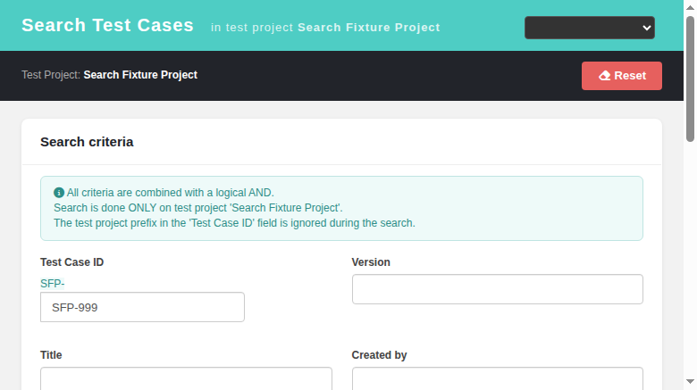
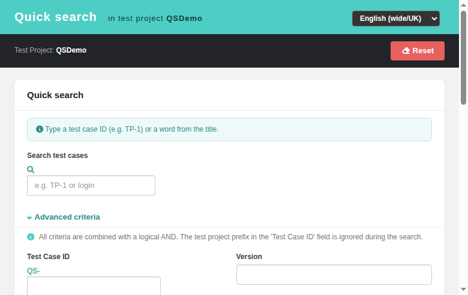
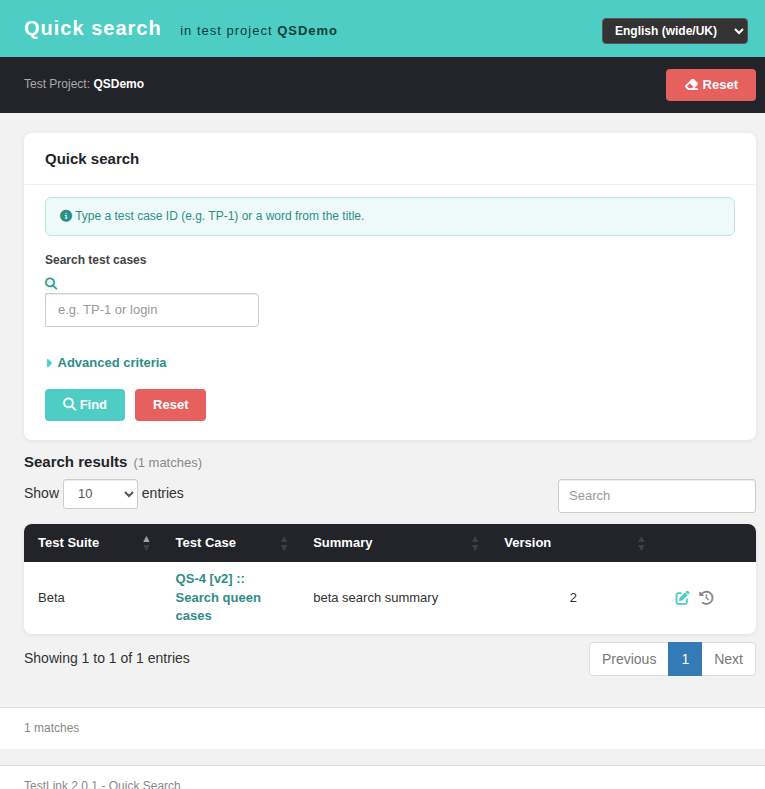

# Search Test Cases (Quick Search) — Modernized Screen

**Path:** ASIDE menu > Search > *Quick search* / *Search Test Cases*
**URL:** `gui/templates/search/searchView.html?tproject_id=<id>&tplan_id=<id>`
**BFF API:** `api/search/index.php` (session-based auth, JSON I/O)
**Prerequisite:** `view_tc` grant on the current test project (same visibility
rule as legacy `getMenuVisibility()`); the Search section is hidden otherwise.
**Replaces:** legacy quick-search form `lib/search/searchForm.php` +
`gui/templates/dashio/search/searchForm.tpl`, results from
`lib/testcases/tcSearch.php` (ExtJS grid).


---

## What it does

Searches **test cases in the CURRENT test project only**, combining all filled
criteria with a logical **AND** (`LIKE '%value%'` semantics on text fields) —
exactly like TestLink 1.9.20's quick search.

Notices shown above the form:

* all criteria are combined with AND;
* search is restricted to the selected test project;
* the test project prefix typed in the *Test Case ID* field is ignored
  (a bare number like `3` is auto-completed to `SFP-3`).

## Search criteria

| Criterion | Behavior |
|-----------|----------|
| Test Case ID | full external id (`SFP-2`) or bare number (`2`); unknown id → warning "Test case does not exist." |
| Version | exact match on tcversion.version |
| Title | `LIKE` on test case name |
| Created by / Edited by | `LIKE` on author/updater login, first name or last name |
| Summary / Preconditions | `LIKE` |
| Steps / Expected results | `LIKE` across tcsteps rows |
| Creation date from/to | range on `tcversions.creation_ts` (to-date includes 23:59:59); dates sent in the project's configured format |
| Modification date from/to | range on `tcversions.modification_ts` |
| Importance | High/Medium/Low — shown only when the project has *test priority enabled* |
| Status | Draft … Final domain (localized server-side, same source as legacy) |
| Keyword | exact keyword id — shown only when the project has keywords |
| Custom field + value | design-time custom fields linked to test cases; date/datetime values converted like legacy, everything else `LIKE` |
| Requirement document ID | `LIKE` on `req_doc_id` via req_coverage — shown only when requirements are enabled |

Result cap: if more than `testcase_cfg.search.max_qty_for_display` (200)
distinct test cases match, the search refuses to display and warns
"Too many results - please refine the search criteria." (legacy behavior).

## Results

### Grouped by test suite (legacy ExtTable parity, Fixes #1092)


The legacy grid (`lib/testcases/tcSearch.php:339-351`) grouped the hits per test
suite, so the modern results table is grouped too:

* every suite path gets a collapsible teal header with its item count
  (`Suite Alpha (3 Items)`, singular `(1 Item)`) — the legacy
  `groupTextTpl '{text} (N Items)'` of `exttable.class.php:591`;
* clicking a header collapses/expands that group; the toolbar button
  **Expand/Collapse Groups** collapses/expands all of them and reports
  `Groups collapsed` / `Groups expanded`;
* the **Test Suite** column is hidden while grouping (legacy
  `hideGroupedColumn=true`); the toolbar toggle **Show all Columns** /
  **Hide Test Suite column** brings it back (legacy disabled that button, so the
  port adds it as a superset);
* default order is suite path (so groups never split) and **test case
  descending** inside each group, per legacy `sortDirection='DESC'`; sorting by
  another column keeps the groups intact;
* `orderMulti: false` mirrors legacy `allowMultiSort=false`; nothing is stored in
  `localStorage` (`storeTableState=false` in legacy);
* the no-CDN fallback table (see #799) renders the same group headers.

No BFF change was needed: `api/search/index.php` already returns `path` per row.
New i18n keys `sv.grid.*` (7) exist in all 10 bundles.


DataTable with columns:

* **Test Suite** — full path of the parent suite;
* **Test Case** — clickable `PREFIX-extid [vN] :: Name`; opens the test case
  editor popup (`archiveData.php?edit=testcase&id=…&tcversion_id=…`);
* **Summary** — HTML stripped to plain text;
* **Version**;
* actions: edit popup + execution history popup
  (`execHistory.php?tcase_id=…`).

A match counter is displayed next to the results heading and in the footer.
When nothing matches, an empty-state message is shown instead of the table.

## Errors & warnings



| Situation | Message |
|-----------|---------|
| TC ID given but not found | "Test case does not exist." |
| Project has no test cases | "Test project is empty (no test cases)." |
| No rows match | "No test cases match the given criteria." |
| > 200 matches | "Too many results - please refine the search criteria." |

## Permissions

* Menu entry visible with `view_tc` (mapped to right `mgt_view_tc`) — admins,
  guests, testers, designers etc.; hidden for `<no rights>` users.
* BFF enforces the same rule: HTTP 403 `No permission` without it, HTTP 401
  when not authenticated.

## i18n

All labels/titles/placeholders/messages use the client-side `TLi18n` module
with keys under the `search.*` namespace, present in **all** locale bundles:
en, ro, de, fr, es, it, pt, ru, ja, zh. A locale switcher is available in the
header.

## Technical notes

* BFF endpoints:
  * `GET api/search/index.php?action=context&tproject_id=N` — prefix, keywords,
    custom fields, status domain, feature flags, max result count;
  * `GET api/search/index.php?action=search&tproject_id=N&…` — runs the search,
    returns `{count, rows[], warning}` where each row carries testcase_id,
    tcversion_id, full external id, version, summary and suite path.
* SQL mirrors legacy `tcSearch.php`: nodes_hierarchy join tcversions (+ LEFT
  JOIN steps), optional joins for keywords / custom field values /
  requirement coverage / author & updater users; `COUNT(DISTINCT NH_TC.id)`
  first, then the row fetch capped at the display limit.
* All user input is escaped through `$db->prepare_string()` before being placed
  into LIKE clauses (same hardening as the 1.9.20 security fixes).

---

# Quick Search — Separate Screen (one file per screen)

**URL:** `gui/templates/search/searchQuickView.html?tproject_id=<id>&tplan_id=<id>`
**BFF API:** same `api/search/index.php` (`action=tcQuickSearch`)

## Why a separate file
The ASIDE highlight logic (`syncAsideActiveLink()` in `main.tpl`) matches menu
links by pathname. While both Search items shared one screen, BOTH were
highlighted at the same time. Each screen now has its own file, so exactly one
item is active — consistent with every other ASIDE section.

## What it does
A focused mini-form for fast lookups inside the current test project:

* single input field accepting either a **title fragment** (`LIKE %value%`) or
  a **test case ID** (full external ID like `P2-1`, or bare number
  auto-completed with the project prefix);
* results table (external ID, version, title, path) rendered as a DataTable;
* clicking a result opens the **modernized TC viewer**
  (`gui/templates/testcases/tcView.html`), not the legacy popup;
* empty input → toast error; no matches → inline "no results" message;
* self-contained page: own CSS, TLi18n localization, Dashio header/toolbar.

## Routing
`lib/functions/common.php` builds both URIs:

```
$actions->tcSearch      = "/gui/templates/search/searchView.html?{$ctx}";
$actions->tcQuickSearch = "/gui/templates/search/searchQuickView.html?{$ctx}";
```

## Screenshots


The quick **Search Test Cases** screen now appends a **"Generated by TestLink on …"** timestamp to the results footer after a successful search, matching the legacy behavior. The timestamp is formatted server-side in the user's TestLink locale (including the time component) and shown only when a search runs and produces no warning; it is hidden on warnings, empty results, and after Reset.

**Changes**

- `api/search/index.php` (action=search): adds `generated_on` (locale-aware `tlStrftime(timestamp_format, locales_timestamp_format[$locale]`) and `generated_on_iso` to the response payload (Refs #1093).
- `gui/templates/search/searchView.html`: renders a hidden `#footerGenerated` block that displays `common.generatedBy` + the server-formatted timestamp when results exist without warning; cleared on reset. Uses existing i18n key `common.generatedBy`.

**Screenshots**

- Results footer with generated-on timestamp (success case)


---

## Advanced Criteria panel (full legacy form parity, Refs #1101)

The quick search screen dropped the legacy full search criteria form
(`tcSearch.php?doAction=userInput` / `lib/testcases/tcSearchForm.php`) — the
modern screen had only the single quick-text box. The gap is now closed with an
expandable **Advanced criteria** panel (`#btnAdv` toggle → `#advPanel`) that
re-implements EVERY legacy criterion on the same BFF (`api/search/index.php`,
which already parsed all of them):

| Group | Fields |
|-------|--------|
| Identification | Test Case ID (project prefix ignored — hint shown), Version |
| Text | Title, Summary, Preconditions, Steps, Expected results, Jolly (OR) |
| Meta | Importance (only when the project enables test priority), Status, Created by, Edited by |
| Dates | Creation from/to, Modification from/to (project date format via `fmtDate()`) |
| Taxonomy | Keyword, Custom field + value, Requirement document ID (both gated by project settings) |




### Behavior

- All criteria combine with a logical **AND**; an empty form → toast
  "Type what you are looking for.".
- **Jolly (OR)** supersedes Title/Summary/Preconditions/Steps/Expected results
  exactly like legacy `tcSearch.php:93-121` — a hint appears under the note as
  soon as Jolly is typed.
- An explicit advanced **Title** (or **Test Case ID**) wins over the quick box;
  the conflict raises a localized toast ("Quick search text ignored…") instead
  of silently dropping the input.
- Enter inside any advanced input triggers the search.
- **Deep links**: `?name=…&importance=…&creation_date_from=…` prefill their
  fields AND auto-open the panel, so a filter can never be active-but-invisible.
- `resetForm()` clears all 20 fields; the panel toggle stays localized
  (`aria-expanded` + rotating caret, no label desync on locale switch).

### Files

- `gui/templates/search/searchQuickView.html` — panel HTML/CSS, `buildAdvancedParams()`,
  `toggleAdvanced()`, `fmtDate()`, deep-link prefill, Enter-to-search.
- `api/search/index.php` — unchanged (already supported every filter).
- i18n: `search.advancedCriteria`, `search.quickIgnoredTc`, `search.quickIgnoredName`,
  `search.jollySupersedes`, reused `search.prefixIgnored`/`search.filterModeAnd` in all bundles.
