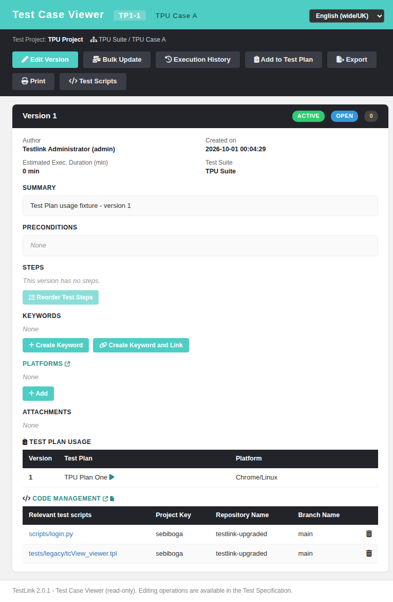

# Task — Issue #1039: Code Tracker / test-script links in the Test Case Viewer

## What was missing

TestLink 1.9.20's Test Case Viewer rendered, per version panel, a **Code Management / CTS**
block (`gui/templates/dashio/testcases/tcView_viewer.tpl:561-588`) when the owning test
project had `code_tracker_enabled`:

* a bold **"Code management"** link to `$gui->cts->cfg->uriview` (`target="_blank"`),
* a **"Link Existent Test Script"** button calling
  `open_script_add_window(tproject_id, null, tcversion_id, 'link')` → the Script Add popup,
* the linked-test-scripts table from
  `gui/templates/dashio/include/showScriptsTable.inc.tpl` with `can_delete=true`, i.e. columns
  *Relevant test scripts | Project Key | Repository Name | Branch Name* plus a trash icon per row.

The modern viewer dropped all of it: `api/testcases/index.php?action=view` had no
`codeTrackerEnabled` flag and no script payload, so `tcView.html` rendered nothing.

## What changed

### BFF — `api/testcases/index.php`

| Helper | Legacy twin |
|---|---|
| `tcViewCodeTracker()` | `testproject::isCodeTrackerEnabled()` + `tlCodeTracker::getLinkedTo()/getByID()` (the `getCodeTracker()` of `lib/testcases/scriptAdd.php`) |
| `tcViewScripts()` | `testcase::getScriptsForTestCaseVersion()` (`lib/functions/testcase.class.php:8678`) |
| `tcViewCtsUrl()` | `$gui->cts->cfg->uriview`, with `getEnterCodeURL()` as fallback |

New response keys on `action=view`:

```jsonc
"codeTrackerEnabled": true,          // $gui->codeTrackerEnabled
"ctsViewUrl": "https://github.com/", // $gui->cts->cfg->uriview
"ctsName": "Fixture GitHub Tracker",
"canModifyScripts": true,            // showScriptsTable.inc.tpl can_delete
"versions": [{ "tcversion_id": 6, "scripts": [ /* $gui->scripts[$tcversion_id] */ ] }]
```

Each script row keeps the legacy composite id
`project_key&&repository_name&&code_path` (the table has **no** surrogate key) plus a
`view_url` built by `codeTrackerInterface::buildViewCodeURL()` — **commit wins over branch**,
exactly like the legacy `buildViewCodeURL:291-315`.

### Screen — `gui/templates/testcases/tcView.html`

* `renderCodeTracker(v)` — the label + "Code management" link + the fa-file link button
  (`openScriptAddWindow()`, opening the modernized `scriptEdit.html` popup, Refs #1574) and the
  4-column table. The trash column only appears when `canModifyScripts`.
* `confirmDeleteScript()` / `doDeleteScript()` — the legacy `delete_confirmation()` box
  (`inc_del_onclick.tpl:29`), posting the composite id to
  `api/tcscripts/index.php?action=unlink`, the modern replacement of
  `scriptDelete.php::del_testcase_script()`.

### i18n

12 new `tcview.cts*` keys translated in **all 10** locale bundles
(`en, de, fr, es, it, pt, ro, ru, ja, zh`).

## Verification

13/13 test cases pass (`tmp/TLU_Test_Cases.md`, suite *Task — Issue #1039*), covering the
payload contract, the rendered block, both link flavours (branch + commit), the delete
round-trip, the `code_tracker_enabled = 0` gate, the Romanian locale and the Event Viewer.



Fixture: `tmp/fixtures_1039.sql` (idempotent). Note `codetrackers.type` is an **int** —
`200` = GitHub (`tlCodeTracker::$systems`, `lib/functions/tlCodeTracker.class.php:28-29`);
a textual `'github'` resolves to `implementation = NULL` and silently disables the block.
