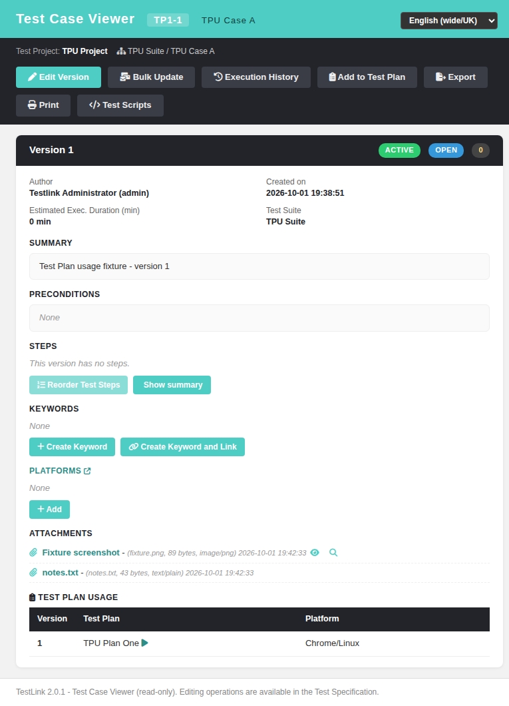

# Task — Issue #1042: attachment download link (and the rest of the legacy attachment block) in the Test Case Viewer

## What was missing

The Test Case Viewer listed the attachments of every test case version, but as **plain text**:
each file was rendered as `
<i class="fa fa-paperclip"></i>{title}
(file_name, N KB)
`. There was no `<a href>`, so the attachment id the BFF already sent
was never used and **a file could be listed but never downloaded**. On top of that the modern
screen had dropped the whole write half and every affordance of the legacy block:

| legacy behaviour | legacy source | modern before |
|---|---|---|
| download anchor `attachmentdownload.php?id=N`, `target=_blank`, bold, tooltip `click_to_get_attachment` | `gui/templates/dashio/include/attachments.inc.tpl:89-90` | **missing** (plain text) |
| eye toggle rendering the file inline (`toogleImageURL`) when `is_image` | `attachments.inc.tpl:91-95` | **missing** (`is_image` not even in the payload) |
| ghost toggle exposing `inlineString` (`[tlInlineImage]N[/tlInlineImage]`) | `attachments.inc.tpl:98-101` | **missing** |
| delete link, hidden only by `$attach_downloadOnly` | `attachments.inc.tpl:104-110`, driven by `tcView.tpl:190-196` and `:309-318` | **missing** |
| metadata `file_name (N bytes, file_type) date_added` | `attachments.inc.tpl:96` | `file_name, N KB` |
| empty-title rule `action_on_display_empty_title` → `access_icon` / `access_string` | `attachments.inc.tpl:78-86`, `config.inc.php:1568-1578` | **missing** |
| "attachment feature disabled" notice | `attachments.inc.tpl:55-59` | **missing** |

Legacy 1.9.20 `tcView.tpl:202-206` never passes `attach_show_upload_btn`, so the 1.9.20
Test Case Viewer had **no upload form** — the correct port is list + download + delete, not an
upload widget. (Suite/Execution/Requirement screens do render one.)

## The implementation

### BFF — `api/testcases/index.php`

* per-version attachment rows (`:2185-2209`) gained `download_url`
  (`/api/attachments/index.php?action=download&id=N` — the same field and shape
  `api/suiteview/index.php:266` and `api/projectinfo` already send) and `is_image`
  (legacy rule `strpos($file_type,'image/') !== false`, `lib/functions/tlAttachment.class.php:262`);
* root payload (`:1499-1513`) gained the legacy environment of the block:
  `attachmentsEnabled`, `attachmentsMaxSize` (`$gui->import_limit`),
  `downloadOnlyAfterExec` (the driver of `$bDownloadOnly`),
  `attachmentsEmptyTitleMode`, `attachmentsAccessString`.

No new endpoint: the download already existed (`api/attachments/index.php:179-251`) with the
owner right check for `tcversions` (`api/_attachauth.php:295-307`).

### Screen — `gui/templates/testcases/tcView.html`

* `attDownloadOnly(v)` reproduces `$bDownloadOnly` = `hasBeenExecuted && downloadOnlyAfterExec`
  (frozen versions are download-only too, `tcView.tpl:317`); `attCanDelete(v)` ANDs it with the
  modern write gate (`mgt_modify_tc`, `is_open`, `canEditExecuted`) — 1.9.20 got that gate
  implicitly from the edit screen, the modern viewer has to state it;
* `attLinkText(a)` = the empty-title rule; `renderAttachments(v)` = the legacy row: paperclip +
  bold `target=_blank` download anchor + `file_name (N bytes, type) date` italic meta + eye and
  ghost toggles for images + delete button + inline-image container, or the disabled notice;
* `toggleAttImage(id)`, `toggleAttGhost(id)`, `confirmDeleteAttachment(id)` +
  `doDeleteAttachment()` (legacy `delete_confirmation()` → `deleteAttachment_onClick()`), with
  the `#attDelModal` confirm dialog built exactly like the existing `#relDelModal`.

### Blocker found on the way: attachment delete always 403

`api/attachments/index.php` called `attAuthOwnerAllowed($db, $user, $table, $fkId)`, but that
function's third parameter is the `attAuthResolveContext()` **array**
(`api/_attachauth.php:394-396`), not a table name. The gate therefore always resolved
`domain = ''` and denied — measured `403 {"code":"NO_RIGHT"}` for **admin** on `tcversions`, i.e.
deleting an attachment through the BFF was impossible and the legacy delete link could not be
ported at all. Fixed by using the documented wrapper `attAuthCheckOwner(..., $forWrite = true)`
(resolve + gate), which additionally makes a read-only grant insufficient to delete a file —
the same rule the upload branch of the same endpoint already applies.

The same wrong-argument call exists in `api/attachmentsdelete/index.php:270` (the Attachment
Delete popup endpoint); that one is outside this screen and is filed as **#1782**.

## Verification

* Suite 1042 in `tmp/TLU_Test_Cases.md` — **PASS** (see the suite entry).
* Browser (admin, `tcView.html?tproject_id=1&tcase_id=5&tcversion_id=6`, fixture
  `tmp/fixtures_1042.php`):
  * download anchor rendered for every row, `GET …?action=download&id=6` → `200`,
    `Content-Type: text/plain`, `Content-Disposition: inline; filename="notes.txt"`, body
    `Issue 1042 fixture: plain text attachment.`; the PNG row → `200 image/png`, 89 bytes;
  * eye toggle inserts/removes ``;
    ghost toggle shows `Fixture screenshot [tlInlineImage]5[/tlInlineImage]`;
  * delete: confirm dialog shows the file name, POST `action=delete` (`table=tcversions`,
    `id=6`, `file_id`) → row disappears after re-render, modal closes, localized toast
    `Attachment deleted.`;
  * gates: frozen version → `attDownloadOnly=true`, **no** delete button, download link still
    there; executed + `downloadOnlyAfterExec` (config is TRUE here) → no delete button;
    `attachmentsEnabled=false` → "Attachments disabled" notice; empty title with
    `show_label` → `[*]`, with `show_icon` → the file name; no attachments → "None".
* `php -l api/testcases/index.php`, `php -l api/attachments/index.php`,
  `node --check` on the extracted screen script, `python3 -m json.tool` on all 10 i18n bundles:
  all clean. Console: no errors. Event Viewer: no new Error/Warning entries (the only entries
  produced during the run were `E_WARNING Undefined property: stdClass::$id` from my own first
  version of the throwaway fixture script, removed together with the script rewrite).

## Screenshot

