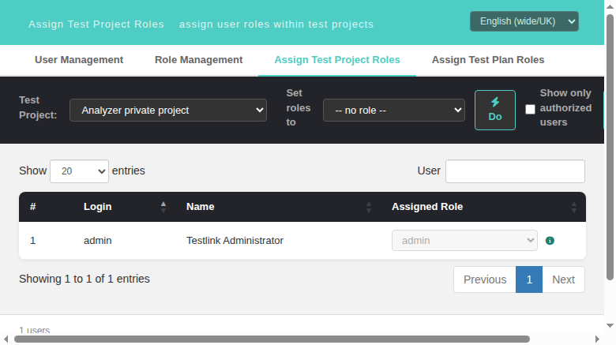
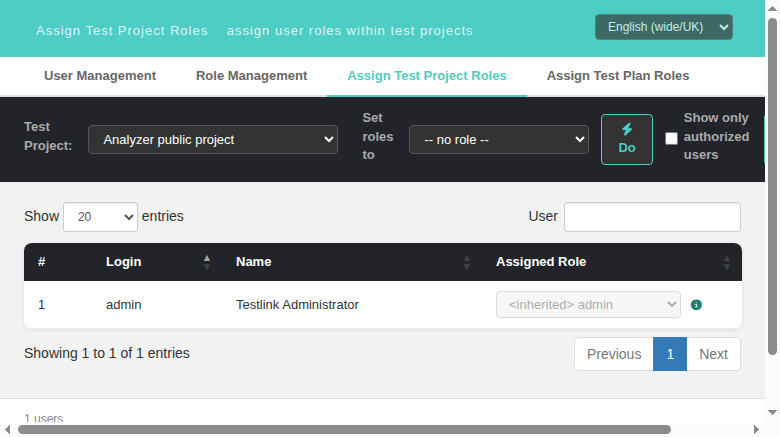

# Task 1613 — Assign Test Project Roles must preselect the **SESSION** test project when the URL carries no `tproject_id`

**Issue:** [#1613](https://github.com/sebiboga/testlink-upgraded/issues/1613)
**Status:** IMPLEMENTED & VERIFIED (2026-10-01) — branch `task/issue-1613`
**Screen:** Assign Test Project Roles — `gui/templates/usermanagement/usersAssignProject.html`
**BFF:** `api/roles/index.php` — `GET /meta/tproject-roles` gained `sessionTprojectID`
**i18n:** unchanged — the fix changes *which* project is preselected, not any label

## The gap

Legacy `lib/usermanagement/usersAssign.php:307-316` (read from git `ab387af72^`; the
legacy controller and template were deleted in `ab387af72`, Refs #947), inside
`getTestProjectEffectiveRoles()`:

```php
// If have no a test project ID, try to figure out which test project to show
// Try with session info, if failed go to first test project available.
if (!$argsObj->featureID) {
    if ($argsObj->testprojectID) {
        $argsObj->featureID = $argsObj->testprojectID;   // SESSION PROJECT WINS
    } else if (sizeof($features)) {
        $xx = current($features);
        $argsObj->featureID = $xx['id'];                  // only then the first combo entry
    }
}
```

`$argsObj->testprojectID` is `$_SESSION['testprojectID']`, written by the navBar project
combo; `gui/templates/dashio/usermanagement/usersAssign.tpl:174-179` then rendered that
combo entry `selected`. The grid therefore always opened on the user's current context.

The 2.0.1 port kept only **two** of the three sources:

```js
// usersAssignProject.html:445 (pre-fix)
var pid = (selectedId && $.inArray(String(selectedId), ids) !== -1) ? selectedId : r.projects[0].id;
```

`selectedId` comes exclusively from the `tproject_id` URL param
(`usersAssignProject.html:400` → `loadProjects(tp)`), so a direct/bookmarked URL with no
param silently landed on `r.projects[0].id` — and `getAssignableProjects()`
(`api/roles/index.php:123`) orders the combo `ORDER BY name ASC`, i.e. **alphabetically
first, not the session project**.

The session source was dropped on **both** halves of the round trip: the BFF computed
`$sessionTprojectID` at `api/roles/index.php:377` but consumed it only internally for the
rights check (`:381`) and never serialized it, so the screen *could not* have honoured it.

**Impact beyond cosmetics.** `currentProject` is what `saveAssignments()` posts
(`usersAssignProject.html:911`), so role assignments land on a project the user never
picked. The ASIDE/dashio links always append `tproject_id`
(`lib/functions/common.php:1887`) — which is why this only bites on a direct/bookmarked
URL, and that is precisely the case legacy handled.

### Measured gap repro (fresh DB, `testprojects` had 0 rows → fixtures created)

Fixtures: project **1 "Analyzer public project"** (`APUB`, `is_public=1`),
project **2 "Analyzer private project"** (`APRIV`, `is_public=0`).
Session project pinned to 1 (navBar combo showed `APUB:Analyzer public project`,
Dashboard read "Test Project: Analyzer public project").

Screen opened at `http://localhost:8082/gui/templates/usermanagement/usersAssignProject.html`
(no query string) on the **unmodified** tree (`git diff -- api gui` empty, `ecb826d16`):

```json
{"comboValue":"2","comboText":"Analyzer private project",
 "options":[":-- select project --","2:Analyzer private project","1:Analyzer public project"]}
```

```json
// GET /api/roles/index.php/meta/tproject-roles?tproject_id=0
{"keys":["status","items","roles","projects","isPublic","demoMode","roleColouring","pagination"],
 "sessionTprojectID": undefined,
 "projects":[{"id":2,"name":"Analyzer private project"},{"id":1,"name":"Analyzer public project"}]}
```



## Implementation

### 1. BFF — `api/roles/index.php` (+11/-1, one payload key)

`GET /meta/tproject-roles` now serializes the session project next to the filtered combo:

```php
'pagination' => getUsersAssignPaginationConfig(),
'sessionTprojectID' => $sessionTprojectID]);
```

`$sessionTprojectID` is the value already computed at `api/roles/index.php:377`
(`intval($_SESSION['testprojectID'])`, `0` when the session has no project). Nothing new
is queried and nothing sensitive is exposed — only the id of the project the navBar combo
already put the user in. The screen treats `0`/absent as "no session project".

### 2. Screen — `gui/templates/usermanagement/usersAssignProject.html` (+14/-4)

`loadProjects()` resolves the initial selection with legacy's exact three-step precedence,
each candidate guarded by membership in the **filtered** combo (a stale/unknown id can
never be selected):

```js
var ids = $.map(r.projects, function(p) { return String(p.id); });
var pid = r.projects[0].id;
var sessionId = (r.sessionTprojectID != null && String(r.sessionTprojectID) !== '')
  ? String(r.sessionTprojectID) : '';
if (sessionId && $.inArray(sessionId, ids) !== -1) { pid = sessionId; }
if (selectedId && $.inArray(String(selectedId), ids) !== -1) { pid = String(selectedId); }
sel.val(pid);
loadUsers(pid);
```

`ids` is string-normalized (`String(p.id)`) so the comparison never suffers jQuery's
strict `inArray` type mismatch between a URL string and a JSON number; `pid` is likewise
a string, which `sel.val()` and `loadUsers()` both accept unchanged. An explicit URL param
still **beats** the session — mirroring legacy's `if (!$argsObj->featureID)` guard, i.e.
the session only fills the gap when the request carries no usable featureID.

No new i18n keys: nothing user-facing was added, so no locale bundle was touched.

## Verification (suite 1613 — `tmp/TLU_Test_Cases.md`, 9 PASS + 2 FAIL-reproduced)

| case | observed |
|---|---|
| no param, session = 1 (**the repro**) | combo `1` "Analyzer public project", grid renders project 1 — was `2` pre-fix |
| BFF payload | `sessionTprojectID: 1` present in the key list |
| no param, session = 2 | combo `2` |
| `?tproject_id=2`, session = 1 | combo `2` — the URL still wins |
| `?tproject_id=999`, session = 1 | combo `1` — an id outside the assignable combo falls back to the session project, never to a phantom `999` |
| resolution matrix (the exact `loadProjects()` expression replayed in-page against the real payload shape, 7 rows: session 1 / session 2 / session 0 / key absent / session 99 not assignable / param 2 + session 1 / param 999 + session 1) | `1, 2, 2, 2, 2, 2, 1` — every row matches legacy precedence |
| syntax gates | `php -l api/roles/index.php` clean; extracted inline `<script>` → `node --check` clean |
| regression — `usersAssignPlan.html`, `rolesView.html` | 0 console errors/warnings on both |
| Event Viewer / `events` | `log_level in (1,2,3)` → 0 rows |



**Not covered / remaining.** The "no assignable project at all" branch would need a second,
non-privileged user holding a project role on only one of the two fixtures; that branch
short-circuits at `if (!r.projects || !r.projects.length)` *before* the resolution code, is
untouched by this change, and is already covered by #1621's suite.

## Related

- Refs #924 / #935 / #936 / #937 (rights filtering of the combo) — the list this resolution
  picks from is unchanged.
- Refs #1643 / #1644 / #1707 — the sibling parities on the same screen, all reading the same
  `GET /meta/tproject-roles` payload.
- #1609/#1610/#1611/#1612 — the plan-screen twins of the same modernization chapter.
