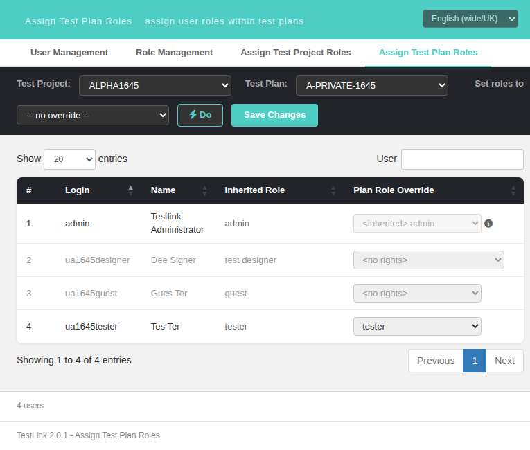

# Task 1645 — `not_authorized_user` row marker for `<no rights>` users in Assign Test Plan Roles (gap vs legacy)

**Issue:** [#1645](https://github.com/sebiboga/testlink-upgraded/issues/1645)
**Status:** IMPLEMENTED & VERIFIED, issue CLOSED — branch `task/issue-1645`
**Related:** #1706 (same defect still open on the sibling project screen), #1676, #1664, #946

## The gap

Legacy `usersAssign.tpl` — the template SHARED by the test-project and the
test-plan contexts — tagged every user row whose **effective** role on the
selected feature was `TL_ROLES_NO_RIGHTS` (3):

```smarty
{* gui/templates/dashio/usermanagement/usersAssign.tpl:234-237 (deleted in ab387af72) *}
{$user_row_class=''}
{if $effective_role_id == $smarty.const.TL_ROLES_NO_RIGHTS}
  {$user_row_class='class="not_authorized_user"'}
{/if}
<tr {$user_row_class} bgcolor="{cycle values="#eeeeee,#d0d0d0"}">
```

`$effective_role_id` is `$gui->userFeatureRoles[$uID].effective_role_id`
(`usersAssign.tpl:225-228`), i.e. the value produced by
`get_tproject_effective_role()` / `get_tplan_effective_role()`
(`lib/functions/roles.inc.php`), **not** the explicit assignment row. The
`not_authorized_user` class greyed the row out, which is how a manager spotted at
a glance that a user has no rights on the selected project/plan — the common
case being every non-admin user on a **private** test plan.

**What modern did instead:** the modern plan screen wrote
`<tr data-uid="…">` (`gui/templates/usermanagement/usersAssignPlan.html:600`)
and nothing else: no `not_authorized_user` class, and no CSS rule for it, so a
`<no rights>` row was visually identical to a normal one.

The BFF already returned everything needed — `effectiveRoleID` is part of the
`tplan-roles` payload (`api/roles/index.php:967`) — and the sibling **project**
screen carried the constant, the CSS rule and the row-class expression
(`usersAssignProject.html:33`, `:125`, `:462`). The plan screen had none of the
three.

## Implementation

No BFF change, no model change, no new i18n key (the marker is visual-only in
legacy too — no new user-facing text was introduced). Three additions to
`gui/templates/usermanagement/usersAssignPlan.html`:

1. **CSS rule** in the `<style>` block (sibling parity with
   `usersAssignProject.html:33`):
   `.assign-table tr.not_authorized_user td { color: #999; }`
2. **Constant** next to `ADMIN_ROLE_ID`:
   `var NO_RIGHTS_ROLE_ID = 3;` — the front-end twin of
   `config.inc.php` `TL_ROLES_NO_RIGHTS` (same value as
   `usersAssignProject.html:125`).
3. **Row class** in `renderUsersTable()`, derived from the loaded
   `u.effectiveRoleID`:
   `var rowClass = (u.effectiveRoleID == NO_RIGHTS_ROLE_ID) ? ' class="not_authorized_user"' : '';`
   plus the same condition re-applied in the DataTables `createdRow` callback
   with `$(row).addClass('not_authorized_user')`.

### Why the `createdRow` re-application is mandatory (measured, not assumed)

Writing the class into the static row markup is **not** enough: DataTables
*replaces* the `className` of every `<tr>` with its own striping classes while
creating the row. `createdRow` runs **after** that assignment, and `addClass()`
(never `className =`) keeps the striping class intact.

This was proven empirically during the investigation: the sibling project
screen, which writes the class into its markup at `usersAssignProject.html:462`
but has **no** `createdRow` callback, was measured in the browser with the exact
same `<no rights>` users and produced
`class="odd" / "even"` only — its marker is dead code for the same reason. That
defect is out of scope for this issue and is filed separately as **#1706**.

## Verification (measured, suite 1645 in `tmp/TLU_Test_Cases.md`)

Fixture `php tmp/fixtures_1645.php` (re-runnable, on this branch): public
project `ALPHA1645` id 1; plans `A-PUBLIC-1645` id 5 (`is_public=1`, control)
and `A-PRIVATE-1645` id 6 (`is_public=0`); users `ua1645designer` (id 2, role
4), `ua1645guest` (id 3, role 5), `ua1645tester` (id 4, role 7, holding an
**explicit** plan role 7 on plan 6 → control row that must NOT be marked).

| Plan | user | `effectiveRoleID` | before | after |
|------|------|-------------------|--------|-------|
| 6 (private) | `ua1645designer` | 3 | `class="even"`, `rgb(51,51,51)` | `class="not_authorized_user even"`, `rgb(153,153,153)` |
| 6 (private) | `ua1645guest` | 3 | `class="odd"`, `rgb(51,51,51)` | `class="not_authorized_user odd"`, `rgb(153,153,153)` |
| 6 (private) | `ua1645tester` | 7 (explicit) | `class="even"` | `class="even"` (unchanged, correct) |
| 6 (private) | `admin` | 8 | `class="odd"` | `class="odd"` (unchanged, correct) |
| 5 (public) | all | 4/5/7 inherited | `odd`/`even` | `odd`/`even` — nobody marked |

The marker was also measured as surviving every DataTables redraw — search,
column sort (2×), `Show All` and the bulk `Do` full re-render — and combining
correctly with the `changed` highlight (`class="not_authorized_user changed
even"`). Save round trip: granting `guest` to `ua1645designer` and saving
reloads the grid, where the row is no longer marked (its effective role is no
longer 3) while `ua1645guest` stays marked.

Console: 0 errors, 0 warnings on every state. Event Viewer: no new
Error/Warning entries (only the expected `log_level 16` AUDIT rows from the
Save).

## Notes / behaviour decisions

* The marker reflects the **effective** role as loaded, exactly like legacy,
  which computed the class while rendering the page and never updated it. A
  role picked in the `<select>` therefore greys/ungreys the row on the next
  grid load (Save reloads it), not before — the same as legacy.
* The `Inherited Role` column and the pre-selected `<no rights>` option
  (issue #1664) remain the textual carriers of the same information; the marker
  is the visual carrier legacy provided.
* Sibling screen: #1706 — same fix still needed on
  `usersAssignProject.html` (it also lacks a `createdRow` callback).


