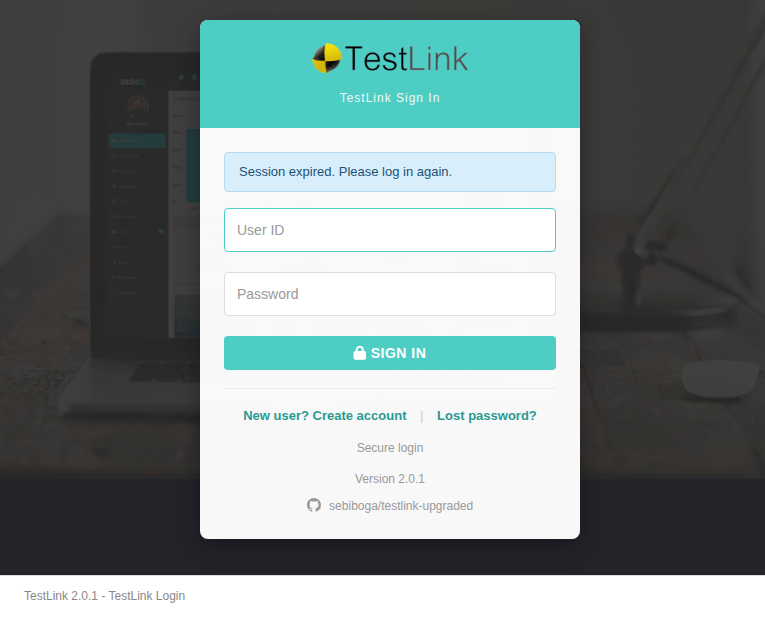

# Task, Issue #1646 — Assign Plan Roles: bounce to login on a 401 `session_expired`

**Screen:** `gui/templates/usermanagement/usersAssignPlan.html` (Assign Test Plan Roles)
**BFF:** `api/roles/index.php` (no change needed — it already answers `401`)
**Status:** implemented, verified, pushed on `task/issue-1646`

## The gap

Legacy 1.9.20 ran `checkSessionValid($db)` on every load of the shared users-assign
controller — test project **and** test plan context — from
`lib/usermanagement/usersAssign.php:97` (deleted in `ab387af72`), and again right after the
update block. `checkSessionValid()` (`lib/functions/common.php:258-286`) redirected any session
idle for longer than `config_get("sessionInactivityTimeout")` to
`login.php?note=expired&destination=<this screen>`, and committed nothing.

The BFF cannot redirect, so the guard answers instead:

```
api/_guard.php:175-199  bffEnforceSession()
  -> 401 {"status":"error","code":"session_expired","message":"session_expired"}
```

`api/roles/index.php:39` calls it before any route dispatch, so it covers every route of the
screen. But **the plan screen never inspected the status**, so all four request paths dropped the
401 into a wrong branch:

| path | handler | behaviour on a 401 (before) |
|---|---|---|
| project meta | `loadProjects().fail()` | fell into the `else` → rendered the **dead empty state** "Select a test project and test plan above…" with the toolbar still interactive |
| plans | `loadPlans().fail()` | **silently swallowed** — the plan combo stayed unusable |
| users | `loadUsers().fail()` | **silently swallowed** — the grid just stayed empty |
| save | `saveAssignments()` `error:` | fell through to `assign.updateFailed` — the user was told **their role write failed** when the truth was that the session was dead and nothing had been written |

The sibling screen already had the fix (`usersAssignProject.html:219-235 sessionExpired(xhr)`,
called from both of its failure paths, landed by issues #1614 / #1620). The plan screen never
got the helper.

Two 401 shapes exist, and this matters:

- stale session → `api/_guard.php:192-196` → `401 {"code":"session_expired"}`
- **no session at all** → `api/roles/index.php:24-27` → `401 {"status":"error","message":"Not authenticated"}`, **with no `code` key**

A check that only looked at the body code would still be a second-class citizen here, so the fix
keys on the **status code** and treats the body code as a secondary trigger.

## The fix

`gui/templates/usermanagement/usersAssignPlan.html`

- `sessionExpired(xhr)` at `:291-326`, ported from the sibling screen. It shows the localized
  `auth.sessionExpired` toast as an **error** and then bounces `window.top` to
  `login.php?note=expired&destination=<this path + query, url-encoded>`, so the Dashio shell
  (which loads screens in an iframe) goes with it instead of leaving a stale menu on screen.
  It uses this screen's own `showDemoToast(msg, cls)` — the plan screen has no `#toast` element and
  no global `toast()`, so the project screen's helper would throw `ReferenceError: toast is not
  defined`; the page builds its `.toast` nodes dynamically. The bounce waits **1200 ms** (the
  sibling uses 600 ms) so the toast is readable first — the toast lifetime is 4000 ms.
- Called **first** in all four handlers: `loadProjects().fail()` `:386-391`,
  `loadPlans().fail()` `:503-508`, `loadUsers().fail()` `:743-748`,
  `saveAssignments() error:` `:898-904`.
- 403 handling is untouched — the deny box is still the answer to a rights failure.

**No i18n change:** `auth.sessionExpired` already exists in all ten locale bundles
(de, en, es, fr, it, ja, pt, ro, ru, zh). **No BFF change:** the guard was already correct.

## Verification

Reproduce a stale session by ageing the session file past the window
(`sessionInactivityTimeout = 9900` → **594 000 s**; age by `-700000` s — ageing by `-100000` s
still returns `200`, because every valid call slides `lastActivity` forward,
`lib/functions/common.php:286-288`).

| check | result |
|---|---|
| `loadProjects` (page load) | lands on `login.php?note=expired&destination=…usersAssignPlan.html%3Ftproject_id%3D1%26tplan_id%3D1`; login page shows "Session expired. Please log in again." |
| `loadPlans` | redirect fires mid-request → same login URL + note |
| `loadUsers` | toast "Session expired. Please log in again." at +200 ms…+1200 ms, then the bounce |
| `saveAssignments` | toast is "Session expired…", **not** "Update failed" → then the bounce |
| `sessionExpired({status:403})` | `false` — deny box preserved |
| `{status:200}`, `{status:500}` | `false` — pre-existing behaviour preserved |
| `{status:401}` × 4 bodies (no code / `session_expired` / empty / non-JSON) | `true` for all four |
| valid session | project + plan selected, no deny box, no toast — unchanged |
| Event Viewer | `select count(*) from events where log_level <> 16` → **0** |
| `node --check` on the inline script | OK |

Suite `1646` in `tmp/TLU_Test_Cases.md`: 11/11 PASS.


