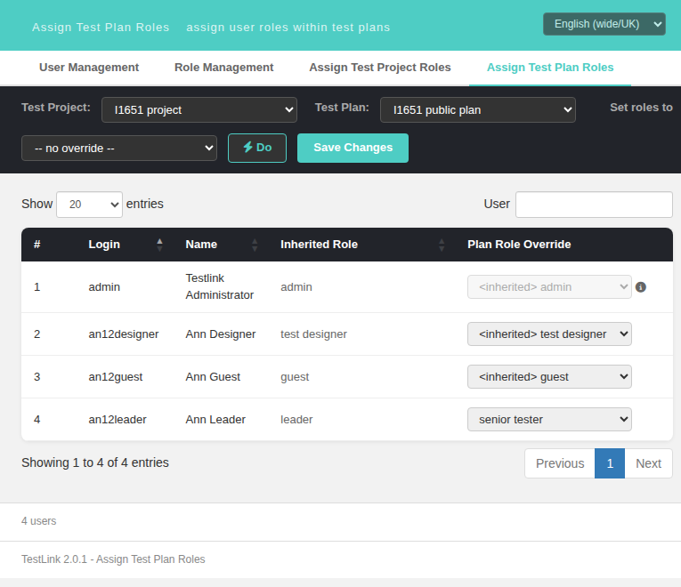

# Task #1651 — resolved-role name on the value-0 override option (Assign Test Plan / Test Project Roles)

**Status:** implemented, verified in the browser, pushed to `task/issue-1651`.
**Screens:** `gui/templates/usermanagement/usersAssignPlan.html`,
`gui/templates/usermanagement/usersAssignProject.html`
**BFF:** `api/roles/index.php` — **no change needed** (see below).

## The gap

Every per-user role `<select>` opens with a value-0 option — the "revert to inherited" choice. Legacy
decorated that option with the name of the role the user would fall back to, for **every** row:

```smarty
{* gui/templates/dashio/usermanagement/usersAssign.tpl:225-232 (deleted in ab387af72) *}
{* get role name to add to inherited in order to give better information to user *}
{$effective_role_id=$gui->userFeatureRoles[$uID].effective_role_id}
{if $gui->userFeatureRoles[$uID].is_inherited == 1}
  {$ikx=$effective_role_id}
{else}
  {$ikx=$gui->userFeatureRoles[$uID].uplayer_role_id}   {* always the GLOBAL role: roles.inc.php:334-336 *}
{/if}
{$inherited_role_name=$gui->optRights[$ikx]->name}

{* usersAssign.tpl:264-271 - applied UNCONDITIONALLY, no is_inherited counterpart *}
<option value="{$role_id}" {$applySelected}>
    {$role->getDisplayName()|escape}
    {if $role_id == $smarty.const.TL_ROLES_INHERITED}
      {$inherited_role_name|escape}
    {/if}
</option>
```

So legacy read `inherited leader` for a row with an explicit plan role (the fallback is the user's
**global** role, not the effective one) and `inherited guest` for a `<no rights>` row on a private
plan.

The modern screens only interpolated the name for **inherited** rows and fell back to a generic
`-- no override --` (plan screen) / `-- no role --` (project screen) for everything else — the
control that performs the revert no longer said which role you revert *to*.

## Why no BFF change

`api/roles/index.php:311-312` already computes exactly the legacy `$ikx` and ships it per user:

```php
$inheritedRoleID = $isInherited ? $effectiveRoleID : $globalRoleID;
```

exposed as `inheritedRoleID` / `inheritedRoleName` in `GET /api/roles/meta/tplan-roles`
(`:956-957`) and `GET /api/roles/meta/tproject-roles` (`:789-790`). The value was fetched, shipped
and then discarded by the renderer. The defect was rendering-only.

Measured payload (`tplan_id=2000`, admin session):

```
admin         planRole=0 eff=8 isInh=1 inhRoleID=8 inhName='admin'
an12designer  planRole=0 eff=4 isInh=1 inhRoleID=4 inhName='test designer'
an12guest     planRole=0 eff=5 isInh=1 inhRoleID=5 inhName='guest'
an12leader    planRole=6 eff=6 isInh=0 inhRoleID=9 inhName='leader'      <- payload HAS the name
```

`meta/tproject-roles` returns the same shape for the project screen.

## The fix

One new i18n key, `assign.overrideClearedRole`, in all 10 bundles (en de es fr it ja pt ro ru zh):

| locale | value |
|---|---|
| en | `revert to inherited {role}` |
| de | `zurück zum geerbten {role}` |
| es | `volver al heredado {role}` |
| fr | `retour à l'hérité {role}` |
| it | `torna al ereditato {role}` |
| ja | `継承の {role} に戻す` |
| pt | `voltar à herdada {role}` |
| ro | `revino la mostenit {role}` |
| ru | `вернуться к унаследованной роли {role}` |
| zh | `恢复为继承的 {role}` |

The two branches stay distinct on purpose: an **inherited** row keeps the current-state wording
`<inherited> <role>` (`assign.inheritedRoleOption`), an **overridden** row states the fallback it
reverts TO (`assign.overrideClearedRole`). The previous bare labels survive as the fallback used
when the payload carries no resolved name.

`usersAssignPlan.html` — `rolesOptions()`:

```js
var noRoleLbl = u.isInherited
  ? esc(TLi18n.t('assign.inheritedRoleOption', {role: u.inheritedRoleName}))
  : (hasResolvedRoleName(u.inheritedRoleName)
      ? esc(TLi18n.t('assign.overrideClearedRole', {role: u.inheritedRoleName}))
      : esc(TLi18n.t('assign.noOverride')));
```

`usersAssignProject.html` — `buildBodyHtml()`, identical but falling back to `assign.noRole`.

### Deliberately not changed

* `buildBulkSelect()` (`usersAssignPlan.html:618`) — the bulk "set roles to" select keeps the bare
  `-- no override --`. Legacy `usersAssign.tpl:193-197` renders the pseudo-role display name alone
  there, because `$inherited_role_name` is not assigned until line 225.
* The option `value` stays `0`, so the save payload, the `not_authorized_user` row marker and the
  `changed` badge are untouched.
* The role name itself stays the raw `roles.description` (`leader`), not a localized string — that
  is `tlRole::getDisplayName()`'s legacy behaviour.

## Verification (see `tmp/TLU_Test_Cases.md`, suite "Task — Issue #1651", 12 assertions)

* plan `2000`: `an12leader` (explicit plan role 6) → `revert to inherited leader`; the three
  inherited rows keep `<inherited> <role>`.
* plan `2001` (private ⇒ `<no rights>`): `revert to inherited test designer` / `… guest` /
  `… leader`.
* project `1000`: `an12leader` (explicit project role 6) → `revert to inherited leader`.
* bulk select unchanged on both plans.
* save round-trip: value 0 deletes `user_testplan_roles (4,2000,6)` and the row re-renders as
  `<inherited> senior tester` (the plan now inherits the explicit project role 6).
* `'-'` sentinel (a user with `role_id=0` + an explicit project role): the value-0 option
  falls back to `-- no role --` instead of rendering `revert to inherited -`.
* `ro_RO` locale live: `revino la mostenit leader`.
* `node --check` clean on both screens; no console errors; no new `log_level IN (1,2)` event row.


