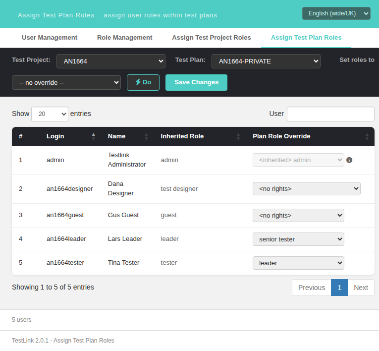

# Task 1664 — the per-user role `<select>` must pre-select the **EFFECTIVE** plan role (`<no rights>` on a private plan)

**Issue:** [#1664](https://github.com/sebiboga/testlink-upgraded/issues/1664)
**Status:** IMPLEMENTED & VERIFIED (2026-09-27) — branch `task/issue-1664`
**Screen:** Assign Test Plan Roles — `gui/templates/usermanagement/usersAssignPlan.html`
**BFF:** unchanged — `GET /roles/meta/tplan-roles` already ships `effectiveRoleID` + `isInherited` (#944); this run only consumed it in the `<select>`
**i18n:** unchanged — the `<no rights>` option label comes from the localized role list (`roles[].name`), the value-0 option labels already exist

## The gap

Legacy `gui/templates/dashio/usermanagement/usersAssign.tpl:249-256` (read from git
`ab387af72^`, the legacy controller/template were deleted in `ab387af72`, Refs #947) —
the shared `usersAssign.tpl` is used by BOTH the project and the plan screen:

```smarty
{$applySelected = ''}
{if ($gui->userFeatureRoles[$uID].effective_role_id == $role_id &&
     $gui->userFeatureRoles[$uID].is_inherited==0) ||
    ($role_id == $smarty.const.TL_ROLES_INHERITED &&
     $gui->userFeatureRoles[$uID].is_inherited==1)}
  {$applySelected = ' selected="selected" '}
{/if}
```

⇒ **the pre-selected option is the user's EFFECTIVE plan role** when the role is not
inherited, and the value-0 `TL_ROLES_INHERITED` option when it is inherited.

The `is_inherited == 0` + `effective_role_id == 3` case is produced by
`get_tplan_effective_role()` — `lib/functions/roles.inc.php:407-416`:

```php
// For Private Test Plans specific role is NEEDED for users with global role !? ADMIN
if( $doNextStep && ($row['user']->globalRoleID != TL_ROLES_ADMIN) && !$tplan['is_public']) {
  $isInherited = 0; $doNextStep = false;
  $effective_role[$user_id]['effective_role_id'] = TL_ROLES_NO_RIGHTS;   // 3
  $effective_role[$user_id]['effective_role'] = '<no rights>';
}
```

So on a **private** test plan a non-admin user **without an explicit plan role** gets
`is_inherited = 0, effective_role_id = 3` and legacy renders the **`<no rights>` option
selected**. A plain *Update* then submits `userRole[<uid>]=3` and `doUpdate()` deletes +
re-adds that row — materialising an explicit `<no rights>` plan role.

The modern screen seeded the model with the **explicit** `user_testplan_roles` row instead:

```js
origRoleID: u.roleID,   // api/roles/index.php:945 → 0 when there is no row
roleVal: u.roleID,      // gui/templates/usermanagement/usersAssignPlan.html:653 (pre-fix)
```

and `rolesOptions(u, u.roleVal)` marks `u.roleVal` as the selected option, so the value-0
"*revert to inherited …*" option always won. The BFF already computed the right value
(`effectiveRoleID` + `isInherited`, #944) but nothing consumed it for the select. Net effect
on a private plan: `<no rights>` was never pre-selected, and a plain Save submitted `0`,
so `doUpdate()` **deleted** those rows instead of writing the explicit `<no rights>` role
legacy writes.

The twin screen already implements the rule correctly —
`usersAssignProject.html:390` `roleChoices[u.id] = (u.isInherited == 1) ? 0 : u.effectiveRoleID;`
— which made this a plan-screen-only gap (the same twin pattern as #1641–#1646).

## Implementation

`gui/templates/usermanagement/usersAssignPlan.html` only, +25/-3 (no BFF, no i18n):

1. **Legacy `$applySelected` value** — `loadUsers()`:
   `roleVal: u.isInherited ? 0 : u.effectiveRoleID`, while `origRoleID: u.roleID` is kept
   as the **baseline** (the `data-role` attribute, the admin-option rule of
   `rolesOptions()`, and the value the Save payload is compared against).
2. **Explicit `changed` flag** — the "modified" bookkeeping can no longer be derived from
   `roleVal !== origRoleID`: the legacy preselect makes that comparison true for every
   `<no rights>` row on a private plan **without any user edit**, which would enable Save
   on load. Every row now carries `changed` (seeded `false`), set by `onRoleChange()` and
   `applyBulkRole()` against `origRoleID` and consumed by `isDirty()`, the DataTables
   `createdRow` highlight and the *Modified* badge — the same `changedMap` pattern the
   project screen uses (`usersAssignProject.html:391/591/633`).
3. **Save payload untouched** — `assignments[u.id] = u.roleVal` already mirrored the legacy
   `userRole[<uid>]` form (every non-admin row is always posted), so with the correct
   preselect a plain Save now writes the explicit `<no rights>` rows, exactly like legacy
   `doUpdate()`.

## Verification (suite 1664 — 10/10 PASS, `tmp/TLU_Test_Cases.md`)

Fixtures `tmp/fixtures_1664.php` (re-runnable): public tproject `AN1664` with a public
and a **private** plan; users `an1664designer` (global 4), `an1664guest` (5),
`an1664tester` (7), `an1664leader` (9 + explicit plan role 6), `an1664dormant`
(inactive). The suite ran on that **pristine** state — the only `user_testplan_roles`
rows are the leader's two.

| case | observed |
|---|---|
| private plan, no interaction | `dr0=v0 "<inherited> admin"` (locked admin), `dr0=v3 "<no rights>"` ×3, `dr6=v6 "senior tester"` (explicit row) |
| same load | Save **disabled**, 0 *Modified* badges, `isDirty()=false` — no spurious dirty |
| public plan | `dr0=v0 "<inherited> test designer" / "guest" / "tester"`, `dr6=v6`, admin `v0`; model `inh=1 ⇒ val=0` |
| one row changed (→ 7) | row highlighted + badge, badges `1`, Save enabled |
| DataTables redraw (search/clear) | the preselect (`v3`) **and** the user's change (`v7`) both survive |
| bulk *Do* (leader) | 4 non-admin rows set to `v9`, admin row still `0`, badges `4`, Save enabled |
| **reload**, edit one row (uid 4 → 4) and Save on the private plan | toast *User Roles updated*; `user_testplan_roles` = `(5\|<public>\|6) (2\|<private>\|3) (3\|<private>\|3) (4\|<private>\|4) (5\|<private>\|6)` — the explicit **`<no rights>` (3)** rows legacy writes for the untouched users; before the fix these two rows were submitted as `0` and **deleted** |
| inactive user | never listed |
| Event Viewer / `events` + console | no new Error/Warning from the screen; console clean on every load |

**Reading the *Modified* badge.** Legacy posts the whole `userRole[<uid>]` form, so a
single edit really does write the `<no rights>` rows of users nobody touched (row S9
above) — faithfully reproduced. The badge therefore means "**you touched this row**",
not "this row changed in the DB"; `changed` is deliberately not recomputed after a save
(the screen reloads the model from the server).



## Related

- Refs #944 (shipped the `effectiveRoleID`/`isInherited` computation; its "and as the
  default select value" part was never wired into this screen).
- #1645 (`not_authorized_user` row marker, `usersAssignProject.html:462`) reads the same
  payload field and is **still OPEN** — deliberately not touched here, the legacy
  `<tr class="not_authorized_user">` marker is a separate change on the same screen.
- #1680 (filed by this run, `bug`): pre-existing `Uncaught TypeError … reading 'row'` in
  `onRoleChange()`'s `assignDt.cell(tr, 4).data(...)` on the **second** change of the same
  row — reproduced on the unmodified `HEAD` file, unrelated to this fix, left open.
