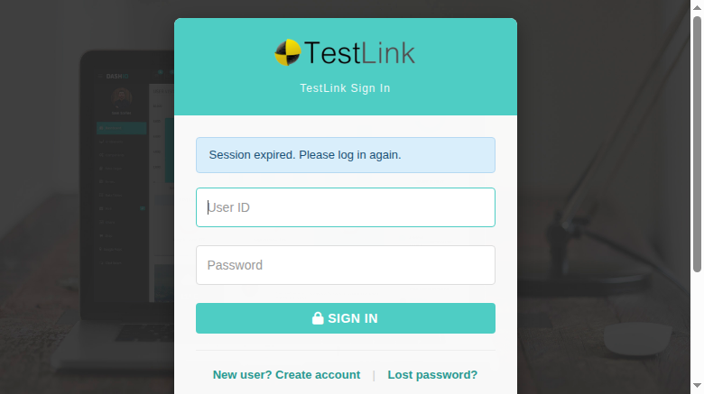

# Task, Issue #1760 — User & Role Management: bounce to login on a 401 `session_expired`

**Screens:** `gui/templates/usermanagement/usersView.html` (User Management),
`gui/templates/usermanagement/rolesView.html` (Role Management)
**BFF:** `api/users/index.php` (changed), `api/roles/index.php` (already correct)
**Status:** implemented, verified, pushed on `task/issue-1760`

## The gap — it was TWO layers, not one

Legacy 1.9.20 ran `testlinkInitPage()` on **every** page, which called `checkSessionValid()`
(`lib/functions/common.php:281-310`): a session idle longer than
`config_get("sessionInactivityTimeout")` minutes was redirected to
`login.php?note=expired&destination=<this screen>` via `redirect(..., "top.location")`
**before the first render**, so no user/role screen ever painted a form against a dead session —
and no write could be committed.

The issue body listed only the front-end half of the gap. The measurement found more:

### Layer 1 — `api/users/index.php` never enforced the inactivity window

`api/_guard.php:175-198 bffEnforceSession()` existed and was called by `api/roles/index.php:40`
after the `userID` gate and before any route dispatch, but **the Users BFF never called it**.
`doSessionStart()` alone does not enforce the window, so a tab left open past the timeout kept
serving the user catalog **and kept writing users**:

```
-- STALE session (lastActivity = now-700000; window = 9900 min = 594000 s) --
GET  /api/users/index.php           -> 200 {"status":"ok","items":[…admin…]}
GET  /api/users/index.php/meta/grants -> 200 {"status":"ok","grants":{…}}
POST /api/users/index.php (create)  -> 200 {"status":"ok","item":{"id":2,"login":"stale_probe"}}
select id,login from users;          -> 1 admin, 2 stale_probe     <-- the row was really written
```

while the sibling Roles BFF already answered `401 {"code":"session_expired"}` for the same stale
session. Fix: one call, `bffEnforceSession($db);`, placed like the Roles one.

### Layer 2 — neither screen inspected the 401 status

| screen | request paths | before |
|---|---|---|
| `usersView.html` | 12 | `401` → deny box "mgt_users right required" (path 1), silently swallowed (2–6), **alert "login does not exist"** (7), **alert/toast "the write failed"** (8–12) |
| `rolesView.html` | 8 | `401` → deny box "role_management right required" (3), swallowed (1, 2, 4), **false write-failure messages** (5, 7, 8), **opened the delete-confirm dialog with an armed Delete button** (6) |

A stale session therefore produced a *rights* diagnosis that did not exist, and a *write-failure*
diagnosis for writes that were never attempted. Legacy could show none of them.

## The fix

`api/users/index.php` — `bffEnforceSession($db);` after the `userID` gate, before the `mgt_users`
right check and before any route dispatch (covers the four `/meta/*` reads, the list, `?login=`,
`/{id}`, `POST`, `PUT`, `DELETE`, `reset-password`, `generate-apikey`).

`usersView.html` / `rolesView.html` — the proven helper set from
`usersAssignProject.html:325-396` (issues #1614/#1620, `usersAssignPlan.html:579-613` #1646):

* `sessionExpired(xhr)` — **keys on the HTTP status** (401) with the body
  `code === 'session_expired'` as a secondary trigger. Status-first is mandatory: an *absent*
  session answers `401 {"status":"error","message":"Not authenticated"}` with **no `code` key at
  all** (`api/users/index.php:27`, `api/roles/index.php:26`), and a code-only test would have let
  that fall through into the deny box. Shows the localized `auth.sessionExpired` toast as an error,
  then re-arms a **single** 600 ms `window.top` bounce to
  `login.php?note=expired&destination=<path + query>` (the Dashio shell lives in an iframe, so only
  the top window is redirected — the stale shell and its menu go with it).
* `showSessionExpired()` — terminal state: hides the demo banner, **tab bar** and every
  interactive block (toolbar, grid toolbar, table, footers), closes the modal(s) — including the
  role **delete-confirm** dialog whose Delete button was really clickable — destroys the DataTable,
  empties `tbody` and clears the cached model (`allItems`/`roleMap`/`localeMap`/`authMeta`/
  `rightsMap`/`allRights`/`canViewEvents`). **No deny box**: a rights message would send the user
  chasing a configuration problem they do not have.
* `sessionDead` — entry guard in every loader and every action function, plus a `if (sessionDead)
  return;` in every success callback that could repaint the neutralised screen from a request that
  was in flight when the 401 landed (and in `loadMeta`'s `.always()`, which used to kick off the
  user-list load even after a 401).

403 handling is untouched on both screens: a rights failure still shows the deny box.

**No i18n change** — `auth.sessionExpired` already exists in all ten bundles (de, en, es, fr, it,
ja, pt, ro, ru, zh).

## Verification

Stale session = age the session file's `lastActivity` to `now-700000` (window 594 000 s; ageing by
only −100 000 s still returns 200 because every valid call slides `lastActivity` forward).

### API (`tmp/repro_1760.sh`)

| request | stale, before | stale, after | valid session |
|---|---|---|---|
| `GET /api/users/index.php` | `200` + user list | **`401 {"code":"session_expired"}`** | `200` |
| `GET /api/users/index.php/meta/grants` | `200` | **`401`** | `200` |
| `POST /api/users/index.php` (create) | `200`, row written | **`401`, table unchanged** | `200` |
| `GET /api/roles/index.php`, `/meta/rights` | `401` | `401` | `200` |
| no cookie, either BFF | `401` (no `code`) | `401` (no `code`) | — |

### Screen (headless Chrome, real stale session)

* `usersView.html?tproject_id=1&tplan_id=0` → `login.php?note=expired&destination=%2Fgui%2Ftemplates%2Fusermanagement%2FusersView.html%3Ftproject_id%3D1%26tplan_id%3D0`,
  login page shows "Session expired. Please log in again."
* `rolesView.html?tproject_id=1&tplan_id=0` → same bounce, same note.

### Helper matrix (both screens, in-page)

| input | result |
|---|---|
| `{status:401, body {code:session_expired}}` / `{401, empty body}` / `{401, HTML body}` / `{401, no code}` / `{200, code:session_expired}` | `true` |
| `{status:403}` / `{200}` / `{500}` / `null` | `false` (403 → deny box preserved) |
| after a `true`: toast = "Session expired. Please log in again." (`.err`), tab bar / toolbar / table hidden, **deny box hidden**, 0 rows, model cleared, all loaders + action functions inert | verified on both screens |

### Regression

* valid session: `usersView` 2 rows + 4 tabs, `rolesView` 9 roles, no deny box — unchanged.
* 403 path (`norights` / role 3, fixture from `tmp/mkuser_norights.php`): deny box shown, **no
  bounce**, `sessionDead === false`.
* `select count(*) from events where log_level <> 16` → **0**; browser console: only the expected
  403 network log, no JS errors.
* `php -l api/users/index.php` clean; `node --check` on both extracted inline scripts clean.

### Code-review hardening (post-review, verified)

1. `sessionExpired()` made **idempotent** — `if (sessionDead) { return true; }` after the detection:
   three concurrent 401s (the screen fires 5 requests on load) all answer `true`, so no caller
   falls into its own error branch, while the toast and the navigation timer fire exactly once.
2. `if (sessionDead) { return; }` added as the first statement of every `$.ajax` **success**
   handler (5 in `usersView.html`, 3 in `rolesView.html`) so a response that raced the bounce
   cannot repaint or re-open a modal over the neutralised screen.
3. No new i18n key: the only new user-visible string is the pre-existing
   `TLi18n.t('auth.sessionExpired')`.

Suite `1760` in `tmp/TLU_Test_Cases.md`: **26/26 PASS**.


