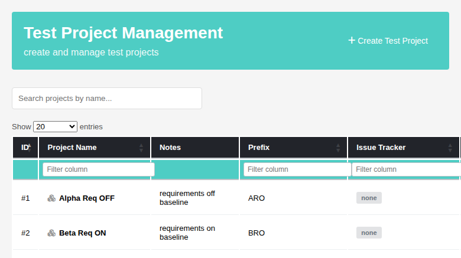

# Task — Issue #988: requirement-feature quick toggle in `projectsView`

Modernization of the **Test Project Management** screen
(`gui/templates/projectsView.html`) restoring the legacy
**"Requirement Feature"** quick toggle that the 2.0.1 rewrite dropped.

## What legacy did

`gui/templates/dashio/project/projectView.tpl` gave the project list a dedicated
column whose entire content was a click-to-change toggle icon:

- header — `projectView.tpl:92`
  ```smarty
  <th class="icon_cell" {#NOT_SORTABLE#}>{$labels.th_requirement_feature}</th>
  ```
  Position: after Code Tracker, before Active. `icon_cell` +
  `{#NOT_SORTABLE#}` and **no** `{#SMART_SEARCH#}` — deliberately not sortable
  and not filterable.

- body — `projectView.tpl:126-134`
  ```smarty
  <td class="clickable_icon">
    {if $testproject.opt->requirementsEnabled}
      <i class="fas fa-toggle-on" title="{$labels.active_click_to_change}"
         onclick="doAction.value='disableRequirements';itemID.value={$testproject.id};$('#testProjectView').submit();"></i>
    {else}
      <i class="fas fa-toggle-off" title="{$labels.inactive_click_to_change}"
         onclick="doAction.value='enableRequirements';itemID.value={$testproject.id};$('#testProjectView').submit();"></i>
    {/if}
  </td>
  ```

- controller — `lib/project/projectEdit.php:87-88` and `:118-119` dispatch the
  `doAction` value to the manager method of the same name, then set
  `$reloadType = 'reloadNavBar'` to redraw the list.

- manager — `lib/functions/testproject.class.php:3935-3951`
  ```php
  function enableRequirements($id) {
    $opt = $this->getOptions(intval($id));
    $opt->requirementsEnabled = 1;
    $this->setOptions($safeID, $opt);
  }
  ```
  Reads the stored `testprojects.options` blob, flips **only**
  `requirementsEnabled`, writes it back. No AUDIT event on this path.

Labels: `locale/en_US/strings.txt:413` `th_requirement_feature`,
`:45` `active_click_to_change = 'Active (click to set inactive)'`,
`:62` `inactive_click_to_change = 'Inactive (click to set active)'`.

## What the modern screen was missing

The 2.0.1 rewrite collapsed legacy's two icon columns ("Requirement Feature" and
"Active") plus the "Public" flag into a single text **Status** badge
(`projectsView.html` `projectRow()`), and the requirement flag survived only in
the edit modal's "Enable Requirements" checkbox. There was no column, no
per-row affordance and no BFF route for it.

## What was implemented

### 1. BFF — `api/projects/index.php`

New route `POST /api/projects/<id>/requirements` with body `{"enabled":0|1}`.

Because the id sits one segment *before* the action word
(`/api/projects/6/requirements`), the generic `ctype_digit(end($parts))` id
resolution cannot see it. The dispatcher detects `last === 'requirements'`,
clears `$projectId` and re-reads it from `$parts[count($parts) - 2]`, so a
malformed path falls through to a `Project ID required` 400 instead of silently
reaching `createProject()`.

The handler calls `$tprojectMgr->enableRequirements($id)` /
`disableRequirements($id)` **verbatim** and re-reads the flag through
`getOptions()` so the response reports what actually landed in the DB.

A dedicated route rather than the pre-existing
`PUT /api/projects/<id>` with `{optReq:n}`: `updateProject()` re-runs
`crossChecksBFF()` (duplicate name/prefix validation), rewrites
name/prefix/notes/color, calls `activate()` and `applyTrackers()`, and
unconditionally logs `audit_testproject_saved`. Legacy's toggle does none of
that.

Auth model unchanged: the session check, `bffSameOriginGuard()` and the
`mgt_modify_product` gate at the top of the file already cover the new route, so
a role-3 "no rights" user gets the same `403` as every other projects operation.

Status codes: `404` unknown project, `400` missing/invalid `enabled` or malformed
path, `200 {"success":true,"id":N,"optReq":0|1}` on success.

**Route shape is matched exactly.** `parts === ['api','projects',<id>,'requirements']`.
Detection is by the presence of the literal `requirements` segment anywhere in the
path, so `…/1/requirements/extra`, `…/requirements/1` and `…/1/2/requirements` are
all rejected with `400` and can never fall through to `createProject()` — verified
by firing all of them and confirming the project count is unchanged.

**`"enabled"` is coerced strictly.** `(int)(bool)"false"` is `1`, so a JSON client
sending the *string* `"false"` would have silently enabled the feature. The value
must now be one of `0, 1, false, true, "0", "1"`, otherwise `400`.

**The write is verified.** `testproject::setOptions()` only issues its UPDATE when
the stored blob already contained a decodable object (it iterates the *stored*
object), so a row whose `testprojects.options` is `NULL`/empty — exactly how the
shipped sample data inserts it — can never be written by that method. The route
re-reads the flag afterwards and returns `500 Failed to store the requirements
feature flag` instead of claiming `success:true`, and the client alerts rather than
redrawing a list that disagrees with the click. Legacy was silent here, so this is
deliberately stricter than legacy.

## Known limitation

The toggle cannot write to a project whose `testprojects.options` is `NULL`/empty:
`testproject::setOptions()` (`lib/functions/testproject.class.php:4000-4024`)
iterates the **stored** object and runs its UPDATE only when the loop body executed
at least once, so an empty stored object is a structural dead end. The route
surfaces that as a `500` instead of a silent no-op. The repair path is the edit
modal (or `PUT /api/projects/<id>`), which writes `options` unconditionally —
confirmed: a `PUT` on a `NULL`-blob project restores all four flags and answers
`200`. Legacy had the same dead end, silently; fixing `setOptions()` itself affects
every caller and is filed as a separate issue.

### 2. Screen — `gui/templates/projectsView.html`

- New header cell between "Code Tracker" and "Status", `data-i18n="proj.requirementFeature"`,
  **no** `data-col-filter` (legacy has no `{#SMART_SEARCH#}` for this column).
- Loading row `colspan` 8 → 9.
- `requirementFeature` cell: `fa-toggle-on` / `fa-toggle-off` with the
  `proj.activeClickToChange` / `proj.inactiveClickToChange` tooltips, plus
  `role="button"`, `tabindex="0"` and `aria-pressed` (the Dashio screens'
  keyboard convention; legacy had none).
- `columnDefs`: added `{ targets: 6, orderable: false }` (legacy
  `{#NOT_SORTABLE#}`) and moved the actions entry 7 → 8.
- `toggleRequirements(id, enable)` POSTs to the new route and calls
  `loadProjects()` on success (legacy `reloadNavBar`); on failure it alerts
  `proj.msg.errorToggleRequirements`.
- Delegated `keydown` handler on `#projectsTable .req-toggle` maps Enter/Space to
  a click — delegation is required because `renderProjects()` destroys and
  re-creates the tbody on every reload.
- CSS for `.req-toggle` (teal on / grey off, pointer cursor, focus ring).

### 3. i18n — all 10 locale bundles

New keys: `proj.requirementFeature`, `proj.activeClickToChange`,
`proj.inactiveClickToChange`, `proj.msg.errorToggleRequirements`.

Wording comes from the legacy locale strings, not invented:
`th_requirement_feature` for the header and
`active_click_to_change` / `inactive_click_to_change` for the tooltips. `ro_RO`,
`it_IT` and `ru_RU` have no `th_requirement_feature` string and fall back to
their own existing `proj.enableRequirements` wording, so the column header
matches the modal checkbox in the same language.

Keys are inserted **inside** the existing `proj.*` / `proj.msg.*` runs in local
alphabetical position — the bundles are grouped by namespace but not globally
sorted, and sorting the whole file produces a ~2900-line diff of pure reordering
that would bury the change in every concurrent-agent merge.

## Verification

14-case suite appended to `tmp/TLU_Test_Cases.md` — all PASS. Highlights:

- off→on and on→off both persist, including across a cache-ignoring reload
  (`GET /api/projects` → `1:1 2:0 3:0`).
- The other three option flags and name/prefix/notes/active/is_public are
  byte-identical before and after a toggle (checked in SQL).
- **Zero** new rows in the `events` table across three toggles — legacy logs no
  event for this path, and neither does the new route. No Error/Warning entries.
- 404 / 400 / 403 paths all return the expected JSON, and the 403 attempt left
  the row untouched.
- DataTables sort, global search, per-column filtering and the length menu all
  still work with the extra column; the new column is neither sortable nor
  filterable, as in legacy.

### Screenshot



## Related

- **#1633** — found while testing: the per-column filter boxes display
  `[object Object]` after any list re-render, because DataTables 1.13's
  `state.columns[i].search` is an object, not a string. Pre-existing (reproduced
  on the pre-change revision), filed separately, not fixed here.
