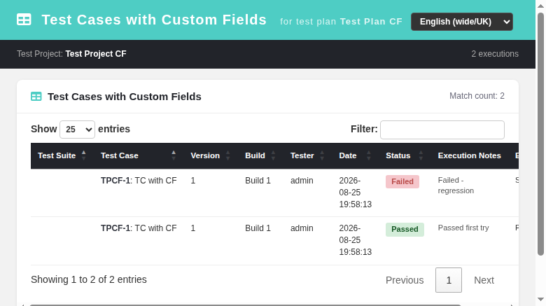

# Test Cases with Custom Fields Report — Modernized Screen

Modernization of **Test Cases with Custom Fields** (`lib/results/testCasesWithCF.php`)
— GitHub issue [#737](https://github.com/sebiboga/testlink-upgraded/issues/737).

The legacy Smarty screen is replaced by a standalone Dashio page
(`gui/templates/results/tcasesWithCF.html`) backed by a plain-PHP REST BFF
action inside `api/reports/index.php` (`action=tcases_with_cf`). The ASIDE
**Reports → Test Cases with Custom Fields** entry now points to the new HTML
screen when a test plan is selected.

**Path:** Reports → Test Cases with Custom Fields
**URL:** `gui/templates/results/tcasesWithCF.html?tproject_id=<id>&tplan_id=<id>`
**BFF API:** `api/reports/index.php?action=tcases_with_cf&tproject_id=<id>&tplan_id=<id>`
**Right:** `report_view` enforced server-side (same as legacy).



---

## Table of Contents
1. [What the screen does](#1-what-the-screen-does)
2. [REST API Reference](#2-rest-api-reference)
3. [Legacy parity notes](#3-legacy-parity-notes)
4. [i18n Keys](#4-i18n-keys)
5. [Security](#5-security)
6. [Testing](#6-testing)

## 1. What the screen does

| Feature | Legacy behavior | Modern implementation |
|---|---|---|
| Page load | `testCasesWithCF.php` loads CF definitions via `cfield_mgr::get_linked_cfields_at_execution()` | BFF action fetches same CF definitions, returns them as `cfinfo` array |
| Filter toolbar | Test Suite dropdown, Test Case dropdown, Build dropdown, Show button | identical: three comboboxes + Show button; cascading refresh on selection |
| Empty state | Table shown with "No custom fields" warning | Info panel with translated message, no table rendered |
| Results table | Static HTML table with dynamic columns for each CF | DataTables with sort, search, pagination; columns: Test Suite, Test Case, Version, Build, Tester, Date, Status, Execution Notes + one column per CF |
| CF values | Rendered from `executions.rows[].cfields` array | Same data shape; `cfinfo` drives column headers |
| Status badges | Plain text with color spans | Bootstrap badges with status-based coloring |
| Locale | Server-side Smarty `lang` | Client-side `TLi18n` module; 18 locale switcher |

## 2. REST API Reference

All routes require an authenticated session; callers without `report_view` get `403`.

### GET `api/reports/index.php?action=tcases_with_cf`

Returns test case execution results with custom field values.

**Query parameters:**
| Parameter | Required | Description |
|---|---|---|
| `tproject_id` | Yes | Test project ID |
| `tplan_id` | Yes | Test plan ID |
| `tcase_id` | No | Filter to specific test case |
| `build_id` | No | Filter to specific build |

**Response:**
```json
{
  "status": "ok",
  "cfinfo": [
    { "field_id": 6, "name": "CF_Environment", "label": "Environment" }
  ],
  "gui": {
    "testsuite": "Test Suite",
    "testcase": "Test Case",
    "build": "Build",
    "status": "Status"
  },
  "executions": {
    "header": [
      "Test Suite", "Test Case", "Version", "Build",
      "Tester", "Date", "Status", "Execution Notes"
    ],
    "rows": [
      {
        "testsuite_name": "Suite A",
        "tc_external_id": 1,
        "tcase_name": "TC with CF",
        "version": 1,
        "build_name": "Build 1",
        "login": "admin",
        "execution_ts": "2026-08-25 19:58:13",
        "status": "failed",
        "notes": "Failed - regression",
        "cfields": { "Environment": "Staging" }
      }
    ]
  }
}
```

## 3. Legacy parity notes

- CF definitions fetched via same `cfield_mgr::get_linked_cfields_at_execution()` path
- Execution rows built from same DB query (executions + tcversions + builds + cfield_values)
- `getPathLayered()` null guard added to handle missing CF definitions gracefully
- Test Suite / Test Case / Build cascading filter mirrors legacy dropdown behavior
- Status coloring uses same hex values as legacy Smarty template

## 4. i18n Keys

All strings use `TLi18n` keys; no hardcoded text.

| Key | English value |
|---|---|
| `tcwcf.title` | Test Cases with Custom Fields |
| `tcwcf.subtitle` | for test plan |
| `tcwcf.noCF` | No custom fields defined for test cases or executions |
| `tcwcf.showBtn` | Show |
| `tcwcf.matchCount` | Match count: |
| `testsuite` | Test Suite |
| `testcase` | Test Case |
| `build` | Build |
| `status` | Status |
| `common.filter` | Filter: |
| `common.showEntries` | Show |
| `common.entries` | entries |
| `common.pageInfo` | Showing %s to %s of %s entries |
| `common.prev` | Previous |
| `common.next` | Next |
| `common.errorLoading` | Error loading data |

Keys present in all 11 locale bundles (en, ro, de, fr, es, it, ja, pt, ru, zh, plus the base en).

## 5. Security

- Session-based authentication enforced at BFF entry point
- `report_view` right checked server-side before any DB query
- `tproject_id` validated against user's allowed projects
- All output escaped via `htmlspecialchars()` in DataTables rendering

## 6. Testing

Test suite #37 in `tmp/TLU_Test_Cases.md` — 15 test cases covering:
- Screen load without PHP warnings
- Empty state when no CFs defined
- Filter dropdown population and cascading
- Results table columns and data correctness
- Custom field value display
- DataTable pagination and search
- Locale switcher translation
- Aside menu link target
- API data response format
- API 401 without session
- Event Viewer cleanliness
- View-only user permissions
