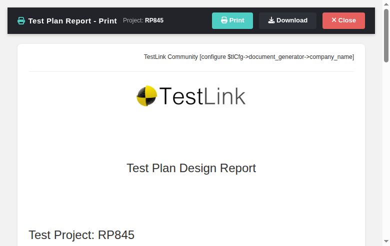

# Test Plan Report Print (reportPrint) — Modernized Screen

Modernization of the **Test Plan Report print** output — the standalone
entry point that `testPlanReport.html` (the modernized navigator) previously
opened via the legacy controller `/lib/results/printDocument.php` in a new
window, and which per-build report links pointed at through `lnl.php`. It is
replaced by a new Dashio print popup
(`gui/templates/results/reportPrint.html`) backed by a plain-PHP REST BFF
(`api/reportsprint/index.php`), reusing the exact same battle-tested legacy
document generator so every printed document stays byte-for-byte the classic
TestLink report. GitHub issue
[#845](https://github.com/sebiboga/testlink-upgraded/issues/845).

**URL:** `gui/templates/results/reportPrint.html?type=<testplan|testreport|testreport_onbuild>&level=<testproject|testsuite>&id=<id>&tproject_id=<id>&tplan_id=<id>&format=<n>&build_id=<id>&opts=<urlencoded print opts>`
**BFF API:** `api/reportsprint/index.php?action=print&...` / `?action=download&...`
**Rights:** `testplan_metrics` enforced server-side (same gate as legacy
`checkRights()` in `printDocument.php`).

---
## Table of Contents
1. [What the screen does](#1-what-the-screen-does)
2. [REST API Reference](#2-rest-api-reference)
3. [Legacy parity notes](#3-legacy-parity-notes)
4. [i18n Keys](#4-i18n-keys)
5. [Security](#5-security)
6. [Testing](#6-testing)

## 1. What the screen does

| Feature | Legacy behavior | Modern implementation |
|---|---|---|
| Entry point | `testPlanReport.html` opened `/lib/results/printDocument.php` in a new window (full standalone page) | opens `reportPrint.html` (new tab) with the same semantics (type / level / id / tproject_id / tplan_id / format / build_id + print options) |
| Per-build report links | navigator per-build `report_url` used `lnl.php?apikey=...` | `report_url` re-points to `reportPrint.html?type=testreport_onbuild&...&build_id=<bid>&format=0` |
| Document generation | Smarty/PHP rendered a standalone page via `printDocument.php` | BFF `action=print` re-includes the untouched legacy generator and returns the body as JSON; the screen renders it into the popup |
| Print | browser print of the standalone page | **Print** toolbar button issues `window.print()` on the generated document |
| Download | (legacy n/a — opened copies of the standalone page) | **Download** opens the BFF `action=download` endpoint, streaming the generated document as an attachment (`Content-Disposition: attachment; filename="RP8-test_plan-….html"`) |
| Close | close the window | **Close** closes the popup |
| Locale | PHP `$g_lang` | client-side `TLi18n` switcher; keys in `rpt.*` namespace |
| Errors | legacy pages errored out / anonymous apikey path | i18n error banners (not authorized / invalid plan / generation failed) with Print/Download disabled |

## 2. REST API Reference

Session-authenticated JSON; safe verb (GET) only, so no Origin guard needed.
Session (cookie) auth is mandatory — the legacy anonymous `apikey` path is NOT
replicated.

| Method | Route | Query | Returns |
|---|---|---|---|
| GET | `?action=print` | `type` (`testplan\|testreport\|testreport_onbuild`), `level` (`testproject\|testsuite`), `id`, `tproject_id`, `tplan_id`, `format` (0=HTML), `build_id` (for onbuild), plus print options (`toc`, `headerNumbering`, `header`, `summary`, `body`, `author`, `keyword`, `cfields`, `requirement`) | `{status, level, id, doc_type, body_html}` |
| GET | `?action=download` | same params as `print` | streamed attachment: `Content-Type: text/html`, `Content-Disposition: attachment; filename="RP8-<doc>-<date>.html"` |

### Error conditions
- Missing/invalid session → HTTP 401.
- No `testplan_metrics` right on the project/plan → HTTP 403 `No permission`.
- Plan that does not belong to the given test project → HTTP 400 `Invalid test
  plan for this test project`.
- Unknown `action` → HTTP 404 `Unknown action`.

## 3. Legacy parity notes

- The BFF re-includes the **untouched** legacy generator
  `lib/results/printDocument.php` inside an output buffer and returns the
  produced body as JSON — the same strategy used by `api/executionprint`
  (Refs #844) and `api/reqdoc` (Refs #755), so every report format (test plan,
  test report, per-build report) renders exactly as it did in 1.9.20/2.0.1.
- Two scoping/loading gotchas had to be handled (documented in the BFF header):
  - The legacy controller must be `require`d at **TOP-LEVEL script scope** after
    `chdir('lib/results')` (its nested relative requires resolve against CWD, and
    `$tlCfg` must be the global). Including it from a helper function scope makes
    its `cfg/reports.cfg.php` include run where global `$tlCfg` is invisible
    (`Attempt to assign property on null`).
  - The BFF does NOT pre-load `cfg/reports.cfg.php` (the legacy `require`s it
    itself); pre-loading caused `Constant FORMAT_* already defined` E_WARNINGs.
    The BFF uses literal values: `FORMAT_HTML`=0 and plan-based doc types
    (`testplan`, `testreport`, `testreport_onbuild`).

## 4. i18n Keys

All labels are client-side via `TLi18n`; keys under the `rpt.` namespace
(`rpt.header`, `rpt.project`, `rpt.btnPrint`, `rpt.btnDownload`,
`rpt.btnClose`, `rpt.errLoad`, `rpt.empty`). Present in all 10 bundles
(`en ro de es fr it ja pt ru zh`).

## 5. Security

- Session-authenticated BFF only — the legacy anonymous `apikey` access to a
  generated report is not exposed.
- Server-side right re-check on every request (`testplan_metrics` on the
  context project/plan); a user without that right gets 403 even with a valid
  session.
- The `id` / `tproject_id` / `tplan_id` / `build_id` values are int-cast and the
  plan is validated as belonging to the project before generation, so a
  hand-crafted bad id returns a clean 400 instead of a fatal.
- Supported `type`/`level` values are white-listed; anything unexpected is
  rejected before generation.

## 6. Testing

See **Suite 845 — Test Plan Report print endpoint** in
`tmp/TLU_Test_Cases.md` (15/15 PASS): whole-plan / one-suite /
testreport_onbuild per-build / testreport generation; download headers; bogus
plan 400; unknown action 404; no-rights user 403; guest-with-right user 200;
navigator "Print whole test plan report" button opens the popup with the proper
`opts`; per-build `report_url` re-pointing; print popup render; locale loads;
Event Viewer clean; console clean.
