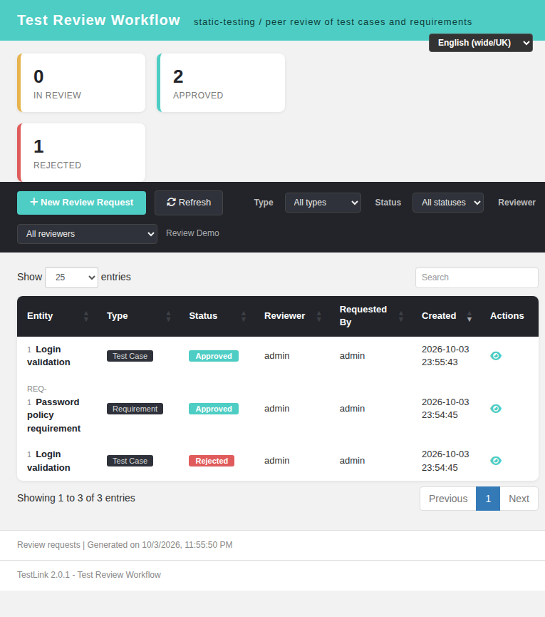

# Test Review / Static-Testing Workflow (ISTQB #1054) — Modernized

Legacy TestLink 1.9.20 had no first-class peer-review workflow for test cases or
requirements: reviewers were tracked ad-hoc through the `tcversions.status` /
`req_versions.status` domains (draft, ready for review, review in progress,
rework, obsolete, final), with no reviewer assignment, no review record and no
audit trail. This gap (ISTQB CTFL chapter 3 static testing, issue #1279) is now
closed in TestLink 2.0.1.

## Modern screen

- Page: `gui/templates/reviews/reviews.html`
- API:  `api/reviews/index.php`

The Dashio screen is a review board for the selected test project:

- Tiles for **In review / Approved / Rejected / Cancelled** counts.
- DataTable of review requests: entity title + doc id, type (Test Case /
  Requirement), status badge, reviewer, requester, created timestamp, actions
  (View details, Record decision).
- Filters: type, status, reviewer, plus DataTables search / paging.
- **New Review Request** modal: entity type, entity (latest version of a test
  case or requirement of the project), reviewer (users with access to the
  project), comments.
- **Review Decision** modal: review comments, Approve / Reject (Confirm /
  Cancel). A decision is final and syncs the underlying entity status.
- All labels come from the client-side `TLi18n` module; `review.*` keys exist in
  every locale bundle (`en`, `ro`, `de`, `es`, `fr`, `it`, `ja`, `pt`, `ru`,
  `zh`).

The ASIDE menu gains a **Review** entry (section 7b) for users holding
`mgt_view_tc` / `mgt_view_req` / `mgt_modify_tc`.

## REST BFF

`api/reviews/index.php` (session auth, JSON I/O):

| Method | Route | Purpose |
|---|---|---|
| GET | `?action=meta&tproject_id=N` | statuses, entity types, reviewer candidates, `canRequestTc` / `canRequestReq` |
| GET | `?action=candidates&tproject_id=N` | assignable reviewers |
| GET | `?action=list&tproject_id=N` | review rows (joined logins) + per-status counts |
| GET | `?action=entities&tproject_id=N&entity_type=tcase\|requirement` | reviewable entities (latest version) |
| POST | `?action=create` | create a review request |
| POST | `?action=decide` | approve / reject / cancel a review |

Rights: `mgt_view_tc` / `mgt_view_req` to read; `mgt_modify_tc` /
`mgt_modify_req` to request or decide. Schema is created lazily
(`CREATE TABLE IF NOT EXISTS tc_reviews`); `tc_reviews` is whitelisted in
`lib/functions/object.class.php` and the DDL also lives in
`install/sql/mysql/testlink_create_tables.sql`.

Decisions sync entity status:

- Test case: approve → `Final` (7), reject → `Rework` (4).
- Requirement: approve → `F`, reject → `W`.

Every transition writes an event: `REVIEW_REQUEST`, `REVIEW_APPROVE`,
`REVIEW_REJECT`.

## Verification

- Curl: meta / list / entities (tcase + requirement) / create (tcase +
  requirement) / decide (approve + reject) all OK; entity statuses confirmed in
  the DB (`req_versions.status = F`, `tcversions.status = 4` then `7`).
- Browser: tiles, table, filters, i18n (EN + RO), create modal and decision
  modal exercised; toasts `Review request created.` /
  `Review decision recorded.`; counts update live.
- Event Viewer: no new Error/Warning entries.
- Test suite: `Task — Issue #1279` in `tmp/TLU_Test_Cases.md` — 9/9 curl steps +
  browser create/decide PASS.

## Defect found and fixed during the run

The requirement entity listing originally joined `req_versions.id =
requirements.id`. In 2.0.1 the requirement version is a **child node** of the
requirement node (`nodes_hierarchy.parent_id = requirements.id`), so the query
returned no requirements. The join now resolves the latest version through the
child node (`nodes_hierarchy(parent_id) JOIN req_versions ON req_versions.id =
child.id`), verified id 8 → version node 9.

