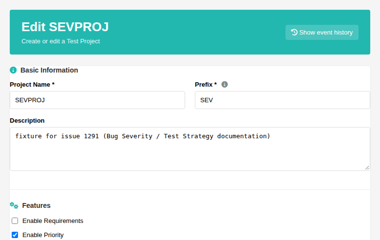
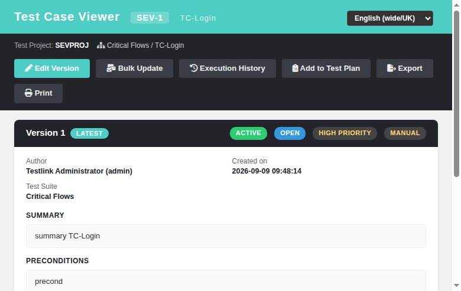

# Bug Severity (Test Strategy) — Documentation

Refs: issue #1291 · Task run · Branch `task/issue-1291`

## What this page covers

**Bug Severity** is a part of the **Test Strategy** in TestLink 2.0.1: the
severity/priority levels of a test effort are not hard-coded UI labels — they
are **defined in the Test Strategy** of each test project and drive how
defects found during test execution are classified and prioritised.

TestLink splits the classic "bug severity" concept into three coordinated
levels that together form the project's severity model:

| Level | Where it lives | Values |
|---|---|---|
| **Priority (importance)** | test case version (`tcversion.importance`) | High (3) / Medium (2) / Low (1) |
| **Urgency** | test-plan ↔ test-case link (`testplan_tcversions.urgency`) | High (3) / Medium (2) / Low (1) |
| **Execution priority** | computed = `importance × urgency` | High / Medium / Low (thresholds from `urgencyImportance` config) |

The toggle that turns this model on **per test project** is the **Enable
Priority** project option (`testPriorityEnabled`) — the first place the
severity level scheme is "defined" in the strategy. When enabled, TestLink
shows Importance / Urgency / Priority columns in the Test Case
Specification and the execution-oriented screens; when disabled, the whole
severity layer is hidden.



## 1. Where the severity levels are defined

### 1.1 Project level — Enable Priority

The Test Strategy of a project is configured on **Test Project Management >
Create/Edit Test Project** (`gui/templates/projects/projectEdit.html`, BFF
`api/projects/index.php`). The **Features** section holds the
**Enable Priority** checkbox:

- **ON** → the project's test cases carry an Importance and can be assigned
  Urgency inside a test plan; priority-aware reports and columns activate.
- **OFF** (default) → severity/priority is not tracked on this project.

Server-side write path: `api/projects/index.php:209-210`
(`$options->testPriorityEnabled = isset($input['optPriority'])`.

### 1.2 Test case version — Importance

Each test case version stores an **Importance** (`tcversion.importance`):
3 = High, 2 = Medium, 1 = Low. This is the per-test-case severity the author
assigns while writing the test (how severe is the defect this case is meant
to catch).

Modern screens exposing it:

- **Test Case Viewer** (`gui/templates/testcases/tcView.html`) renders the
  value as a badge (`tcview.importanceHigh/Medium/Low`, mapping in
  `tcView.html:248-250`): "HIGH PRIORITY" / "MEDIUM PRIORITY" / "LOW PRIORITY".



- **Test Specification** (`tspec.importance*`), **Search** (`search.importance`),
  **My Test Case Assignments** (`tcPerUser.colImportance`), **TC Assignment
  Overview** (`tca.colPriority`), **Set Test Urgency** (`turg.colImportance`).

Set programmatically via `testcase::setImportance()` (`lib/functions/testcase.class.php:7709`).

### 1.3 Test plan link — Urgency

When a test case version is added to a **test plan**, the strategy may assign
an **Urgency** to the link (`testplan_tcversions.urgency`), again High /
Medium / Low. Urgency answers "how urgently must this test be executed" and is
managed from:

- **Set Test Urgency** (`gui/templates/plans/testUrgency.html`, BFF routes
  `GET/POST /urgency`, `/urgency/suite`, `/urgency/tcases` in
  `api/plans/index.php`), legacy `lib/plan/planUrgency.php`.

Write paths: `testPlanUrgency::setTestUrgency()` / `setSuiteUrgency()`
(`lib/functions/testPlanUrgency.class.php:33,65`).

### 1.4 Computed execution priority

The final severity-driven **priority** is the product of the two strategy
levels:

```
priority = importance × urgency
```

Level thresholds come from the global Test Strategy configuration
(`config.inc.php:2041-2048`):

```php
$tlCfg->urgencyImportance = new stdClass();
$tlCfg->urgencyImportance->threshold['low']  = 3;
$tlCfg->urgencyImportance->threshold['high'] = 6;
```

`priority_to_level()` (`lib/functions/common.php:766-781`):

- `priority >= 6` → **HIGH**
- `priority <  3` → **LOW**
- otherwise        → **MEDIUM**

Example (credit-card banking flows): a High-importance × High-urgency case
scores 9 and gets **HIGH** priority; a Low-importance × Low-urgency case
scores 1 and gets **LOW**. Reports that slice results by priority
(e.g. "Results by priority", `rgm.priority` in the REST BFF
`api/reports/index.php` priority rows) rely on exactly these levels.

## 2. Priority grid

| Importance \ Urgency | High (3) | Medium (2) | Low (1) |
|---|---|---|---|
| **High (3)** | High (9) | High (6) | Medium (3) |
| **Medium (2)** | High (6) | Medium (4) | Low (2) |
| **Low (1)** | Medium (3) | Low (2) | Low (1) |

## 3. Bug severity in the defect-report flow

The severity level of an **actual bug** is defined once the test fails and a
defect is filed. In TestLink 2.0.1 the execution screen
(`gui/templates/execute/execTest.html`) links or creates bug/issue IDs
against the configured **Issue Tracker** (`exe.bugId`, `exe.createBugDone`):
the tracker (GitHub, JIRA, Redmine, Bugzilla, Mantis ...) owns the
bug severity field (Critical / High / Medium / Low etc.). TestLink keeps the
priority model (Importance × Urgency) so the **test strategy severity**
aligns with what the team then files in the tracker.

## 4. Rights model

- Changing test project "Enable Priority" requires the project management
  rights enforced by `api/projects/index.php` on the create/edit routes.
- Setting Urgency on a plan requires `testplan_planning`
  (`testPlanUrgency.php` legacy parity), enforced server-side on every
  `/urgency*` route.
- The urgency menu entry keeps the `testplan_set_urgent_testcases` grant gate.

## 5. Legacy parity

| Legacy 1.9.20 | Modern 2.0.1 |
|---|---|
| `tcversion.importance` 3/2/1 | unchanged schema; displayed via `tcview.*` / `tspec.*` labels |
| `testplan_tcversions.urgency` 3/2/1 | unchanged schema; managed by the modern Set Test Urgency screen |
| `priority_to_level()` thresholds (`urgencyImportance`) | the modern BFF `prioLevel()` (`api/tcassignments/index.php:103`, `api/execassignment/index.php:110`) uses simplified hardcoded thresholds (<=2 low, <=4 medium, >4 high) — functionally similar to the config thresholds (low=3 high=6) but diverging at priority value 5 |
| `testPriorityEnabled` project option | still stored on the project; exposed/edited in `projectEdit.html` |

## 6. Test cases

Suite in `tmp/TLU_Test_Cases.md` — `Task — Issue #1291: Document Bug
Severity` (see the repository test-case document for steps and results).
Screenshots live in the GitHub Wiki page "Bug Severity".

## 7. Modern Severity Configuration screen (severityConfig, Refs #1294)

The per-project **Severity Configuration** screen (`gui/templates/projects/
severityConfig.html` + `api/severityconfig/index.php`, ASIDE → Product →
Severity Configuration) is a Dashio modern screen where the Test Strategy
severity scale is defined:

- **Project selector** lists all projects; the current `tproject_id` URL
  param preselects a project.
- **Severity in the Test Strategy** card shows whether the project's
  **Enable Priority** (`testPriorityEnabled`) option is ENABLED/DISABLED.
- **Severity levels** card: one row per level (LOW/MEDIUM/HIGH/CRITICAL)
  with a custom **label** (max 40 chars) and **description** (max 300
  chars). Editing marks the scale dirty and enables the Save buttons; the
  default badge is shown next to a customized level.
- **Severity / priority preview** grid renders the computed mapping
  `importance × urgency` → severity level live (as you type): products
  `<3` → LOW, `>=6` → HIGH/CRITICAL, otherwise MEDIUM; `3×3=9` → CRITICAL.
- **Save** persists the scale into the project `options` blob under the
  `severityLevels` property via `testproject::update()` and logs an AUDIT
  event (`severityConfig_saved`, objectType `testprojects`).
- **Reset to defaults** drops the `severityLevels` property so the default
  scale is served again.
- The toolbar **Bug Severity guide** link opens `documentation/bugSeverity.html`.

**API contract** (`api/severityconfig/index.php`):

- `GET ?action=projects` — accessible project list (id/name/prefix) for the
  selector; authenticated session only.
- `GET ?tproject_id=N` — returns `project`, `priorityEnabled`,
  `levels` (default scale when none stored, merged scaffold otherwise),
  `canEdit` (`mgt_modify_product`); 401 anon, 404 unknown project.
- `POST/PUT ?tproject_id=N` body `{levels:[{level,code,label,description}]}`
  — **403** without `mgt_modify_product`; 400 no/invalid levels, 404 unknown
  project; empty `levels` array = reset-to-defaults; writes the AUDIT event.

**Rights:** writes gated on `mgt_modify_product` (403 with a no-rights
user); reads require only a valid session (401 anon). This mirrors the
project-edit surface.

**i18n:** `sevcfg.*` (36 keys) + `footers.severityConfig` in all 10 locale
bundles.

**Regression suite:** `Suite 1294` in `tmp/TLU_Test_Cases.md` — 11/11 PASS
(load, ENABLED badge, preview grid, custom-label save + DB persistence,
reset-to-defaults, 401/403 gates, i18n completeness, Event Viewer clean).


## Files

- `docs/WIKI-BUG-SEVERITY.md` — this page (docs mirror, no image lines)
- `tmp/wiki-repo/Bug-Severity.md` — GitHub Wiki page (with images)
- `tmp/wiki-repo/images/bugseverity-*.png` — screenshots
- `docs/screenshots/bugseverity-*.png` — docs-mirror screenshots
- `tmp/fixtures_1291.php` — demo fixture (project SEVPROJ, priority enabled)