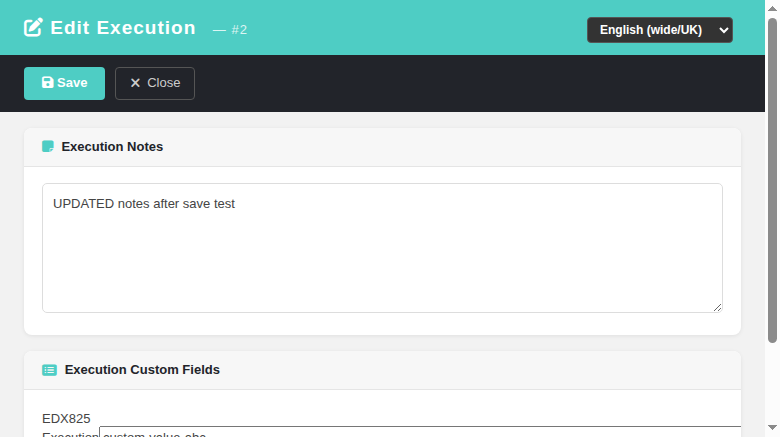
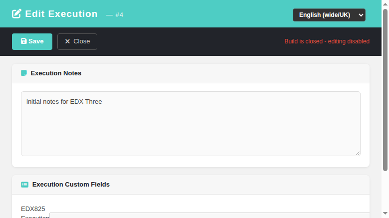
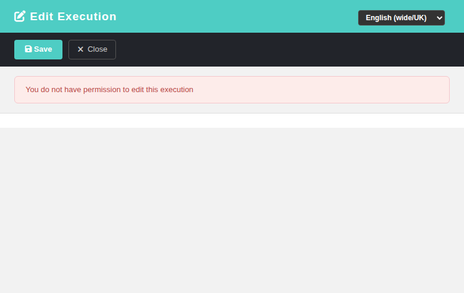

# Edit Execution — Modernized Screen

Modernization of the legacy **Edit Execution** popup (`lib/execute/editExecution.php`),
which lets a tester edit the **execution notes** and the **execution-level custom fields**
of an already-recorded execution row. GitHub issue
[#825](https://github.com/sebiboga/testlink-upgraded/issues/825).

The legacy popup (opened from `execTest.html` / `execHistory.html` via `openEditExecution()`)
is replaced by a standalone Dashio page (`gui/templates/execute/editExecution.html`)
backed by a plain-PHP REST BFF API (`api/executionedit/index.php`).

**Path:** Execute Tests (`execTest.html`) or Execution History (`execHistory.html`) → execution
row → **edit-notes (pencil) icon** → opens the popup.
**URL:** `gui/templates/execute/editExecution.html?exec_id=<id>&tproject_id=..&tplan_id=..`
**BFF API:**
- `GET  ?action=init&exec_id=N` → `{ exec_id, tcversion_id, tplan_id, tproject_id, notes,
  can_edit, build_is_open, exec_cfields_html, exec_cfields }`
- `POST ?action=update` (JSON body `{ exec_id, notes, custom_field_* }`) → `{ status, updated }`

**Rights:** `testplan_execute` **AND** `exec_edit_notes` — both required, evaluated on the
owning test project (mirrors legacy `checkRights()`). A tester role that can execute but
cannot edit notes gets 403.
**Tracking issue:** [#825](https://github.com/sebiboga/testlink-upgraded/issues/825)

---

## Behavioral parity with the legacy controller

The BFF reproduces `editExecution.php` exactly:

- **Notes** — `get_execution()` returns the current notes; the editor is a plain textarea
  (legacy used a web-editor; the plain textarea keeps the Dashio popup dependency-free and
  matches the modern `execSetResults.html` notes field). Saved via `updateExecutionNotes()`.
- **Execution custom fields** — rendered through the **same legacy helper** as
  `editExecution.php` (`testcase::html_table_of_custom_field_inputs(tcversion_id, null,
  'execution', '_cf', exec_id, tplan_id, tproject_id)`), so the input name contract
  `custom_field_<type>_<id>_<tcaseId>` is preserved and persisted via
  `cfield_mgr->execution_values_to_db()` (execution-edit path). Field definitions are
  returned for front-end required/format validation.
- **Formed-value guard** — the update route only writes `custom_field_*` names whose
  (type,id) belongs to a real execution-time custom field linked to the test case version,
  so a forged payload cannot write unrelated values.
- **Closed build** — when the execution's build is closed (`builds.is_open <> 1`) the
  editor is shown read-only (Save disabled) and the update route returns 400, matching
  legacy behaviour.
- **Notifications** — notes + CF updates are written directly exactly as the legacy
  `doUpdate()` did (no spurious audit rows).

---

## Screenshots

### Main editor (notes + execution custom field)

### Closed build — read-only (Save disabled)

### Insufficient rights (403)

---

## Test coverage

Test suite **825** (12/12 PASS) is appended to `tmp/TLU_Test_Cases.md` — covers notes
load/save, CF render/save, closed-build read-only, 404 unknown execution, 403 rights
(tester role), link switch, i18n in all 10 bundles, console clean, and Event Viewer clean.

One bug found & fixed during the run: the popup loaded jQuery from a non-existent local
path (`/gui/javascript/jquery-1.8.3.js`, 404 → `$ is not defined` killed the whole page);
fixed to the CDN `https://code.jquery.com/jquery-3.6.0.min.js` (same as
`execSetResults.html` / `execTest.html`).
