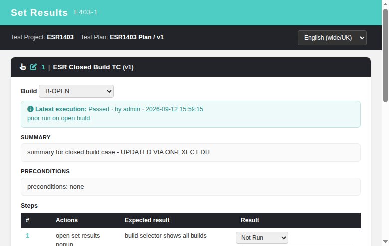
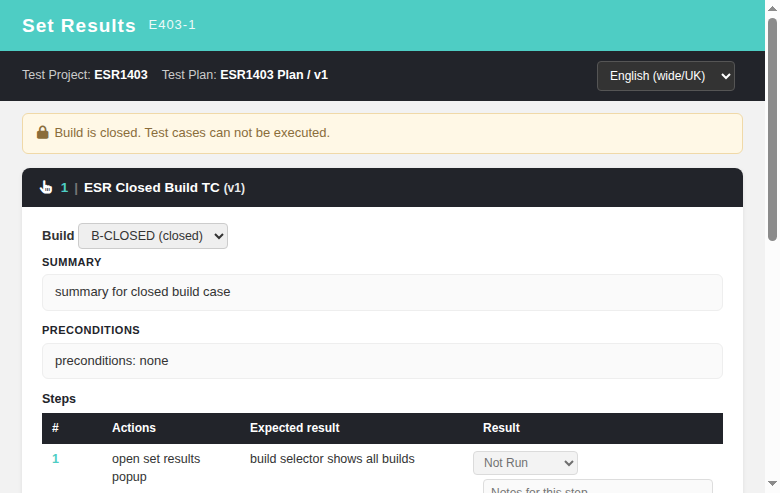
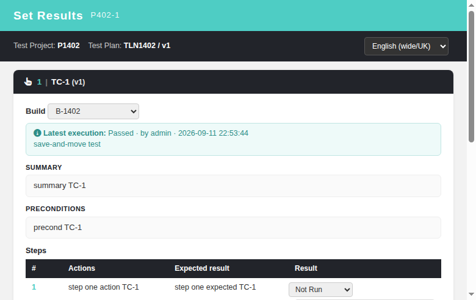

# Set Results — Modernized Screen

Modernization of the legacy "set results" execution popup
(`lib/execute/execSetResults.php`, `level=testcase` mode,
`gui/templates/dashio/execute/execSetResults.tpl`) — GitHub issue
[#817](https://github.com/sebiboga/testlink-upgraded/issues/817).

The legacy Smarty screen is replaced by a standalone Dashio page
(`gui/templates/execute/execSetResults.html`) backed by a plain-PHP REST BFF
API (`api/execsetresults/index.php`). The 5 report screens that still opened
the legacy `execSetResults.php` popup (tcasesWithCF, resultsMatrix,
assignedTcOverview, tcAssignments, and the shared
`gui/javascript/testlink_library.js` `openExecutionWindow()` helper) now open
the modern screen instead.

**Path:** reached from report screens (Results matrix, TC with CF, Assigned TC
overview, TC assignments) — row **execute** icon opens the popup.
**URL:** `gui/templates/execute/execSetResults.html?tplan_id=..&tcase_id=..&tcversion_id=..[&setting_build=..][&setting_platform=..]`
**BFF API:** `GET ?action=init` + `POST ?action=save` on `/api/execsetresults/`
**Rights:** `testplan_execute` (full) or `exec_ro_access` (read-only — Save
disabled and server rejects write).
**Tracking issue:** [#817](https://github.com/sebiboga/testlink-upgraded/issues/817)

---

## Behavioral parity with the legacy controller

The BFF reproduces the `level=testcase` path of `lib/execute/execSetResults.php`:

- **`GET ?action=init`** resolves test plan + owning project (access-checked),
  test case + version (must belong to the case AND be linked to the plan),
  and returns:
  - test case context (external id, name), version (summary, preconditions,
    importance, execution type),
  - steps (sorted by step_number),
  - builds of the plan (executable = active+open; newest active+open wins as
    default),
  - platforms linked to the plan (empty → UI hides the selector),
  - execution status vocabulary (f/b/p/n/x/u — the legacy virtual filter
    status `a`/All is excluded),
  - grants (`testplan_execute` / `exec_ro_access` / `edit_testcase`),
  - prior execution of this version on this build+platform, including recorded
    step-level results (partial-execution feature) so the form resumes the last
    run.
- **`POST ?action=save`** writes the execution with
  `write_execution()` (exec.inc.php), payload shape identical to
  `api/execute?action=save`: status code, notes, optional per-step results
  (step ids validated to belong to the version → forged ids skipped),
  execution duration, platform id. `not_run` results are ignored (legacy
  parity), non-executable builds and unlinked versions are rejected.

## Parameter normalization

Legacy callers used different key names (from `level=testcase` cookie-settings
contract and `openExecutionWindow()`):

| Modern | Legacy aliases |
|--------|----------------|
| `tcase_id` | `id` |
| `tcversion_id` | `version_id` |
| `build_id` | `setting_build` |
| `platform_id` | `setting_platform` |

## Edit test case on execution (Refs #1400)

Legacy parity: `exec_show_tc_exec.inc.tpl:476-481` shows a `note_edit` icon
(gated on `grants->edit_testcase` = `mgt_modify_tc` at project+plan level,
`execSetResults.php:1425`) left of the TC title, calling
`openTCaseWindow(tcase_id, tcversion_id, 'editOnExec&tplan_id=…')` which opens
the TC-spec viewer in a `TestCaseSpec` popup.

The modern popup mirrors this:

- **BFF** `GET ?action=init` returns `grants.edit_testcase` (1/0) computed with
  the exact legacy scope `hasRight('mgt_modify_tc', tproject_id, tplan_id)`.
- **UI** when granted, a pencil icon (tooltip "Show Test Case specification")
  precedes the TC title (`TC-1 (v1)`) in the header card. It opens the modern
  TC-spec viewer `gui/templates/testcases/tcView.html?tcase_id=..&tcversion_id=..&tproject_id=..`
  in a `TestCaseSpec` popup — the modern equivalent of the legacy
  `archiveData.php?show_mode=editOnExec` viewer (tcView.html itself offers the
  "Edit Version" button to users with design rights; window name `TestCaseSpec`
  is kept so repeated clicks reuse the popup, legacy behavior).

Users without `mgt_modify_tc` see the plain-text title (no icon, no popup).

## Auto-refresh after on-exec TC edit (Refs #1479)

Legacy parity: the legacy `editOnExec` viewer wired `testcase.class.php:7447-7460`
+ `gui/javascript/testlink_library.js:712-757` (`dialog_onLoad`/`dialog_onUnload`)
so the exec popup auto-refreshed when the `TestCaseSpec` popup closed after an
edit. Issue #1479 restores that behavior in the modern popup with a same-origin
`postMessage` signal chain (no backend change):

- **`execSetResults.html`** `openTcSpecWindow()` opens the viewer with
  `&editOnExec=1&tplan_id=..` and a `message` listener reloads the execution
  context (`loadInfo()`, the modern equivalent of the legacy `top.opener.location`
  reload) and shows a toast ("Test case updated. Refreshing execution context...")
  when a `tcedit-saved` message arrives for the CURRENT test case.
- **`tcView.html`** detects `editOnExec=1`, appends it to the `tcEdit.html` URL
  its "Edit Version" button opens, and forwards the editor's `tcedit-saved`
  notification to `window.opener` (the exec popup) while refreshing its own view.
- **`tcEdit.html`** after a successful `update` or `create_version`, if
  `editOnExec=1`, `postMessage({type:'tcedit-saved', tcase_id, tcversion_id})`
  to `window.opener`.

i18n: `esr.tcUpdated` in all 10 locale bundles.

## Screen layout

| Section | Description |
|---------|-------------|
| **Header** | "Set Results" + TC external id / name / version |
| **Toolbar** | Test Project / Test Plan context + locale switcher |
| **Plan context** | Build selector (**all** builds; closed ones marked `(closed)`) + Platform selector (hidden when plan has none) |
| **Prior execution** | Info box showing last result / tester / timestamp / notes (resumes the run; hidden when the selected build has no execution) |
| **TC content** | Summary, Preconditions, Steps table (per-step status + notes) |
| **Result** | Overall-result status buttons (colored) + Notes + Execution time (minutes) |
| **Actions** | **Save result** (disabled for read-only) and **Cancel** |

## Flow

1. The popup loads and calls `GET ?action=init` with the plan/case/version ids
   (plus optional build/platform). The BFF resolves context and returns it,
   pre-selecting the prior execution status if one exists.
2. The tester sets the overall result, optionally per-step results/notes and a
   note + execution duration, then clicks **Save result**.
3. The front-end `POST ?action=save` (JSON). The BFF writes the execution and
   returns `{status:ok, saved:true, execution_id}`; the toast confirms.

## TC design-info sub-sections (Refs #1404)

The legacy popup showed three design-info blocks under the steps table: the
linked **Requirements** list, the test case **relations** table and the
**Keywords** line. All three are reimplemented in the modern screen, fed by the
same `GET ?action=init` call (`requirements`, `relations`, `keywords`,
`requirements_enabled`).

- **Keywords:** one line `Keywords: kw1, kw2, …` rendered only when the version
  has keywords (legacy `exec_test_spec.inc.tpl`).
- **Linked Requirements:** a list of links `/lib/requirements/reqView.php?showReqSpecTitle=1&requirement_id=..&tproject_id=..`, titled
  `[spec] : REQ-1 : Title [Version n]`; rendered only when the project enables
  requirements (`requirementsEnabled`) AND the user has `mgt_view_req`. Empty
  result collapses the section (matches legacy DF-empty behavior).
- **Test case relations:** table with ID/Type + Test case columns. Each row
  carries the relation id, the localized type label and, for every linked case
  version, three popup icons: **execution history**
  (`execHistory.html?tcase_id=..&tproject_id=..`), **execute**
  (`execSetResults.html?tcase_id=..&version_id=..&level=testcase&id=..&tplan_id=..&setting_build=..&setting_platform=..`) and **design**
  (`tcView.html?tcase_id=..&tcversion_id=..&tproject_id=..`). Relation type
  labels come from `$tlCfg->testcase_cfg->relations->type_labels`; both
  directions (source/destination) are shown per legacy `exec_tc_relations.inc.tpl`.

All new labels are i18n keys (`esr.keywords`, `esr.relations`, `esr.relationIdType`,
`esr.testCase`, `esr.requirements`, `esr.clickToOpen`, `esr.execHistory`,
`esr.executeRel`, `esr.designRel`) present in all 10 locale bundles.

## Read-only access

A user with only `exec_ro_access` sees the full context (steps, prior
execution) but the **Save result** button is disabled client-side AND the
`save` route returns HTTP 403 `Insufficient rights` server-side. `testplan_execute`
is required to write.

## Closed builds (issue [#1403](https://github.com/sebiboga/testlink-upgraded/issues/1403))

The BFF `init` returns every build of the plan (`id/name/active/open/executable/release_date`,
`executable = active AND open`). The legacy popup shows a closed build with a
"Build is closed / Test cases can not be executed" banner and blocks new
execution while still allowing result review — the modern popup mirrors this:

- The build selector lists **all** builds (closed ones suffixed `(closed)`),
  so a closed build never silently disappears from the dropdown.
- Selecting a closed build shows the amber **"Build is closed. Test cases can
  not be executed."** box and switches the popup to review-only: Save, status
  buttons, step selects/notes, Notes and Execution-time are disabled, but the
  build selector stays enabled so the tester can switch back.
- Switching builds re-runs `GET ?action=init` for the new `setting_build`, so
  the banner and the prior-execution box always reflect the ACTUAL selected
  build (a build with no execution hides the prior box).
- `doSave()` defensively re-validates the selected build and aborts with
  `esr.errClosedBuild` ("Selected build is closed - result not saved.") if the
  UI state was somehow bypassed.
- Server-side the `save` route already rejected closed builds (HTTP 400
  "Invalid or non-executable build"), so data was always safe; this change only
  restores the missing user-facing signal.

i18n keys (all 10 locale bundles): `esr.closedBuild`, `esr.buildClosedMsg`,
`esr.errClosedBuild`.

## Case navigation: Move to Previous / Next + Save and move to next (Refs #1402)

The legacy popup's action bar offered **Move to next test case**, **Save
result**, **Save result and move to next** and **Move to previous test case**
(`gui/templates/dashio/execute/include/exec_controls.inc.tpl:84-103`,
`lib/execute/execSetResults.php:617-632`); the initial 2.0.1 port shipped only
Save + Cancel. Issue
[#1402](https://github.com/sebiboga/testlink-upgraded/issues/1402) restores the
full navigation.

- **BFF** (`api/execsetresults/index.php`): `?action=init` now returns
  `save_and_move` (from `$tlCfg->exec_cfg->exec_mode->save_and_move`, default
  `unlimited`) and `nav {mode, prev:{tcase_id,tcversion_id}|null, next:...}`
  describing the sibling chain:
  - **unlimited** — cyclic walk of the plan's linked case versions ordered by
    `node_order, tc_external_id` (deduped by tcversion); Next from the last case
    wraps to the first, Previous from the first wraps to the last.
  - **limited** — via the exact legacy `testplan::getTestCaseNextSibling()`
    (local scope): Next stops at the last case (prev:null / next:null when no
    sibling), Previous clamps at the first.
- **Front-end** (`gui/templates/execute/execSetResults.html`): action bar shows
  `Move to Previous Test Case`, `Save result`, `Save and move to next`,
  `Move to Next Test Case`, `Cancel`. `navTo(dir)` keeps the selected
  build/platform, rewrites the popup URL in place (`id/tcase_id/version_id/
  tcversion_id`) and re-runs `init`. `doSave(navNext=true)` saves then moves to
  next — including the legacy `not_run` case (nothing recorded, still
  navigates). Closed-build / read-only state disables `Save`, `Save and move to
  next`, `Next` and `Previous`.
- **i18n:** `esr.moveToNext`, `esr.moveToPrevious`, `esr.saveAndMoveNext`,
  `esr.noNextCase`, `esr.noPrevCase` in all 10 locale bundles.

## Per-step attachments & Steps Work In Progress save (issue #1401)

The legacy popup allowed a file to be attached **per execution step** on result
save (`exec_test_spec.inc.tpl:53-73` → `uploadedFile[<step_id>][]`, consumed by
`write_execution()` in `lib/functions/exec.inc.php:255-321`), plus a partial
save of step results before the execution was formally completed
(`execSetResults.php:333-343` → `testcase::saveStepsPartialExec()`, persisted in
`execution_tcsteps_wip`, `testcase.class.php:9658-9699`). Neither was present in
the initial 2.0.1 popup port. Issue #1401 restores all three.

- **BFF** (`api/execsetresults/index.php`):
  - `?action=init` returns feature gates `steps_exec`, `steps_exec_attachments`,
    `attachments_enabled` (from `$tlCfg->exec_cfg->steps_exec /
    steps_exec_attachments`, config.inc.php:1140-1144, and the attachments
    module flag).
  - `esrPriorExecution()` additionally exposes, per step, the prior execution's
    step attachments (from `attachments` where `fk_table='execution_tcsteps'`)
    as `prior_steps[<stepId>].attachments[]` with `download_url`
    (`/lib/attachments/attachmentdownload.php?id=`).
  - New `POST ?action=save_partial` persists step results into
    `execution_tcsteps_wip` (validates plan/build rights, open build, and that
    every step id belongs to the selected tcversion; ctx testplan_id,
    platform_id, build_id, tester_id).
- **Front-end** (`gui/templates/execute/execSetResults.html`):
  - Each step row shows the `File:` uploader (multiple) plus prior attachment
    download links when the feature flags are on.
  - Under the steps table: the legacy ATTENTION banner "When saving Steps Work
    In Progress Execution, Attachments will not be saved" and the **Save Steps
    Work In Progress Execution** button.
  - `doSave()` now posts FormData multipart (overview fields +
    `steps[<sid>][status]` / `steps[<sid>][notes]` + files as
    `uploadedFile[<sid>][]`), so step files attach on the full save
    (`write_execution()` also deletes the WIP rows).
  - Closed build disables the file inputs and the WIP save.
- **i18n:** `esr.localFile`, `esr.stepFiles`, `esr.partialExecWarn`,
  `esr.savePartialExec`, `esr.partialSaved`, `esr.errPartialSave` in all 10
  locale bundles.
- **Test cases:** TLU suite #1401, 11/11 PASS (`tmp/TLU_Test_Cases.md`).

## Test suite block (issue #1399)

The legacy popup showed a test-suite block above the TC summary
(`gui/templates/dashio/execute/include/exec_show_tc_exec.inc.tpl:36-71`):
a link to the owning test suite opening the legacy suite viewer
(`openTestSuiteWindow`, `gui/javascript/testlink_library.js:1529` →
`archiveData.php?edit=testsuite`), the suite details, the suite's design-time
custom fields (`testsuite::html_table_of_custom_field_values`,
`lib/functions/testsuite.class.php:1419`, values from `cfield_design_values`
keyed by the suite node), and the suite attachments (`getAttachmentInfos(...,
'nodes_hierarchy', ...)`, `lib/execute/execSetResults.php:1766-1769/1980-1983`).
The initial 2.0.1 port dropped the whole block. Issue #1399 restores it.

- **BFF** (`api/execsetresults/index.php`): `esrTestSuite()` walks up from the
  test case through `nodes_hierarchy` until it reaches a `testsuite` node
  (returns `null` when the TC sits directly under the project), then returns:
  - `id` / `name` / `details` / `path` (branch from the project down),
  - `cfs[]` — suite design-time custom fields (all `get_linked_cfields_at_design`
    fields; values read from `cfield_design_values` on the suite node,
    formatted via `cfield_mgr::string_custom_field_value`),
  - `attachments[]` — attachments where `fk_table='nodes_hierarchy'` and
    `fk_id=<suite id>`, each with `download_url`
    (`/lib/attachments/attachmentdownload.php?id=`).
  `?action=init` includes it as the `suite` key.
- **Front-end** (`gui/templates/execute/execSetResults.html`): the `suiteBox`
  block renders "Test Suite : <name>" (link + icon that opens the modern
  viewer `suiteView.html?id=<suite>&tproject_id=<project>` in a new window),
  the `DETAILS` text, the `TEST SUITE CUSTOM FIELDS` table (Field/Value) and
  the `ATTACHMENTS` list. The block is hidden when `suite` is null.
- **i18n:** `esr.testsuite`, `esr.details`, `esr.attachments`, `esr.suiteCfs`,
  `esr.cfField`, `esr.cfValue`, `esr.openSuite` in all 10 locale bundles.
- **Test cases:** TLU suite #1399 (see `tmp/TLU_Test_Cases.md`).

## Header execInfo strip, notes panels, execution meta (issue #1398)

Legacy behavior (dropped in the initial 2.0.1 port, restored in #1398):

- **Copy direct link** — init returns `feature_id` + `direct_link` (legacy
  `buildExecContext`/`getFeatureID`); the popup header **Copy link** button
  toggles an inline input with `basehref/ltx.php?item=exec&feature_id=…&
  build_id=…` (legacy format) and copies it to the clipboard.
- **Print** — header button → `window.print()`.
- **Import XML Results** — opens `resultsImport.html` with `tproject_id`,
  `tplan_id`, `build_id`, `platform_id` context.
- **Execute and Save Results** — gated on `exec_cfg->enable_test_automation`
  (default DISABLED: hidden button + BFF 403). Enabled mode ports
  `do_remote_execution()`: `executeTestCase()` with `getXMLRPCServerParams()`;
  writes an AUTO execution row on `now`; localized `configProblems`/
  `connectionFailure` feedback surfaced.
- **Notes panels** — collapsible Test Plan / Build / Platform boxes with
  plan+build design-time custom fields (`show_on_execution=1` scope), from
  init `tplan_notes/build_notes/platform_notes/tplan_cfs/build_cfs`; empty
  boxes skipped.
- **Execution meta** — "Execution type: Manual/Automated | Estimated execution
  duration: N minutes" (`execution_type_label`, `estimated_exec_duration`).

BFF: `esrDirectLink()`, `esrExecutionTypeLabel()` (uses
`TESTCASE_EXECUTION_TYPE_AUTO`), `esrNotesPayload()`. i18n: 14 new `esr.*` keys
in all 10 bundles. Test cases: TLU suite #1398.
