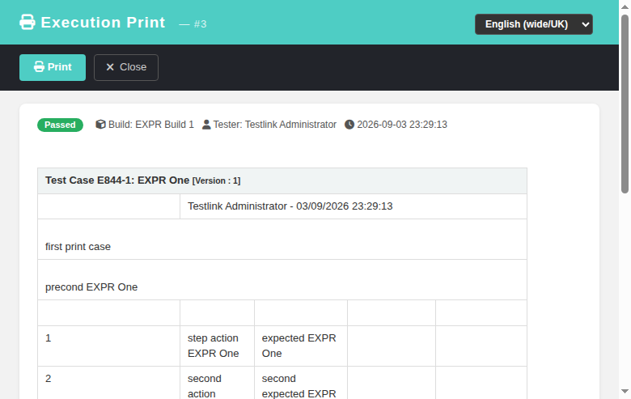

# Execution Print — Modernized Screen

Modernization of the legacy **Execution Print** popup (`lib/execute/execPrint.php`), which
renders a printable document for a single execution row: the linked test-case definition
(summary, author, importance, preconditions, steps with execution results/notes, custom
fields, keywords, requirements), overall execution status, build, tester, dates and the
direct-linked public execution URL. GitHub issue
[#844](https://github.com/sebiboga/testlink-upgraded/issues/844).

The legacy popup (opened from `execTest.html` / `execHistory.html` via `openExecPrint()`) is
replaced by a standalone Dashio page (`gui/templates/execute/execPrint.html`) backed by a
plain-PHP REST BFF API (`api/executionprint/index.php`).

**Path:** Execute Tests (`execTest.html`) or Execution History (`execHistory.html`) → execution
row → **Print** → opens the popup.
**URL:** `gui/templates/execute/execPrint.html?id=<execution_id>`
**BFF API:**
- `GET ?action=print&id=N` → `{ status, exec_id, page_title, body_html, meta{status,
  execution_ts, build_name, tester, tproject_id, tplan_id} }`
- `POST ?action=delete_attachment&id=N&deleteAttachmentID=M` → `{ status, deleted, exec_id }`
  (destructive action — POST only, same-origin-guarded; ownership-checked against the
  execution's own attachment list)

**Rights:** authenticated session + `testplan_execute` on the owning test project (403
otherwise). Unknown / forged execution id → 404 (probed before render, so no E_WARNING events).
**Tracking issue:** [#844](https://github.com/sebiboga/testlink-upgraded/issues/844)

---

## Behavioral parity with the legacy controller

The BFF reuses the battle-tested legacy render machinery over the network:

- **Print body** — generated server-side by `lib/functions/print.inc.php`
  `renderExecutionForPrinting()` (the exact function `execPrint.php` called), so the printed
  document is byte-for-byte the legacy output: test-case header table, author/date, summary,
  preconditions, step table with execution-notes and execution-status columns, execution type
  and duration, execution notes, and the `Direct Link:` share URL. `setPaths()` guarantees
  `$_SESSION['basehref']` is available to the renderer.
- **Meta line** — the Dashio screen additionally shows a status badge (passed/failed/blocked/
  not-run), build name, tester and execution timestamp above the print body.
- **Print** — the toolbar *Print* button calls `window.print()`; the print CSS hides the
  header/toolbar/footer and keeps only the document (with `@page` margins).
- **Attachment delete** — the legacy render embeds an inline `<form>` per execution-step
  attachment that POSTs `deleteAttachmentID` to `execPrint.php`. The modern screen intercepts
  the submit in JS and routes it through the BFF `delete_attachment` route, then re-renders.

## Security hardening (intentional, Refs #844)

The legacy `execPrint.php` opened `testlinkInitPage($db,false,true)` — the flag makes it
callable **without** a session for the external-direct-link use case. The modern screen runs
inside the authenticated app, so the BFF **requires a session user** and enforces
`testplan_execute` on the owning test project. The public anonymous share link (`lnl.php`)
intentionally keeps using the legacy `execPrint.php` so the share-link flow still works.

---

## Screenshots

### Normal execution print (admin, passed execution)

---

## Test coverage

Test suite **844** (12/12 PASS) is appended to `tmp/TLU_Test_Cases.md` — covers BFF print OK
(200 + body), 404 unknown execution, 400 missing id, 403 no-rights (`noprint` user), front-end
render + 404/403 error banners, Print button handler, delete_attachment guards, i18n in all 10
bundles, in-app link switch (`execTest.html` / `execHistory.html`), and Event Viewer clean.
