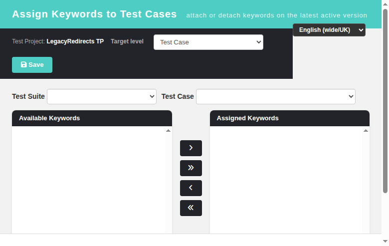
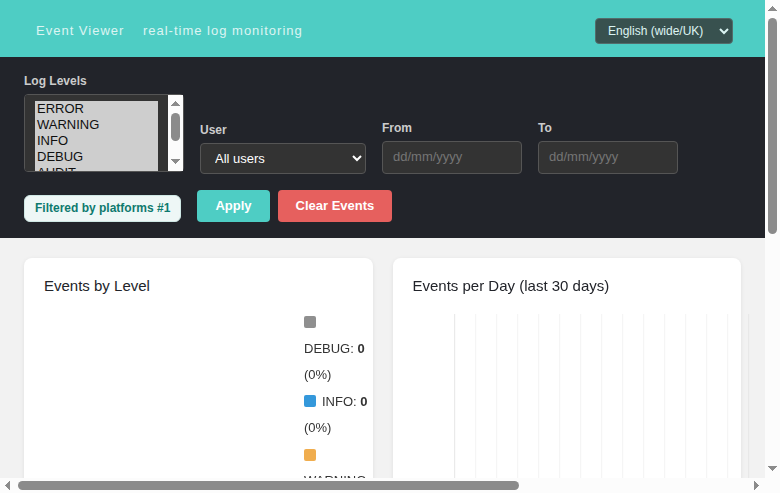

# TestLink — Legacy Redirect Cleanup (Refs #757)

Removes the last two legacy entry points still reachable from modernized **Product** screens,
and fixes the `kwa.*` i18n regression surfaced while testing (Refs #820).

- **Path:** Product > Keyword Management :: "Assign Keywords to Test Cases"; Product > Platform Management :: "Show event history"
- **Refs:** #757 (modernize keywordsView, platformsView, tcImport misc legacy redirects), #820 (missing kwa.* keys), #819 (deferred tcImport XML BFF).

---

## What changed

| Source screen | Legacy target | New target |
|---|---|---|
| `gui/templates/keywords/keywordsView.html` — "Assign Keywords to Test Cases" (`goAssign()`) | `lib/general/frmWorkArea.php?feature=keywordsAssign` | `keywordsAssign.html?tproject_id=&tplan_id=` |
| `gui/templates/platforms/platformsView.html` — "Show event history" (Edit platform) | `POST /lib/events/eventviewer.php` (hidden form `object_id`, `object_type=platforms`) | `GET eventviewer.html?object_id=&object_type=platforms` |
| `gui/templates/eventviewer/eventviewer.html` | — | New: reads `objectId`/`objectType` (or `object_id`/`object_type`) URL params, forwards them to the BFF, and shows a "Filtered by {type} #{id}" banner |

The BFF (`api/eventviewer/index.php`) already supported `objectId` + `objectType` filtering for
events/stats — only the front-end wasn't wired to pass them from the URL. No BFF change was needed.

---

## Files

| File | Change |
|---|---|
| `gui/templates/keywords/keywordsView.html` | `goAssign()` → modern `keywordsAssign.html` |
| `gui/templates/platforms/platformsView.html` | Event-history form → `GET eventviewer.html` (kept `object_id`/`object_type=platforms`) |
| `gui/templates/eventviewer/eventviewer.html` | Object-filter URL params + "Filtered by {type} #{id}" indicator |
| `gui/templates/i18n/{en,ro,de,es,fr,it,ja,pt,ru,zh}.json` | `ev.filteredByObject` added (bug #820 also added all 29 `kwa.*` keys) |

---

## Screenshots





---

## Event Viewer object filter

The platforms Event History button now opens the modern Event Viewer filtered to that platform:

```
/gui/templates/eventviewer/eventviewer.html?object_id=1&object_type=platforms
```

`buildQuery()` forwards `objectId`/`objectType` to the BFF, so both the events table and the
by-level / per-day charts are scoped to the object (legacy parity with `object_id`/`object_type`).
When an object filter is active a teal banner shows `Filtered by platforms #1` (key `ev.filteredByObject`).

---

## Test plan

Regression suite **821** in `tmp/TLU_Test_Cases.md` — **11/11 PASS**.

- `goAssign()` opens `keywordsAssign.html` (no `frmWorkArea.php`).
- `keywordsAssign.html` renders fully translated (no raw `kwa.*`).
- Event History opens the modern viewer as GET with object filter; BFF endpoints return 200.
- `events` table stays clean (AUDIT level only, no new Error/Warning).